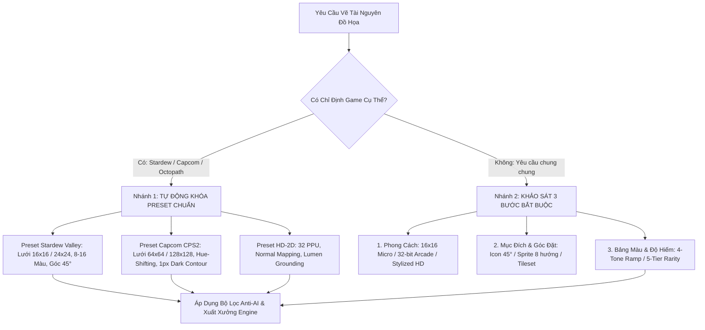

# 2D Pixel Asset Technical Specifications & Production Contract
## Hợp Đồng Quy Chuẩn Kỹ Thuật Đồ Họa 2D Pixel — Project Ascendant

> **Mã hợp đồng**: `SPEC-ART-2026-09-23-V2`  
> **Cơ quan ban hành**: Lead Game Designer & Technical Art Director  
> **Tiêu chuẩn áp dụng**: `game-art-studio` (Anti-AI Craft Guide, Asset Contract Presets & Meowa Pipeline)  
> **Game tham chiếu chuẩn mực (Benchmarks)**: *Stardew Valley* (ConcernedApe), *Terraria* (Re-Logic), *Octopath Traveler* (Square Enix), *Capcom CPS2 Arcade* (Capcom).  
> **Engine mục tiêu**: Unreal Engine 5.7 (Paper2D / PaperZD / CommonUI / Lumen HD-2D)  
> **Hiệu lực**: **BẮT BUỘC THỰC THI (MANDATORY)** — Mọi tài nguyên đồ họa vi phạm bất kỳ điều răn nào sẽ bị hệ thống QA Gate Check tự động từ chối.

---

## 1. Giao Thức Khởi Tạo Hợp Đồng Bắt Buộc (Mandatory Asset Contract)

> 🛑 **NGUYÊN TẮC TỐI THƯỢNG**: CẤM ĐOÁN MÒ VÀ CẤM SINH ẢNH BỪA BÃI KHI THIẾU RÀNG BUỘC KỸ THUẬT.  
> Việc sinh ảnh tự do không qua hợp đồng sẽ tạo ra các bức ảnh "nhựa", sai tỷ lệ (mixels), mờ nhòe (pillow shading) và lệch khung lưới UI, gây lãng phí tài nguyên và công sức làm lại.

### Quy Trình Khóa Hợp Đồng 2 Nhánh (Two-Branch Contract Resolution):



---

## 2. Các Bộ Hợp Đồng Định Sẵn (Asset Contract Presets)

### Preset A: *Project Ascendant HD-2D* (Chunky 32×32 Pixel Standard — Kế Thừa Tinh Hoa Stardew & Octopath)
* **Hệ quy chiếu lưới pixel**:
  * **Kích thước bản vẽ gốc (Native Grid)**: Chuẩn hóa **$32 \times 32$ pixel** (Vũ khí tiêu chuẩn, khiên, dược phẩm, quặng khoáng sản) và **$40 \times 40$ pixel** (Đại kiếm 2 tay, trượng đại pháp sư).
  * **Kích thước xuất xưởng cho UI (Export Canvas)**: Phóng to thuật toán **Nearest Neighbor $8\times$ thành $256 \times 256$ pixel** (hoặc $2\times$ thành $64 \times 64$ trong kho đồ dạng lưới).
  * **Kích thước hạt pixel**: Đạt tỷ lệ vàng giữa độ dày dặn cổ điển (Chunky) và độ sắc nét chi tiết của game HD-2D, thể hiện rõ từng vết xước thép, góc vát giác ngọc và cổ ngữ ma thuật.
* **Ngân sách màu (Color Budget)**:
  * Giới hạn từ **16 đến 24 màu độc nhất** cho mỗi icon $32 \times 32$.
  * Phân bậc màu dứt khoát: Mỗi vật liệu tuân thủ **4 nấc sắc độ (4-Tone Color Ramp)** không dùng gradient mờ.

### Quy Chuẩn Màu Sắc Linh Hoạt Theo Môi Trường (Zone-Adaptive & Dynamic Lighting)
> 💡 **NGUYÊN TẮC THIẾT KẾ CỐT LÕI**: *"Không đóng khung trò chơi vào một màu u tối duy nhất. Màu sắc của vật phẩm phản ánh bản chất nguyên tố, còn độ sáng và đổ bóng sẽ biến đổi động học theo từng khu vực."*

1. **Bản Vẽ Gốc (Base Albedo / Pure Element)**:
   - Tài nguyên gốc thể hiện trọn vẹn màu sắc tự nhiên, rực rỡ của nguyên tố: Lửa đỏ cam ấm áp, Băng tinh thể xanh ngọc trong trẻo, Thánh quang hoàng kim rạng ngời, Hư không tím thẫm ma mị.
2. **Biến Đổi Theo 4 Phân Vùng Môi Trường (Zone Ambient Adaptability)**:
   - **Khu An Toàn / Lò Rèn (Sanctuary / Forge)**: Hưởng ánh sáng vàng hổ phách ấm áp (~2200K), màu sắc tươi sáng, rực rỡ, độ bão hòa cao, mang lại cảm giác bình yên và giàu sức sống.
   - **Dã Ngoại & Rừng Sâu (Wilderness Exploration)**: Ánh sáng trăng lạnh (~6500K) kết hợp sương mù thể tích, bóng đổ ngả sắc chàm tím, rêu lân tinh le lói.
   - **Đấu Trường Boss (Boss Arena)**: Nền đất tối đen (Obsidian), tương phản cực độ (High Contrast), tôn vinh ánh sáng phát quang rực lửa của đòn đánh.
   - **Vùng Đất Tha Hóa (Contested / Void Domain)**: Tông màu u uất, ánh tím hư không (`#6A1B9A`), khử bão hòa nhẹ để thể hiện sự suy tàn chết chóc.
3. **Tương Tác Với Unreal Engine Lumen**:
   - Sprite nhân vật và vũ khí nhận ánh sáng trực tiếp từ nguồn sáng điểm (Point Lights) và đèn định hướng (Directional Sun) trong Unreal Engine 5.7, tự động đổ bóng xiên thời gian thực xuống địa hình 3D.

---

## 3. Bản Đồ 5 Dấu Hiệu "Mùi AI" & Giải Pháp Thủ Công Triệt Để

| Dấu Hiệu AI (AI Tell) | Bản Chất Lỗi Của AI | Hậu Quả Trong Game | Giải Pháp Nghệ Nhân Thủ Công (Master Cure) |
| :--- | :--- | :--- | :--- |
| **1. Pillow Shading (Đánh bóng gối ôm)** | AI lấy trung bình màu và làm tối dần từ mép ngoài vào tâm mọi chi tiết, không có nguồn sáng vật lý. | Vật thể phồng như gối ôm, mềm nhũn như đất sét, mất chất kim loại cứng. | **Khóa chặt nguồn sáng đơn góc $45^\circ$ (Key Light)** từ góc trên-trái ($10$ giờ). Đổ bóng đổ cứng (Cast Shadow) dứt khoát dưới cằm, lưỡi kiếm, vạt áo. |
| **2. Micro-Color Bleed (Dải màu bẩn)** | AI pha trộn hàng nghìn dải màu trung gian mờ mờ thay vì dùng bảng màu giới hạn (Indexed Palette). | Tranh bị đục, bẩn, tái ngắt, mất độ trong trẻo retro của pixel art. | **Quy tắc dải màu 3–4 bậc (3-4 Color Ramp)** kết hợp **Hue-Shifting** (Sáng ngả Vàng chanh, Tối ngả Tím Navy). |
| **3. Ornate Greeble (Chi tiết rác ngẫu nhiên)** | Khi prompt từ khóa "knight" hay "sword", AI tự ý thêm hoa văn vàng uốn lượn, ren ren, dây đai chằng chịt. | Gây nhiễu thị giác cực độ, không thể đọc được hình dạng nhân vật từ camera -45°. | **Quy tắc tỉ lệ chi tiết 70 - 20 - 10**. Dành trọn 70% diện tích là mảng phẳng trơn để mắt nghỉ ngơi. Cấm hoa văn vàng vô nghĩa. |
| **4. Stiff Mannequin Poses (Tư thế ma-nơ-canh)** | AI luôn vẽ nhân vật đứng thẳng tưng $90^\circ$, hai chân chịu lực đều 50/50, mắt nhìn vô hồn vào camera. | Nhân vật đơ cứng như tượng sáp hoặc đồ chơi nhựa chưa bóc hộp. | **Line of Action (Đường cong chữ C/S)**, **Contrapposto (Trọng tâm chân trụ 80/20)**, thân người ngả góc $15^\circ-25^\circ$. |
| **5. Pixel Sins (Lỗi vỡ hạt điểm ảnh)** | AI sinh "pixel giả": pixel to nhỏ lẫn lộn (mixels), pixel đơn độc trôi nổi (orphan pixels), bậc thang gãy khúc (jaggies). | Trông như ảnh JPG chất lượng thấp bị giảm phân giải cẩu thả chứ không phải pixel art thật. | **Đường nét phân bậc toán học (1-1-1, 2-2-2, 1-2-3)**, **Viền bao ngoài 1px than sẫm**, và **Selout** (viền nội bộ theo màu gốc). |

---

## 4. Tỷ Lệ Chi Tiết Vàng 70 - 20 - 10 (Resting Area Rule)

Để loại trừ tận gốc căn bệnh "AI Greeble" (nhồi nhét chi tiết vô nghĩa), mọi thiết kế nhân vật và vũ khí bắt buộc phân bổ diện tích theo tỷ lệ:

```
┌────────────────────────────────────────────────────────────────────────┐
│                        70% VÙNG NGHỈ MẮT                               │
│       (Mảng giáp ngực phẳng, tà áo choàng trơn, phiến lưỡi kiếm)       │
│               ── Giúp mắt người chơi định vị khối lớn ──               │
├───────────────────────────────────┬────────────────────────────────────┤
│       20% CHI TIẾT CHỨC NĂNG      │      10% ĐIỂM NHẤN TIÊU ĐIỂM       │
│ (Khóa thắt lưng, nẹp ủng, quấn cán)│ (Lóe sáng mũi nhọn, ngọc đính đốc) │
└───────────────────────────────────┴────────────────────────────────────┘
```

1. **70% Vùng nghỉ mắt (Resting Areas / Broad Planes)**:
   - Tấm giáp sắt phẳng, ống quần trơn, tà áo choàng buông thẳng, thân kiếm không hoa văn.
   - Tạo cảm giác đồ họa vững chãi, khỏe khoắn, giúp nhận diện rõ silhouette từ khoảng cách xa.
2. **20% Chi tiết chức năng (Functional Secondary Elements)**:
   - Dây nịt đai, khóa cài kim loại, rãnh thoát máu trên kiếm, đường chỉ may trên áo da.
   - Chỉ vẽ chi tiết khi chi tiết đó có mục đích công năng thực tế.
3. **10% Điểm nhấn tiêu điểm (Focal Highlights)**:
   - Điểm sáng trắng 1px phản quang trên chóp mũi kiếm, vết nứt le lói trên viên ngọc quyền trượng, con ngươi mắt phát sáng.

---

## 5. Quy Chuẩn Động Lực Học Nhân Vật (Meowa Action-First Pipeline)

```
       ❌ DÁNG ĐỨNG AI (Cứng đơ)                  ✅ DÁNG ĐỨNG THỦ CÔNG (Sống động)
           [ O ] (Đầu thẳng)                          [ O ]  (Đầu nghiêng ngắm mục tiêu)
          /  |  \                                     /   \
         |   |   | (Tay ép sát sườn, cột sống 90°)   /  S  \ (Đường cong S-line mạnh mẽ)
         |   |   |                                  /       \
            / \                                    /  /|     \ (Chân trước tấn, chân sau đẩy)
           |   | (Chân chia lực 50/50)            *   |
                                                  (Trọng tâm lệch 80% chân trước)
```

### 5.1 Kỹ Thuật Tư Thế Mở Đầu Hành Động (Action-First Pose)
Trong hoạt ảnh game hành động hardcore, khung hình đầu tiên của animation chính là nguồn phát động lực:
* **Đòn Đánh (Attack Animation)**: Tư thế đầu tiên phải là nhân vật **đã giương kiếm/kéo căng dây cung sẵn sàng vung đòn**, không bắt đầu từ tư thế đứng im (Neutral Idle) làm trễ nhịp combo.
* **Chạy / Lướt (Run / Dash)**: Khung hình đầu tiên là hai chân đã bước sải rộng, thân người chúi về phía trước $20^\circ$.
* **Khoảng đệm chuyển động (Directional Motion Padding)**:
  * Phía trước hướng mặt: Dành riêng **$32$px không gian trong suốt** để chứa vệt chém kiếm (Slash Trail VFX).
  * Phía trên đỉnh đầu: Dành riêng **$14$px không gian trong suốt** để chứa động tác nhảy hoặc vung búa lên cao.

### 5.2 Khóa Tọa Độ Mốc Giải Phẫu Khung Paperdoll (Modular Landmarks)
Để đảm bảo khi người chơi click thay đổi trang bị từ Áo vải sang Giáp sắt, Áo da hay Pháp bào, các lớp sprite gắn khít $100\%$ không bị trôi lệch:

```
(0, 0) ───────────────────────────────────────────────────────────── (128, 0)
│                                                                           │
│                      [Trục Mắt / Nón Mũ: Y = 44]                          │
│                      [Cổ Áo / Giáp Ngực: Y = 56]                          │
│  [Tay Cầm Phụ (Khiên)]                        [Tay Cầm Chính (Vũ Khí)]    │
│    (X: 32, Y: 76)                                  (X: 96, Y: 76)         │
│                      [Thắt Lưng / Quần: Y = 80]                           │
│                                                                           │
│                   ▼ PIVOT ANCHOR CHÂN TIẾP ĐẤT (X: 64, Y: 114)            │
│                       (Khóa cứng với UE5 Capsule)                         │
(0, 128) ───────────────────────────────────────────────────────── (128, 128)
```

---

## 6. Quy Chuẩn Kỹ Thuật Icon Trang Bị & Ma Trận 5 Bậc Hiếm

### 6.1 Bố Cục Góc Đặt Thẩm Mỹ Chuẩn Mực

| Nhóm Vật Phẩm | Góc Đặt Quy Chuẩn | Mô Tả Kỹ Thuật Chi Tiết |
| :--- | :---: | :--- |
| **Vũ Khí Cận Chiến** (Kiếm, Đại kiếm, Dao găm, Chùy, Rìu, Lưỡi hái) | **$45^\circ$ Đường Chéo** | Chuôi kiếm nằm tại góc dưới-trái, mũi kiếm vươn tới góc trên-phải. Chiếm trọn $85-90\%$ đường chéo ô đồ. |
| **Vũ Khí Tầm Xa & Gậy Phép** (Cung tên, Trượng ma pháp) | **$45^\circ$ Đường Chéo** | Thân cung vắt chéo, đầu trượng chứa khối ngọc/tinh thể phát sáng ở góc trên-phải. |
| **Khiên Phòng Ngự** | **Nghiêng nhẹ $15^\circ$** | Mặt khiên hướng chính diện, vát mép $15^\circ$ để thấy độ dày tấm kim loại/gỗ sồi. |
| **Bình Dược Phẩm (Potions)** | **Thẳng đứng $90^\circ$** | Cổ bình thắt nút bấc ở đỉnh, thân bình chứa dung dịch $70\%$, vệt sáng phản quang thủy tinh 1px trắng chéo qua thân. |
| **Nguyên Liệu Quặng & Thỏi Kim Loại** | **Khối 3D Isometry** | Vát 3 mặt diện rõ ràng (Mặt đỉnh đón nắng, Mặt trái chuyển sắc, Mặt phải bóng đổ sẫm). |
| **Đá Quý Cắt Giác (Cut Gems)** | **Đa giác kim cương $0^\circ$** | Cắt giác hình học sắc nét. Tâm ngọc sáng rực, viền ngoài đổ bóng sâu tạo độ khúc xạ thủy tinh. |
| **Trang Bị Mặc (Áo Giáp, Mũ, Ủng)** | **Chính diện $0^\circ$** | Dạng trưng bày trên giá đỡ (Armor Stand), trục dọc cân đối đối xứng. |

### 6.2 Khung Viền Phân Hạng 5 Bậc Hiếm (5-Tier Rarity Color Matrix)
Tích hợp trực tiếp với script tự động `generate_item_icon_sheet.py`:

```python
RARITY_COLORS = {
    "common":    (156, 163, 175, 255),  # Gray #9CA3AF (Xám đá phiến - Normal Tier 1)
    "uncommon":  (34, 197, 94, 255),   # Green #22C55E (Xanh ngọc bích - Magic Tier 2)
    "rare":      (59, 130, 246, 255),   # Blue #3B82F6 (Xanh lam cobalt - Rare Tier 2)
    "epic":      (168, 85, 247, 255),   # Purple #A855F7 (Tím huyền bí - Epic Tier 3)
    "legendary": (245, 158, 11, 255),   # Gold #F59E0B (Hoàng kim rực lửa - Legendary Tier 3/4)
}
```

* Quy chuẩn viền: Độ dày viền đúng **2px** bao quanh mép icon (`border_width=2`).

---

## 7. Quy Tắc Soạn Thảo Prompt: "Chống Mùi AI"

### 7.1 Từ Điển Đen Tuyệt Đối Cấm (Negative Blacklist)
> ❌ **CẤM SỬ DỤNG CÁC TỪ KHÓA SAU**:
> `masterpiece`, `hyperdetailed`, `ultra-realistic 8k`, `intricate filigree`, `unreal engine render`, `octane render`, `cinematic lighting`, `volumetric fog`, `diffuse bloom`, `ambient occlusion`, `trending on artstation`, `photorealistic`.
> *(Các từ khóa này kích hoạt thuật toán nội suy tạo hạt mịn, làm nhòe viền và sinh ra hoa văn rác vàng kim đặc trưng của AI slop).*

### 7.2 Từ Điển Vàng Thủ Công (Positive Craft Keywords)
> ✅ **BẮT BUỘC SỬ DỤNG**:
> - **Pixel Art**: `16-bit arcade sprite, authentic Stardew Valley chunky pixel grid, Capcom CPS2 aesthetic, strict 4-tone color ramp, dynamic S-curve line of action, hue-shifted cool violet shadows, crisp 1px dark charcoal contour, no pillow shading, flat solid background #FF00FF`.
> - **HD 2D / Icons**: `Clean 32-bit RPG inventory icon, angled diagonally at 45 degrees, readable chunky silhouette, hard-edged cel-shaded facets, limited 12-color palette, solid dark charcoal border, flat solid background #FF00FF, perfectly pixelated with zero anti-aliasing`.

---

## 8. Ví Dụ Đối Chiếu Mẫu: Dở vs Xuất Sắc

### Ví Dụ 1: Sprite Nhân Vật Chiến Binh Lao Đánh (Combat Sprite)

* ❌ **Prompt Kém (Đầy mùi AI, kết quả đơ cứng và bẩn màu)**:
  ```text
  A fantasy knight warrior swinging a sword, masterpiece, 8k, hyper detailed armor with gold ornaments, dynamic lighting, octane render, unreal engine 5, beautiful background.
  ```
  *(Hậu quả: Giáp đầy hoa văn vàng rác vụn vặt, người đứng thẳng tưng vô hồn, bóng viền mờ căm như đất sét, nền lem nhem).*

* ✅ **Prompt Chuẩn Studio (Đậm chất nghệ nhân thủ công Stardew/Capcom)**:
  ```text
  16-bit arcade pixel art sprite of an athletic rogue knight mid-strike with an executioner sword. Action-first pose: body lunging forward at 20-degree angle, weight heavy on front bent knee, claymore swinging in a sharp motion arc. Clean Capcom CPS2 palette: burnished steel armor with crisp cel-shaded plane shifts, sunlight highlights from top-left shifting to deep indigo shadows. 70 percent clean resting metal plates, zero filigree, bold 1px charcoal outer contour, clear negative space between legs and blade, pure magenta background #FF00FF, no floor shadow.
  ```

---

### Ví Dụ 2: Biểu Tượng Trang Bị Kiếm Băng (Item Icon)

* ❌ **Prompt Kém**:
  ```text
  Magic sword icon, ultra realistic glowing crystal sword, epic detailed, fantasy concept art, artstation.
  ```

* ✅ **Prompt Chuẩn Studio (Stardew Valley 45° Chunky Style)**:
  ```text
  Authentic 16x16 chunky pixel art inventory icon of a runic frost broadsword, displayed at 45-degree diagonal from bottom-left to top-right. Chunky readable silhouette, clear geometric crossguard, deep cobalt steel blade with crisp cyan-white edge highlight. No blurry glow, hard-edged cel-shaded facets, limited 8-color palette, solid dark slate border #121316, flat solid background #000000, perfectly pixelated with zero anti-aliasing.
  ```

---

## 9. Pipeline Tự Động Hóa Xuất Xưởng Engine (CLI Commands)

Tất cả các script trong bộ kỹ năng `game-art-studio` được gọi theo đúng cú pháp CLI chuẩn hóa:

### 1. Cắt Ghép Tách Nền & Ghim Pivot Chân:
```bash
python3 /home/kenzings/.gemini/config/skills/game-art-studio/scripts/slice_spritesheet.py \
    --input_sheet <path_to_spritesheet.png> \
    --output_dir <output_frames_folder> \
    --frames 8 \
    --color_key auto \
    --tolerance 35 \
    --anchor bottom_center
```

### 2. Đóng Khung 5 Bậc Hiếm Cho Icon Trang Bị:
```bash
python3 /home/kenzings/.gemini/config/skills/game-art-studio/scripts/generate_item_icon_sheet.py \
    --input_sheet <icons_raw.png> \
    --output_dir <output_dir> \
    --grid 4x4 \
    --rarity rare
```

### 3. Ghép GIF Hoạt Ảnh Xem Trước:
```bash
python3 /home/kenzings/.gemini/config/skills/game-art-studio/scripts/assemble_flipbook_gif.py \
    --frames_dir <output_frames_folder> \
    --output_gif <preview.gif> \
    --fps 12.0
```

### 4. Tự Động Import Vào Unreal Engine 5 Paper2D / PaperZD:
```bash
/mnt/Data/Engine/Binaries/Linux/UnrealEditor-Cmd \
    ProjectAscendant/ProjectAscendant.uproject \
    -ExecutePythonScript="scripts/import_ue_flipbooks.py --frames_dir <output_frames_folder> --dest_path /Game/Art/Flipbooks --name FB_Hero_Attack --fps 12.0" \
    -nullrhi -nosound -unattended
```

---

## 10. Bảng Kiểm Tra Nghiệm Thu Chất Lượng (QA Gate Check Checklist)

Trước khi bất kỳ file đồ họa nào được chấp thuận đưa vào game, kiểm tra viên (Art QA) phải tích đủ 6 tiêu chí:

- [ ] **1. Blackout Silhouette Test**: Đổ đen toàn bộ sprite thành `#000000` trên nền trắng $\rightarrow$ Phải phân biệt rõ class/loại vũ khí trong 0.2 giây.
- [ ] **2. Zero Border Bleed Test**: Quét mảng alpha 4 cạnh biên (Top, Bottom, Left, Right) $\rightarrow$ Bắt buộc Alpha = 0, không cụt góc hay mất chuôi kiếm.
- [ ] **3. Color Budget Audit**: Đếm số màu độc nhất $\rightarrow$ Không vượt quá 16 màu đối với icon $16 \times 16$ hoặc 32 màu đối với sprite nhân vật.
- [ ] **4. Mixel-Free Audit**: Kiểm tra kích thước pixel trên toàn màn hình $\rightarrow$ Kích thước hạt pixel của vũ khí trên tay phải đồng nhất $1:1$ với cơ thể nhân vật.
- [ ] **5. Landmark Lockstep Test**: Ghép thử trang phục lên khung nhân vật $\rightarrow$ Khớp $100\%$ tại các mốc `Y=44`, `Y=56`, `Y=80`, không lòi da thịt.
- [ ] **6. HD-2D Lumen Test**: Chiếu đèn thời gian thực trong UE5 $\rightarrow$ Khối phản xạ ánh sáng nổi khối chân thực, không bị phẳng lì.
