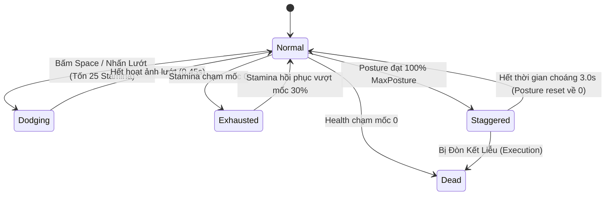

# Character Attributes & Stats Engine (GAS)

> **Status**: Approved  
> **Author**: Systems Designer & Lead Programmer  
> **Last Updated**: 2026-09-14  
> **Implements Pillar**: True Skill Expression & Break Posture  
> **Target Engine**: Unreal Engine 5 (C++ Gameplay Ability System)

---

## Overview

Hệ thống Thuộc tính và Trạng thái Nhân vật (Character Attributes & Stats Engine) là xương sống tính toán toàn bộ năng lực sinh tồn, độ cơ động và sức mạnh chiến đấu của người chơi cũng như quái vật trong Project Ascendant. Được xây dựng trực tiếp trên nền tảng **Unreal Engine Gameplay Ability System (GAS)**, hệ thống quản lý các thuộc tính cơ sở (Máu, Thể lực, Năng lượng), chỉ số cơ chế (Thế đứng - Posture, Thời lượng I-frame, Ngưỡng choáng) và chỉ số chiến đấu (Công, Thủ, Tốc độ). 

Hệ thống giải quyết bài toán cốt lõi của game: biến kỹ năng canh thời gian (timing) và né đòn của người chơi thành lợi thế vượt qua sự chênh lệch cấp độ ảo thông qua cơ chế phá vỡ Posture, đồng thời đảm bảo khả năng đồng bộ mạng nhiều người chơi (Multiplayer Replication) mượt mà không độ trễ.

---

## Player Fantasy

*"Một kiếm sĩ nhỏ bé đứng trước con quái vật khổng lồ cấp 50. Không có một đòn đánh nào của quái vật chạm được vào vạt áo của bạn; từng cú né đòn sát nút lấp đầy thanh thể lực, từng nhát chém chuẩn xác vào tử huyệt bẻ gãy thế đứng của đối thủ, để rồi tung ra nhát kiếm kết liễu chí mạng chấn động màn hình."*  

Người chơi cảm nhận sự làm chủ tuyệt đối qua từng thanh chỉ số: Stamina phản hồi nhanh nhạy cho từng cú lướt, và thanh Posture của đối phương liên tục sụp đổ dưới áp lực kỹ năng dồn dập. Kỹ năng cá nhân của người chơi chính là chỉ số mạnh nhất trong game.

---

## Detailed Design

### Core Rules

Toàn bộ thuộc tính nhân vật và quái vật được khai báo trong C++ thông qua class `UAscendantAttributeSet` kế thừa từ `UAttributeSet` của Unreal Engine GAS.

#### Bảng Thuộc Tính Cốt Lõi (Core Attributes)

| Tên Thuộc Tính (C++) | Ý nghĩa | Giá trị cơ sở (Player Lv 1) | Quy tắc vận hành & Giới hạn |
| :--- | :--- | :---: | :--- |
| **`Health` / `MaxHealth`** | Sinh mệnh | 500 / 500 | Min 0, Max = MaxHealth. Về 0 kích hoạt thẻ `State.Dead`. |
| **`Stamina` / `MaxStamina`** | Thể lực hành động | 100 / 100 | Tiêu hao khi Lướt né đòn (25/lần) hoặc Tụ lực đánh (20/lần). Min 0, Max = MaxStamina. |
| **`StaminaRegenRate`** | Tốc độ hồi thể lực | 45 / giây | Bắt đầu hồi sau khi ngừng tiêu hao **0.6 giây** (`StaminaRegenDelay`). Đầy bình trong ~2.2 giây. |
| **`Mana` / `MaxMana`** | Năng lượng kỹ năng | 100 / 100 | Dùng thi triển skill Class. Tự hồi 5/giây hoặc hồi 10 điểm khi đánh thường trúng đích. |
| **`Posture` / `MaxPosture`** | Thanh Thế đứng | 0 / 100 *(Boss: 0 / 1000+)* | **Cơ chế ngược:** Tích tụ từ 0 đến 100. Đạt 100% kích hoạt `State.Staggered` (Choáng vỡ thế). |
| **`PostureDecayRate`** | Tốc độ hạ nhiệt thế đứng | 20 / giây | Bắt đầu giảm nhiệt nếu không bị tấn công trong **4.0 giây** (`PostureDecayDelay`). |
| **`IFrameDuration`** | Thời lượng bất tử khi né | 0.28 giây | Kích hoạt thẻ `State.Invulnerable` trong 0.28s đầu của cú lướt (tổng hoạt ảnh lướt 0.45s). |
| **`MoveSpeed`** | Tốc độ di chuyển | 550 cm/s | Tốc độ chạy 8 hướng chuẩn góc nhìn Isometric. |

### States and Transitions

Trạng thái nhân vật được quản lý thông qua GameplayTags:

- **`State.Invulnerable` (Bất Tử Tạm Thời):** Được gán vào nhân vật trong suốt 0.28s của `IFrameDuration`. Mọi sát thương và hiệu ứng truyền vào bị triệt tiêu 100%.
- **`State.Exhausted` (Kiệt Sức):** Xuất hiện khi lạm dụng Stamina về 0. Nhân vật bị giảm 25% tốc độ chạy và khóa hoàn toàn nút Lướt né trong 1.5 giây cho đến khi Stamina hồi phục trên 30%.
- **`State.Staggered` (Vỡ Thế Đứng - Cơ chế Đánh Vượt Cấp):** 
  - Khi Posture của Boss hoặc Player đầy 100%: Mục tiêu bị đóng băng cử động trong 3.0 giây, mở ra cửa sổ **Đòn Kết Liễu (Execution Window)**.
  - Người chơi áp sát bấm nút Tấn công sẽ kích hoạt hoạt ảnh kết liễu gây sát thương **25% Max HP của Boss**, giúp việc hạ Boss vượt cấp diễn ra nhanh chóng nếu người chơi giữ được phong độ né và dồn Posture chuẩn xác.

### Interactions with Other Systems

- **Combat System (`combat-system.md`):** Mỗi đòn đánh gửi `UGameplayEffect` truyền các chỉ số sát thương máu và sát thương Posture.
- **Dash & Evasion (`dash-evasion.md`):** Đọc trực tiếp `IFrameDuration` và tiêu hao `Stamina`.
- **Blacksmithing (`blacksmithing-system.md`):** Trang bị rèn tăng trực tiếp vào `MaxHealth`, `MaxStamina`, `StaminaRegenRate`.
- **Apothecary (`apothecary-system.md`):** Dầu tẩm vũ khí cộng dồn hệ số sát thương Posture (`StaggerDamageMultiplier` +30%).
- **Multiplayer Replication:** Toàn bộ thuộc tính replicate tự động qua mạng sử dụng macro `GAMEPLAYATTRIBUTE_REPNOTIFY` chuẩn của Unreal GAS.

---

## Formulas

### 1. Công thức Sát Thương Thực Nhận (Effective Damage)

$$\text{DamageTaken} = \text{RawDamage} \times \left( \frac{100}{100 + \text{Armor}} \right)$$

- **Quy tắc I-frame:** Nếu nhân vật đang mang thẻ `State.Invulnerable`, $\text{DamageTaken} = 0$ tuyệt đối (không kích hoạt sát thương và bỏ qua mọi hiệu ứng khống chế).

### 2. Công thức Sát Thương Phá Thế (Posture Damage)

$$\text{PostureDamage} = \text{BaseStagger} \times (1 + \text{StaggerBonus}) \times \text{HitMultiplier}$$

- Đánh thường cơ bản: $\text{HitMultiplier} = 1.0$
- Đánh trúng điểm yếu / Bộ phận Boss (Weakspot/Part): $\text{HitMultiplier} = 1.5$
- Phản đòn hoàn hảo (Perfect Parry): Gây lập tức **35% Max Posture** của mục tiêu.
- Dầu tẩm vũ khí của Dược sư: $\text{StaggerBonus} = +0.3$ (+30% sát thương Posture).

### 3. Công thức Đòn Kết Liễu Vượt Cấp (Stagger Execution Damage)

$$\text{ExecuteDamage} = (\text{TargetMaxHP} \times 0.25) + (\text{BaseDamage} \times 3.0)$$

- **Ý nghĩa thiết kế:** Khi làm đầy 100% Posture của Boss, người chơi kích hoạt đòn kết liễu rút thẳng **25% Max HP của Boss**. Người chơi kỹ năng cao chỉ cần 4 lần phá thế thành công là có thể hạ gục Boss vượt 20-30 cấp mà không bị cản trở bởi lượng máu khổng lồ của Boss.

### 4. Công thức Hồi Phục Thể Lực (Stamina Recovery)

- Kích hoạt sau khi không tiêu hao Stamina trong $0.6\text{s}$ (`StaminaRegenDelay`):
$$\text{Stamina} = \min(\text{MaxStamina}, \text{Stamina} + \text{StaminaRegenRate} \times \Delta t)$$

---

## Edge Cases

- **Cú lướt tuyệt vọng (Desperation Roll):** Nếu Stamina chỉ còn dưới 25 điểm (ví dụ: còn 5 điểm) mà người chơi bấm phím né, hệ thống vẫn cho phép lướt đủ 0.28s I-frame để cứu người chơi trong khoảnh khắc sinh tử. Tuy nhiên, Stamina sẽ bị âm tạm thời và nhân vật lập tức rơi vào trạng thái Kiệt Sức (`State.Exhausted`) trong **2.2 giây** (thay vì 1.5 giây thông thường).
- **Ngắt chiêu Boss khi Vỡ Thế Đứng:** Nếu Boss đang bay trên không hoặc đang gồng chiêu cuối diện rộng mà bị đòn đánh dồn đầy 100% Posture, toàn bộ hoạt ảnh của Boss bị ngắt lập tức (Animation Interrupt). Boss rơi xuống đất nằm gục trong 3.0 giây. Cơ chế Posture luôn được ưu tiên cao hơn Super-Armor của quái.
- **Tranh chấp đòn kết liễu trong MMO Contested Combat ([ADR-0001](file:///mnt/Data/Projects/project-games/docs/architecture/adr-0001-open-world-mmo-combat-networking.md)):** Người chơi tung đòn bẻ gãy điểm Posture cuối cùng (Posture Break Finisher) nhận cửa sổ ưu tiên 1.5 giây đầu tiên để tương tác kết liễu độc quyền gây 25% Max HP của Boss. Sau 1.5 giây nếu Finisher chưa kích hoạt, nút kết liễu sẽ mở tự do cho bất kỳ người chơi tham chiến nào trong bán kính. Khi đòn kết liễu hoàn tất, toàn bộ người chơi tham chiến đứng trong bán kính 10m (1000cm) đều nhận được bùa lợi **Hưng Phấn Chiến Đấu** (+20% tốc độ đánh và hồi đầy thanh Stamina ngay lập tức).

---

## Dependencies

- **Hệ thống phụ thuộc bên trên (Upstream Dependencies):** Không có (Đây là hệ thống Nền tảng / Foundation System gốc).
- **Các hệ thống phụ thuộc vào tài liệu này (Downstream Dependents):**
  - `dash-evasion.md` (Lướt & Né I-frame)
  - `combat-system.md` (Chiến đấu & Combo)
  - `stagger-system.md` (Hệ thống Phá thế)
  - `combat-hud.md` (Giao diện hiển thị)
  - `foundational-classes.md` (4 Chức nghiệp cơ bản)
  - `apothecary-system.md` (Dược sư & Dầu tẩm)

---

## Tuning Knobs

Các biến số có thể tinh chỉnh trực tiếp trong GameplayEffect hoặc Data Asset mà không cần sửa code:

| Tên Biến Số | Giá Trị Mặc Định | Biên Độ Khuyến Nghị | Mục Đích Cân Bằng |
| :--- | :---: | :---: | :--- |
| `StaminaCost_Dash` | 25.0 | 20.0 – 35.0 | Điều tiết số lần lướt tối đa liên tục trước khi kiệt sức. |
| `IFrameDuration` | 0.28s | 0.24s – 0.32s | Thước đo độ khó của việc canh timing né đòn. |
| `StaminaRegenDelay` | 0.6s | 0.4s – 1.0s | Nhịp dừng trước khi hồi phục thể lực. |
| `StaminaRegenRate` | 45.0 / s | 35.0 – 60.0 | Tốc độ lấp đầy thanh thể lực. |
| `ExhaustedDuration` | 1.5s | 1.0s – 2.5s | Thời gian chịu phạt kiệt sức khi dùng cạn Stamina. |
| `PostureDecayDelay` | 4.0s | 3.0s – 6.0s | Thời gian quái vật không bị đánh trước khi bắt đầu hồi phục thế đứng. |
| `PostureDecayRate` | 20.0 / s | 15.0 – 30.0 | Tốc độ hạ nhiệt thanh Posture của mục tiêu. |
| `StaggerExecutionHPPct` | 0.25 | 0.20 – 0.30 | Tỷ lệ % Máu tối đa bị rút trong mỗi đòn kết liễu phá thế. |
| `StaggerDuration` | 3.0s | 2.5s – 4.0s | Cửa sổ thời gian mục tiêu bị đóng băng cho phép bấm kết liễu. |

---

## Visual/Audio Requirements

### Yêu Cầu Thị Giác (VFX)
- **I-frame Ghosting Trail:** Khi nhân vật lướt né trong thời lượng bất tử, để lại vệt bóng mờ mờ ảo màu trắng bạc (bằng Niagara Mesh Renderer).
- **Exhausted Feedback:** Khi rơi vào trạng thái Kiệt Sức (`State.Exhausted`), nhân vật thở dốc, viền màn hình hơi tối xám (Post-process Vignette).
- **Posture Break VFX:** Khi Posture của Boss đạt 100%, một vụ nổ ánh sáng vàng cam hình mạng nhện nứt vỡ (Glass Shatter VFX) phát ra quanh tâm Boss.

### Yêu Cầu Âm Thanh (SFX)
- **Âm Lướt Né:** Tiếng xé gió sắc gọn (*Whoosh sound*) khẳng định hành động né đòn đã được nhận lệnh.
- **Âm Vỡ Thế Đứng:** Tiếng nứt gãy kim loại đanh thép (*Heavy Metallic Clank / Glass Break*), vang dội không gian để báo hiệu thời cơ vàng dồn sát thương.
- **Âm Kiệt Sức:** Tiếng tim đập nhanh và tiếng thở dốc ngắn để nhắc nhở người chơi lập tức lùi lại giữ vị trí.

---

## UI Requirements

- **Thanh Chỉ Số Người Chơi:** Thanh Máu (Đỏ) và Thanh Thể Lực (Xanh lục) cong nhẹ góc dưới bên trái màn hình hoặc hiển thị dưới chân nhân vật (có nút gạt trong Settings).
- **Thanh Thế Đứng Của Boss (Posture Bar):** Nằm ngay dưới thanh máu Boss (màu vàng cam). Khi đầy 100%, thanh này nhấp nháy đỏ rực và hiện biểu tượng phím Tương tác `[E]` (Bàn phím) hoặc `[X]` (Tay cầm).
- **Số Sát Thương Nhảy (Combat Text):**
  - Đánh thường: Chữ trắng nhỏ.
  - Đánh điểm yếu (Posture bonus): Chữ vàng cam.
  - Đòn kết liễu phá thế: Chữ đỏ thẫm cỡ lớn kèm hiệu ứng rung màn hình nhẹ.

---

## Acceptance Criteria

- [ ] **AC-1 (Né & I-frame):** Bấm phím né tiêu hao chính xác 25 Stamina, kích hoạt I-frame trong 0.28s đầu; mọi hitbox đi xuyên qua người chơi trong 0.28s này không gây sát thương và không gây hiệu ứng.
- [ ] **AC-2 (Kiệt Sức):** Tiêu hao Stamina về 0 kích hoạt ngay lập tức thẻ `State.Exhausted`, giảm 25% tốc chạy và khóa phím né đòn trong 1.5s.
- [ ] **AC-3 (Phá Thế Đứng):** Khi Posture của Boss đạt 100%, Boss bị khựng lại 3.0s; bấm phím tấn công trong cự ly 3m sẽ kích hoạt hoạt ảnh kết liễu rút đúng 25% Max HP của Boss.
- [ ] **AC-4 (Đồng Bộ Mạng GAS):** Mọi thuộc tính (Máu, Stamina, Posture) đồng bộ mượt mà giữa Server và Client qua Unreal Replication; Client né đòn có cảm giác tức thì nhờ Client-side Prediction.

---

## Open Questions

- **Q1:** Có nên cho phép trang bị cấp cao (như Cấp Thần / Divine) tăng nhẹ thời lượng I-frame (ví dụ từ 0.28s lên 0.32s) hay giữ nguyên 0.28s cố định xuyên suốt game để bảo toàn tính công bằng kỹ năng? *(Đề xuất: Giữ cố định 0.28s, trang bị chỉ nên giảm lượng Stamina tiêu hao thay vì kéo dài I-frame).*
