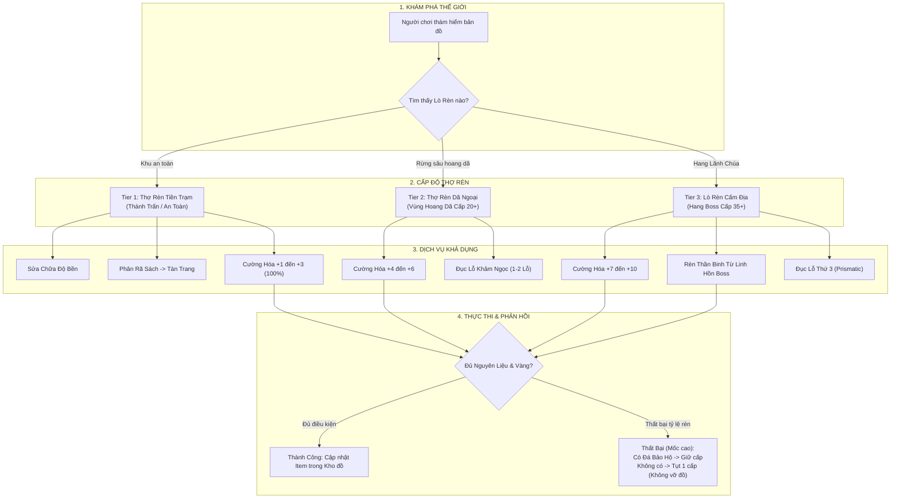

# Zone-tiered Blacksmithing System

> **Status**: Approved  
> **Author**: Systems Designer & Lead Programmer  
> **Last Updated**: 2026-09-15  
> **Implements Pillar**: Meaningful Progression & High-Risk High-Reward Exploration  
> **Target Engine**: Unreal Engine 5 (Crafting DataAssets & DataTable)

---

## Overview

Hệ thống Thợ Rèn Phân Vùng (Zone-tiered Blacksmithing System) là trụ cột kinh tế chế tác và cường hóa trang bị cốt lõi trong Project Ascendant, kết nối trực tiếp tài nguyên thu thập từ quái vật, mảnh vỡ bộ phận Boss ([`stagger-system.md`](file:///mnt/Data/Projects/project-games/design/gdd/stagger-system.md)) và trang bị trong kho đồ ([`inventory-system.md`](file:///mnt/Data/Projects/project-games/design/gdd/inventory-system.md)) với động lực khám phá thế giới mở. Khác với các tựa game nhập vai truyền thống vốn tập trung mọi dịch vụ thợ rèn tại khu an toàn trung tâm, hệ thống phân bổ các lò rèn thành **3 cấp độ dã ngoại phân vùng**—từ *Thợ Rèn Tiền Trạm* tại khu an toàn (chuyên sửa chữa và rèn đồ Normal/Rare), *Thợ Rèn Dã Ngoại* nơi rừng sâu nguy hiểm (mở khóa đồ Legendary và đục lỗ khảm ngọc), cho đến *Lò Rèn Cấm Địa* ẩn sâu trong lãnh địa Lãnh Chúa (nơi duy nhất đúc được Thần Binh Immortal & Divine từ Linh Hồn Boss).

Được xây dựng trên triết lý **"Rủi ro cao - Phần thưởng xứng đáng" (High-Risk High-Reward)** và thế giới mở không rào chắn cấp độ nhân vật (Non-gated Open World), hệ thống trao quyền cho những người chơi có kỹ năng phản xạ và né tránh thượng thừa khả năng mạo hiểm tiến sâu vào các vùng cấm địa nguy hiểm từ sớm để rèn đúc những món trang bị tối thượng vượt bậc. Hệ thống cung cấp các tính năng: Đúc Trang Bị Mới (Crafting), Cường Hóa Chỉ Số (Enhancement +1 đến +10), Khảm Ngọc (Gem Sockets), Đúc Thần Binh từ Linh Hồn Boss (Boss Soul Forging), Phân Rã Sách Kỹ Năng thừa thành Tàn Trang (`item_skill_shard`), và Nâng cấp mở rộng sức chứa túi đồ (30 đến 60 ô).

---

## Player Fantasy

Hệ thống Thợ Rèn Phân Vùng mang đến trải nghiệm cảm xúc trực diện (Direct Engagement), nơi người chơi nếm trải cảm giác thót tim của một kẻ liều mạng vượt cấp và sự thỏa mãn tột cùng khi rèn đúc Thần Binh ngay trong lòng hiểm nguy:

> *"Nép mình sau rặng đá nham thạch bỏng rát sâu trong lãnh địa của Lãnh Chúa Hỏa Long, tim bạn đập thình thịch khi những con quái tinh anh cấp 35 lượn lờ cách bạn chỉ vài bước chân. Với một nhân vật mới cấp 15, bất kỳ một đòn đánh nào chạm người cũng đồng nghĩa với cái chết tức tưởi. Nhưng bạn đã luồn lách qua tất cả bằng những cú lướt né I-frame chuẩn xác.*
> 
> *Phía trước, một lò rèn cổ xưa ngập tràn ánh sáng đỏ rực xuất hiện giữa vách đá hoang tàn—Lò Rèn Cấm Địa. Bạn bước tới chiếc đe bằng đá đen khổng lồ, đặt lên đó chiếc Sừng Cổ Đại nguyên vẹn vừa bẻ gãy từ Boss và viên Linh Hồn Lãnh Chúa phát sáng huyền ảo. Người thợ rèn cổ đại mù lòa vung cây búa nặng nề giáng xuống.*
> 
> *'KENG! KENG! KENG!'*
> 
> *Tia lửa thần thánh bắn tung tóe xé toạc màn đêm hang động. Khi làn khói lam tan biến, trên mặt đe là thanh Thần Binh Bậc 5 phát ra hào quang rực rỡ, làm biến đổi hoàn toàn cơ chế chiêu thức của bạn. Cảm giác đánh cược mạng sống để tự tay tạo nên vũ khí tối thượng ngay tại sào huyệt kẻ thù đem lại khoái cảm kiêu hãnh tột bực—bạn đã chinh phục trò chơi bằng chính lòng quả cảm và kỹ năng cơ học của mình."*

---

## Detailed Design

### Core Rules

#### 1. Ma Trận Phân Cấp 3 Bậc Thợ Rèn Dã Ngoại (3-Tier Blacksmithing Matrix)
Khác biệt hoàn toàn với các tựa game MMORPG gom mọi dịch vụ vào thành chính, thế giới của Project Ascendant phân bổ các lò rèn rải rác ngoài thế giới theo 3 cấp độ hiểm nguy:

| Bậc Lò Rèn | Tên Cơ Sở Rèn | Vị Trí Địa Lý & Mức Nguy Hiểm | Bậc Trang Bị Cho Phép Rèn | Giới Hạn Cường Hóa | Dịch Vụ Đặc Thù |
| :---: | :--- | :--- | :---: | :---: | :--- |
| **Tier 1** | **Thợ Rèn Tiền Trạm** *(Outpost Forge)* | Khu an toàn thành trấn, Tiền trạm ban đầu (Vùng an toàn). | **Normal & Rare** (Tier 1 & 2) | Tối đa **+3** | • Sửa chữa độ bền trang bị. • Phân rã Sách thừa ra Tàn Trang Kỹ Năng. • Nâng cấp túi đồ Bậc 1 (30 $\rightarrow$ 40 ô). |
| **Tier 2** | **Thợ Rèn Dã Ngoại** *(Wilderness Forge)* | Rừng sâu, hẻm núi hiểm trở (Vùng quái Cấp 20+). | Mở khóa **Legendary** (Tier 3) | Tối đa **+6** | • Đục tối đa 2 Lỗ Khảm Ngọc (Gem Sockets). • Rèn trang bị từ mảnh vỡ Boss sơ cấp. • Nâng cấp túi đồ Bậc 2 (40 $\rightarrow$ 50 ô). |
| **Tier 3** | **Lò Rèn Cấm Địa** *(Ancient Sanctuary Forge)* | Ẩn sâu trong lòng hang nham thạch của Lãnh Chúa (Cấp 35+). | Độc quyền **Immortal & Divine** (Tier 4 & 5) | Đỉnh phong **+10** | • Đúc Thần Binh từ Linh Hồn Lãnh Chúa (Boss Soul). • Đục Lỗ Khảm thứ 3 (Prismatic Socket). • Nâng cấp túi đồ Bậc 3 (50 $\rightarrow$ 60 ô tối đa). |

---

#### 2. Các Quy Trình Dịch Vụ Cốt Lõi Tại Thợ Rèn

##### A. Quy Trình Cường Hóa Trang Bị (+1 đến +10)
Cường hóa gia tăng trực tiếp sát thương gốc của vũ khí (+5% mỗi cấp) hoặc chỉ số Giáp/Kháng của trang bị phòng hộ (+6% mỗi cấp). Để tôn trọng công sức cày cuốc của người chơi trong một tựa game hardcore, **trang bị TUYỆT ĐỐI KHÔNG BAO GIỜ BỊ PHÁ HỦY HOẶC BIẾN MẤT KHI RÈN THẤT BẠI**:

- **Mốc +1 đến +3 (An Toàn Tuyệt Đối — Khả dụng từ Tier 1 Blacksmith):**
  - Tỷ lệ thành công: **100%**.
  - Tiêu hao: Vàng + Quặng Đồng / Quặng Sắt.
- **Mốc +4 đến +6 (Thử Thách — Yêu cầu Tier 2 Blacksmith):**
  - Tỷ lệ thành công: $+4$ (70%), $+5$ (60%), $+6$ (50%).
  - Tiêu hao: Vàng + Quặng Sắt Đen + Tinh Thể Ma Pháp.
  - *Nếu thất bại:* Giữ nguyên cấp độ hiện tại, chỉ tiêu hao nguyên liệu và vàng.
- **Mốc +7 đến +9 (Nguy Hiểm — Yêu cầu Tier 3 Blacksmith):**
  - Tỷ lệ thành công: $+7$ (40%), $+8$ (30%), $+9$ (25%).
  - Tiêu hao: Vàng + Quặng Hư Không + Tàn Trang Boss.
  - *Nếu thất bại:* Bị tụt 1 cấp độ (Ví dụ: Đập từ $+7$ lên $+8$ xịt sẽ tụt về $+6$), **TRỪ KHI** người chơi bỏ thêm *Đá Bảo Hộ Cổ Xưa (`item_blacksmith_ward`)* vào ô phù trợ để giữ nguyên cấp.
- **Mốc +10 (Đỉnh Phong Thần Binh — Yêu cầu Tier 3 Blacksmith):**
  - Tỷ lệ thành công: **15%**.
  - Mở khóa thêm dòng hiệu ứng hào quang vũ khí đặc biệt (Weapon Glow VFX) và tăng vọt +20% Posture Damage.
  - *Nếu thất bại:* Tụt về $+9$ nếu không có Đá Bảo Hộ; không bao giờ bị vỡ đồ.

---

##### B. Chế Tác Thần Binh Từ Linh Hồn Boss (Boss Soul Forging — Độc quyền Tier 3)
Chỉ có thể thực hiện tại **Lò Rèn Cấm Địa**. Công thức rèn đòi hỏi sự kết hợp toàn diện giữa các hệ thống:
- **Nguyên liệu cốt lõi:**
  - 1 $\times$ Linh Hồn Lãnh Chúa (`item_boss_soul_*`) thu được khi diệt Boss.
  - 4 $\times$ Bộ phận rách/chặt từ Boss qua cơ chế Part Breaking ([`stagger-system.md`](file:///mnt/Data/Projects/project-games/design/gdd/stagger-system.md)): Sừng, Vảy Đuôi, Giáp Ngực, Cánh.
  - 5 $\times$ Quặng Hư Không Cổ Đại.
- **Đặc tính Thần Binh (Tier 5 Divine):**
  - Cải biến cơ chế chiêu thức của Class (Ví dụ: Cú chém *Blade Arc* của Vanguard phóng thêm sóng xung kích lửa; mũi tên *Piercing Shot* của Ranger để lại vệt nổ liên hoàn).

---

##### C. Hệ Thống Đục Lỗ & Khảm Ngọc (Gem Sockets)
- **Cơ chế:** Thợ rèn dùng đe ma thuật để khai mở lỗ ngọc trên trang bị từ Bậc Rare trở lên:
  - *Tier 2 Blacksmith:* Đục tối đa 2 lỗ ngọc thường trên trang bị Bậc Rare và Legendary.
  - *Tier 3 Blacksmith:* Đục lỗ ngọc thứ 3 (Lỗ Đa Sắc - Prismatic Socket) cho trang bị Bậc Immortal và Divine.
- **Loại ngọc khảm tiêu biểu:**
  - *Hồng Ngọc (Ruby):* Tăng +15% Sát thương Posture khi đánh Boss.
  - *Lam Ngọc (Sapphire):* Tăng +20% Tốc độ hồi phục Mana tự nhiên.
  - *Hoàng Ngọc (Topaz):* Giảm 10% Chi phí Thể Lực của đòn lướt né.

---

##### D. Mở Rộng Túi Đồ Dã Ngoại (Backpack Expansion)
Đồng bộ trực tiếp với [`design/registry/entities.yaml`](file:///mnt/Data/Projects/project-games/design/registry/entities.yaml) và [`inventory-system.md`](file:///mnt/Data/Projects/project-games/design/gdd/inventory-system.md):
1. **Bậc 1 (Lên 40 Ô):** Thực hiện tại Tier 1 Blacksmith — 10 Da Thú + 5 Quặng Đồng, 500 Vàng.
2. **Bậc 2 (Lên 50 Ô):** Thực hiện tại Tier 2 Blacksmith — 15 Da Cường Lực + 5 Quặng Sắt Đen, 2,000 Vàng.
3. **Bậc 3 (Lên 60 Ô Tối Đa):** Thực hiện tại Tier 3 Blacksmith — 5 Vảy Đuôi Thiết Giáp Boss + 2 Quặng Hư Không, 8,000 Vàng.

---

### States and Transitions

---

### Interactions with Other Systems

| Hệ Thống Tương Tác | Dữ Liệu Trao Đổi Vào (Data In) | Dữ Liệu Xuất Ra (Data Out) | Trách Nhiệm Sở Hữu (Ownership) |
| :--- | :--- | :--- | :--- |
| **Inventory System** | Danh sách Item, Quặng rèn, Đá quý, Mảnh vỡ Boss trong túi đồ | Trừ nguyên liệu; cập nhật cấp độ $+N$, dòng khảm ngọc và chỉ số trang bị | Inventory quản lý lưu trữ; Blacksmith sở hữu logic công thức và tỷ lệ rèn. |
| **Stagger System (Part Breaking)** | Mảnh vỡ Sừng, Đuôi, Giáp, Cánh Boss thu được sau khi phá bộ phận | Chuyển hóa các mảnh vỡ thành nguyên liệu bắt buộc để đúc đồ Bậc 3 và Thần Binh Bậc 5 | Stagger quản lý tỷ lệ rơi mảnh vỡ; Blacksmith sở hữu công thức phối trộn. |
| **Zone System (World Openness)** | Tọa độ và trạng thái khám phá lò rèn dã ngoại của người chơi | Mở khóa dịch vụ tương ứng với cấp độ lò rèn người chơi đã tiếp cận | Zone quản lý vị trí địa lý; Blacksmith quản lý quyền mở menu dịch vụ. |
| **Attributes Engine (GAS)** | Chỉ số cơ bản của trang bị | Cấp thêm các `GameplayEffect` cộng chỉ số theo cấp $+N$ và ngọc khảm | Attributes tính toán chỉ số cuối; Blacksmith cấp thông số Modifier. |

---

## Formulas

### 1. Công Thức Tăng Trưởng Chỉ Số Khi Cường Hóa (Enhancement Stat Scaling)
The `enhancement_stat_scaling` formula is defined as:

`WeaponAttack(Level) = round(BaseAttack * (1.0 + 0.05 * Level)) + (Level == 10 ? round(BaseAttack * 0.10) : 0)`  
`ArmorDefense(Level) = round(BaseDefense * (1.0 + 0.06 * Level))`

**Variables:**
| Variable | Symbol | Type | Range | Description |
|---|:---:|:---:|:---:|---|
| Base Attack Power | $\text{BaseAttack}$ | float | $20.0 - 250.0$ | Sát thương gốc của vũ khí ở cấp $+0$. |
| Base Defense | $\text{BaseDefense}$ | float | $10.0 - 150.0$ | Chỉ số Giáp/Kháng gốc của áo giáp ở cấp $+0$. |
| Enhancement Level | $\text{Level}$ | int | $0 - 10$ | Cấp độ cường hóa của trang bị ($+1 \rightarrow +10$). |

**Output Range:** 
- Vũ khí: Tăng $+5\%$ sát thương mỗi cấp từ $+1 \rightarrow +9$; tại $+10$ nhận thêm bonus đột biến $+10\%$ (Tổng tăng $+60\%$ sát thương gốc).
- Giáp: Tăng $+6\%$ chỉ số phòng ngự mỗi cấp (Tổng tăng $+60\%$ chỉ số giáp tại $+10$).

**Example:**
- Thanh Trọng Kiếm Bậc 2 (Rare) có $\text{BaseAttack} = 50$:
  - Tại $+3$: $\text{Attack} = 50 \times (1 + 0.15) = \mathbf{57.5} \rightarrow \mathbf{58}$ sát thương.
  - Tại $+10$: $\text{Attack} = 50 \times (1 + 0.50) + 50 \times 0.10 = 75 + 5 = \mathbf{80}$ sát thương.

---

### 2. Công Thức Chi Phí Vàng Cường Hóa (Enhancement Gold Cost)
The `enhancement_gold_cost` formula is defined as:

`EnhanceGold(Level, Tier) = round(BaseForgeFee(Tier) * (1.0 + 0.35 * (Level)^1.4))`

**Variables:**
| Variable | Symbol | Type | Range | Description |
|---|:---:|:---:|:---:|---|
| Base Forge Fee | $\text{BaseFee}$ | int | $50 - 500$ | Phí rèn cơ sở theo Tier: Normal (50), Rare (100), Legendary (200), Immortal (350), Divine (500). |
| Current Level | $\text{Level}$ | int | $0 - 9$ | Cấp độ hiện tại của món đồ trước khi đập lên cấp kế tiếp. |

**Output Range:** $50 - 5,200$ Vàng mỗi lần thử nghiệm rèn.  
**Example:** Đập đồ Legendary Bậc 3 ($\text{BaseFee} = 200$ Vàng):
- Lên $+1$ ($\text{Level} = 0$): Chi phí $= 200 \times 1.0 = \mathbf{200}$ Vàng.
- Lên $+7$ ($\text{Level} = 6$): Chi phí $= 200 \times (1 + 0.35 \times 6^{1.4}) = 200 \times (1 + 0.35 \times 12.29) = 200 \times 5.30 = \mathbf{1,060}$ Vàng.

---

### 3. Tỷ Lệ Thành Công & Cơ Chế Giảm Cấp (Success Rate & Penalty Matrix)
The `enhancement_success_matrix` is defined as:

$$\text{SuccessRate}(\text{Level}) = \begin{cases} 
1.00 & \text{khi } \text{TargetLevel} \in [1, 3] \\
0.70 - 0.10 \times (\text{TargetLevel} - 4) & \text{khi } \text{TargetLevel} \in [4, 6] \\
0.40 - 0.05 \times (\text{TargetLevel} - 7) & \text{khi } \text{TargetLevel} \in [7, 9] \\
0.15 & \text{khi } \text{TargetLevel} = 10 
\end{cases}$$

$$\text{Penalty}(\text{Fail}) = \begin{cases} 
\text{Giữ nguyên cấp} & \text{khi } \text{TargetLevel} \le 6 \text{ hoặc có Đá Bảo Hộ} \\
\text{Cấp hiện tại} - 1 & \text{khi } \text{TargetLevel} \ge 7 \text{ và KHÔNG có Đá Bảo Hộ} 
\end{cases}$$

---

### 4. Công Thức Chi Phí Sửa Chữa Độ Bền (Repair Cost Formula)
The `repair_cost_formula` is defined as:

`RepairCost = ceil(BaseItemPrice(Tier) * 0.25 * (1.0 - DurabilityPct))`

**Variables:**
| Variable | Symbol | Type | Range | Description |
|---|:---:|:---:|:---:|---|
| Base Item Price | $\text{Price}$ | int | $50 - 2,000$ | Giá trị cơ sở của trang bị theo Bậc (đã chuẩn hóa trong `inventory-system.md`). |
| Current Durability Pct | $\text{DurPct}$ | float | $0.0 - 0.99$ | Tỷ lệ độ bền còn lại của món đồ ($0\% \rightarrow 99\%$). |

**Output Range:** $1 - 500$ Vàng để phục hồi hoàn toàn $100\%$ độ bền.  
**Example:** Một món đồ Bậc 2 Rare có $\text{Price} = 125$ Vàng, bị hỏng còn $20\%$ độ bền ($\text{DurPct} = 0.20$):  
$\text{RepairCost} = \lceil 125 \times 0.25 \times (1 - 0.20) \rceil = \lceil 31.25 \times 0.80 \rceil = \mathbf{25}$ Vàng.

---

### 5. Công Thức Sản Lượng Phân Rã Trang Bị (Salvage Materials Yield)
The `salvage_yield_formula` is defined as:

`OreYield = 2 + (EnhancementLevel >= 5 ? 1 : 0) + (EnhancementLevel >= 9 ? 1 : 0)`

- **Loại quặng thu hồi tương ứng với Bậc:**
  - Normal $\rightarrow$ Quặng Đồng.
  - Rare $\rightarrow$ Quặng Sắt.
  - Legendary $\rightarrow$ Quặng Sắt Đen + 1 Tinh Thể Ma Pháp.
  - Immortal $\rightarrow$ Quặng Hư Không.
  - Divine $\rightarrow$ Quặng Hư Không + 1 Mảnh Vỡ Thần Thánh.
- *(Lưu ý: Phân rã Sách Kỹ Năng tuân thủ nghiêm ngặt tỷ lệ $1, 3, 8, 25$ Tàn Trang Kỹ Năng đã khóa trong `skill-progression-system.md`)*.

---

## Edge Cases

1. **If người chơi mang trang bị Bậc Cao (Bậc 3 Legendary, Bậc 4 Immortal, Bậc 5 Divine) đến Thợ Rèn Tiền Trạm (Tier 1 Blacksmith)**:
   - Thợ rèn Tier 1 không thể cường hóa vượt quá mốc $+3$ và không thể đục lỗ khảm ngọc cho các trang bị này.
   - Giao diện hiển thị thông báo từ chối: *"Ngọn lửa tiền trạm quá yếu, không thể tôi luyện thần binh này. Hãy tìm đến Thợ Rèn Dã Ngoại hoặc Lò Rèn Cấm Địa!"*.
   - *Quy tắc cứu hộ:* Thợ rèn Tier 1 vẫn được phép sửa chữa độ bền trang bị với chi phí vàng quy chuẩn, đảm bảo người chơi không bao giờ bị kẹt với món đồ hỏng khi quay về thành.

2. **If người chơi bị quái vật tấn công trong lúc đang mở giao diện rèn đúc tại Thợ Rèn Dã Ngoại (Tier 2 / Tier 3)**:
   - Giao diện thợ rèn lập tức tự động đóng lại (`ForceCloseUI`), nhân vật chuyển ngay sang trạng thái giao chiến (`State.InCombat`).
   - Toàn bộ trang bị và nguyên liệu đang đặt trên ô chế tác được hoàn trả nguyên vẹn về túi đồ ngay lập tức; không xảy ra hiện tượng mất mát vật phẩm.

3. **If người chơi cường hóa trang bị thất bại ở mốc cao (+7 đến +10) mà KHÔNG có Đá Bảo Hộ**:
   - Trang bị tụt chính xác 1 cấp độ (Ví dụ: Từ $+8$ tụt về $+7$).
   - Chỉ số đòn đánh/phòng ngự tự động cập nhật giảm tương ứng với cấp độ mới trên `UAscendantAttributeSet`.
   - **TUYỆT ĐỐI KHÔNG PHÁ HỦY:** Món đồ không bao giờ bị nứt vỡ hay biến mất; độ bền giữ nguyên $100\%$.

4. **If người chơi tháo ngọc đã khảm ra khỏi trang bị (Unsocket Gem)**:
   - Thao tác tháo ngọc khả dụng tại Thợ Rèn Tier 2 và Tier 3 với mức phí $100$ Vàng mỗi viên.
   - Viên ngọc được hoàn trả nguyên vẹn $100\%$ về túi đồ (không bị vỡ ngọc); lỗ khảm trên trang bị trở về trạng thái trống (`EmptySocket`), sẵn sàng để khảm viên ngọc khác.

5. **If túi đồ đã đạt trần sức chứa 60/60 ô mà người chơi bấm nâng cấp túi đồ tại Thợ Rèn**:
   - Tùy chọn nâng cấp túi đồ bị vô hiệu hóa (`bIsEnabled = false`), hiển thị nhãn: *"Đã đạt sức chứa tối đa (60/60 Ô)"*.
   - Hệ thống từ chối nhận nguyên liệu và không trừ vàng của người chơi.

6. **If người chơi thao tác phân rã một trang bị quý (Bậc Legendary trở lên hoặc đồ đã cường hóa từ +4 trở lên)**:
   - Hệ thống hiển thị hộp thoại cảnh báo bảo mật 2 lớp: *"Bạn có chắc chắn muốn phân rã [Tên Trang Bị] cấp +N? Thao tác này không thể hoàn tác!"*.
   - Người chơi phải nhấn giữ phím chuột trong **1.5 giây** mới kích hoạt phân rã.
   - Nếu trang bị đang được bật cờ Khóa Đồ (`bIsLocked = true` trong `inventory-system.md`), nút phân rã bị vô hiệu hóa hoàn toàn.

---

## Dependencies

### 1. Phụ Thuộc Thượng Nguồn (Upstream Dependencies — Hard Requirements)

| Hệ Thống Thượng Nguồn | Bản Tả Thiết Kế (GDD) | Bản Chất Phụ Thuộc | Giao Diện Dữ Liệu Trao Đổi (Interface Contract) |
| :--- | :--- | :---: | :--- |
| **Inventory & Item Database** | [`inventory-system.md`](file:///mnt/Data/Projects/project-games/design/gdd/inventory-system.md) | **Bắt Buộc (Hard)** | Đọc danh mục trang bị, quặng rèn, đá quý; trừ tài nguyên khi rèn; cập nhật cấp độ $+N$, số lỗ ngọc (`GemSockets`) và trạng thái độ bền; quản lý 3 mốc mở rộng ô đồ (30 $\rightarrow$ 60 ô). |
| **Stagger & Part Breaking** | [`stagger-system.md`](file:///mnt/Data/Projects/project-games/design/gdd/stagger-system.md) | **Bắt Buộc (Hard)** | Tiếp nhận 4 mảnh vỡ bộ phận rơi từ Boss (Sừng, Vảy Đuôi, Giáp Ngực, Cánh) cùng Linh Hồn Lãnh Chúa (`item_boss_soul_*`) làm nguyên liệu chế tác đồ Bậc 3 Legendary và Bậc 5 Divine. |
| **Attributes Engine (GAS)** | [`attributes-system.md`](file:///mnt/Data/Projects/project-games/design/gdd/attributes-system.md) | **Bắt Buộc (Hard)** | Cập nhật các giá trị bổ trợ (Attributes Modifiers) khi nhân vật trang bị vũ khí/giáp đã cường hóa hoặc khảm ngọc vào `UAscendantAttributeSet`. |

---

### 2. Hệ Thống Hạ Nguồn (Downstream Dependents)

| Hệ Thống Hạ Nguồn | Bản Tả Thiết Kế (GDD) | Bản Chất Phụ Thuộc | Kỳ Vọng Hệ Thống Cung Cấp |
| :--- | :--- | :---: | :--- |
| **Zone System & Checkpoints** | `design/gdd/zone-system.md` | **Tương Thích (Soft)** | Xác định vị trí địa lý của 3 bậc lò rèn ngoài thế giới mở; kích hoạt menu dịch vụ rèn khi người chơi tiếp cận đe rèn trong vùng đất tương ứng. |
| **Merchant Economy Loop** | `design/gdd/merchant-economy.md` | **Kinh Tế (Soft)** | Thợ rèn đóng vai trò là "Bồn Rửa Vàng" (Primary Gold Sink) lớn nhất game, cân bằng lượng tiền người chơi kiếm được từ thương nhân và diệt quái. |

---

## Tuning Knobs

Bảng tổng hợp các biến số cân bằng kinh tế và rèn đúc dành cho Designer có thể tinh chỉnh trực tiếp qua `DataTable` hoặc `DataAsset` trong Unreal Engine 5 mà không cần can thiệp mã nguồn C++:

| Tên Biến Số (Variable Name) | Giá Trị Mặc Định | Biên Độ Khuyến Nghị | Đơn Vị | Tác Động Khi Đặt Quá Cao / Quá Thấp |
| :--- | :---: | :---: | :---: | :--- |
| `WeaponEnhanceAttackPerLevel` | **0.05** | 0.03 – 0.08 | Tỷ lệ | **Cao (>0.08):** Sát thương vũ khí tăng quá đà, làm lu mờ kỹ năng người chơi. **Thấp (<0.03):** Cường hóa không đủ hấp dẫn để người chơi đầu tư tài nguyên. |
| `WeaponEnhanceMasteryBonus` | **0.10** | 0.05 – 0.20 | Tỷ lệ | **Cao (>0.20):** Mốc $+10$ quá áp đảo, gây mất cân bằng nghiêm trọng. **Thấp (<0.05):** Mất đi cảm giác đột phá đỉnh phong của Thần Binh. |
| `ArmorEnhanceDefensePerLevel`| **0.06** | 0.04 – 0.10 | Tỷ lệ | **Cao (>0.10):** Người chơi trở nên bất tử (Tanker quá lố trước Boss). **Thấp (<0.04):** Mặc đồ cường hóa vẫn cảm thấy mỏng manh như thường. |
| `EnhanceRate_Safe` *(+1 $\rightarrow$ +3)* | **1.00** | 1.00 | Tỷ lệ | **Cố định:** Luôn là 100% để tạo bước đệm tâm lý an toàn đầu game. |
| `EnhanceRate_Mid_Base` *(+4)* | **0.70** | 0.50 – 0.80 | Tỷ lệ | **Cao (>0.80):** Quá dễ đạt mốc $+6$ tại vùng hoang dã. **Thấp (<0.50):** Gây nản lòng khi mới chuyển sang giai đoạn giữa game. |
| `EnhanceRate_High_Base` *(+7)*| **0.40** | 0.25 – 0.50 | Tỷ lệ | **Cao (>0.50):** Giảm giá trị của Lò Rèn Cấm Địa. **Thấp (<0.25):** Tỷ lệ xịt quá cao gây ức chế tâm lý. |
| `EnhanceRate_Mastery` *(+10)* | **0.15** | 0.10 – 0.25 | Tỷ lệ | **Cao (>0.25):** Thần Binh $+10$ trở nên đại trà. **Thấp (<0.10):** Rào cản quá cực đoan, tạo cảm giác bất khả thi. |
| `GemUnsocketFee` | **100** | 50 – 250 | Vàng | **Cao (>250):** Người chơi ngần ngại thử nghiệm phối ngọc tự do. **Thấp (<50):** Chi phí quá nhỏ không đủ tạo giá trị kinh tế. |
| `RepairCostMultiplier` | **0.25** | 0.15 – 0.40 | Tỷ lệ | **Cao (>0.40):** Tiền sửa đồ ăn hết tiền nâng cấp, gây áp lực nghèo túng. **Thấp (<0.15):** Cơ chế độ bền trở nên vô nghĩa. |
| `MaxGemSockets_Tier2` | **2** | 1 – 2 | Lỗ | Số lỗ ngọc tối đa cho phép đục tại Thợ Rèn Dã Ngoại. |
| `MaxGemSockets_Tier3` | **3** | 2 – 3 | Lỗ | Số lỗ ngọc tối đa độc quyền tại Lò Rèn Cấm Địa (Lỗ Đa Sắc). |

---

## Visual/Audio Requirements

### 1. Hiệu Ứng Hình Ảnh & Niagara VFX (Visual & VFX)
- **Thao Tác Nện Búa (Hammer Strike):** Khi bấm nút Rèn, hoạt ảnh búa đập xuống đe 3 nhịp dứt khoát, mỗi nhịp bắn ra chùm tia lửa nóng đỏ (*Fiery Spark Splash*) văng tung tóe trên mặt đất.
- **Cường Hóa Thành Công (Enhance Success):**
  - Vầng hào quang ánh sáng bùng nổ theo màu sắc nhận diện của Bậc trang bị (Trắng, Xanh Lam, Cam, Đỏ Thẫm, Hoàng Kim).
  - *Tại mốc +10 (Đỉnh Phong):* Kích hoạt vệt hào quang bao bọc vũ khí vĩnh viễn (*Weapon Aura Glow Niagara*), vũ khí tỏa ra các hạt ánh sáng chuyển động nhịp nhàng dọc theo lưỡi kiếm/thân cung.
- **Cường Hóa Thất Bại (Enhance Failure):**
  - Đe rèn xì ra một đám khói đen u ám (*Sizzling Black Smoke*), tia lửa tắt ngấm, tạo phản hồi thị giác rõ ràng về sự thất bại mà không gây cảm giác trang bị bị vỡ nát.
- **Nghi Thức Đúc Thần Binh (Boss Soul Forging):**
  - Viên Linh Hồn Lãnh Chúa và 4 mảnh vỡ bộ phận bay lơ lửng xoay tròn quanh đe rèn, hội tụ dần vào tâm chấn trước khi một cột sáng thần thánh đâm thẳng lên trời.

---

### 2. Âm Thanh & Phản Hồi Âm Học (Audio & SFX)
- **Âm Nện Đe:** Chuỗi 3 tiếng búa đập kim loại đanh thép (*"KENG... KENG... BOONG!"*), âm cuối ngân vang rền rĩ trầm ấm.
- **Âm Tôi Kim Loại:** Tiếng kim loại nóng đỏ nhúng vào máng nước kêu xèo xèo dữ dội (*Steaming Water Hiss*).
- **Âm Thành Công / Thất Bại:**
  - *Thành công:* Hợp âm chuông ngân thánh thót vang dội (*Triumphant Chime*).
  - *Thất bại:* Tiếng sắt cùn gãy lách cách trầm đục (*Dull Clack*) báo hiệu tụt cấp hoặc mất nguyên liệu.
- **Âm Đúc Thần Binh:** Tiếng gầm vang vọng của Lãnh Chúa cổ đại hòa quyện cùng tiếng sấm sét thần bí khi món đồ Bậc 5 ra đời.

---

## UI Requirements

### 1. Bố Cục Cửa Sổ Thợ Rèn (Blacksmithing UI — CommonUI)
- **Khung Điều Hướng Bên Trái (Service Tabs):**
  - Tab 1: Cường Hóa (+1 đến +10).
  - Tab 2: Chế Tác Thần Binh (Boss Soul Crafting — Chỉ sáng đèn tại Tier 3 Blacksmith).
  - Tab 3: Khảm Ngọc & Đục Lỗ (Gem Sockets).
  - Tab 4: Mở Rộng Túi Đồ (30 $\rightarrow$ 60 Ô).
  - Tab 5: Phân Rã Trang Bị & Sách Kỹ Năng.
- **Khu Vực Làm Việc Trung Tâm (The Forge Anvil):**
  - Ô trung tâm: Đặt Trang Bị cần nâng cấp.
  - Các ô vệ tinh xung quanh: Hiển thị nguyên liệu quặng/vàng yêu cầu và số lượng thực tế trong túi đồ (Dòng đỏ nếu thiếu, xanh nếu đủ).
  - Ô Phụ Trợ (Ward Slot): Ô chuyên dụng đặt *Đá Bảo Hộ Cổ Xưa* để chống tụt cấp khi đập đồ mốc cao (+7 đến +10).
  - Bảng So Sánh Chỉ Số: Hiển thị trực quan chỉ số hiện tại $\rightarrow$ chỉ số sau khi cường hóa (ví dụ: *Sát Thương: 50 $\rightarrow$ 58 (+8)*).
  - Tỷ lệ thành công hiển thị rõ ràng bằng con số phần trăm `%` lớn ở giữa đe.
- **Cơ Chế Bấm Rèn An Toàn:**
  - Nút "Tiến Hành Tôi Luyện" đòi hỏi người chơi **nhấn giữ chuột trong 0.8 giây** (thanh tiến trình lấp đầy) để ngăn ngừa việc bấm nhầm tiêu hao tài nguyên quý giá.

---

## Acceptance Criteria

- [ ] **AC-1 (Zone-tiered Service Access Gating):**
  - **GIVEN** người chơi đang tương tác với Thợ Rèn Tiền Trạm (Tier 1 Blacksmith),
  - **WHEN** người chơi đặt một trang bị Bậc 3 Legendary vào ô cường hóa và cố gắng nâng cấp vượt quá mốc $+3$,
  - **THEN** hệ thống từ chối thực thi và hiển thị thông báo yêu cầu tìm đến Thợ Rèn Dã Ngoại (Tier 2) hoặc Lò Rèn Cấm Địa (Tier 3), nhưng vẫn cho phép sửa chữa độ bền trang bị bình thường.

- [ ] **AC-2 (Safe Enhancement Floors 100%):**
  - **GIVEN** người chơi có một món đồ ở cấp $+0$, $+1$ hoặc $+2$ và đủ nguyên liệu quặng đồng/sắt cùng vàng,
  - **WHEN** nhấn giữ nút cường hóa trong $0.8\text{s}$,
  - **THEN** tỷ lệ thành công luôn đạt $100\%$, trang bị nâng chính xác lên $+1$, $+2$ hoặc $+3$, tăng đúng $+5\%$ sát thương gốc (với vũ khí) hoặc $+6\%$ giáp (với áo giáp) trên `UAscendantAttributeSet`.

- [ ] **AC-3 (High-Tier Enhancement Failure & Ward Protection):**
  - **GIVEN** người chơi cường hóa một món đồ từ $+7$ lên $+8$ mà kết quả ngẫu nhiên rơi vào tỷ lệ thất bại ($60\%$),
  - **WHEN** không đặt Đá Bảo Hộ (`item_blacksmith_ward`) trong ô phụ trợ,
  - **THEN** trang bị bị tụt chính xác 1 cấp về $+6$, tuyệt đối không bị vỡ hoặc biến mất; nếu có đặt Đá Bảo Hộ, viên đá bị tiêu hao nhưng trang bị vẫn giữ nguyên vẹn ở cấp $+7$.

- [ ] **AC-4 (Mastery +10 Capstone Bonus & Glow VFX):**
  - **GIVEN** một vũ khí đạt mốc cường hóa thành công $+10$ tại Lò Rèn Cấm Địa (Tier 3 Blacksmith),
  - **WHEN** kiểm tra chỉ số và mô hình hiển thị,
  - **THEN** vũ khí nhận tổng cộng $+60\%$ sát thương gốc ($+50\%$ từ 10 cấp $+10\%$ bonus đột biến), kích hoạt vệt hào quang phát sáng Niagara bao quanh thân kiếm, và tăng thêm $+20\%$ Posture Damage.

- [ ] **AC-5 (Boss Soul Crafting & Class Mutation):**
  - **GIVEN** người chơi mang $1\times$ Linh Hồn Lãnh Chúa, $4\times$ mảnh vỡ bộ phận Boss và $5\times$ Quặng Hư Không đến Lò Rèn Cấm Địa,
  - **WHEN** kích hoạt đúc Thần Binh Bậc 5 (Divine),
  - **THEN** toàn bộ nguyên liệu bị trừ, trang bị Bậc 5 xuất hiện trong kho đồ mang theo dòng bổ trợ cải biến cơ chế kỹ năng của Class tương ứng.

- [ ] **AC-6 (Gem Socketing & Safe Unsocketing):**
  - **GIVEN** một trang bị Bậc Rare có 1 lỗ ngọc trống và người chơi có 1 viên Hồng Ngọc (Ruby),
  - **WHEN** thực hiện khảm ngọc tại Thợ Rèn Tier 2,
  - **THEN** viên ngọc được gắn cố định vào trang bị, tăng $+15\%$ Posture Damage; khi trả $100$ Vàng để tháo ngọc, viên ngọc được hoàn trả nguyên vẹn vào túi đồ và lỗ ngọc trên trang bị trở về trạng thái rỗng.

- [ ] **AC-7 (Backpack Capacity Expansion Sequence):**
  - **GIVEN** người chơi có đủ nguyên liệu và vàng cho từng bậc nâng cấp túi đồ,
  - **WHEN** thực hiện nâng cấp lần lượt tại Tier 1, Tier 2 và Tier 3 Blacksmith,
  - **THEN** sức chứa kho đồ tăng chính xác lần lượt lên $40$ ô, $50$ ô, và đạt trần tối đa ở $60$ ô; khi đã ở $60$ ô, nút nâng cấp bị vô hiệu hóa.

---

## Open Questions

*Không còn câu hỏi thiết kế tồn đọng. Toàn bộ cơ chế phân cấp thợ rèn dã ngoại, tỷ lệ cường hóa an toàn và chi phí mở rộng túi đồ đã đồng bộ hoàn hảo với Inventory & 5-Tier Item Database và Stagger System.*
