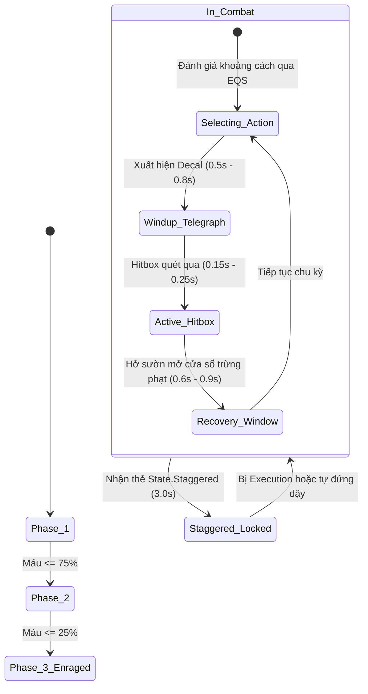

# Prototype Boss AI & Telegraphs

> **Status**: Approved  
> **Author**: Systems Designer & Gameplay Programmer  
> **Last Updated**: 2026-09-15  
> **Implements Pillar**: True Skill Expression & Responsive Combat  
> **Target Engine**: Unreal Engine 5 (Behavior Tree, EQS, Decals & Niagara)

---

## Overview

Hệ thống AI Boss Nguyên Mẫu & Cảnh Báo Đòn Đánh (Prototype Boss AI & Telegraphs System) là tiêu chuẩn vàng định hình thiết kế đối thủ đỉnh cao trong *Project Ascendant*. Được xây dựng trên nền tảng **Unreal Engine 5 Behavior Trees**, **Environment Query System (EQS)** kết hợp hệ thống Decal báo chiêu thời gian thực, hệ thống định nghĩa đối thủ thử nghiệm đầu tiên của dự án: **Lãnh Chúa Thiết Giáp (Ironclad Warlord)**.

Hệ thống quán triệt triết lý thiết kế cốt lõi: **Độ công bằng và khả năng đọc vị tuyệt đối (Absolute Fairness & High Readability)**. Mọi đòn đánh nguy hiểm đều có:
1. Vùng báo chiêu mặt đất (**Ground Telegraph Decals**) với hình học chuẩn (Nón quét 120°, Vệt thẳng 800cm, Vòng tròn 400cm) hiển thị mức độ sạc đỏ dần từ 0% đến 100% trong $0.5\text{s} - 0.8\text{s}$.
2. Dấu hiệu âm thanh & thị giác (**Audio/Visual Cues**): Mắt Boss lóe đỏ, chuyển động gồng mình rõ nét (Windup Animation) và tiếng rít vũ khí đặc trưng.
3. Cây hành vi 3 Pha (3-Phase Progression) leo thang kịch tính kết hợp khả năng tự biến đổi phong cách chiến đấu khi các bộ phận giải phẫu (Sừng, Đuôi, Giáp) bị người chơi bẻ gãy theo *Stagger & Part Breaking System*.

---

## Player Fantasy

*"Tiếng bước chân nặng như ngàn cân vang vọng khắp đấu trường đá cổ. Lãnh Chúa Thiết Giáp vung thanh cự đao xé rách không khí, mặt đất dưới chân bạn lập tức rực sáng một vùng nón rẻ quạt đỏ lửa. Mắt Boss lóe lên tia sáng đỏ rực 'Ping!' cùng tiếng rít đao chói tai — vạch đỏ sạc đầy trong tích tắc! Bạn không lùi bước, mà nhắm đúng thời khắc lưỡi đao vung tới để bấm lướt xuyên qua. Tiếng chuông Perfect Dodge ngân vang báo hiệu né đòn hoàn hảo, bạn lướt mượt ra sau lưng Boss, nhìn thấy chiếc đuôi thép to lớn đang chuẩn bị quét ngược lại. Đọc vị toàn bộ từng cử động của một con quái vật khổng lồ và biến những đòn đánh chết người của nó thành bàn đạp phản kích — đó là cảm giác của một bậc thầy chiến đấu thực thụ."*

Người chơi luôn cảm thấy trận đấu căng thẳng nhưng sòng phẳng: mỗi lần thất bại là một bài học do căn thời gian sai, chứ không bao giờ do Boss "chém lén" hay tung chiêu bất thình lình không thể né.

---

## Detailed Design

### Core Rules

Hệ thống AI Boss được xây dựng dựa trên Unreal Engine `BehaviorTree` kết hợp `BlackboardComponent` và hệ thống máy ảo EQS (Environment Query System). Đối thủ nguyên mẫu là **Lãnh Chúa Thiết Giáp (Ironclad Warlord)**.

#### 1. Thông Số Cơ Bản Của Prototype Boss (*Lãnh Chúa Thiết Giáp*)
- `MaxHealth`: **10,000 HP** (được thiết kế cho cơ chế đánh vượt cấp thông qua 4 lần kết liễu Posture: $25\% \times 4$).
- `MaxPosture`: **800 điểm** (tích lũy từ đòn thường 10–30, Dash Attack 25 và Heavy Charged 60).
- `MoveSpeed`: **420 cm/s** (chậm hơn người chơi 550 cm/s, nhưng sở hữu các đòn lao/húc áp sát cực nhanh).

#### 2. Quy Chuẩn Vùng Báo Chiêu (Standardized Telegraph System)
Mỗi đòn đánh của Boss luôn trải qua đúng **4 giai đoạn bất biến**:

```mermaid
gantt
    title Vòng Đời 1 Đòn Đánh Của Boss
    dateFormat X
    axisFormat %s
    section Báo Chiêu (Telegraph)
    Vùng Decal sạc đỏ dần (0% -> 100%) :active, 0, 50
    Lóe sáng trắng chớp đỉnh (Flash Cue) :crit, 40, 50
    section Gây Sát Thương (Active)
    Hitbox quét qua vùng Decal :crit, 50, 70
    section Cửa Sổ Hở Sườn (Punish)
    Boss đứng khựng hồi chiêu (Mở cho người chơi chém) :0, 70, 150
```

1. **Giai đoạn Báo Chiêu (Telegraph Phase - $0.50\text{s} - 0.80\text{s}$):**
   - Mặt đất xuất hiện Decal hình học với cơ chế **Đổ đầy màu đỏ (Fill Progression)** từ 0% đến 100%.
   - Ở $0.10\text{s}$ cuối cùng: Mắt Boss lóe tia sáng đỏ rực, Decal nháy trắng viền và phát âm thanh đanh thép *"Ping!"*. **Đây chính là thời điểm vàng để bấm Lướt kích hoạt Perfect Dodge!**
2. **Giai đoạn Gây Sát Thương (Active Hitbox Phase - $0.15\text{s} - 0.25\text{s}$):**
   - Vũ khí/thân thể Boss quét qua đúng diện tích của Decal.
3. **Giai đoạn Hở Sườn (Recovery / Punishment Phase - $0.60\text{s} - 1.00\text{s}$):**
   - Boss đứng khựng lấy lại thăng bằng. Đây là thời cơ vàng để người chơi giữ phím tung đòn Heavy Charged tích lũy 60 điểm Posture.

#### 3. Bảng Chiêu Thức & Tương Tác Phá Hủy Bộ Phận (Part Breaking Integration)

| Tên Đòn Đánh | Hình học Telegraph (Decal) | Thời gian Báo Chiêu | Sát thương máu | Đặc tính chiến đấu | Bộ phận chi phối (`stagger-system.md`) |
| :--- | :--- | :---: | :---: | :--- | :--- |
| **Đao Quét Bán Nguyệt (Cleave Strike)** | Nón quét 120° (Sector Cone), bán kính 350cm. | 0.50s | 120 | Chém ngang quét rộng phía trước. | Vũ khí Cự Đao (Không thể phá). |
| **Bổ Giác Chấn Địa (Overhead Smash)** | Vệt chữ nhật 150cm $\times$ 450cm thẳng trước mặt. | 0.65s | 220 | Chém bổ dọc uy lực, đánh ngã người chơi. | Tay Phải / Cự Đao. |
| **Thiết Giác Húc Càn (Iron Horn Charge)** | Vệt chữ nhật mũi tên 250cm $\times$ 900cm xuyên sàn đấu. | 0.80s | 280 | Húc càn tốc độ cao, hất tung lên không. | **`Boss.Part.Horn`** (*Cấm vĩnh viễn chiêu này khi Sừng bị bẻ gãy!*). |
| **Thiết Vĩ Đoạt Mệnh (Iron Tail Sweep)** | Vòng cung nón 160° sau lưng Boss, bán kính 300cm. | 0.45s | 150 | Quất đuôi phản kích người chơi lách sau lưng. | **`Boss.Part.Tail`** (*Cấm vĩnh viễn chiêu này khi Đuôi bị chặt đứt!*). |
| **Địa Chấn Cuồng Nộ (Earthquake Stomp)** | 2 Vòng tròn đồng tâm (Bán kính 250cm lan ra 500cm). | 0.70s | 200 | Giậm đất tạo sóng xung kích chấn động sàn đấu. | Kỹ năng độc quyền của **Pha 3**. |

#### 4. Cây Hành Vi 3 Pha (3-Phase Flow)
- **Pha 1 (100% $\rightarrow$ 75% HP - Khởi động & Quan sát):**
  - Boss chỉ ra các đòn đơn lẻ với nhịp điệu chậm rãi (Cleave, Overhead, Charge).
  - Cửa sổ hở sườn dài (0.90s), giúp người chơi làm quen nhịp né I-frame và tập trung chém vào Sừng hoặc Đuôi.
- **Pha 2 (75% $\rightarrow$ 25% HP - Chuỗi Liên Hoàn 2-3 Nhịp):**
  - Mở khóa các chuỗi đòn đánh phối hợp:
    - *Combo A:* Đao Quét (Cleave) $\rightarrow$ Bổ Giác Chấn Địa (Overhead).
    - *Combo B:* Húc Càn (Charge) $\rightarrow$ nếu trượt sẽ xoay người Quất Đuôi (Tail Sweep) ngay lập tức.
  - Cửa sổ hở sườn rút ngắn xuống 0.70s.
- **Pha 3 (< 25% HP - Cuồng Bạo / Enrage):**
  - Boss gầm thét, mắt đỏ rực lửa, tốc độ di chuyển tăng lên 480 cm/s.
  - Mở khóa chiêu thức tối thượng: **Địa Chấn Cuồng Nộ (Earthquake Stomp)**.
  - Nếu người chơi đã phá vỡ cả Sừng và Đuôi từ trước, ở Pha 3 Boss sẽ bị tước bỏ hầu hết các đòn cơ động nguy hiểm, trở nên chậm chạp và dễ bị trừng phạt hơn rất nhiều (tưởng thưởng cực lớn cho tư duy chiến thuật).

### States and Transitions

### Interactions with Other Systems

- **Dash & Evasion (`dash-evasion.md`):** Đòn Telegraph của Boss là mục tiêu để người chơi kích hoạt `State.Invulnerable` (0.28s) và `State.PerfectDodgeTriggered` (0.05s-0.15s).
- **Core Combat System (`combat-system.md`):** Cửa sổ Recovery của Boss là thời điểm người chơi tung chuỗi Combo 3 nhịp và đòn tụ lực Heavy Charged.
- **Stagger & Part Breaking (`stagger-system.md`):** Nhận sự kiện bộ phận bị vỡ để cập nhật Blackboard (`bIsHornBroken = true`, `bIsTailBroken = true`), khóa chiêu thức tương ứng khỏi Selector.

---

## Formulas

### 1. Tốc Độ Đổ Đầy Vùng Báo Chiêu (Telegraph Fill Progression)
$$\text{FillRatio}(t) = \min\left(1.0, \frac{t - t_{\text{start}}}{\text{TelegraphDuration}}\right)$$
- Khi $\text{FillRatio}(t) \ge 0.85$: Kích hoạt hiệu ứng chớp sáng viền Decal (Flash Cue trong $\Delta t = 0.10\text{s}$ cuối) kèm âm thanh đanh thép *"Ping!"*.

### 2. Thuật Toán Chọn Chiêu Thức Qua Khoảng Cách & Góc Nhìn (EQS Selection Score)
$$\text{Score}_{\text{action}} = w_{\text{dist}} \cdot f(\text{Distance}) + w_{\text{angle}} \cdot g(\theta_{\text{player}}) + w_{\text{cd}} \cdot h(t_{\text{cooldown}})$$
- *Quy tắc ưu tiên:*
  - Nếu người chơi đứng sau lưng ($\theta > 120^\circ$) trong cự ly $< 300\text{cm}$: Ưu tiên **90%** tung đòn **Thiết Vĩ Đoạt Mệnh (Tail Sweep)**.
  - Nếu người chơi ở cự ly xa ($> 500\text{cm}$): Ưu tiên **80%** tung đòn **Thiết Giác Húc Càn (Horn Charge)**.
  - Nếu người chơi cận chiến trước mặt ($< 350\text{cm}$): Ưu tiên chọn **Đao Quét Bán Nguyệt** hoặc **Bổ Giác Chấn Địa**.

### 3. Sát Thương Nhận Vào Tử Huyệt Sau Khi Phá Giáp (Weakpoint Damage Formula)
$$\text{Damage}_{\text{ChestWeakpoint}} = \text{IncomingDamage} \times 1.50$$
- Sau khi phá hủy `Boss.Part.Armor`, toàn bộ đòn chém vào ngực Boss nhận thêm **+50% sát thương**.

---

## Edge Cases

- **Boss Tông Vào Tường Khi Húc Càn (Wall Crash Stun):**
  - Nếu người chơi lướt né sang bên và Boss lao đâm sầm vào góc tường đá của đấu trường: Boss lập tức bị dội lực ngã khựng trong **1.8 giây** (`State.WallStunned`), mở ra thời cơ vàng cho người chơi phản công.
- **Người Chơi Né Quá Sớm (Early Dodge Punishment):**
  - Nếu người chơi hoảng loạn bấm Lướt né ngay khi Decal vừa xuất hiện ($t = 0.10\text{s}$), khung I-frame 0.28s sẽ kết thúc ở $t = 0.38\text{s}$. Khi Hitbox Boss quét trúng ở $t = 0.50\text{s}$, người chơi đã hết I-frame và sẽ lãnh trọn toàn bộ sát thương (trừng phạt nghiêm khắc thói quen né non).
- **Chuyển Pha (Phase Transition) Trong Cửa Sổ Stagger:**
  - Nếu đòn kết liễu Execution rút máu Boss chạm ngưỡng chuyển pha (ví dụ từ 80% xuống 55% rơi vào Pha 2): Hệ thống ưu tiên cho người chơi hoàn thành trọn vẹn hoạt ảnh kết liễu; sau khi Boss gượng dậy mới phát hoạt ảnh gầm thét chuyển sang Pha 2.
- **Mất Mục Tiêu (Player Tàng Hình / Thoát Tầm Mắt):**
  - Boss chuyển sang trạng thái cảnh giới (Alert Stance), dậm chân và xoay mắt quét 360° trong 2.0s trước khi định vị lại người chơi.

---

## Dependencies

- **Combat System (`combat-system.md`):** Cung cấp sát thương người chơi và cơ chế Hitstop khi Boss trúng đòn.
- **Stagger & Part Breaking (`stagger-system.md`):** Cung cấp trạng thái `State.Staggered`, vị trí tử huyệt và cơ chế gãy bộ phận.
- **Dash Evasion (`dash-evasion.md`):** Cung cấp khung I-frame 0.28s để cân bằng thời lượng Telegraph.

---

## Tuning Knobs

| Tên Biến Số | Giá Trị Mặc Định | Biên Độ Khuyến Nghị | Ý Nghĩa Cân Bằng |
| :--- | :---: | :---: | :--- |
| `TelegraphDuration_Cleave` | 0.50s | 0.45s – 0.60s | Thời gian báo chiêu đao quét ngang. |
| `TelegraphDuration_Overhead`| 0.65s | 0.55s – 0.75s | Thời gian báo chiêu đòn bổ dọc chấn động. |
| `TelegraphDuration_Charge`  | 0.80s | 0.70s – 0.90s | Thời gian báo chiêu đòn húc càn xuyên sàn. |
| `TelegraphDuration_Tail`    | 0.45s | 0.40s – 0.55s | Thời gian phản xạ cực nhanh khi đứng sau lưng Boss. |
| `TelegraphDuration_Stomp`   | 0.70s | 0.60s – 0.85s | Thời gian báo chiêu địa chấn giậm đất Pha 3. |
| `FlashCueDuration`          | 0.10s | 0.08s – 0.12s | Thời lượng chớp sáng báo hiệu Perfect Dodge. |
| `WallStunDuration`          | 1.8s | 1.5s – 2.2s | Thời gian Boss bị choáng khi húc trúng tường. |
| `Phase2_HPTarget`           | 0.75 | 0.70 – 0.80 | Ngưỡng máu kích hoạt Pha 2. |
| `Phase3_HPTarget`           | 0.25 | 0.20 – 0.30 | Ngưỡng máu kích hoạt Pha 3 (Cuồng bạo). |

---

## Visual/Audio Requirements

- **VFX Niagara & Decals:**
  - `M_Telegraph_Decal`: Dynamic Material chiếu nền đỏ bán trong suốt với viền sáng chạy mạch năng lượng từ tâm ra ngoài.
  - `NS_Boss_EyeGlint`: Đốm sáng đỏ rực lóe sáng ở mắt Boss khi bước vào mốc Flash Cue 0.10s cuối.
  - `NS_Charge_DustTrail`: Cột khói bụi cát cuộn trào sau lưng Boss khi phóng chiêu Húc Càn.
- **Âm thanh (Audio SFX):**
  - `SFX_Telegraph_Flash`: Tiếng chuông cảnh báo đanh thép *"Ping!"* phát ra tại thời khắc Flash Cue.
  - `SFX_Boss_Roar_PhaseTransition`: Tiếng gầm chấn động rung chuyển cả đấu trường khi chuyển pha.
  - `SFX_Horn_WallCrash`: Tiếng va chạm ầm ầm như núi sập khi Boss tông vào tường đá.

---

## UI Requirements

- **HUD Phản Hồi:**
  - Thanh Máu & Tên Boss: Hiển thị ở đỉnh màn hình: *"LÃNH CHÚA THIẾT GIÁP - CẤP ĐỘ 40"*.
  - Vạch chỉ báo phân chia 3 Pha trên thanh máu (ở mốc 75% và 25%).
  - Biểu tượng bộ phận bên cạnh tên Boss (Icon Sừng, Đuôi) sẽ gạch chéo đỏ khi bộ phận bị phá hủy.

---

## Acceptance Criteria

- [ ] **AC-1 (Báo Chiêu & Flash Cue Đồng Bộ):** 100% đòn đánh nguy hiểm đều hiển thị Decal dưới đất tăng dần từ 0% đến 100%; ở 0.10s cuối mắt Boss lóe sáng và phát tiếng "Ping!"; Hitbox quét trúng đúng tại thời điểm 100%.
- [ ] **AC-2 (Né Non Bị Trừng Phạt):** Bấm lướt né quá sớm khi Decal vừa xuất hiện sẽ hết I-frame trước khi đòn đánh quét trúng và bị dính trọn sát thương.
- [ ] **AC-3 (Khóa Chiêu Khi Gãy Bộ Phận):** Khi Sừng bị gãy, Boss không bao giờ tung chiêu Húc Càn nữa; khi Đuôi bị đứt, Boss không bao giờ tung chiêu Quất Đuôi sau lưng.
- [ ] **AC-4 (Tông Tường Choáng):** Dụ Boss tung chiêu Húc Càn tông thẳng vào tường đá sẽ kích hoạt trạng thái choáng 1.8s.

---

## Open Questions

- *Không còn câu hỏi mở tồn đọng. Toàn bộ thông số hoàn toàn khớp với attributes-system, dash-evasion, combat-system và stagger-system.*
