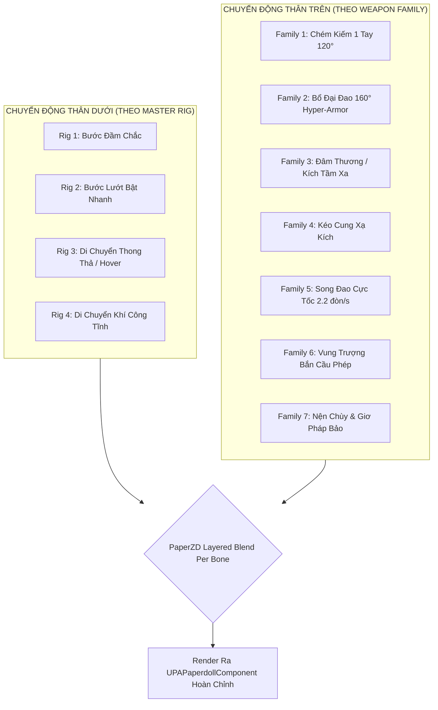

# Character & NPC Visual Identity System (Silhouette, Rigs & Threat Telegraphing)
## Đặc Tả Hệ Thống Bản Sắc Thị Giác Nhân Vật & NPC — Project Ascendant

> **Mã tài liệu**: `GDD-VISUAL-IDENTITY-2026-V1`  
> **Trạng thái**: Approved  
> **Tác giả**: Lead Game Systems Designer & Technical Art Director  
> **Ngày ban hành**: 2026-09-25  
> **Trụ cột thực thi**: Visual Clarity & Combat Readability at -45° Isometric, High-Stakes Combat Expression  
> **Engine mục tiêu**: Unreal Engine 5.7 / 5.8 (Paper2D, PaperZD Animation State Machine, Lumen HD-2D, Niagara 2D)  
> **Tài liệu liên quan**: [`itemization.md`](file:///mnt/Data/Projects/project-games/ProjectAscendant/design/gdd/itemization.md), [`foundational-classes.md`](file:///mnt/Data/Projects/project-games/ProjectAscendant/design/gdd/foundational-classes.md), [`zone-system.md`](file:///mnt/Data/Projects/project-games/ProjectAscendant/design/gdd/zone-system.md), [`pixel-asset-specifications.md`](file:///mnt/Data/Projects/project-games/ProjectAscendant/design/art/pixel-asset-specifications.md)

---

## 1. Tổng Quan & Triết Lý Thiết Kế (Design Philosophy)

Trong góc nhìn 2.5D Isometric nghiêng $-45^\circ$, với camera đặt cách nhân vật $1200\text{ cm}$ và kích thước màn hình hiển thị hàng chục đơn vị chiến đấu cùng lúc, **hình dạng bóng đen (Silhouette)** là kênh thông tin thị giác duy nhất giúp người chơi đưa ra quyết định sinh tử trong $200\text{ ms}$ (nhận diện class đồng đội, class kẻ thù PK, hoặc cấp bậc quái vật đang lao tới).

```
╔═══════════════════════════════════════════════════════════════════════════════════════════════════╗
║                                 NGUYÊN TẮC VÀNG THỊ GIÁC                                          ║
║       "NẾU NHÂN VẬT CHỈ LÀ MỘT BÓNG ĐEN 1 MÀU (PURE BLACK SILHOUETTE) TRÊN NỀN TRẮNG,             ║
║            NGƯỜI CHƠI VẪN PHẢI BIẾT ĐÓ LÀ CLASS GÌ VÀ QUÁI ĐÓ NGUY HIỂM Ở MỨC NÀO!"              ║
╚═══════════════════════════════════════════════════════════════════════════════════════════════════╝
```

### 1.1 Ba Vấn Đề Lớn Được Giải Quyết Triệt Để:
1. **Tránh xung đột màu với Rarity System (Color Decoupling)**:
   Hệ thống Itemization đã cố định màu sắc cho 5 bậc hiếm trang bị (`Common` xám, `Uncommon` lục, `Rare` lam, `Epic` tím, `Legendary` hoàng kim) thông qua các Material Instance tĩnh (`item-005`). Do đó, **tuyệt đối cấm dùng màu áo giáp để phân biệt Class**. Bản sắc của Class phải được neo cứng vào **Khối hình học tổng thể (Shape Grammar), Dáng đứng (Stance / Center of Gravity) và Cách cầm Vũ khí (Weapon Grip / Anchor Points)**.
2. **Cảnh báo độ nguy hiểm quái vật bằng hình khối (Visual Threat Telegraphing)**:
   Không bắt người chơi phải dán mắt vào thanh máu UI. Quái vật từ *Trash Mob* đến *World Boss* phải truyền tải cấp độ nguy hiểm thông qua quy chuẩn tỷ lệ thể tích (Mass Scaling), mật độ gai góc bất đối xứng (Spikiness & Aggression Index) và biên độ chuyển động mở rộng (Extending Wind-up Silhouette).
3. **Bài toán ngân sách sản xuất (The 8,400-Frame Mitigation)**:
   Với 12 Class, 7 Weapon Families, 8 hướng nhìn và chuỗi đòn đánh đa tầng, nếu vẽ riêng từng frame cho từng class sẽ tạo ra hơn 8.400 frame vẽ tay—bất khả thi với quy mô studio tinh gọn. Giải pháp cốt lõi là **Kiến trúc 5 Master Animation Rigs kết hợp cơ chế phân tách chuyển động thân trên/thân dưới (Decoupled PaperZD State Machine)**, tái sử dụng hoạt ảnh đòn đánh theo Weapon Family nhưng vẫn giữ bản sắc Class bằng **Custom Idle Stances (3-4 frame) và Secondary Motion Props**.

---

## 2. Ma Trận Silhouette Rule Cho 12 Class Nhân Vật

12 Class trong Project Ascendant trải dài qua 4 phân bậc độ hiếm chức nghiệp:
- **Khởi Đầu (Normal - Tier 1)**: *Vanguard (Chiến Binh)*, *Ranger (Du Hiệp)*, *Arcanist (Thuật Sĩ)*, *Acolyte (Tu Sĩ)*.
- **Hiếm (Rare - Tier 2)**: *Berserker (Cuồng Nộ)*, *Shadowblade (Thích Khách)*, *Elementalist (Nguyên Tố Sư)*, *Templar (Thánh Hiệp Sĩ)*.
- **Sử Thi (Epic - Tier 3)**: *Void Blade (Hư Không Kiếm)*, *Chronomancer (Thời Không Pháp Sư)*, *Dragon Knight (Long Kỵ Sĩ)*.
- **Thần Thoại Ẩn (Mythic Hidden - Tier 4)**: *God Slayer (Thần Thí Giả)*.

```mermaid
flowchart TD
    subgraph SHAPE_GRAMMAR["3 NHÓM HÌNH KHỐI CỐT LÕI"]
        Blocky["KHỐI HÌNH THANG / VUÔNG<br/>(Heavy / Defensive / Unyielding)"]
        Sharp["KHỐI TAM GIÁC NGƯỢC / XIÊN NHỌN<br/>(Agile / Lethal / Piercing)"]
        Vertical["KHỐI TRỤ ĐỨNG / HÌNH THOI<br/>(Mystic / Flowing / Transcendent)"]
    end

    Blocky --> C1[Vanguard: Khiên Tháp & Trọng Tâm Chìm]
    Blocky --> C5[Berserker: Lưng Gù Đao Khổng Lồ]
    Blocky --> C8[Templar: Cầu Vai Chữ Thập & Đại Thuẫn]
    Blocky --> C11[Dragon Knight: Sừng Rồng & Thương Dài]

    Sharp --> C2[Ranger: Cánh Cung Xiên Vượt Đỉnh Đầu]
    Sharp --> C6[Shadowblade: Cúi Rạp & Song Đao Chữ X]
    Sharp --> C9[Void Blade: Kiếm Hư Không Dốc 45° Tà Áo Xé]
    Sharp --> C12[God Slayer: Lưỡi Kích Bất Đối Xứng]

    Vertical --> C3[Arcanist: Pháp Trượng Đứng & Cầu Phép Lơ Lửng]
    Vertical --> C4[Acolyte: Chùy Chuông & Tràng Hạt Cân Bằng]
    Vertical --> C7[Elementalist: Pháp Cầu Đôi Xoay Vần]
    Vertical --> C10[Chronomancer: Đồng Hồ Cát Con Lắc]
```



### 2.1 Bảng Đặc Tả Dáng Đứng & Silhouette Anchor Của 12 Class

| Class & Bậc Hiếm | Weapon Family Mặc Định | Khối Hình Học Cơ Sở (Shape Grammar) | Trọng Tâm & Dáng Đứng (Line of Action & Stance) | Silhouette Anchor Độc Nhất (Nhận Diện Mù Màu) | Thử Nghiệm Thumbnail (16x16 / 32x32) |
| :--- | :--- | :--- | :--- | :--- | :--- |
| **1. Vanguard**<br>*(Normal - Tier 1)* | Family 1: `1H.Blade` + Khiên | **Hình thang đáy lớn (Heavy Trapezoid)** | Chân tấn rộng, trọng tâm thấp (60% chân trước), cột sống hơi khum đón lực. | Khiên sắt vuông vức che trọn 40% thân trái; mũi kiếm hạ thấp hướng $45^\circ$ xuống đất. | Một khối vuông dày dặn, nổi bật mảng nhô góc trái của khiên. |
| **2. Ranger**<br>*(Normal - Tier 1)* | Family 4: `2H.Bow` | **Tam giác ngược xiên nhọn (Slanted Triangle)** | Đứng nghiêng $30^\circ$, chân sau kiễng nhẹ, thân người thanh mảnh, hướng nhìn căng cước. | Cánh cung dài vươn cao vượt đỉnh đầu 12px; tà khăn choàng dã ngoại bay lệch về sau. | Đường xiên chéo dài xé toạc hình elip thân người. |
| **3. Arcanist**<br>*(Normal - Tier 1)* | Family 6: `2H.Staff` | **Trụ đứng thẳng (Vertical Column)** | Đứng thẳng $90^\circ$, kiêu hãnh, chân khép hẹp, tà áo chùng buông thẳng xuống đất. | Trượng ma pháp cao hơn đầu 16px cắm đất; 2 viên đá phép bay lơ lửng quanh vai trái. | Dáng cột thon dài có điểm nhô sáng ở đầu trượng. |
| **4. Acolyte**<br>*(Normal - Tier 1)* | Family 7: `1H.Mace` / Relic | **Đồng hồ cát / Chữ thập (Hourglass)** | Trọng tâm cân bằng 50/50, mã bộ tĩnh, ngực ưỡn thẳng, hai tay mở rộng đón nhận. | Cầu vai rộng đối xứng, dải kinh sách thả dài dọc 2 bên hông; tay cầm chùy thả lỏng. | Khối thắt eo rõ rệt giữa vai rộng và tà váy pháp sư xòe. |
| **5. Berserker**<br>*(Rare - Tier 2)* | Family 2: `2H.Heavy` (Đại Đao) | **Tam giác phình ngang (Bulky Wedge)** | Lưng còng gù về phía trước $25^\circ$, đầu rụt giữa hai vai cuồn cuộn, tư thế như dã thú săn mồi. | Phiến đại đao khổng lồ vác chéo ngang vai nhô ra ngoài cơ thể 18px; tóc/bờm xõa dài. | Khối gai góc, lệch trọng tâm dữ dội về bên vác vũ khí. |
| **6. Shadowblade**<br>*(Rare - Tier 2)* | Family 5: `Dual.Daggers` | **Mũi tên dốc thấp (Low-Slung Chevron)** | Hạ thấp sát đất (chỉ cao bằng 75% chiều cao thường), chân gập sâu, tư thế sẵn sàng bật lò xo. | Cặp song đao bắt chéo chữ X trước ngực hoặc chỉa ngược về sau; khăn trùm kín mặt. | Khối bóng dẹt, bề ngang bè rộng hơn bề cao, hai mũi dao sắc lẹm. |
| **7. Elementalist**<br>*(Rare - Tier 2)* | Family 6: `2H.Staff` / Orbs | **Hình thoi lơ lửng (Floating Diamond)** | Hai chân không chạm đất (hovering 4px), thân trên nghiêng nhẹ theo luồng khí động. | Hai quả cầu nguyên tố bay vòng tròn tạo thành quỹ đạo elip lớn bao quanh thân. | Bóng chân lơ lửng cách mặt bóng đổ (Cast Shadow) 4px. |
| **8. Templar**<br>*(Rare - Tier 2)* | Family 1: `1H.Blade` + Đại Thuẫn | **Tòa tháp Gothic (Gothic Spire)** | Đứng thẳng tắp, ngực ưỡn cao, chân giáp thép đóng đinh xuống nền đá. | Đại thuẫn tháp (Tower Shield) dựng đứng từ cằm xuống đất; chóp mũ Greathelm hình chóp nhọn. | Cạnh dựng đứng tuyệt đối ở mạn khiên, chóp đỉnh mũ nhọn hoắt. |
| **9. Void Blade**<br>*(Epic - Tier 3)* | Family 1: `1H.Blade` (Kiếm dài) | **Đường zigzag bất ổn (Fractured Zigzag)** | Thân người chao đảo nhẹ như tàn ảnh, một tay giấu sau lưng, một tay cầm kiếm dốc ngược. | Tà áo choàng hư không rách xơ xác bay ngược chiều gió; lưỡi kiếm dài mảnh như đường chỉ. | Vạt áo xé răng cưa bay hỗn loạn, tạo cảm giác phi vật lý. |
| **10. Chronomancer**<br>*(Epic - Tier 3)* | Family 7: `Relic` (Đồng Hồ Cát) | **Con lắc dao động (Pendulum Asymmetry)** | Dáng đứng thong thả, bước chân lệch nhịp, tay nâng pháp bảo lơ lửng ngang tầm mắt. | Vòng kim cô thời gian xoay lơ lửng sau lưng; dây xích đồng hồ cát rủ dài đung đưa. | Vòng hào quang tròn rỗng bao quanh đầu và vai. |
| **11. Dragon Knight**<br>*(Epic - Tier 3)* | Family 3: `2H.Polearm` (Chiến Kích) | **Mũi thương chọc trời (Ascending Lance)** | Đứng chéo chân kiên cố, ngực vươn cao, tay cầm thương dựng đứng góc $75^\circ$. | Mũi chiến kích lưỡi trăng khuyết vươn cao vượt đầu 24px; đuôi mũ giáp vảy rồng dài. | Điểm cao nhất trong tất cả các class, đỉnh nhọn áp đảo khung hình. |
| **12. God Slayer**<br>*(Mythic Hidden)* | Family 1 / Family 3 | **Hư vô biến dạng (Distorted Negative Space)** | Tĩnh lặng tuyệt đối (No idle breathing), không có chuyển động thở thông thường. | Lưỡi kiếm/kích cắm thẳng xuống đất phía trước mặt; bóng đổ dưới chân loang lổ như mực đen. | Khoảng rỗng (Negative space) lớn giữa thân người và vũ khí cắm đất. |

---

## 3. Hệ Thống Phân Cấp NPC & Quái Vật (Enemy Tier System)

Quái vật trong Project Ascendant được chia thành **4 Tầng Nguy Hiểm (Threat Tiers)** xuyên suốt 3 vùng bản đồ mở không rào cản. Người chơi phải có khả năng ước lượng cấp bậc và chuẩn bị phản xạ I-frame ngay khi quái vật xuất hiện ở rìa tầm nhìn camera.

```
TIỂU THỂ (TRASH)      TINH ANH (ELITE)       THỦ LĨNH (MINI-BOSS)      LÃNH CHÚA (WORLD BOSS)
    [ 0.8x-1.0x ]         [ 1.3x-1.5x ]          [ 2.0x-2.5x ]             [ 4.0x-8.0x ]
  Mềm / Bo tròn         Giáp nhọn / Bất đối xứng   Dị tật / Khối cơ bắp      Hư không / Che rợp đất
```

### 3.1 Ma Trận 4 Cấp Độ Quái Vật Theo 3 Vùng Đất

| Tầng Quái Vật | Đặc Điểm Hình Khối (Shape & Mass) | Hành Vi Dáng Đứng (Stance & Telegraph) | Vùng 1: Verdant Frontier (Tiền Trạm Sơ Khai) | Vùng 2: Ashen Wilderness (Hoang Dã Tàn Tích) | Vùng 3: Forbidden Sanctum (Cấm Địa Thần Tích) |
| :--- | :--- | :--- | :--- | :--- | :--- |
| **Bậc 1: Trash Mob**<br>*(Lũ Quái Rác)* | - Kích thước: **$0.8\times - 1.0\times$** người chơi.<br>- Khối bo tròn, lùn, tứ chi khẳng khiu hoặc co rúm.<br>- Đường nét viền mềm mại, ít góc nhọn. | - Dáng đứng lỏng lẻo, co cụm theo bầy.<br>- Khi bị đánh có phản ứng lùi bước (Hit-Stun) rõ rệt.<br>- Đòn đánh biên độ ngắn, không có pha gồng. | **Rừng Nấm Quỷ (Fungal Crawler)**:<br>Nấm lùn bò 4 chân, lưng tròn trịa, di chuyển lúc nhúc. | **Xác Sống Khô (Ashen Scavenger)**:<br>Xác lính gầy guộc, cầm thanh kiếm cùn lê bước. | **Bọ Hư Không (Void Larva)**:<br>Sâu bọ trườn sát đất, thân mềm đốt tròn, lao vào cắn xé. |
| **Bậc 2: Elite Mob**<br>*(Quái Tinh Anh)* | - Kích thước: **$1.3\times - 1.5\times$** người chơi.<br>- Bắt đầu xuất hiện **khối nhọn bất đối xứng (Asymmetrical Horns/Spikes)**.<br>- Giáp trụ phủ $60\%$ thân mình. | - Đứng tấn đĩnh đạc, vũ khí luôn ở thế thủ (Guard Stance).<br>- Có Hyper-Armor khi ra chiêu.<br>- Pha gồng (Wind-up): Giương cao vũ khí giữ 0.4s trước khi bổ. | **Thủ Lĩnh Nanh Bạc (Silverback Brute)**:<br>Khỉ đột rừng sâu vai u thịt bắp, nanh dài nhô lệch mạn phải. | **Hiệp Sĩ Tro Tàn (Ashen Centurion)**:<br>Chiến binh giáp thép đen, mũ 1 sừng nhọn, cầm giáo dài quét ngang. | **Đao Phủ Hư Không (Void Executioner)**:<br>Sinh vật hai đầu, mang đại đao gãy, tỏa khói đen quanh khớp. |
| **Bậc 3: Mini-Boss**<br>*(Thủ Lĩnh Vùng)* | - Kích thước: **$2.0\times - 2.5\times$** người chơi.<br>- Khối hình góc cạnh gãy khúc dữ dội (Jagged Brutalism).<br>- Silhouette phá vỡ quy chuẩn cơ thể sinh học thông thường. | - Vũ khí cắm sâu hoặc kéo lê trên mặt đất tạo vệt rãnh.<br>- Có hào quang thể tích (Volumetric Aura) mờ bao quanh.<br>- Pha gồng: Toàn thân ngửa ra sau, silhouette mở rộng $40\%$. | **Thực Vật Ma Quái (Corrupted Treant)**:<br>Gốc cây cổ thụ ngàn năm biến dạng, cành gai sắc nhọn vươn cao 60px. | **Hỏa Tinh Cự Đao (Lava Reaver)**:<br>Quái thú dung nham một tay là phiến đá lửa khổng lồ chiếm trọn thân. | **Giám Ngục Hư Không (Sanctum Warden)**:<br>Kẻ canh giữ lơ lửng, 4 cánh tay cầm 4 cổ ngữ phong ấn phát sáng. |
| **Bậc 4: World Boss**<br>*(Lãnh Chúa Thế Giới)* | - Kích thước: **$4.0\times - 8.0\times$** người chơi (chiếm 250–400px canvas).<br>- Silhouette đa tầng, nhiều bộ phận hoạt động độc lập.<br>- Đổ bóng khổng lồ (Massive Cast Shadow) bao trùm cả đấu trường. | - Đòn thế là các sự kiện địa chấn (Geological Events).<br>- Toàn thân phát quang rực lửa (Emissive Cores).<br>- Pha gồng: Thu mình nén năng lượng (Silhouette co lại 20%) rồi bung toạc $180\%$. | **Bạch Long Rừng Sâu (Verdant Wyrm)**:<br>Rồng cổ đại sải cánh che kín góc camera, vảy sừng phủ rêu xanh. | **Người Đá Khổng Lồ (Ancient Stone Golem)**:<br>Cự thạch bất đối xứng, lõi dung nham đỏ rực ở ngực nứt toác. | **Chúa Tể Hư Không (Void Sovereign)**:<br>Thực thể vũ trụ không hình thù cố định, các xúc tu hư không cào rách không gian. |

### 3.2 Quy Chuẩn Báo Hiệu Đòn Đánh Qua Silhouette (Telegraphing Without UI)

Để người chơi không phải nhìn chằm chằm vào thanh máu hay decal sàn:
1. **Quy tắc Mở Rộng Biên Độ Hình Thể (Extending Silhouette Rule)**:
   Trước khi quái vật tung ra đòn quét nặng (Heavy Cleave) hoặc đòn đâm chí mạng (Unblockable Thrust), tư thế gồng đòn (Wind-up) bắt buộc phải **kéo dãn silhouette ra ngoài thể tích bình thường tối thiểu $30\% - 50\%$** (giương cao búa, banh rộng cánh, ngửa người cực độ).
2. **Khóa Điểm Mù Âm (Negative Space Tell)**:
   Đòn đánh chuẩn bị bổ xuống phải tạo ra một vùng trống hình học rõ rệt giữa cơ thể quái và vũ khí giương cao, cho phép người chơi nhận ra "khoảng trống chết chóc" ngay cả khi đang bị che khuất một phần bởi hiệu ứng hạt VFX.

---

## 4. Kiến Trúc Chia Sẻ Hoạt Ảnh & Ngân Sách Sprite (Animation Sharing Architecture)

### 4.1 Phân Tích Bài Toán Ngân Sách "8.400 Frames"
Nếu làm theo cách ngây thơ (Brute Force):
$$\text{Chi phí} = 12\text{ Classes} \times 7\text{ Weapon Types} \times 8\text{ Directions} \times 10\text{ Actions} \times 10\text{ Frames} \approx \mathbf{67.200}\text{ frames (bất khả thi)}.$$
Ngay cả khi cắt giảm chỉ cho mỗi class dùng 1-2 vũ khí:
$$12\text{ Classes} \times 8\text{ Directions} \times \sim 90\text{ frames/class} \approx \mathbf{8.640}\text{ frames}.$$
Con số này vẫn sẽ phá hủy tiến độ sản xuất của một đội ngũ indie nhỏ.

### 4.2 Giải Pháp: 4 Master Animation Rigs & Phân Tách Thân Trên/Thân Dưới
Chúng ta chuẩn hóa toàn bộ chuyển động của 12 Class vào **4 Khung Xương Hoạt Ảnh Cốt Lõi (Master Rigs)**:

```
┌─────────────────────────────────────────────────────────────────────────────────────────────┐
│                             4 MASTER ANIMATION RIGS CỐT LÕI                                 │
├─────────────────────────┬─────────────────────────┬─────────────────────────┬───────────────┤
│   RIG 1: HEAVY TANK     │    RIG 2: AGILITY       │    RIG 3: CASTER        │ RIG 4: MONK   │
│ (Vanguard, Berserker,   │ (Ranger, Shadowblade,   │ (Arcanist, Elementalist,│   (Acolyte)   │
│  Templar, Dragon Knight)│  Void Blade, God Slayer)│  Chronomancer)          │               │
│ • Trọng tâm thấp, bước đầm│ • Trọng tâm kiễng mũi chân│ • Đứng thẳng, lướt nhẹ   │ • Tấn mã bộ,  │
│ • Độ lắc hông: Nhỏ      │ • Độ lắc hông: Nhanh, linh│ • Chân ít gập, tà bay   │   trọng tâm   │
│ • Bước sải: Dài, chắc   │ • Bước sải: Ngắn, bùng nổ│ • Bước sải: Thong thả   │   cân bằng    │
└─────────────────────────┴─────────────────────────┴─────────────────────────┴───────────────┘
```

### 4.3 Kiến Trúc Phân Tách Thân Trên / Thân Dưới (Decoupled PaperZD Setup)

Trong Unreal Engine 5.7 / 5.8, nhân vật được cấu hình với 2 State Machine chạy song song:
1. **Lower Body State Machine (Chân & Thắt Lưng)**:
   - Chỉ chịu trách nhiệm cho: `Idle`, `Walk`, `Run`, `Dash` (I-frame dodge), `HitStun`.
   - Chia sẻ hoàn toàn giữa các Class thuộc cùng 1 Master Rig!
   - 4 Master Rigs $\times$ 8 hướng $\times$ 24 frames cơ bản = **768 frames**.
2. **Upper Body State Machine (Ngực, Tay & Đầu)**:
   - Gắn trực tiếp với **7 Weapon Families**, **HOÀN TOÀN ĐỘC LẬP VỚI CLASS**!
   - Khi một động tác chém kiếm `Weapon.1H.Blade` được vẽ, cả Vanguard, Templar, Void Blade và God Slayer đều dùng chung chính xác bộ sprite đó!
   - 7 Weapon Families $\times$ 8 hướng $\times$ 3 đòn combo $\times$ 4 frames = **672 frames**.



### 4.4 Kỹ Thuật "Zero-Frame Visual Distinctiveness" (Khác Biệt Mà Không Tốn Frame)

Làm thế nào để 2 class cùng dùng chung 1 Rig và 1 Weapon Family (như Vanguard và Templar) trông không bị trùng lặp?
1. **Custom Idle Stance (Chỉ tốn đúng 3-4 frames tĩnh cho mỗi class)**:
   - Khi đứng yên chờ đòn, Vanguard vác khiên che ngực thở sâu, còn Templar chống đại thuẫn xuống đất trang nghiêm. Chỉ với 3-4 frames Idle độc nhất cho mỗi class (12 classes $\times$ 8 hướng $\times$ 4 frames = 384 frames), ấn tượng ban đầu về class đã được khắc sâu $100\%$.
2. **Secondary Motion Bằng Lò Xo Vật Lý 2D (PaperZD Spring Bones)**:
   - Dải khăn Acolyte, tà áo Arcanist, lông vũ nón Ranger được gắn hệ thống xương lò xo ảo. Khi nhân vật chạy hoặc chém kiếm, các dải vải tự động vung vẩy theo quán tính vật lý thực—**Tốn 0 frame vẽ tay thêm**!
3. **Niagara 2D Slash Trails & Shaders Tùy Biến**:
   - Cùng là đòn chém `Weapon.1H.Blade`:
     - Vanguard: Vệt chém màu thép xám văng tia lửa cam.
     - Templar: Vệt chém ánh sáng vàng thánh hóa (Holy Gold).
     - Void Blade: Vệt chém xé rách không gian màu tím than kèm tàn tro hư không.
     - God Slayer: Vệt chém đen tuyền nuốt chửng ánh sáng.
   - Toàn bộ vệt chém này được render bằng Niagara Mesh Ribbon, không tốn bất kỳ một frame pixel vẽ tay nào của nhân vật.

---

## 5. Tích Hợp Hệ Thống Paperdoll 9-Slot & Bảo Toàn Silhouette

`UPAPaperdollComponent` quản lý 9 sub-component theo cấu trúc phân lớp Z-Order và tọa độ gốc bàn chân cố định `(X: 64, Y: 114)`:
`Helm` $\rightarrow$ `Chest` $\rightarrow$ `Gloves` $\rightarrow$ `Pants` $\rightarrow$ `Boots` $\rightarrow$ `MainHand` $\rightarrow$ `OffHand` $\rightarrow$ `Amulet` $\rightarrow$ `Ring`.

### 5.1 Thách Thức Khi Mặc Giáp Chung
Khi người chơi mặc full bộ giáp `Armor_Heavy_T1` (Sắt thô dã chiến) hoặc `Armor_Medium_T1` (Da bò thô), toàn bộ thân thể Base Body từ cổ tới chân bị che kín. Nếu không có quy tắc bảo toàn, một Vanguard, một Berserker và một Templar cùng mặc giáp Heavy T1 sẽ biến thành 3 nhân vật giống hệt nhau!

### 5.2 Ba Vùng Nhận Diện Bất Biến (3 Invariable Class Zones)

Để giải quyết triệt để vấn đề này, mọi bộ giáp trang bị trong game bắt buộc phải tuân thủ **Quy Tắc 3 Vùng Bất Biến**:

```
                              [ VÙNG 1: HEADWEAR & CLASS CREST ]
                              Socket gắn trên đỉnh mũ luôn mang biểu tượng Class
                                         │
                                         ▼
                                     ┌───────┐
                                     │ (o o) │ ◄── [Vùng Mặt & Cổ]
                         ┌───────────┴───────┴───────────┐
  [ VÙNG 2: WEAPON STANCE ]  │       [VÙNG 3: TABARD]        │  [ VÙNG 2: OFFHAND STANCE ]
  Vị trí góc cầm vũ khí      │   Khoảng hở ngực/hông luôn    │  Góc giương khiên/pháp bảo
  vươn ra ngoài thân thể     │   để lộ dải cờ/ấn chú Class   │  chiếm 30-40% profile ngoài
  (Góc 45° chĩa đất/vác vai) │                               │  (Che ngực hoặc cắm đất)
                         └───────────────────────────────┘
```

1. **Vùng 1: Socket Phụ Kiện Đầu & Mào Giáp (Headwear / Crest Profile)**:
   - Dù mũ giáp là nồi sắt tròn trơn (Greathelm T1) hay giáp rồng hắc thạch (T3), slot `Helm` luôn chừa một điểm gắn socket phụ kiện độc quyền của Class:
     - Vanguard: Luôn có chùm lông bờm ngựa màu đỏ thẫm dựng đứng.
     - Berserker: Luôn có cặp sừng thú thô ráp chĩa ngang.
     - Templar: Luôn có cánh thép thiên thần nhỏ gắn 2 bên mang tai.
     - Dragon Knight: Luôn có sừng rồng vươn dài nhọn hoắt về phía sau.
2. **Vùng 2: Dáng Vũ Khí & Góc Vươn (Weapon Stance Profile)**:
   - Vũ khí và vũ khí phụ nằm ở các slot `MainHand` và `OffHand` luôn chìa ra ngoài biên độ cơ thể tối thiểu $15 - 25\text{ px}$.
   - Góc cầm vũ khí cố định theo bản sắc Class:
     - Vanguard: Khiên luôn che trước ngực, kiếm chúc mũi xuống đất.
     - Berserker: Vũ khí luôn đặt ngang vai gồ ghề.
     - Ranger: Cung luôn vắt chéo qua vai tạo đường xiên $45^\circ$.
3. **Vùng 3: Lớp Cờ Áo & Ấn Chú (Class Tabard / Sash Overlay)**:
   - Lớp `Chest Armor` trong thiết kế pixel luôn có một khoảng trống cắt dọc giữa ngực (Cutout Channel).
   - Component `Amulet` hoặc một lớp phụ kiện trang phục độc quyền của Class sẽ hiển thị đè lên trên giáp ngực:
     - Acolyte: Dải khăn thánh giá thả dài từ cổ xuống đầu gối.
     - Ranger: Khăn choàng len du mục quấn 2 vòng cổ, đuôi khăn bay theo gió.
     - Arcanist: Dải cổ ngữ ma thuật lấp lánh thả giữa ngực.

### 5.3 Chuẩn Hóa Khung Hình 1.0x & Vóc Dáng Vẽ Thủ Công (Zero-Mixel Handcrafted Anatomy)

> ⚠️ **ĐIỀU CHỈNH KỸ THUẬT QUAN TRỌNG (CONSISTENCY RESOLUTION)**:  
> Tuyệt đối **KHÔNG sử dụng Engine Transform Scale (SetRelativeScale3D X/Y bất đối xứng như $1.08\times, 0.98\times$)** trong Unreal Engine để thay đổi vóc dáng nhân vật.  
> 
> **Lý do kỹ thuật & mỹ thuật**:
> 1. **Triệt tiêu hoàn toàn Mixels (Zero Mixels)**: Theo Điều răn số 5 trong `SPEC-ART-2026-09-23-V2`, co giãn trục X/Y không đồng dạng sẽ bóp méo hạt pixel (pixel hình chữ nhật thay vì hình vuông $1:1$), phá hủy tính thẩm mỹ HD-2D.
> 2. **Bảo toàn tọa độ Hand Socket tuyệt đối**: Giữ nguyên `HandSocket_R` $(96, 76)$ và `HandSocket_L` $(32, 76)$ cố định so với Pivot chân $(64, 114)$ trên lưới $128 \times 128$. Không làm trôi lệch chuôi kiếm/khiên khỏi bàn tay nhân vật giữa 12 class.
> 3. **Bảo đảm hoạt ảnh Upper Body dùng chung không bị biến dạng**: Chuỗi đòn đánh của 7 Weapon Families khi áp lên Vanguard, Templar hay Void Blade đều giữ nguyên tỷ lệ pixel sắc nét tuyệt đối.

Thay vì dùng Engine Scale, sự khác biệt về vóc dáng giữa các nhóm Class được **thể hiện thuần túy qua nét vẽ thủ công (Handcrafted Pixel Anatomy) bên trong cùng canvas $128 \times 128$**:

| Nhóm Class | Chiều Rộng Vai (Vẽ Tay) | Chiều Cao Đỉnh Đầu (Vẽ Tay) | Phân Bổ Khối Cơ Thể Trên Sprite | Bản Sắc Vóc Dáng |
| :--- | :---: | :---: | :--- | :--- |
| **Vanguard / Berserker** | $28\text{ px}$ (Bè rộng) | $Y = 56$ (Thấp, tấn chìm) | Thân trên cơ bắp, chân tấn choãi rộng sang hai bên. | Vững chãi, đầm chắc như khối đá. |
| **Templar / Dragon Knight** | $26\text{ px}$ (Vuông vức) | $Y = 50$ (Cao sừng sững) | Lưng thẳng tắp $90^\circ$, cổ cao, giáp vai dựng đứng. | Uy nghiêm, bệ vệ, khí chất hộ vệ. |
| **Ranger / Shadowblade** | $20\text{ px}$ (Thon gọn) | $Y = 56$ (Tiêu chuẩn) | Thắt eo hẹp, chân thu gọn, thân người nghiêng $15^\circ$. | Thanh mảnh, cơ động, khí động học. |
| **Arcanist / Chronomancer** | $20\text{ px}$ (Thanh thoát) | $Y = 52$ (Thon dài) | Tà áo chùng buông thẳng, vai xuôi nhẹ, tay vươn mở. | Khí chất học giả thông thái, thoát tục. |


---

## 6. Hệ Thống NPC Dân Thường Khu Vực An Toàn (Civilian & Townsfolk Identity)

Khu vực an toàn tại 3 Tòa Thành (*Verdant Bastion*, *Ashen Keep*, *Sanctum Fortress*) cần một quần thể NPC dân sự sống động nhằm truyền tải thế giới sống (*Living World*). Hệ thống NPC dân sự được thiết kế tách biệt hoàn toàn khỏi 12 Class chiến đấu và 4 bậc quái vật, tuân thủ nguyên tắc tối ưu ngân sách nghiêm ngặt.

### 6.1 Bốn Nguyên Tắc Ràng Buộc Bắt Buộc

```
┌─────────────────────────────────────────────────────────────────────────────────────────────┐
│                             4 RÀNG BUỘC CHO HỆ THỐNG NPC DÂN THƯỜNG                        │
├──────────────────────────┬──────────────────────────┬───────────────────────────────────────┤
│ 1. 100% TÁI DÙNG RIG     │ 2. ANIMATION TỐI GIẢN    │ 3. PALETTE SWAP & PROPS CẦM TAY       │
│ Khóa cứng trong 4 Master │ Chỉ gồm:                 │ Dùng Dynamic Material Instance đổi màu│
│ Rigs (Heavy/Agility/     │ • Idle (4f thở / cử chỉ) │ vải vóc + Sprite Prop 1-frame gắn tay │
│ Caster/Monk). Không tạo  │ • Walk (4f tuần tra)     │ (Búa, Cân, Giỏ bánh mì). Tốn 0 frame  │
│ thêm Rig thứ 5!          │ Cắt bỏ 100% combat.      │ vẽ thêm cho trang phục biến thể!      │
└──────────────────────────┴──────────────────────────┴───────────────────────────────────────┘
```

### 6.2 Phân Bổ 5 Vai Trò Nghề Nghiệp Dân Sự

| Vai Trò NPC | Master Rig Tái Sử Dụng | Hành Vi Trực Quan & Animation Set | Đạo Cụ Cầm Tay (1-Frame Prop Overlay) | Hệ Thống Game Liên Kết |
| :--- | :--- | :--- | :--- | :--- |
| **1. Thợ Rèn (Blacksmith)** | **Rig 1: Heavy Tank**<br>(Dáng vạm vỡ, chân tấn đầm chắc) | - `Idle`: Gõ búa nhịp nhàng xuống đe (4f).<br>- `Walk`: Vác búa rảo bước trong xưởng (4f). | `Prop_Blacksmith_Hammer` (Tay phải), `Prop_Tongs` (Tay trái gắp phôi). | Tương tác trực tiếp với [`UPABlacksmithSubsystem`](file:///mnt/Data/Projects/project-games/ProjectAscendant/Source/ProjectAscendant/Crafting/PABlacksmithSubsystem.h) (Đục lỗ socket, khảm gem, reforge, sửa đồ). |
| **2. Thương Nhân (Merchant)** | **Rig 2: Agility**<br>(Dáng hơi khom, lanh lợi, chào mời) | - `Idle`: Xoa hai bàn tay, đếm tiền vàng (4f).<br>- `Walk`: Ôm hòm hàng rảo bước (4f). | `Prop_Merchant_GoldPouch` (Túi tiền căng phồng), `Prop_Merchant_Scale` (Cân tiểu ly). | Hệ thống giao dịch kinh tế (`merchant-economy.md`), mua bán dược phẩm và quặng nguyên liệu. |
| **3. Dân Làng Nền (Ambient Filler)** | **Rig 2 / Rig 3**<br>(Dáng người bình dân, thư thái) | - `Idle`: Chắp tay sau lưng, ngó nghiêng (4f).<br>- `Walk`: Đi dạo, quét dọn lối đi (4f). | `Prop_Villager_Basket` (Giỏ lương thực), `Prop_Villager_Broom` (Chổi quét rơm). | Quần thể làm nền thị trấn, di chuyển theo lịch trình tuần tra (AI Ambient Route). |
| **4. Lính Gác Thị Trấn (Town Guard)** | **Rig 1: Heavy Tank**<br>(Dáng đứng nghiêm trang, bước chân đầm chắc) | - `Trạng thái Thường (Passive)`: Tựa ngọn giáo đứng gác cổng thành (Idle 4f), bồng giáo đi tuần tra (Walk 4f).<br>- `Trạng thái Trừng Phạt (Lethal Strike)`: Khi kẻ Outlaw (Karma < 0 / Red-Name) xâm phạm bán kính $1000\text{ cm}$ quanh cổng thành, lính gác kích hoạt đòn đâm chí mạng Knockback đẩy lùi kẻ thù bằng cách **TÁI DÙNG 100% `FB_Upper_2H_Polearm_Combo` (Weapon Family 3)**! | `Prop_Guard_CitySpear` (Ngọn giáo dài nẹp cờ thành), `Prop_Guard_CityShield` (Khiên huy hiệu). | Cảnh giới ranh giới an toàn (`SafeZoneRadius = 5000 cm`), kích hoạt đòn đánh trừng phạt với dependency chéo vào `FB_Upper_2H_Polearm_Combo` (Tốn **0 frame** vẽ mới). |
| **5. Người Giao Nhiệm Vụ (Quest Giver)** | **Rig 3: Caster**<br>(Dáng học giả đĩnh đạc, cao ráo) | - `Idle`: Mở cuộn da chỉ trỏ (4f).<br>- `Walk`: Bước đi khoan thai (4f).<br>- **Frame Callout**: 1 frame vẫy tay khẩn thiết. | `Prop_Quest_Scroll` (Cuộn thư cổ phong ấn sáp đỏ) + `VFX_Quest_Exclamation` (Chấm than vàng). | Phát nhiệm vụ cốt truyện/dã ngoại. Nhận diện từ xa qua biểu cảm vẫy tay và icon `!` trên đầu. |

### 6.3 Cơ Chế Biến Thể Vùng Bằng Dynamic Palette Swap (Zero-Frame)

Cùng 1 bộ sprite dân làng, khi xuất hiện ở 3 phân vùng thế giới sẽ tự động nạp Dynamic Material Instance để đồng điệu với môi trường:
- **Verdant Bastion (Vùng 1 - Tiền Trạm)**: Bảng màu nông dân/lính thô mộc: Nâu da bò (`#8D6E63`), Xanh rêu (`#4E6E58`), Vải lanh mộc (`#D7CCC8`).
- **Ashen Keep (Vùng 2 - Hoang Dã Tro Tàn)**: Bảng màu thợ mỏ/lính đánh thuê: Xám tro (`#424242`), Đỏ gạch nung (`#8D2B2B`), Thép rỉ sét (`#78909C`).
- **Sanctum Fortress (Vùng 3 - Cấm Địa)**: Bảng màu tu sĩ cao cấp/học giả hoàng gia: Trắng ngà (`#F5F5F5`), Lam ngọc thẫm (`#1A237E`), Chỉ vàng kim (`#FFD54F`).

---

## 7. Hướng Dẫn Kỹ Thuật Cho Lead Technical Art Director (Production Contract)

### 7.1 Quy Chuẩn Kiểm Thử Silhouette 3 Bước (Silhouette QA Gate Check)
Trước khi bất kỳ sprite nhân vật, quái vật hay NPC nào được đưa vào game, Art Director bắt buộc phải chạy qua script kiểm thử tự động `qa_silhouette_check.py` với 3 tiêu chí:

```
[ BƯỚC 1: CONVERT PURE BLACK ]
Biến đổi toàn bộ sprite thành 1 màu đen tuyền (#000000) trên nền trắng (#FFFFFF).

[ BƯỚC 2: THUMBNAIL TEST 16x16 / 32x32 ]
Thu nhỏ hình bóng đen về kích thước 32x32 px và 16x16 px (Nearest Neighbor).
Quan sát từ khoảng cách 1 mét: Có phân biệt được ngay Class / Tier quái vật / NPC chức năng không?
- Nếu không phân biệt được -> REJECT (Yêu cầu tăng góc mở vũ khí hoặc thêm mào giáp/đạo cụ).

[ BƯỚC 3: OVERLAY CLASH TEST ]
Gắn đè sprite giáp Heavy T1 hoặc đạo cụ lên bóng đen:
Silhouette của nhân vật có bị biến thành một "khối trụ vô hồn" không?
- Nếu bị che lấp hết điểm nhận diện -> REJECT (Yêu cầu khoét rãnh ngực hoặc nâng cao mào đầu).
```

### 7.2 Bảng Phân Bổ Ngân Sách Frame Tổng Toàn Dự Án (Bao Gồm Cả NPC Dân Cư)

| Hạng Mục Đồ Họa | Cách Tiếp Cận Cũ (Brute Force) | Kiến Trúc Tối Ưu Mới (Master Rigs & Decoupling) | Ghi Chú & Tái Sử Dụng |
| :--- | :---: | :---: | :--- |
| **Lower Body Combat** | $2.304\text{ frames}$ | **$420\text{ frames}$** | 4 Master Rigs $\times 5$ hướng $\times 21$ frames. |
| **Upper Body Combat** | $3.456\text{ frames}$ | **$560\text{ frames}$** | 7 Weapon Families $\times 5$ hướng $\times 16$ frames. |
| **Idle Stances (12 Class)** | $1.152\text{ frames}$ | **$240\text{ frames}$** | 12 Class $\times 5$ hướng $\times 4$ frames. |
| **Helm Crest Sprites** | $600\text{ frames}$ | **$60\text{ sprites}$** | 12 Class $\times 5$ hướng tĩnh. |
| **Tabard Overlay Sprites** | $600\text{ frames}$ | **$60\text{ sprites}$** | 12 Class $\times 5$ hướng tĩnh. |
| **NPC Dân Cư - Lower Body** | $1.200\text{ frames}$ | **$0\text{ frames (FREE)}$** | **Tái dùng $100\%$ Lower Body từ 4 Master Rigs**. |
| **NPC Dân Cư - Upper Body** | $1.800\text{ frames}$ | **$205\text{ frames}$** | 5 vai trò $\times 5$ hướng $\times (8\text{f} \text{ đến } 9\text{f})$. |
| **NPC Dân Cư - Prop Cầm Tay** | $600\text{ frames}$ | **$50\text{ sprites}$** | 10 loại đạo cụ $\times 5$ hướng xoay tĩnh. |
| **TỔNG ASSET TOÀN BỘ GAME** | **$\approx 11.712\text{ FRAMES}$** | **$\mathbf{1.595\text{ ASSETS}}$** | **TIẾT KIỆM 86.4% TOÀN BỘ NGÂN SÁCH!** |

---

## 8. Kết Luận & Kế Hoạch Triển Khai (Action Plan)

Đặc tả này đóng vai trò là **Hợp Đồng Kỹ Thuật Bắt Buộc** giữa Thiết Kế Hệ Thống (Game Systems) và Đội Ngũ Mỹ Thuật (Art Studio):
1. **Art Director** căn cứ vào Mục 2 để vẽ bản phác thảo Silhouette (Bóng Đen) cho 12 Class, bảo đảm vượt qua bài kiểm tra Thumbnail Test trước khi đi vào vẽ chi tiết pixel.
2. **Technical Animator** thiết lập 4 Master Rigs trong PaperZD, chia tách xương thân trên và thân dưới theo đúng ma trận ở Mục 4.
3. **VFX Artist** xây dựng hệ thống vệt chém Niagara Mesh Ribbon theo từng Class để tạo bản sắc thị giác độc nhất mà không cần tốn thêm frame vẽ nhân vật.
4. **Gameplay Programmer** giữ vững tích hợp giữa `UPAPaperdollComponent` và các socket mào đầu/vũ khí để duy trì độ nhận diện tối thượng trong mọi tình huống giao tranh ác liệt.
