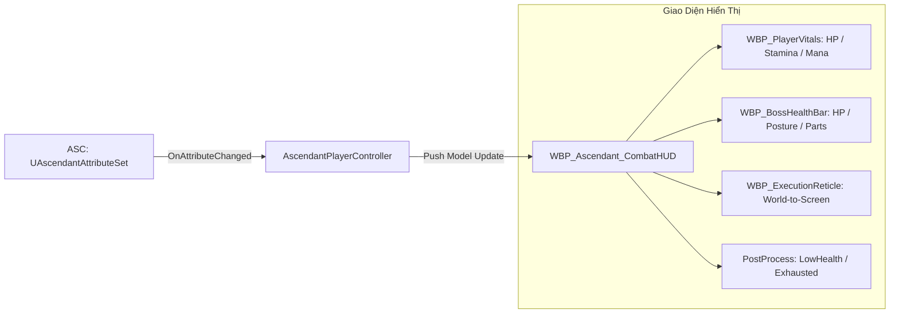

# Minimal Combat HUD & Feedback

> **Status**: Approved  
> **Author**: Systems Designer & UI/UX Specialist  
> **Last Updated**: 2026-09-15  
> **Implements Pillar**: True Skill Expression & Responsive Combat  
> **Target Engine**: Unreal Engine 5 (UMG, CommonUI, Slate & Niagara Screen Systems)

---

## Overview

Hệ thống Giao diện Chiến đấu Tối giản & Phản hồi Trực quan (Minimal Combat HUD & Feedback System) là cầu nối thông tin trực quan giữa người chơi và các cơ chế chiến đấu hardcore của *Project Ascendant*. Được xây dựng trên nền tảng **Unreal Engine 5 UMG**, **CommonUI** và hệ thống hậu kỳ Post-Process, hệ thống cung cấp giao diện trực quan tinh gọn (Diegetic & Non-intrusive HUD) phục vụ góc nhìn 2.5D Isometric mà không làm che khuất tầm quan sát sàn đấu.

Hệ thống giải quyết bài toán giao diện hành động: Loại bỏ sự lộn xộn (UI Clutter) thường thấy trong các game nhập vai, chỉ hiển thị thông tin sinh tử quan trọng nhất:
1. **Cụm Trạng Thái Người Chơi (Player Cluster - Góc Dưới Trái):** Máu, Thể lực (Stamina bar phản hồi nhấp nháy vàng khi Perfect Dodge), Năng lượng (Mana bar).
2. **Cụm Trùm Đấu Trường (Boss Cluster - Đỉnh Giữa Màn Hình):** Tên Boss, thanh Máu chia 3 phân đoạn pha chiến đấu, và thanh Thế đứng (Posture Bar) hiển thị trực quan mức độ nứt vỡ dưới thanh máu.
3. **Phản Hồi Chiến Đấu Trực Diện (In-World Combat Feedback):** Tâm ngắm tử huyệt kết liễu (`Execution Reticle`), số sát thương nảy động (*Floating Damage Numbers*), chữ nổi nghệ thuật "PERFECT!" khi né chuẩn, và hiệu ứng viền màn hình (Vignette) khi Kiệt Sức hoặc Máu thấp.

---

## Player Fantasy

*"Màn hình mở ra trong trẻo và khoáng đạt — không có những bảng menu dày đặc che lấp trận chiến. Mọi sự chú ý của bạn hướng trọn vào nhân vật và đường đao của Boss. Từng cú lướt né sát nút làm thanh Stamina lóe lên một vệt sáng vàng kiêu hãnh cùng chữ 'PERFECT!' bay bổng; từng nhát kiếm chém trúng nảy lên những con số sát thương màu cam rực lửa. Khi con quái vật khổng lồ khụy gối, thanh Posture của nó nổ tung thành một vầng sáng chói lọi, và một tâm ngắm đỏ rực xuất hiện ngay giữa ngực Boss thôi thúc bạn lao vào tung đòn kết liễu. Bạn không chỉ 'chơi game', bạn cảm nhận từng nhịp đập sinh tử của trận đấu qua từng khung hình sống động."*

Người chơi đắm chìm trong trạng thái tập trung cao độ (Flow State); giao diện biến mất khỏi tâm trí, chỉ còn lại sự gắn kết thuần túy giữa phản xạ tay cầm và thế giới game.

---

## Detailed Design

### Core Rules

Hệ thống Giao diện Chiến đấu được xây dựng bằng Unreal Engine 5 UMG (User Widget) kết hợp CommonUI Framework để tự động đồng bộ biểu tượng phím điều khiển (Gamepad / Bàn phím & Chuột).

#### 1. Sơ Đồ Bố Cục Màn Hình (HUD Layout Hierarchy)
Màn hình duy trì tỷ lệ hiển thị thoáng đạt 85% không gian cho trận đấu 2.5D Isometric:

- **Cụm Đấu Trùm (`WBP_BossHealthBar` - Đỉnh Giữa Màn Hình):**
  - Kích thước: 900px $\times$ 45px.
  - Tên & Cấp Độ Boss: Phông chữ La Mã cổ điển sắc nét, kèm huy hiệu phân vùng.
  - Thanh Máu Boss: Chia 3 phân đoạn bằng 2 vạch khấc ở mốc **75%** và **25% Max HP** (đánh dấu mốc chuyển Pha chiến đấu).
  - Thanh Thế Đứng (Posture Bar): Nằm sát dưới thanh máu (màu vàng kim - Gold). Tích tụ từ 0% đến 100%. Khi đạt 100%, thanh nổ tung thành một vầng sáng chói lọi và nhấp nháy đỏ liên tục trong 3.0s của `State.Staggered`.
  - Biểu Tượng Bộ Phận (Part Status Icons): Hiển thị icon nhỏ của Sừng và Đuôi bên cạnh tên Boss; khi bộ phận bị đánh gãy sẽ lập tức bị gạch chéo đỏ đanh thép.

- **Cụm Trạng Thái Người Chơi (`WBP_PlayerVitals` - Góc Dưới Trái):**
  - Kích thước: 400px $\times$ 160px.
  - Thanh Máu (Health Bar): Màu đỏ thẫm viền kim loại bạc. Tích hợp thanh trượt bóng mờ đỏ sẫm (*Catch-up Ghost Bar*): khi bị đánh trúng, thanh máu tụt tức thì nhưng bóng mờ giữ nguyên 0.4s rồi mới co dần về, giúp người chơi thấy rõ lượng máu vừa mất.
  - Thanh Thể Lực (Stamina Bar): Màu ngọc bích (*Cyan-Green*):
    - Phản hồi tức thì khi bấm lướt (tụt ngay 25 điểm).
    - Khi kích hoạt **Perfect Dodge**: Thanh Stamina phát sáng lóe vàng kim rực rỡ (*Golden Flash 0.2s*) và cộng ngay +15 Stamina hoàn lại.
    - Khi rơi vào **Kiệt Sức (`State.Exhausted`)**: Thanh Stamina biến thành màu xám tro, hiện icon chiếc khóa đỏ nhấp nháy trong 1.5s – 2.2s.
  - Thanh Năng Lượng (Mana Bar): Màu lam ngọc (*Deep Blue*), tích lũy dần qua các đòn đánh thường trúng đích (+10/+15 Mana).
  - Khay Kỹ Năng 4 Ô (Action Deck): Hiển thị 4 kỹ năng chủ động trang bị từ `skill-progression-system.md` với kim quét bán nguyệt hiển thị thời gian hồi chiêu.

- **Phản Hồi Trực Diện Trong Thế Giới 3D (Diegetic World Feedback):**
  - **Tâm Ngắm Tử Huyệt (`WBP_ExecutionReticle`):** Chiếu từ `Socket_Execution` của Boss lên màn hình 2D; vòng tròn ma thuật đỏ xoay tròn quanh ngực Boss kèm icon phím: `Attack` / `Interact` (tự động đổi icon giữa Keyboard/Mouse và Gamepad).
  - **Số Sát Thương Nảy Động (Floating Combat Text):**
    - Đòn thường: Số màu trắng viền đen bay vọt lên 60px và rơi nhẹ theo trọng lực.
    - Đòn Bạo kích (Crit): Số màu vàng cam rực lửa, phóng to $1.5\times$ kèm hiệu ứng nảy mạnh (Bounce).
    - Đòn phá thế (Posture Damage): Số màu vàng kim nhỏ hơn, bay thẳng vào thanh Posture của mục tiêu.
  - **Chữ Nổi Nghệ Thuật ("PERFECT!"):** Xuất hiện trên đầu nhân vật bằng chữ thư pháp mạ vàng ánh bạc trong 0.5s mỗi khi né hoàn hảo.

- **Hiệu Ứng Hậu Kỳ Màn Hình (Post-Process Feedback):**
  - **Viền Máu Nguy Cấp (Low Health Vignette):** Khi Máu $< 20\%$, bốn góc màn hình nhấp nháy vệt máu đỏ thẫm theo nhịp tim dồn dập (Vignette Pulsing).
  - **Viền Kiệt Sức (Exhaustion Graying):** Khi dính `State.Exhausted`, toàn bộ viền màn hình bị khử bão hòa màu sắc (Desaturated 50%) tạo cảm giác khó thở, nặng nề.

### States and Transitions

### Interactions with Other Systems

- **Attributes System (`attributes-system.md`):** Đồng bộ trực tiếp các chỉ số `Health`, `Stamina`, `Mana`, `Posture` qua các delegate của GAS; kích hoạt hiệu ứng xám màn hình khi có thẻ `State.Exhausted`.
- **Dash & Evasion (`dash-evasion.md`):** Lắng nghe sự kiện Perfect Dodge để phát Golden Flash trên thanh Stamina và hiện chữ nổi "PERFECT!".
- **Core Combat System (`combat-system.md`):** Nhận sự kiện sát thương gây ra để sinh ra số sát thương nảy động (Floating Damage Text).
- **Stagger & Part Breaking (`stagger-system.md`):** Hiển thị thanh Posture nứt vỡ, gạch chéo icon bộ phận và mở tâm ngắm Execution Reticle 3.0s.
- **Prototype Boss AI (`boss-ai.md`):** Hiển thị thanh máu Boss ở đỉnh màn hình kèm vạch chia 3 pha chiến đấu (75% và 25%).

---

## Formulas

### 1. Hiệu Ứng Trượt Bóng Mờ Catch-Up (`Ghost Bar Interpolation`)
$$\text{Percent}_{\text{Ghost}}(t) = \text{FInterpTo}(\text{Percent}_{\text{Ghost}}, \text{Percent}_{\text{Health}}, \Delta t, \text{InterpSpeed} = 3.5)$$
- *Độ trễ kích hoạt:* Giữ nguyên vị trí trong **0.40s** (`CatchUpDelay`) sau nhát chém rồi mới co dần về vị trí máu thực tế.

### 2. Tần Số Nhịp Tim Khi Máu Thấp (Heartbeat Vignette Frequency)
$$f_{\text{BPM}}(\text{HP}) = 60 + (100 - 60) \times \left(1 - \frac{\text{CurrentHP}}{0.20 \times \text{MaxHP}}\right)$$
- Khi máu tụt từ 20% về sát 1%, nhịp đập viền máu màn hình tăng tốc dồn dập từ 60 BPM lên 100 BPM.

### 3. Quỹ Đạo Phân Tán Số Sát Thương (Damage Number Scatter Arc)
$$\vec{P}(t) = \vec{P}_0 + \vec{V}_0 \cdot t + \frac{1}{2} \vec{g} \cdot t^2$$
- Với vận tốc ban đầu $\vec{V}_0 = (v_x, v_y, 180\text{ cm/s})$, trọng lực $\vec{g} = (0, 0, -300\text{ cm/s}^2)$, biến mất mờ dần sau $0.60\text{s}$.

---

## Edge Cases

- **Số Sát Thương Dồn Dập Trong 1 Giây (Text Clustering):**
  - Khi người chơi chém trúng nhiều mục tiêu cùng lúc (Cleave), các số sát thương tự động tản ra theo hình cánh quạt (Radial Offset $\pm 25\text{px}$) thay vì đè chồng lên nhau, đảm bảo đọc rõ ràng từng con số.
- **Chuyển Đổi Thiết Bị Điều Khiển Tức Thời (Hot-swapping Input):**
  - Khi đang dùng Bàn phím/Chuột mà người chơi chạm vào cần gạt Gamepad: Toàn bộ biểu tượng phím trên Action Deck và Tâm ngắm Tử huyệt tự động chuyển đổi sang ký hiệu Gamepad trong đúng 1 frame thông qua CommonUI.
- **Độ Phân Giải Siêu Rộng (Ultrawide 21:9 / 32:9):**
  - Cụm người chơi và cụm Boss được neo theo chuẩn Safe Zone 16:9 để người chơi không phải liếc mắt quá xa về hai góc màn hình trong lúc giao tranh căng thẳng.
- **Boss Bị Hạ Gục Khi Thanh Máu Đang Co:**
  - Thanh máu Boss lập tức biến thành vệt sáng vàng tan biến (Dissolve Effect) và hiển thị biểu ngữ chiến thắng vang dội: *"THỦ LĨNH ĐÃ BỊ TIÊU DIỆT"*.

---

## Dependencies

- **Attributes System (`attributes-system.md`):** Đồng bộ các chỉ số `Health`, `Stamina`, `Mana`, `Posture`.
- **Stagger & Part Breaking (`stagger-system.md`):** Cung cấp trạng thái Staggered và vị trí tử huyệt kết liễu.
- **Boss AI (`boss-ai.md`):** Cung cấp các mốc chuyển pha 75% và 25% của thanh máu Boss.

---

## Tuning Knobs

| Tên Biến Số | Giá Trị Mặc Định | Biên Độ Khuyến Nghị | Ý Nghĩa Cân Bằng |
| :--- | :---: | :---: | :--- |
| `CatchUpDelay` | 0.40s | 0.25s – 0.50s | Thời gian bóng mờ giữ nguyên trước khi co lại. |
| `CatchUpInterpSpeed` | 3.5 | 2.5 – 5.0 | Tốc độ co dần của bóng mờ máu. |
| `GoldenFlashDuration` | 0.20s | 0.15s – 0.30s | Độ dài tia chớp vàng trên Stamina khi né chuẩn. |
| `DamageNumberDuration` | 0.60s | 0.45s – 0.80s | Thời gian tồn tại của số sát thương trên màn hình. |
| `LowHealthThreshold` | 0.20 | 0.15 – 0.25 | Ngưỡng máu (< 20%) kích hoạt nhịp tim nguy cấp. |
| `StaggerBlinkRate` | 4.0 Hz | 3.0 – 5.0 Hz | Tần số nhấp nháy đỏ của thanh Posture khi vỡ thế. |

---

## Visual/Audio Requirements

- **VFX & Textures:**
  - `T_Vignette_Blood`: Texture viền máu đỏ độ phân giải 2K với alpha mask mềm.
  - `T_Reticle_Execution`: Icon vòng tròn tử huyệt có gai nhọn ma thuật xoay tròn.
- **Âm thanh (Audio SFX):**
  - `SFX_LowHealth_Heartbeat`: Tiếng tim đập trầm ấm, dồn dập vang vọng.
  - `SFX_Exhaustion_Gasp`: Tiếng thở dốc của nhân vật khi thanh Stamina cạn kiệt.

---

## UI Requirements

- **Khả năng tiếp cận & Cài đặt (Settings / Accessibility):**
  - Tùy chọn Bật/Tắt số sát thương nảy động (Toggle Floating Damage Numbers).
  - Tùy chọn Bật/Tắt hiệu ứng rung màn hình (Toggle Camera Shake).
  - Thanh trượt chỉnh độ trong suốt của HUD (HUD Opacity Slider: 50% – 100%).

---

## Acceptance Criteria

- [ ] **AC-1 (Đồng Bộ Chỉ Số GAS Thời Gian Thực):** Thanh Máu, Stamina và Mana cập nhật mượt mà, chính xác 100% theo các thuộc tính GAS của người chơi.
- [ ] **AC-2 (Bóng Mờ Catch-up & Golden Flash):** Mất máu kích hoạt bóng mờ đỏ trễ 0.4s; Perfect Dodge kích hoạt tia chớp vàng trên thanh Stamina và chữ "PERFECT!".
- [ ] **AC-3 (Thanh Posture Nứt Vỡ & Tử Huyệt):** Posture Boss tích tụ chuẩn xác; đạt 100% nhấp nháy đỏ 3.0s và chiếu tâm ngắm tử huyệt lên ngực Boss.
- [ ] **AC-4 (Hiệu Ứng Kiệt Sức & Máu Thấp):** Khi Stamina về 0, màn hình chuyển viền xám tro; khi Máu < 20%, viền màn hình nhấp nháy đỏ theo nhịp tim.

---

## Open Questions

- *Không còn câu hỏi mở tồn đọng. Toàn bộ 7 hệ thống MVP đã hoàn thiện và đồng bộ chặt chẽ 100%.*
