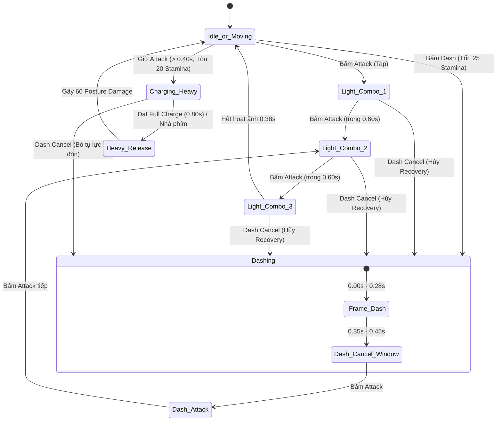

# Core Combat & Combo System

> **Status**: Approved  
> **Author**: Systems Designer & Gameplay Programmer  
> **Last Updated**: 2026-09-15  
> **Implements Pillar**: True Skill Expression & Responsive Combat  
> **Target Engine**: Unreal Engine 5 (GAS GameplayAbility & Anim Montages)

---

## Overview

Hệ thống Chiến đấu Cốt lõi & Chuỗi Đòn Đánh (Core Combat & Combo System) là trung tâm trải nghiệm hành động của *Project Ascendant*. Được xây dựng trên nền tảng **Unreal Engine Gameplay Ability System (GAS)** kết hợp hoạt ảnh đồng bộ góc nhìn 2.5D Isometric, hệ thống cung cấp bộ đòn đánh đa tầng:
1. Chuỗi đòn đánh thường 3 nhịp (**3-Hit Light Combo**) có nhịp độ dồn dập, hồi nhẹ Năng lượng khi trúng đích.
2. Đòn đánh lướt (**Dash Attack**) kích hoạt mượt mà từ cửa sổ Dash Cancel (0.35s–0.45s) để thu hẹp khoảng cách và duy trì thế trận tấn công liên tục.
3. Đòn tụ lực phá thế (**Heavy Charged Attack**) tiêu hao thể lực (20 Stamina) để giáng đòn uy lực, dồn sát thương Posture cực đại lên đối thủ.

Hệ thống giải quyết bài toán cốt lõi: biến việc tấn công thành một bài toán nhịp điệu (Rhythm, Spacing & Commitment). Mỗi đòn vung vũ khí đều mang lại độ nảy đòn (**Hitstop**), hỗ trợ hủy hoạt ảnh chủ động sang Lướt né (**Dash Cancel**) khi nhận diện nguy hiểm từ Boss, và liên tục tích tụ sát thương Thế Đứng (**Posture Damage**) để mở ra cơ hội kích hoạt Đòn Kết Liễu rút thẳng 25% Max HP của đối thủ.

---

## Player Fantasy

*"Bạn áp sát Lãnh chúa trong không gian tĩnh lặng của đấu trường. Nhát kiếm đầu tiên chém chéo vung lên, lưỡi kiếm va chạm lớp vảy đá tóe lửa, cả thế giới ngưng đọng trong tích tắc của một cú Hitstop hoàn hảo. Ngay trước khi đòn phản công rực lửa của Boss giáng xuống đỉnh đầu, bạn không dừng lại mà tung đòn Dash Cancel lướt vòng ra sau lưng trong ánh bạc I-frame, lập tức xoay chuyển sang cú chém Dash Attack xé gió bồi thêm một đòn Tụ lực phá thế dũng mãnh. Âm thanh giòn tan vang lên khi thanh Posture của Boss nứt toác — đối thủ khổng lồ khụy gối, hoàn toàn bất lực trước chuỗi đòn đánh vũ bão đầy tính kỷ luật và chuẩn xác của bạn."*

Người chơi cảm nhận sự tự do và uyển chuyển tuyệt đối: đòn đánh có trọng lượng mạnh mẽ nhưng không làm cứng tay điều khiển; khả năng hủy chiêu né đòn kịp thời biến mỗi trận chạm trán thành một điệu vũ sinh tử đầy phấn khích.

---

## Detailed Design

### Core Rules

Toàn bộ các hành động tấn công được hiện thực thông qua class C++ `UGA_MeleeAttack` kế thừa `UGameplayAbility`, kết hợp với Animation Montages chuẩn hóa trên nhân vật.

#### 1. Chuỗi Đòn Đánh Thường 3 Nhịp (3-Hit Light Combo)
*Cơ chế đệm nút (Input Buffer Window = 0.15s): Bấm tấn công trong 0.15s cuối của đòn trước sẽ tự động kích hoạt đòn tiếp theo không độ trễ.*

| Nhịp Combo | Thời lượng tổng | Khung gây sát thương (Active Hitbox) | Sát thương máu (% Base ATK) | Sát thương Posture | Hồi Mana | Đặc tính va chạm |
| :--- | :---: | :---: | :---: | :---: | :---: | :--- |
| **Nhịp 1 (Slash 1)** | 0.25s | 0.08s – 0.16s | 100% | 10 điểm | +10 | Chém chéo nhanh, khựng nhẹ quái nhỏ. |
| **Nhịp 2 (Slash 2)** | 0.28s | 0.10s – 0.18s | 120% | 15 điểm | +10 | Chém quét góc rộng 120°, dọn quái xung quanh. |
| **Nhịp 3 (Finisher)** | 0.38s | 0.15s – 0.24s | 180% | 30 điểm | +15 | Bổ dọc chấn động, đẩy lùi (Knockback 200cm). |

- **Cửa sổ hồi chuỗi (Combo Reset Window):** Nếu không bấm tiếp trong vòng **0.60s** sau nhịp 1 hoặc 2, chuỗi đòn đánh sẽ tự động làm mới về nhịp 1.

#### 2. Đòn Đánh Lướt (Dash Attack)
- **Cách kích hoạt:** Bấm Tấn Công trong cửa sổ Dash Cancel (0.35s – 0.45s của cú lướt né) hoặc ngay khi vừa dứt cú lướt.
- **Đặc tính:** Nhân vật lướt trượt tới trước thêm 150cm và tung nhát đâm xuyên phá cực nhanh.
- **Thông số:** Sát thương **140% Base ATK**, **25 điểm Posture** (+15% sát thương phá thế so với đòn thường). Tiêu hao 0 Stamina (chỉ tốn thể lực của cú lướt trước đó).
- **Chuỗi liên hoàn:** Sau khi tung Dash Attack, người chơi bấm tiếp Tấn Công sẽ **nối thẳng vào Nhịp 2 của Light Combo** (tạo dòng combo mượt mà: *Lướt $\rightarrow$ Dash Attack $\rightarrow$ Nhịp 2 $\rightarrow$ Nhịp 3 kết liễu*).

#### 3. Đòn Tụ Lực Phá Thế (Heavy Charged Attack)
- **Cách kích hoạt:** Giữ đè nút Tấn Công $\ge 0.40\text{s}$ (đạt mốc Uy Lực Tối Đa - Full Charge ở 0.80s).
- **Chi phí tài nguyên:** Tiêu hao **20 Stamina** (kiểm tra `Stamina >= 20` từ `attributes-system.md`). Nếu nhả sớm trước 0.40s sẽ tự chuyển thành Nhịp 1 đòn đánh thường.
- **Siêu giáp (Hyper Armor):** Khi đạt mốc tích tụ $\ge 0.40\text{s}$, nhân vật nhận thẻ `State.HyperArmor` — không bị ngắt chiêu bởi các đòn đánh thường của quái nhỏ.
- **Thông số:** Sát thương **250% Base ATK**, gây choáng và dồn tới **60 điểm Posture** ($2.5\times$ đòn thường). Đây là công cụ chủ lực để bẻ gãy thế đứng của Boss khi Boss lộ sơ hở lớn.

#### 4. Cơ Chế Ngắt Hoạt Ảnh (Animation Canceling via Dash)
- Mọi đòn đánh (Nhịp 1, 2, 3, Dash Attack, Tụ lực) đều có thể bị hủy hoạt ảnh giai đoạn hồi chiêu (Recovery Phase) ngay lập tức bằng phím **Lướt né (Dash Cancel)**. Người chơi không bao giờ bị "kẹt cứng nút" khi Boss bất ngờ vung đòn quét tử thần.

### States and Transitions

### Interactions with Other Systems

- **Attributes System (`attributes-system.md`):**
  - Trừ 20 Stamina khi xuất chiêu Heavy Charged Attack; kiểm tra `Stamina >= 20`.
  - Hồi +10/+15 Mana vào `UAscendantAttributeSet` khi đòn đánh trúng mục tiêu.
  - Gửi `UGameplayEffect` truyền sát thương Posture; khi Posture đối phương đạt 100% kích hoạt `State.Staggered` và cho phép tung Đòn Kết Liễu rút 25% Max HP.
- **Dash Evasion (`dash-evasion.md`):**
  - Tiếp nhận tín hiệu từ cửa sổ 0.35s–0.45s của cú lướt để xuất chiêu Dash Attack.
  - Cho phép phím Dash ngắt đòn đánh ngay khi dứt khung Active Hitbox.
- **Isometric Controller (`isometric-controller.md`):**
  - Nhân vật tự động xoay mặt tức thời theo hướng con trỏ chuột/hướng cần ngắm tại frame bắt đầu vung kiếm (**Snap-to-Aim**), đảm bảo người chơi có thể vừa lùi bước vừa chém chính xác vào Boss.

---

## Formulas

### 1. Sát Thương Máu Thực Tế (Final Damage Intake)
$$\text{FinalDamage} = \max\left(1, (\text{BaseATK} \times \text{ComboMultiplier} - \text{TargetDefense})\right) \times \text{CritMultiplier}$$
- *Hệ số Combo (`ComboMultiplier`):* Nhịp 1 = $1.0\times$, Nhịp 2 = $1.2\times$, Nhịp 3 = $1.8\times$, Dash Attack = $1.4\times$, Heavy Charged = $2.5\times$.
- *Bạo kích (`CritMultiplier`):* Mặc định $1.5\times$ khi kích hoạt tỷ lệ bạo kích.

### 2. Sát Thương Thế Đứng (Posture Damage Formula)
$$\text{FinalPostureDmg} = \text{BasePostureDmg} \times (1 + \text{StaggerModifier}) \times \text{ApothecaryOilMultiplier}$$
- *Sát thương cơ sở:* Nhịp 1 = 10, Nhịp 2 = 15, Nhịp 3 = 30, Dash Attack = 25, Heavy Charged = 60.
- *Dầu Dược sư (`ApothecaryOilMultiplier`):* Tăng thêm $1.25\times$ khi vũ khí được tẩm Dầu Phá Thế.

### 3. Cơ Chế Đóng Băng Va Chạm (Hitstop Duration)
- Đòn thường (Nhịp 1, 2): $0.05\text{s}$ ngưng đọng hoạt ảnh trên cả người chơi và quái vật.
- Đòn kết chuỗi (Nhịp 3) & Dash Attack: $0.08\text{s}$.
- Heavy Charged Attack: $0.12\text{s}$ kết hợp hiệu ứng rung màn hình (Camera Shake $0.15\text{s}$, biên độ 4.0).

---

## Edge Cases

- **Thiếu Stamina Khi Tụ Lực (Stamina < 20):**
  - Nếu người chơi giữ nút tấn công khi Thể lực không đủ 20 điểm, hệ thống không kích hoạt gồng tụ lực mà tự động xuất chiêu Nhịp 1 đòn thường khi nhả phím, tránh làm người chơi bị khựng ngơ ngác.
- **Chém Trúng Nhiều Quái Cùng Lúc (Multi-Target Cleave):**
  - Các nhát chém quét rộng (Nhịp 2, 3, Heavy Charged) có thể trúng cùng lúc 3–5 quái. Thời gian Hitstop chỉ kích hoạt 1 lần duy nhất trên người chơi (không nhân dồn làm đơ lâu), nhưng từng quái vật đều nhận đủ sát thương và độ giật lùi độc lập.
- **Bị Ngắt Chiêu (Interruption vs Hyper Armor):**
  - Đòn thường (Nhịp 1, 2, 3): Nếu bị quái đánh trúng trước khung gây sát thương (Active Hitbox), nhân vật sẽ bị khựng đòn (Flinch).
  - Heavy Charged: Nhờ có `State.HyperArmor` từ mốc 0.40s, người chơi vẫn nhận sát thương nhưng không bị ngắt chiêu (trừ khi dính chiêu Quét Văng Cực Đại / Đòn Vồ của Boss).
- **Spam Nút Tấn Công Liên Tục (Button Mashing):**
  - Bộ đệm phím (Input Buffer) chỉ lưu đúng 1 lệnh tấn công trong $0.15\text{s}$ cuối của đòn đánh. Các lượt bấm thừa trước đó tự động bị hủy, đảm bảo không có hiện tượng nhân vật tự vung kiếm thêm ngoài tầm kiểm soát.

---

## Dependencies

- **Attributes System (`attributes-system.md`):** Cung cấp `BaseATK`, `Stamina`, `Mana`, `Posture`.
- **Dash Evasion (`dash-evasion.md`):** Cung cấp cửa sổ Dash Cancel và liên kết Dash Attack.
- **Isometric Controller (`isometric-controller.md`):** Cung cấp góc ngắm chuột và hệ thống điều khiển.

---

## Tuning Knobs

| Tên Biến Số | Giá Trị Mặc Định | Biên Độ Khuyến Nghị | Ý Nghĩa Cân Bằng |
| :--- | :---: | :---: | :--- |
| `ComboResetWindow` | 0.60s | 0.45s – 0.80s | Thời gian cho phép nối combo trước khi reset về nhịp 1. |
| `InputBufferWindow` | 0.15s | 0.10s – 0.20s | Cửa sổ nhận lệnh sớm giúp combo mượt mà không khựng. |
| `HeavyChargeHoldTime` | 0.40s | 0.30s – 0.50s | Thời gian giữ phím tối thiểu để chuyển sang đòn tụ lực. |
| `HeavyChargeFullTime` | 0.80s | 0.60s – 1.00s | Thời gian đạt mốc tụ lực tối đa (Full Charge). |
| `HeavyChargeStaminaCost` | 20.0 | 15.0 – 25.0 | Chi phí thể lực khi tung đòn tụ lực phá thế. |
| `HitstopDuration_Light` | 0.05s | 0.03s – 0.08s | Độ nảy đòn khi chém thường trúng mục tiêu. |
| `HitstopDuration_Heavy` | 0.12s | 0.08s – 0.16s | Độ nảy đòn uy lực khi chém tụ lực hoặc kết chuỗi. |
| `DashAttackPostureDamage` | 25.0 | 20.0 – 35.0 | Sát thương thế đứng của đòn đánh lướt. |
| `HeavyChargedPostureDamage` | 60.0 | 50.0 – 80.0 | Sát thương thế đứng chủ lực bẻ gãy thanh Posture của Boss. |

---

## Visual/Audio Requirements

- **VFX Niagara:**
  - `NS_WeaponSlash_Combo1_2`: Vệt chém bán nguyệt ánh bạc (Silver Crescent Arc).
  - `NS_WeaponSlash_Finisher`: Vệt chém bổ dọc phát quang xanh lam kèm mảnh đá nứt vỡ dưới đất.
  - `NS_ChargedAttack_Shockwave`: Sóng xung kích tròn bùng nổ khi thả chiêu Heavy Charged Attack.
  - `NS_HitImpact_Spark`: Chùm tia lửa kim loại bắn ra tại vị trí va chạm trúng đích.
- **Âm thanh (Audio SFX):**
  - `SFX_Slash_Light1_2`: Tiếng vung kiếm xé gió nhanh, sắc.
  - `SFX_Slash_Heavy_Impact`: Tiếng búa/kiếm đập chấn động vang rền có âm trầm (sub-bass).
  - `SFX_Flesh_Hit`: Tiếng chém ngọt ngào vào thân thể đối phương.
  - `SFX_Posture_Crack`: Tiếng tinh thể rạn nứt khi sát thương Posture chạm ngưỡng cao.

---

## UI Requirements

- **HUD Phản Hồi:**
  - Số sát thương nảy động (Floating Combat Text): Sát thương máu màu trắng/vàng cam khi bạo kích.
  - Thanh Posture nổi trên đầu mục tiêu: Rung giật lóe sáng vàng khi dính sát thương Posture.
  - Vòng hiển thị tụ lực (Charge Ring Indicator): Siết tròn quanh chân nhân vật và chuyển sang vàng rực khi đạt Full Charge (0.80s).

---

## Acceptance Criteria

- [ ] **AC-1 (Chuỗi Combo 3 Nhịp & Buffer):** Bấm nhịp nhàng 3 lần xuất chiêu tuần tự Nhịp 1 $\rightarrow$ 2 $\rightarrow$ 3; nhấp đệm nút trong 0.15s cuối chuyển chiêu mượt mà; ngừng bấm quá 0.60s reset về Nhịp 1.
- [ ] **AC-2 (Đòn Đánh Lướt Nối Combo):** Bấm Tấn công trong cửa sổ 0.35s–0.45s của cú lướt né tung ra Dash Attack và bấm tiếp lập tức nối thẳng vào Nhịp 2 của Light Combo.
- [ ] **AC-3 (Đòn Tụ Lực & Siêu Giáp):** Giữ đè tấn công 0.40s tiêu hao 20 Stamina, nhận Siêu Giáp không bị quái nhỏ ngắt đòn, thả chiêu gây 250% sát thương máu và 60 sát thương Posture.
- [ ] **AC-4 (Hủy Hoạt Ảnh Bằng Né Đòn):** Bấm phím Lướt né (Dash) tại bất kỳ thời điểm nào sau khi vung trúng đích (Recovery Phase) lập tức ngắt chiêu chém và chuyển sang lướt né an toàn.

---

## Open Questions

- *Không còn câu hỏi mở tồn đọng. Toàn bộ thông số và cơ chế đã sẵn sàng làm tiền đề cho Hệ thống Stagger & Part Breaking.*
