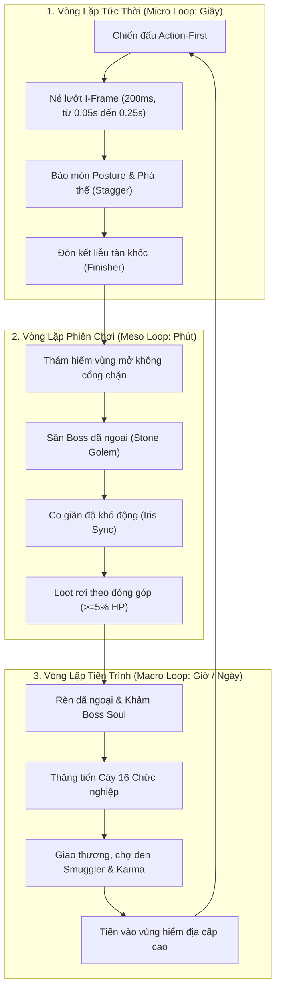

# Core Game Loop: Project Ascendant

> **Trạng thái**: Draft - Sẵn sàng nghiệm thu  
> **Phiên bản**: 1.0  
> **Tác giả**: Team Game Design & Systems Architecture  
> **Tài liệu liên quan**:  
> - `design/gdd/game-concept.md`  
> - `design/gdd/combat-system.md`  
> - `design/gdd/stagger-system.md`  
> - `design/gdd/blacksmithing-system.md`  
> - `design/gdd/itemization.md`  
> - `design/gdd/zone-system.md`  

---

## 1. Tổng Quan Về Vòng Lặp Trò Chơi (Executive Summary)

**Project Ascendant** là tựa game 2.5D Isometric Dark Fantasy Action-RPG kết hợp cơ chế MMO thế giới mở. Khác với các game ARPG truyền thống phụ thuộc thuần túy vào chỉ số và trang bị "dát vàng", Project Ascendant định vị **kỹ năng thao tác của người chơi là nhân tố quyết định sống còn**.

Vòng lặp cốt lõi (**Core Game Loop**) được vận hành qua cấu trúc 3 tầng:

---

## 2. Chi Tiết Từng Tầng Vòng Lặp

### 2.1. Micro Loop: Nhịp độ chiến đấu từng giây (Combat-Moment)

Mỗi cuộc chạm trán diễn ra với nhịp độ dồn dập, đòi hỏi phản xạ đọc tình huống chính xác:

1. **Quan sát & Phản xạ (Telegraph Recognition):**
   - Boss và quái vật luôn có cửa sổ cảnh báo rõ ràng (VFX mặt đất nứt đỏ, âm thanh gầm rú, frame giương vũ khí dừng có chủ đích).
2. **Né đòn bất tử (I-Frame Evasion):**
   - Kỹ năng Dash tiêu tốn thể lực (25 Stamina) cung cấp chính xác **200ms Invulnerability Frame**, từ t = 0.05s đến t = 0.25s của cú lướt 0.35s (theo code `UPAGameplayAbility_Dash`, quyết định 2026-10-09).
   - Căn lướt đúng khoảnh khắc đòn giáng giúp nhân vật không nhận sát thương và giữ vững thế đứng.
3. **Bào mòn thanh Posture (Posture Breakdown):**
   - Đòn đánh thường và kỹ năng nặng gây sát thương lên cả thanh Máu (HP) lẫn thanh Thế đứng (Posture).
   - Khi thanh Posture của mục tiêu cạn kiệt, kẻ địch rơi vào trạng thái Choáng vỡ thế (**State.Broken** & **State.Stunned**).
4. **Đòn kết liễu (Action-First Finisher):**
   - Trong thời gian kẻ địch bị vỡ thế, người chơi kích hoạt kỹ năng Kết liễu (Finisher) gây sát thương cực đại, bẻ gãy bộ phận (Part Breaking) để tăng tỷ lệ rơi nguyên liệu hiếm.

---

### 2.2. Meso Loop: Phiên thám hiểm vùng đất (Session-Level)

Mỗi phiên chơi kéo dài từ 15 đến 45 phút, đưa người chơi qua chuỗi hoạt động khám phá và thu hoạch:

1. **Bản đồ mở không giới hạn cấp độ (Non-gated Open Zones):**
   - Người chơi tự do di chuyển từ Tiền đồn Xanh (*Verdant Frontier*) sang Rặng Núi Tro Tàn (*Ashen Crags*) mà không bị rào cản cấp độ khóa lại.
   - Thử thách tăng theo cự ly xa tiền đồn; người chơi trình độ cao có thể "vượt cấp" săn quái sớm.
2. **Chạm trán Boss dã ngoại (Contested Field Bosses):**
   - Boss xuất hiện công khai trên thế giới (ví dụ: *Stone Golem*).
   - Cơ chế **Dynamic Difficulty Scaling**: Máu và Posture của Boss tự động co giãn theo số lượng người tham gia:
     $$\text{MaxHP}_{\text{scaled}} = \text{BaseHP} \times [1.0 + 0.50 \times (N - 1)]$$
     $$\text{MaxPosture}_{\text{scaled}} = \text{BasePosture} \times [1.0 + 0.35 \times (N - 1)]$$
   - Khi có từ 4 người chơi trở lên, Boss nhận kháng hiệu ứng khống chế (Crowd Control Reduction) để ngăn chặn tình trạng "hội đồng" làm tê liệt AI.
3. **Phân phối chiến lợi phẩm công bằng (Contested Instanced Loot):**
   - Không có cơ chế "last hit cướp đồ".
   - Bất kỳ người chơi nào đóng góp tối thiểu **5% sát thương HP** hoặc **10% sát thương Posture** đều nhận được hòm đồ rơi cá nhân hóa (Instanced Loot Droplet), chỉ người đó nhìn thấy và nhặt được.

---

### 2.3. Macro Loop: Tiến trình trường kỳ (Long-Term Progression)

Vòng tuần hoàn giữ chân người chơi qua nhiều tuần và tháng:

1. **Hệ thống Rèn dã ngoại phân vùng (Zone-Tiered Blacksmithing):**
   - Nguyên liệu rơi từ quái và boss được mang về Lò rèn dã ngoại.
   - Cường hóa trang bị từ $+1$ đến $+10$.
   - **Khảm linh hồn Boss (Boss Soul Socketing):** Biến đổi đặc tính vũ khí (ví dụ: khảm *Core of the Stone Golem* giúp đòn đánh thường có xác suất gây chấn động diện rộng).
2. **Cây Chức nghiệp 16 Class (16-Class Progression Tree):**
   - Khởi đầu với 4 Class Sơ cấp (Bậc T1): **Vanguard** (Tiên phong), **Ranger** (Du hiệp), **Arcanist** (Thuật sĩ), **Acolyte** (Tu sĩ).
   - Mở khóa các Class Trung cấp (Bậc T2), Cao cấp (Bậc T3) và Apex Class (Bậc T4 - God Slayer) thông qua việc tìm kiếm cổ tịch, hoàn thành kỳ ngộ và thử thách bí ẩn trong thế giới (chi tiết xem tại `advanced-classes.md`).
3. **Hệ thống Kinh tế & Điểm Danh Dự (Karma & Smuggler Economy):**
   - Vàng là tiền tệ lưu thông chính, dùng sửa chữa, mua công thức và giao dịch.
   - Điểm **Karma**: Đo lường hành vi đạo đức giữa người chơi với người chơi (giúp đỡ người mới vs tấn công người khác ngoài vùng an toàn).
   - Thợ buôn chợ đen dã ngoại (*Wandering Smuggler*) chỉ xuất hiện ngẫu nhiên và chỉ giao dịch với người chơi đạt yêu cầu Karma nhất định.

---

## 3. Kiến Trúc Kỹ Thuật Đảm Bảo Trải Nghiệm (Technical Pillars)

| Trụ cột kỹ thuật | Công nghệ áp dụng | Mục tiêu đảm bảo cho Core Loop |
| :--- | :--- | :--- |
| **Thẩm quyền máy chủ (Server Authority)** | Unreal Engine Dedicated Server | Ngăn chặn gian lận tốc độ, cheat máu và bất tử. Mọi phép tính sát thương, cạn máu, vỡ posture đều được xử lý trên Server. |
| **Mạng tần số thích ứng (Spatial Replication)** | Iris Replication System | Phân tầng tần số đồng bộ theo khoảng cách: 60Hz cho cự ly gần (<15m), 30Hz cho cự ly trung bình (<35m), và culling loại bỏ gói tin cho cự ly xa nhằm tối ưu băng thông. |
| **Trạng thái nhân vật nhất quán** | Gameplay Ability System (GAS) | Sử dụng `ReplicationMode = Mixed` cho ASC người chơi; các trạng thái `State.Hurt`, `State.Stunned`, `State.Dead` đồng bộ tức thì giữa Server và Simulated Proxies. |
| **Visual đa tầng động** | Modular Paperdoll (Paper2D / PaperZD) | Nhân vật thay đổi vũ khí, áo giáp, mũ hiển thị trực tiếp trên sprite 2.5D mà không cần vẽ lại toàn bộ sprite sheet. |
| **AI Boss nhịp điệu cao** | Spine 2D Skeletal Animation (v4.3) | Boss có khung xương chuyển động mượt mà, chân ghim đất chống trượt bằng IK Constraints, nhịp đập squash/stretch mạnh mẽ. |

---

## 4. Tiêu Chuẩn Nghiệm Thu Của Core Game Loop (Definition of Done)

1. [x] Thao tác chiến đấu tức thì: Dash né đòn có i-frame 200ms (từ 0.05s đến 0.25s của cú lướt 0.35s), hủy hoạt ảnh đúng nhịp Action-First.
2. [x] Boss Stone Golem thực thi đầy đủ vòng lặp: Telegraph -> Slam -> Ground Impact -> Stagger Window -> Finisher Execution.
3. [x] Mạng Iris đồng bộ chính xác giữa 2 client trong môi trường lag/loss: cả hai client thấy chung lượng máu quái, đúng animation Hurt/Dead.
4. [ ] Bản mẫu Vanguard hoàn chỉnh với art chính thức thể hiện trực quan các lớp giáp Paperdoll và vũ khí gắn đúng socket.
5. [ ] Người chơi có thể chế tác và khảm Boss Soul tại thợ rèn để nâng cao chỉ số trước khi bước vào map kế tiếp.
