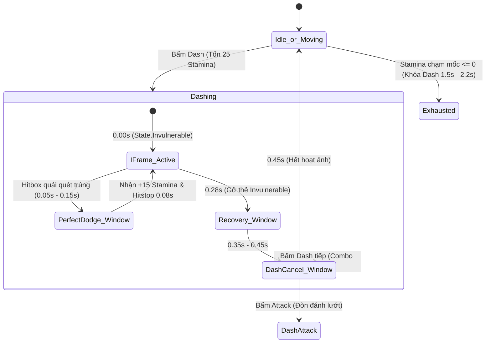

# Dash & I-frame Evasion

> **Status**: Approved  
> **Author**: Systems Designer & Gameplay Programmer  
> **Last Updated**: 2026-09-15  
> **Implements Pillar**: True Skill Expression & Responsive Combat  
> **Target Engine**: Unreal Engine 5 (GAS GameplayAbility & CharacterMovement)

---

## Overview

Hệ thống Lướt & Né Bất Tử (Dash & I-frame Evasion) là cơ chế phòng thủ chủ động tối thượng và là linh hồn trong hệ thống chiến đấu của Project Ascendant. Được xây dựng trên nền tảng **Unreal Engine Gameplay Ability System (GAS)** kết hợp `CharacterMovementComponent`, hệ thống cung cấp cú lướt tốc độ cao (1200 cm/s, tổng thời lượng 0.45s) tích hợp **0.28 giây khung bất tử tuyệt đối (I-frame)**. 

Hệ thống giải quyết bài toán biểu đạt kỹ năng của người chơi: biến việc né tránh thành đòn bẩy phản công thông qua cơ chế **Né Đòn Hoàn Hảo (Perfect Dodge)** thưởng hồi phục thể lực và kích hoạt thiên phú Class, đồng thời hỗ trợ hủy hoạt ảnh linh hoạt (Dash Cancel) để duy trì nhịp độ chiến đấu dồn dập, liền mạch như *Hades*.

---

## Player Fantasy

*"Lưỡi đại đao rực lửa của Lãnh chúa chém quét ngang sàn đấu với tốc độ xé gió. Chỉ một tích tắc trước khi lưỡi đao chạm vào da thịt, bạn bấm phím né — thân ảnh hóa thành một vệt bóng mờ bạc lướt xuyên thẳng qua ngọn lửa tử thần. Tiếng chuông 'Ching!' ngân vang báo hiệu Perfect Dodge, không gian ngưng đọng trong chớp mắt, thể lực dâng trào và bạn lập tức xoay người tung đòn kiếm phản kích chí mạng vào điểm yếu phía sau lưng quái vật."*

Người chơi trải nghiệm cảm giác kích thích tột độ khi làm chủ ranh giới giữa sự sống và cái chết: sự an toàn không đến từ việc chạy trốn hay giáp dày máu trâu, mà đến từ sự tự tin lao thẳng xuyên qua đòn tấn công của đối thủ nhờ độ chính xác của phản xạ.

---

## Detailed Design

### Core Rules

Cú lướt né đòn được thực thi thông qua GameplayAbility `UGA_Dash` kết hợp với Animation Montage chuẩn hóa trên Character.

#### 1. Ba Giai Đoạn Của Cú Lướt (The 3 Dash Phases)

Tổng thời lượng của một cú lướt được cố định ở mức **0.45 giây** (quãng đường di chuyển tổng thể ~380 cm):

```mermaid
gantt
    title Dòng Thời Gian Hoạt Ảnh Lướt (0.45s)
    dateFormat X
    axisFormat %s
    section Khung Bất Tử (I-frame)
    Khung Bất Tử Tuyệt Đối (State.Invulnerable) :active, 0, 28
    Hết I-frame (Có thể nhận sát thương) :crit, 28, 45
    section Vận Tốc & Xuyên Quái
    Đỉnh Tốc 1200 cm/s & Lướt xuyên quái :0, 25
    Hãm tốc về 550 cm/s & Bật va chạm :25, 45
    section Ngắt Hoạt Ảnh (Cancel)
    Cửa Sổ Kích Hoạt Đòn Đánh Lướt (Dash Attack) :35, 45
```

- **Giai đoạn 1: Khung Bất Tử & Tốc Độ Đỉnh (0.00s → 0.28s)**
  - *Vận tốc:* Đạt đỉnh tức thời **1200 cm/s** trong 0.20s đầu, sau đó giảm nhẹ về 900 cm/s ở 0.28s.
  - *Bảo vệ:* Nhân vật mang thẻ `State.Invulnerable`. Bất tử tuyệt đối trước sát thương, hiệu ứng khống chế và lực xô đẩy (Knockback).
  - *Xuyên quái vật:* Capsule Component chuyển kênh va chạm với quái vật sang `Overlap`, cho phép người chơi lướt xuyên qua thân hình Boss mà không bị kẹt lại.
  - *Thị giác:* Kích hoạt vệt bóng mờ bạc Niagara (*Ghosting Trail*).
- **Giai đoạn 2: Cửa Sổ Hồi Phục & Dễ Bị Phạt (0.28s → 0.45s)**
  - *Vận tốc:* Hãm dần từ 900 cm/s về tốc độ chạy thường 550 cm/s.
  - *Trạng thái:* Hết I-frame (thẻ `State.Invulnerable` bị gỡ bỏ). Người chơi sẽ dính sát thương nếu quái vẫn còn chiêu quét trúng (cửa sổ phạt nếu né non hoặc né sai thời điểm).
  - *Va chạm:* Khôi phục lại va chạm vật lý (`Block`) với quái vật.
- **Giai đoạn 3: Hủy Hoạt Ảnh & Đòn Đánh Lướt (0.35s → 0.45s)**
  - Từ mốc 0.35s, người chơi có thể bấm nút Tấn Công hoặc Kỹ Năng để **hủy 0.10s hồi phục cuối** và tung ra ngay chiêu **Đòn Đánh Lướt (Dash Attack)** hoặc xâu chuỗi cú lướt thứ 2.

#### 2. Cơ Chế Né Đòn Hoàn Hảo (Perfect Dodge)

- **Điều kiện kích hoạt:** Hitbox tấn công của đối thủ quét qua Capsule người chơi trong khoảng **0.05s – 0.15s đầu tiên** của cú lướt (*Sweet Spot Timing*).
- **Phần thưởng kỹ năng:**
  - **Hồi Phục Thể Lực:** Lập tức hoàn lại **+15 Stamina** (chi phí thực tế của cú lướt giảm từ 25 xuống chỉ còn 10 điểm, cho phép người chơi kỹ năng cao lướt liên tục mà không lo cạn Stamina).
  - **Hiệu Ứng Hitstop (0.08s):** Toàn bộ sàn đấu và quái vật ngưng đọng nhẹ 0.08 giây, tạo điểm nhấn va chạm cực mạnh cho người chơi.
  - **Kích Hoạt Thiên Phú Class:** Cấp thẻ `State.PerfectDodgeTriggered` trong 2.0s để kích hoạt các cơ chế phản kích đặc thù (ví dụ: *Thí Thần Giả* ngưng đọng thời gian 1s, *Hư Không Kiếm Sư* để lại vết cắt không gian, *Du Hiệp* tăng 30% tốc chạy).

#### 3. Quy Tắc Xác Định Hướng Lướt (Direction Determination)

- *Khi đang di chuyển (WASD / Cần trái lệch deadzone > 0.2):* Lướt theo vector di chuyển (cho phép lướt lùi hoặc lướt ngang trong khi mắt vẫn nhìn/ngắm về phía Boss).
- *Khi đang đứng yên (Vector di chuyển = 0):* Lướt thẳng theo hướng nhìn của nhân vật / hướng con trỏ chuột.

### States and Transitions

### Interactions with Other Systems

- **Combat System (`combat-system.md`):**
  - **Dash Cancel:** Cho phép ngắt chiêu đánh thường bất kỳ lúc nào nếu đột ngột thấy Boss vung đòn nguy hiểm.
  - **Dash Attack:** Kích hoạt hoạt ảnh vung kiếm chém lướt về phía trước, gia tăng 15% sát thương phá thế (Posture).
- **Attributes System (`attributes-system.md`):**
  - Đọc và tiêu hao `stamina_cost_dash = 25.0`, kích hoạt `iframe_duration = 0.28s`.
  - Thực thi cơ chế **Cú lướt tuyệt vọng (Desperation Roll)** khi Stamina < 25 (cho lướt đủ 0.28s nhưng chịu phạt Kiệt Sức trong 2.2s).
- **Isometric Controller (`isometric-controller.md`):**
  - Nhận vector di chuyển làm vector hướng lướt chính xác, không phụ thuộc vào hướng xoay của chuột khi đang di chuyển.

---

## Formulas

### 1. Đường Cong Vận Tốc Cú Lướt (Dash Velocity Curve)
- Từ $t = 0.00\text{s} \rightarrow 0.20\text{s}$: Vận tốc đạt đỉnh $V_{dash}(t) = 1200\text{ cm/s}$.
- Từ $t = 0.20\text{s} \rightarrow 0.45\text{s}$: Hãm tốc theo hàm phi tuyến:
  $$V_{dash}(t) = 550 + (1200 - 550) \times \left(1 - \frac{t - 0.20}{0.25}\right)^2$$
- *Tổng quãng đường lướt:* Tích phân vận tốc xấp xỉ **$380\text{ cm}$**.

### 2. Chi Phí Thể Lực Thực Tế Khi Né Hoàn Hảo (Perfect Dodge Economy)
$$\text{EffectiveCost} = \text{StaminaCost\_Dash} - \text{StaminaRefund} = 25.0 - 15.0 = 10.0\text{ Stamina}$$
- *Ý nghĩa:* Người chơi có kỹ năng cao có thể thực hiện liên tục tới **10 cú né đòn hoàn hảo** từ bình 100 Stamina (thay vì chỉ 4 lần lướt thông thường).

### 3. Cơ Chế Đóng Băng Va Chạm (Hitstop Dilation)
- Khi kích hoạt Perfect Dodge: $\text{GlobalTimeDilation} = 0.1$ trong thời gian thực $0.08\text{s}$ (áp dụng lên quái và môi trường; nhân vật người chơi được cấp $\text{CustomTimeDilation} = 1.0$ để giữ nguyên độ nhạy phản xạ).

---

## Edge Cases

- **Chống Rơi Xuống Vực Thẳm (Ledge Fall Prevention):**
  - CharacterMovement bật cờ `bCanWalkOffLedges = false` trong suốt 0.45s lướt. Người chơi lướt về phía mép vực/hố sâu sẽ bị chặn lại an toàn tại mép sàn, không bao giờ bị trượt té chết oan uổng.
- **Lướt Va Vào Góc Tường Chữ V:**
  - Lực đẩy tự động trượt theo mặt phẳng tiếp xúc (Wall-slide Vector), nhân vật lướt trượt dọc theo chân tường thay vì bị khựng đứng tại chỗ.
- **Vùng Sát Thương Lưu Lại Trên Đất (Persistent AoE Hazard):**
  - Nếu Boss phun vũng độc hoặc dung nham cháy trong 3 giây: Người chơi lướt xuyên qua sẽ an toàn trong 0.28s đầu. Nhưng nếu khi hết 0.28s mà nhân vật vẫn đứng trong vũng độc, sát thương rút máu sẽ bắt đầu tác động bình thường.
- **Hết Stamina Khi Spam Phím Lướt:**
  - Cú lướt thứ 4 sẽ tiêu hao 25 Stamina cuối cùng (100 $\rightarrow$ 0). Người chơi vẫn hoàn thành trọn vẹn cú lướt thứ 4 này có I-frame đầy đủ, nhưng khi vừa kết thúc sẽ lập tức rơi vào trạng thái Kiệt Sức (`State.Exhausted`), khóa nút né đòn trong 1.5s.

---

## Dependencies

- **Attributes System (`attributes-system.md`):** Cung cấp `Stamina`, `StaminaRegenRate`, `IFrameDuration` và trạng thái `State.Exhausted`.
- **Isometric Controller (`isometric-controller.md`):** Cung cấp vector di chuyển 8 hướng và chuẩn hóa tốc độ góc nhìn 2.5D.
- **Combat System (`combat-system.md`):** Tiếp nhận tín hiệu Dash Cancel và kích hoạt đòn đánh lướt (Dash Attack).

---

## Tuning Knobs

| Tên Biến Số | Giá Trị Mặc Định | Biên Độ Khuyến Nghị | Ý Nghĩa Cân Bằng |
| :--- | :---: | :---: | :--- |
| `DashTotalDuration` | 0.45s | 0.40s – 0.50s | Tổng thời gian của hoạt ảnh lướt né. |
| `IFrameDuration` | 0.28s | 0.24s – 0.32s | Khung bất tử đã khóa trong `entities.yaml`. |
| `PerfectDodgeWindow_Start` | 0.05s | 0.03s – 0.08s | Thời điểm bắt đầu cửa sổ né hoàn hảo. |
| `PerfectDodgeWindow_End` | 0.15s | 0.12s – 0.18s | Thời điểm kết thúc cửa sổ né hoàn hảo. |
| `PerfectDodgeStaminaRefund`| 15.0 | 10.0 – 20.0 | Lượng thể lực hoàn lại khi né chuẩn. |
| `PerfectDodgeHitstop` | 0.08s | 0.05s – 0.12s | Độ dài ngưng đọng thời gian tạo cảm giác đã tay. |
| `DashCancelWindow_Start` | 0.35s | 0.30s – 0.40s | Thời điểm cho phép hủy hoạt ảnh để tung Dash Attack. |
| `DashPeakVelocity` | 1200.0 cm/s | 1000 – 1400 cm/s | Vận tốc lướt đạt đỉnh ban đầu. |

---

## Visual/Audio Requirements

- **VFX Niagara:**
  - `NS_DashTrail`: Chuỗi bóng mờ phát quang (Ghosting Trail) lưu lại dáng chạy của nhân vật trong 0.25s.
  - `NS_PerfectDodgeFlash`: Tia chớp bạc lóe sáng quanh tâm nhân vật kèm hiệu ứng sóng xung kích Radial Distortion lan rộng 300cm khi Perfect Dodge thành công.
- **Âm thanh (Audio SFX):**
  - `SFX_Dash_Whoosh`: Tiếng gió rít nhanh, dứt khoát khi vừa nhấn lướt.
  - `SFX_PerfectDodge_Ching`: Âm thanh kim loại vang vọng ngân vang cao vút báo hiệu né đòn thành công.

---

## UI Requirements

- **HUD Phản Hồi:**
  - Thanh Stamina nhấp nháy ánh vàng trắng khi nhận +15 Stamina hoàn lại từ Perfect Dodge.
  - Chữ nổi động dạng chữ ký nghệ thuật: *"PERFECT!"* hiển thị mờ dần trong 0.5s trên đầu nhân vật.

---

## Acceptance Criteria

- [ ] **AC-1 (Khung Bất Tử Tuyệt Đối):** Bấm lướt tiêu hao 25 Stamina, nhân vật lướt xa ~380cm; trong 0.28s đầu tiên mọi hitbox đòn đánh của quái đi xuyên qua không gây sát thương.
- [ ] **AC-2 (Né Hoàn Hảo):** Đòn đánh quái chạm người chơi trong khoảng 0.05s–0.15s lập tức kích hoạt âm thanh "Ching", ngưng đọng 0.08s và hoàn lại đúng 15 Stamina.
- [ ] **AC-3 (Chống Rơi Vực):** Lướt thẳng về phía mép vực đá không làm nhân vật rơi xuống vực (`bCanWalkOffLedges = false`).
- [ ] **AC-4 (Hủy Hoạt Ảnh Đòn Đánh Lướt):** Bấm phím tấn công từ mốc 0.35s ngắt 0.10s cuối hoạt ảnh lướt và kích hoạt ngay lập tức chiêu thức Dash Attack.

---

## Open Questions

- *Không còn câu hỏi mở tồn đọng. Toàn bộ thông số và cơ chế đã được đồng bộ với attributes-system và isometric-controller.*
