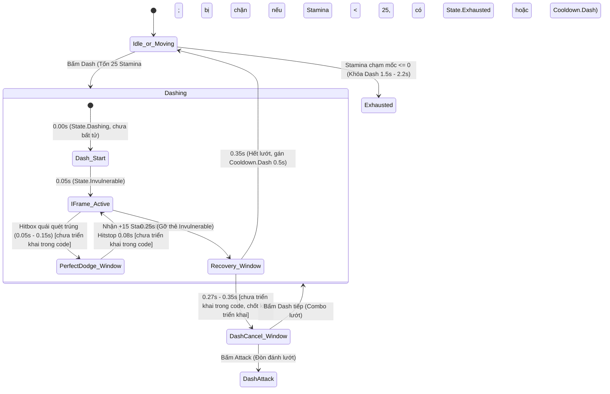

# Dash & I-frame Evasion

> **Status**: Approved  
> **Author**: Systems Designer & Gameplay Programmer  
> **Last Updated**: 2026-10-10 (Y1: cửa sổ Dash Cancel co theo tỉ lệ 0.35/0.45 (2026-10-10, Y1, chủ dự án duyệt)); 2026-10-09 (X10: đồng bộ thông số theo code runtime)  
> **Implements Pillar**: True Skill Expression & Responsive Combat  
> **Target Engine**: Unreal Engine 5 (GAS GameplayAbility & CharacterMovement)

> **Đồng bộ thông số (2026-10-09, DECISIONS.md §12)**: Thời lượng, I-frame, quãng đường, hồi chiêu và chi phí của cú lướt lấy theo code runtime `UPAGameplayAbility_Dash` (`Source/ProjectAscendant/Public/Combat/PAGameplayAbility_Dash.h:30-36, 144-166`). Cảm giác chơi với các giá trị này vẫn chờ chủ dự án duyệt. Bảng đối chiếu trước/sau: `production/qa/x10-combat-values-before-after.md`.

---

## Overview

Hệ thống Lướt & Né Bất Tử (Dash & I-frame Evasion) là cơ chế phòng thủ chủ động tối thượng và là linh hồn trong hệ thống chiến đấu của Project Ascendant. Được xây dựng trên nền tảng **Unreal Engine Gameplay Ability System (GAS)** kết hợp `CharacterMovementComponent`, hệ thống cung cấp cú lướt tốc độ cao (450 cm trong tổng thời lượng 0.35s, vận tốc giảm tuyến tính từ đỉnh ≈2571 cm/s) tích hợp **0.20 giây khung bất tử tuyệt đối (I-frame), từ t = 0.05s đến t = 0.25s**, sau đó hồi chiêu 0.5s. 

Hệ thống giải quyết bài toán biểu đạt kỹ năng của người chơi: biến việc né tránh thành đòn bẩy phản công thông qua cơ chế **Né Đòn Hoàn Hảo (Perfect Dodge)** thưởng hồi phục thể lực và kích hoạt thiên phú Class, đồng thời hỗ trợ hủy hoạt ảnh linh hoạt (Dash Cancel) để duy trì nhịp độ chiến đấu dồn dập, liền mạch như *Hades*.

---

## Player Fantasy

*"Lưỡi đại đao rực lửa của Lãnh chúa chém quét ngang sàn đấu với tốc độ xé gió. Chỉ một tích tắc trước khi lưỡi đao chạm vào da thịt, bạn bấm phím né — thân ảnh hóa thành một vệt bóng mờ bạc lướt xuyên thẳng qua ngọn lửa tử thần. Tiếng chuông 'Ching!' ngân vang báo hiệu Perfect Dodge, không gian ngưng đọng trong chớp mắt, thể lực dâng trào và bạn lập tức xoay người tung đòn kiếm phản kích chí mạng vào điểm yếu phía sau lưng quái vật."*

Người chơi trải nghiệm cảm giác kích thích tột độ khi làm chủ ranh giới giữa sự sống và cái chết: sự an toàn không đến từ việc chạy trốn hay giáp dày máu trâu, mà đến từ sự tự tin lao thẳng xuyên qua đòn tấn công của đối thủ nhờ độ chính xác của phản xạ.

---

## Detailed Design

### Core Rules

Cú lướt né đòn được thực thi thông qua GameplayAbility `UGA_Dash` kết hợp với Animation Montage chuẩn hóa trên Character.

#### 1. Ba Giai Đoạn Của Cú Lướt (The 3 Dash Phases)

Tổng thời lượng của một cú lướt được cố định ở mức **0.35 giây** (quãng đường di chuyển tổng thể **450 cm**). Khi cú lướt kết thúc (kể cả khi bị ngắt), ability luôn gán thẻ hồi chiêu `Cooldown.Dash` trong **0.5 giây**:

```mermaid
gantt
    title Dòng Thời Gian Hoạt Ảnh Lướt (0.35s, đơn vị 0.01s)
    dateFormat X
    axisFormat %s
    section Khung Bất Tử (I-frame)
    Chưa bất tử (bắt đầu lướt) :crit, 0, 5
    Khung Bất Tử Tuyệt Đối (State.Invulnerable) :active, 5, 25
    Hết I-frame (Có thể nhận sát thương) :crit, 25, 35
    section Vận Tốc
    Giảm tuyến tính từ ≈2571 cm/s về 0 :0, 35
```

- **Từ 0.00s đến 0.05s:** Nhân vật đã bắt đầu lướt (thẻ `State.Dashing`) nhưng **chưa** mang thẻ `State.Invulnerable`.
- **Giai đoạn 1: Khung Bất Tử (0.05s → 0.25s, kéo dài 0.20s)**
  - *Vận tốc:* Root Motion Constant Force với đường cong giảm tuyến tính: đạt đỉnh $V_{peak} = 2 \times 450 / 0.35 \approx 2571\text{ cm/s}$ tại t = 0 và giảm đều về 0 tại t = 0.35s (xem Formulas §1).
  - *Bảo vệ:* Nhân vật mang thẻ `State.Invulnerable` (GameplayEffect thời lượng 0.20s). Bất tử tuyệt đối trước sát thương, hiệu ứng khống chế và lực xô đẩy (Knockback).
  - *Xuyên quái vật:* Capsule Component chuyển kênh va chạm với quái vật sang `Overlap`, cho phép người chơi lướt xuyên qua thân hình Boss mà không bị kẹt lại — **chưa triển khai trong code (theo quyết định 2026-10-09: giá trị code là chuẩn)**.
  - *Thị giác:* Kích hoạt vệt bóng mờ bạc Niagara (*Ghosting Trail*) qua delegate `OnDashExecuted`.
- **Giai đoạn 2: Cửa Sổ Hồi Phục & Dễ Bị Phạt (0.25s → 0.35s)**
  - *Vận tốc:* Tiếp tục giảm tuyến tính về 0 khi kết thúc cú lướt.
  - *Trạng thái:* Hết I-frame (thẻ `State.Invulnerable` bị gỡ bỏ). Người chơi sẽ dính sát thương nếu quái vẫn còn chiêu quét trúng (cửa sổ phạt nếu né non hoặc né sai thời điểm).
  - *Va chạm:* Khôi phục lại va chạm vật lý (`Block`) với quái vật (đi kèm cơ chế xuyên quái ở trên — chưa triển khai trong code (theo quyết định 2026-10-09: giá trị code là chuẩn)).
- **Giai đoạn 3: Hủy Hoạt Ảnh & Đòn Đánh Lướt** — **chưa triển khai trong code (theo quyết định 2026-10-09: giá trị code là chuẩn)**
  - Ý đồ thiết kế: người chơi có thể bấm nút Tấn Công hoặc Kỹ Năng để hủy phần hồi phục cuối và tung ra ngay chiêu **Đòn Đánh Lướt (Dash Attack)** hoặc xâu chuỗi cú lướt thứ 2.
  - Mốc cũ của thiết kế (0.35s → 0.45s, hủy 0.10s cuối) dựa trên tổng thời lượng 0.45s. **Mốc mới (2026-10-10, Y1, chủ dự án duyệt):** co theo tỉ lệ 0.35/0.45 → cửa sổ Dash Cancel **0.27s → 0.35s** ($0.35 \times 0.35/0.45 \approx 0.27\text{s}$ → $0.45 \times 0.35/0.45 = 0.35\text{s}$), tức hủy khoảng 0.08s cuối của cú lướt 0.35s; mốc chính xác **chốt khi triển khai**. Lưu ý: hồi chiêu `Cooldown.Dash` 0.5s hiện chặn cú lướt thứ 2 ngay sau đó.

#### 2. Cơ Chế Né Đòn Hoàn Hảo (Perfect Dodge)

> **Trạng thái**: chưa triển khai trong code (theo quyết định 2026-10-09: giá trị code là chuẩn). Logic thuần chỉ có trong `FPADashModel` (`Source/ProjectAscendant/Public/Combat/PADashTypes.h:300-337`); struct này không được dùng ở runtime. Cửa sổ 0.05s – 0.15s vẫn nằm trong khung I-frame mới (0.05s – 0.25s).

- **Điều kiện kích hoạt:** Hitbox tấn công của đối thủ quét qua Capsule người chơi trong khoảng **0.05s – 0.15s đầu tiên** của cú lướt (*Sweet Spot Timing*).
- **Phần thưởng kỹ năng:**
  - **Hồi Phục Thể Lực:** Lập tức hoàn lại **+15 Stamina** (chi phí thực tế của cú lướt giảm từ 25 xuống chỉ còn 10 điểm, cho phép người chơi kỹ năng cao lướt liên tục mà không lo cạn Stamina).
  - **Hiệu Ứng Hitstop (0.08s):** Toàn bộ sàn đấu và quái vật ngưng đọng nhẹ 0.08 giây, tạo điểm nhấn va chạm cực mạnh cho người chơi.
  - **Kích Hoạt Thiên Phú Class:** Cấp thẻ `State.PerfectDodgeTriggered` trong 2.0s để kích hoạt các cơ chế phản kích đặc thù (ví dụ: *Thí Thần Giả* ngưng đọng thời gian 1s, *Hư Không Kiếm Sư* để lại vết cắt không gian, *Du Hiệp* tăng 30% tốc chạy).

#### 3. Quy Tắc Xác Định Hướng Lướt (Direction Determination)

- *Khi đang di chuyển (WASD / Cần trái lệch deadzone > 0.2):* Lướt theo vector di chuyển (cho phép lướt lùi hoặc lướt ngang trong khi mắt vẫn nhìn/ngắm về phía Boss).
- *Khi đang đứng yên (Vector di chuyển = 0):* Lướt thẳng theo hướng nhìn của nhân vật / hướng con trỏ chuột.

### States and Transitions

```mermaid
stateDiagram-v2
    [*] --> Idle_or_Moving
    Idle_or_Moving --> Dashing: Bấm Dash (Tốn 25 Stamina; bị chặn nếu Stamina < 25, có State.Exhausted hoặc Cooldown.Dash)
    state Dashing {
        [*] --> Dash_Start: 0.00s (State.Dashing, chưa bất tử)
        Dash_Start --> IFrame_Active: 0.05s (State.Invulnerable)
        IFrame_Active --> PerfectDodge_Window: Hitbox quái quét trúng (0.05s - 0.15s) [chưa triển khai trong code]
        PerfectDodge_Window --> IFrame_Active: Nhận +15 Stamina & Hitstop 0.08s [chưa triển khai trong code]
        IFrame_Active --> Recovery_Window: 0.25s (Gỡ thẻ Invulnerable)
    }
    Recovery_Window --> Idle_or_Moving: 0.35s (Hết lướt, gán Cooldown.Dash 0.5s)
    Recovery_Window --> DashCancel_Window: 0.27s - 0.35s [chưa triển khai trong code, chốt khi triển khai]
    DashCancel_Window --> DashAttack: Bấm Attack (Đòn đánh lướt)
    DashCancel_Window --> Dashing: Bấm Dash tiếp (Combo lướt)
    Idle_or_Moving --> Exhausted: Stamina chạm mốc <= 0 (Khóa Dash 1.5s - 2.2s)
```

### Interactions with Other Systems

- **Combat System (`combat-system.md`):**
  - **Dash Cancel:** Cho phép ngắt chiêu đánh thường bất kỳ lúc nào nếu đột ngột thấy Boss vung đòn nguy hiểm.
  - **Dash Attack:** Kích hoạt hoạt ảnh vung kiếm chém lướt về phía trước, gia tăng 15% sát thương phá thế (Posture).
- **Attributes System (`attributes-system.md`):**
  - Đọc và tiêu hao `stamina_cost_dash = 25.0`, kích hoạt I-frame `iframe_duration = 0.20s` (từ t = 0.05s đến t = 0.25s).
  - Thực thi cơ chế **Cú lướt tuyệt vọng (Desperation Roll)** khi Stamina < 25 (cho lướt đủ khung I-frame nhưng chịu phạt Kiệt Sức trong 2.2s) — **chưa triển khai trong code (theo quyết định 2026-10-09: giá trị code là chuẩn)**: `UPAGameplayAbility_Dash` chặn kích hoạt khi Stamina < 25 (`Source/ProjectAscendant/Private/Combat/PAGameplayAbility_Dash.cpp:30`); nhánh Desperation Roll trong `FPAStaminaPipeline::ConsumeStamina` (`PAStaminaComponent.cpp:32-35`) không được gọi ở runtime.
- **Isometric Controller (`isometric-controller.md`):**
  - Nhận vector di chuyển làm vector hướng lướt chính xác, không phụ thuộc vào hướng xoay của chuột khi đang di chuyển.

---

## Formulas

### 1. Đường Cong Vận Tốc Cú Lướt (Dash Velocity Curve)
- Giảm tuyến tính (Linear Decay) trong toàn bộ thời lượng $T = 0.35\text{s}$, quãng đường $D = 450\text{ cm}$ (`FPADashPipeline`, `PAGameplayAbility_Dash.h:50-65`):
  $$V_{peak} = \frac{2D}{T} = \frac{2 \times 450}{0.35} \approx 2571.43\text{ cm/s}$$
  $$V_{dash}(t) = V_{peak} \times \left(1 - \frac{t}{T}\right), \quad 0 \le t \le T$$
  $$S(t) = V_{peak} \times \left(t - \frac{t^2}{2T}\right)$$
- *Tổng quãng đường lướt:* $S(T) = D = 450\text{ cm}$.

### 2. Chi Phí Thể Lực Thực Tế Khi Né Hoàn Hảo (Perfect Dodge Economy)
*(chưa triển khai trong code (theo quyết định 2026-10-09: giá trị code là chuẩn))*
$$\text{EffectiveCost} = \text{StaminaCost\_Dash} - \text{StaminaRefund} = 25.0 - 15.0 = 10.0\text{ Stamina}$$
- *Ý nghĩa:* Người chơi có kỹ năng cao có thể thực hiện liên tục tới **10 cú né đòn hoàn hảo** từ bình 100 Stamina (thay vì chỉ 4 lần lướt thông thường).

### 3. Cơ Chế Đóng Băng Va Chạm (Hitstop Dilation)
*(chưa triển khai trong code (theo quyết định 2026-10-09: giá trị code là chuẩn))*
- Khi kích hoạt Perfect Dodge: $\text{GlobalTimeDilation} = 0.1$ trong thời gian thực $0.08\text{s}$ (áp dụng lên quái và môi trường; nhân vật người chơi được cấp $\text{CustomTimeDilation} = 1.0$ để giữ nguyên độ nhạy phản xạ).

---

## Edge Cases

- **Chống Rơi Xuống Vực Thẳm (Ledge Fall Prevention):**
  - CharacterMovement bật cờ `bCanWalkOffLedges = false` trong suốt 0.35s lướt. Người chơi lướt về phía mép vực/hố sâu sẽ bị chặn lại an toàn tại mép sàn, không bao giờ bị trượt té chết oan uổng. *(chưa triển khai trong code (theo quyết định 2026-10-09: giá trị code là chuẩn): `UPAGameplayAbility_Dash` không đặt cờ này; chỉ `FPADashModel` — không dùng ở runtime — có logic tương ứng.)*
- **Lướt Va Vào Góc Tường Chữ V:**
  - Lực đẩy tự động trượt theo mặt phẳng tiếp xúc (Wall-slide Vector), nhân vật lướt trượt dọc theo chân tường thay vì bị khựng đứng tại chỗ.
- **Vùng Sát Thương Lưu Lại Trên Đất (Persistent AoE Hazard):**
  - Nếu Boss phun vũng độc hoặc dung nham cháy trong 3 giây: Người chơi lướt xuyên qua sẽ an toàn trong khung I-frame từ 0.05s đến 0.25s. Nhưng nếu trước 0.05s hoặc sau 0.25s mà nhân vật vẫn đứng trong vũng độc, sát thương rút máu sẽ tác động bình thường.
- **Hết Stamina Khi Spam Phím Lướt:**
  - Cú lướt thứ 4 sẽ tiêu hao 25 Stamina cuối cùng (100 $\rightarrow$ 0). Người chơi vẫn hoàn thành trọn vẹn cú lướt thứ 4 này có I-frame đầy đủ, nhưng khi vừa kết thúc sẽ lập tức rơi vào trạng thái Kiệt Sức (`State.Exhausted`), khóa nút né đòn trong 1.5s.

---

## Dependencies

- **Attributes System (`attributes-system.md`):** Cung cấp `Stamina`, `StaminaRegenRate`, `IFrameDuration` và trạng thái `State.Exhausted`. *(Lưu ý: runtime hiện lấy thời lượng I-frame từ thuộc tính cấu hình `IFrameDuration` của `UPAGameplayAbility_Dash`, không đọc attribute `IFrameDuration` của `UAscendantAttributeSet`.)*
- **Isometric Controller (`isometric-controller.md`):** Cung cấp vector di chuyển 8 hướng và chuẩn hóa tốc độ góc nhìn 2.5D.
- **Combat System (`combat-system.md`):** Tiếp nhận tín hiệu Dash Cancel và kích hoạt đòn đánh lướt (Dash Attack).

---

## Tuning Knobs

| Tên Biến Số | Giá Trị Mặc Định | Biên Độ Khuyến Nghị | Ý Nghĩa Cân Bằng |
| :--- | :---: | :---: | :--- |
| `DashDuration` | 0.35s | — (chờ duyệt cảm giác chơi) | Tổng thời gian của cú lướt né (`PAGameplayAbility_Dash.h:150`). |
| `DashDistance` | 450 cm | — (chờ duyệt cảm giác chơi) | Quãng đường lướt (`PAGameplayAbility_Dash.h:154`). |
| `IFrameStartTime` | 0.05s | — (chờ duyệt cảm giác chơi) | Thời điểm bắt đầu khung bất tử (`PAGameplayAbility_Dash.h:158`). |
| `IFrameDuration` | 0.20s | — (chờ duyệt cảm giác chơi) | Độ dài khung bất tử, kết thúc tại 0.25s (`PAGameplayAbility_Dash.h:162`). |
| `CooldownDuration` | 0.50s | — (chờ duyệt cảm giác chơi) | Hồi chiêu `Cooldown.Dash` gán khi cú lướt kết thúc (`PAGameplayAbility_Dash.h:166`). |
| `DashStaminaCost` | 25.0 | 20.0 – 35.0 | Chi phí thể lực; chặn kích hoạt khi Stamina < 25 (`PAGameplayAbility_Dash.h:146`). |
| `PerfectDodgeWindow_Start` | 0.05s | 0.03s – 0.08s | Thời điểm bắt đầu cửa sổ né hoàn hảo (chưa triển khai trong code (theo quyết định 2026-10-09: giá trị code là chuẩn)). |
| `PerfectDodgeWindow_End` | 0.15s | 0.12s – 0.18s | Thời điểm kết thúc cửa sổ né hoàn hảo (chưa triển khai trong code (theo quyết định 2026-10-09: giá trị code là chuẩn)). |
| `PerfectDodgeStaminaRefund`| 15.0 | 10.0 – 20.0 | Lượng thể lực hoàn lại khi né chuẩn (chưa triển khai trong code (theo quyết định 2026-10-09: giá trị code là chuẩn)). |
| `PerfectDodgeHitstop` | 0.08s | 0.05s – 0.12s | Độ dài ngưng đọng thời gian tạo cảm giác đã tay (chưa triển khai trong code (theo quyết định 2026-10-09: giá trị code là chuẩn)). |
| `DashCancelWindow_Start` | ≈0.27s (mốc cũ 0.35s × 0.35/0.45) | — (chốt khi triển khai) | Thời điểm cho phép hủy hoạt ảnh để tung Dash Attack; cửa sổ kéo tới hết cú lướt 0.35s (mốc cũ 0.45s × 0.35/0.45). Chưa triển khai trong code (theo quyết định 2026-10-09: giá trị code là chuẩn). *(2026-10-10, Y1, chủ dự án duyệt).* |

*Vận tốc đỉnh không còn là biến độc lập: $V_{peak} = 2 \times$ `DashDistance` $/$ `DashDuration` $\approx 2571\text{ cm/s}$.*

---

## Visual/Audio Requirements

- **VFX Niagara:**
  - `NS_DashTrail`: Chuỗi bóng mờ phát quang (Ghosting Trail) lưu lại dáng chạy của nhân vật trong 0.25s.
  - `NS_PerfectDodgeFlash`: Tia chớp bạc lóe sáng quanh tâm nhân vật kèm hiệu ứng sóng xung kích Radial Distortion lan rộng 300cm khi Perfect Dodge thành công.
- **Âm thanh (Audio SFX):**
  - `SFX_Dash_Whoosh`: Tiếng gió rít nhanh, dứt khoát khi vừa nhấn lướt.
  - `SFX_PerfectDodge_Ching`: Âm thanh kim loại vang vọng ngân vang cao vút báo hiệu né đòn thành công.

---

## UI Requirements

- **HUD Phản Hồi:**
  - Thanh Stamina nhấp nháy ánh vàng trắng khi nhận +15 Stamina hoàn lại từ Perfect Dodge.
  - Chữ nổi động dạng chữ ký nghệ thuật: *"PERFECT!"* hiển thị mờ dần trong 0.5s trên đầu nhân vật.

---

## Acceptance Criteria

- [ ] **AC-1 (Khung Bất Tử Tuyệt Đối):** Bấm lướt tiêu hao 25 Stamina (bị chặn nếu Stamina < 25, có `State.Exhausted` hoặc `Cooldown.Dash`), nhân vật lướt xa 450cm trong 0.35s; từ t = 0.05s đến t = 0.25s mọi hitbox đòn đánh của quái đi xuyên qua không gây sát thương; kết thúc lướt gán `Cooldown.Dash` 0.5s.
- [ ] **AC-2 (Né Hoàn Hảo):** Đòn đánh quái chạm người chơi trong khoảng 0.05s–0.15s lập tức kích hoạt âm thanh "Ching", ngưng đọng 0.08s và hoàn lại đúng 15 Stamina. *(chưa triển khai trong code (theo quyết định 2026-10-09: giá trị code là chuẩn))*
- [ ] **AC-3 (Chống Rơi Vực):** Lướt thẳng về phía mép vực đá không làm nhân vật rơi xuống vực (`bCanWalkOffLedges = false`). *(chưa triển khai trong code (theo quyết định 2026-10-09: giá trị code là chuẩn))*
- [ ] **AC-4 (Hủy Hoạt Ảnh Đòn Đánh Lướt):** Bấm phím tấn công trong cửa sổ Dash Cancel ngắt phần hồi phục cuối của cú lướt và kích hoạt ngay lập tức chiêu thức Dash Attack. *(chưa triển khai trong code (theo quyết định 2026-10-09: giá trị code là chuẩn); cửa sổ ≈0.27s – 0.35s co theo tỉ lệ 0.35/0.45 (2026-10-10, Y1, chủ dự án duyệt), chốt khi triển khai)*

---

## Open Questions

- **Q1 (2026-10-09):** Cảm giác chơi với bộ thông số code (0.35s / I-frame 0.05s–0.25s / 450cm / hồi chiêu 0.5s) cần chủ dự án duyệt trước khi coi là chốt (DECISIONS.md §12).
- **Q2 (2026-10-09):** Mốc cửa sổ Dash Cancel / Dash Attack cần định lại cho cú lướt 0.35s và hồi chiêu 0.5s (mốc cũ 0.35s – 0.45s dựa trên tổng thời lượng 0.45s). **Đã giải quyết (2026-10-10, Y1, chủ dự án duyệt):** co theo tỉ lệ 0.35/0.45 → ≈0.27s – 0.35s; chưa triển khai trong code, chốt khi triển khai.
- **Q3 (2026-10-09):** `FPADashModel` / `FPADashConfig` (`PADashTypes.h:37-83`) vẫn giữ bộ số cũ (tổng 0.45s, I-frame 0.00s–0.28s, đỉnh 1200 cm/s) và không được dùng ở runtime; cần một task code riêng để hợp nhất hoặc loại bỏ.
