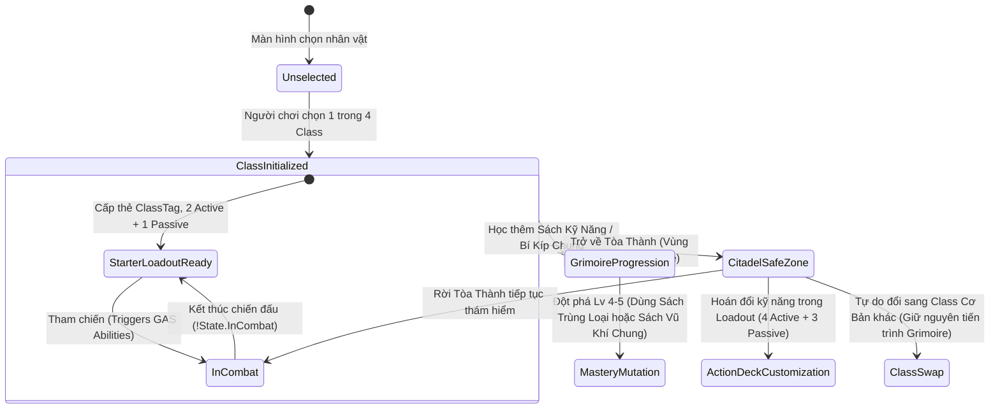

# 4 Foundational Classes & Skill Trees

> **Status**: Approved  
> **Author**: Systems Designer & Lead Programmer  
> **Last Updated**: 2026-09-15  
> **Implements Pillar**: True Skill Expression & Meaningful Progression  
> **Target Engine**: Unreal Engine 5 (GAS & Enhanced Input)

---

## Overview

Hệ thống 4 Chức Nghiệp Nền Tảng & Cây Kỹ Năng (4 Foundational Classes & Skill Trees) định hình bản sắc khởi đầu và cấu trúc tiến trình dài hạn cho người chơi trong Project Ascendant. Đại diện cho 4 trường phái chiến đấu nguyên bản—**Chiến Binh (Vanguard)** kiên cường với phản đòn, **Du Hiệp (Ranger)** linh hoạt xạ kích và đặt bẫy, **Thuật Sĩ (Arcanist)** kiểm soát chiến trường bằng ma pháp bùng nổ, và **Tu Sĩ (Acolyte)** bền bỉ hỗ trợ sinh tồn cùng khí công hộ thể—4 chức nghiệp này là nền móng vận hành toàn bộ vòng lặp hành động hardcore của game.

Được xây dựng theo triết lý thiết kế **A + C**, 4 Class cơ bản không phải là "lớp đệm tạm thời" để vứt bỏ khi tìm thấy Class hiếm, mà là những chức nghiệp sở hữu độ đa dụng cao nhất, chi phí nâng cấp kỹ năng tiết kiệm hơn **40%**, và khả năng tương thích với mọi **Bí Kíp Võ Học Chung** (Shared Weapon Grimoires). Hệ thống tích hợp trực tiếp vào Gameplay Ability System (GAS) của Unreal Engine 5, quản lý chỉ số khởi đầu, bộ Starter Skills (2 Chủ Động + 1 Nội Tại), cơ chế đặc trưng riêng biệt (Class Mechanics), và cây tiến trình phát triển kỹ năng chuyên sâu từ Cấp 1 đến Cấp 5.

---

## Player Fantasy

Hệ thống 4 Chức Nghiệp Nền Tảng mang đến trải nghiệm nhập vai trực diện (Direct Engagement), nơi người chơi cảm nhận sự khác biệt sống động trong từng nhịp thở chiến đấu, độ nặng của vũ khí và phản xạ cơ học đặc thù của từng trường phái:

- **Chiến Binh (Vanguard) — *"Bức Tường Thép Bất Hoại"***:
  > *"Đứng sừng sững như một pháo đài trước lưỡi đao búa tạ khổng lồ của Lãnh Chúa, bạn giương chiếc khiên sắt lên ngay tích tắc trước khi đòn đánh chạm người. Âm thanh 'KENG!' chói tai xé toạc không gian, tia lửa bắn tung tóe—đòn thế của Boss bị phản phé hoàn toàn, mở toang tử huyệt thế đứng (Posture). Bạn bồi tiếp cú chém thứ ba đầy uy lực, tận hưởng khoái cảm thuần túy của việc làm chủ kỹ năng Parrying chuẩn xác từng khung hình."*

- **Du Hiệp (Ranger) — *"Bóng Ma Tật Phong & Thợ Săn Tử Thần"***:
  > *"Bạn lướt vút qua luồng quét đòn chết chóc của kẻ thù trong một phần tư giây, để lại một tàn ảnh mờ ảo. Ngay khi tiếp đất, bạn kéo căng dây cung phóng ra loạt tiễn xuyên thấu găm trúng điểm yếu của Boss, đồng thời rải bẫy chông làm chậm hoàn toàn toán quái đang lao tới. Sự phấn khích tột độ đến từ tốc độ di chuyển xé gió và cảm giác luôn đi trước lưỡi hái tử thần đúng nửa bước."*

- **Thuật Sĩ (Arcanist) — *"Bậc Thầy Thao Túng Chiến Trường"***:
  > *"Bị bủa vây giữa vòng vây quái vật khát máu, bạn giộng mạnh đầu trượng ma thuật xuống mặt đất. Một xoáy nghịch ma pháp bùng lên gom toàn bộ kẻ địch vào một điểm, rồi một vụ nổ hồ quang sấm sét giáng xuống quét sạch chiến trường trong chớp mắt. Bạn không cần chạy trốn; bạn điều khiển toàn bộ nhịp độ trận đánh như một kỳ thủ sắp đặt bàn cờ."*

- **Tu Sĩ (Acolyte) — *"Điểm Tựa Sinh Tử & Hộ Thể Kim Cương"***:
  > *"Khi thanh Stamina của đồng đội cạn kiệt và Boss chuẩn bị giáng đòn kết liễu, bạn lao mình vào tâm chấn với tiếng rống khí công trầm hùng. Cú giộng chùy thánh giải phóng vầng hào quang hộ thể, triệt tiêu mọi hiệu ứng xuất huyết, hồi sinh tức thì thanh thể lực và dựng lên kết giới bất khả xâm phạm. Bạn là chỗ dựa vững chãi nhất, là sự cứu rỗi giữa những trận tử chiến nghẹt thở."*

---

## Detailed Design

### Core Rules

#### 1. Quy Chuẩn Khởi Tạo & Bảng Chỉ Số Nền Tảng (Baseline Stats & Attributes)
Tất cả 4 Class cơ bản được mở khóa miễn phí ngay từ màn hình tạo nhân vật. Khi chọn một class, nhân vật nhận đúng thẻ nhận diện chức nghiệp (`Class.Vanguard`, `Class.Ranger`, `Class.Arcanist`, `Class.Acolyte`), khởi tạo bộ trang bị Bậc 1 (Normal) và nạp bảng chỉ số thuộc tính vào `UAscendantAttributeSet`:

| Thuộc Tính (Attribute) | Chiến Binh (Vanguard) | Du Hiệp (Ranger) | Thuật Sĩ (Arcanist) | Tu Sĩ (Acolyte) | Ý Nghĩa Thiết Kế |
| :--- | :---: | :---: | :---: | :---: | :--- |
| **Máu Tối Đa (Max Health)** | **120** | 90 | 85 | 110 | Vanguard & Acolyte đứng tuyến đầu; Ranger & Arcanist mỏng manh. |
| **Thể Lực (Max Stamina)** | 110 | **120** | 90 | 100 | Ranger có trữ lượng lướt né dồi dào nhất. |
| **Mana Tối Đa (Max Mana)** | 80 | 90 | **140** | 110 | Arcanist sở hữu bể mana khổng lồ để dội phép liên tục. |
| **Thế Đứng (Max Posture)** | **120** | 90 | 80 | 110 | Khả năng chịu đòn đỡ phá vỡ thế đứng trước Boss. |
| **Tốc Chạy (Move Speed)** | 520 cm/s | **570 cm/s** | 530 cm/s | 530 cm/s | Ranger có độ cơ động và tốc độ lướt né vượt trội. |
| **Vũ Khí Khởi Đầu** | Kiếm Sắt + Khiên Gỗ | Cung Săn Gỗ | Trượng Gỗ Khắc Ấn | Chùy Sắt + Hạt Khí | Xác định hoạt ảnh đòn đánh và bộ kỹ năng vũ khí chung. |

---

#### 2. Đặc Tả Chi Tiết 4 Chức Nghiệp Nền Tảng

##### A. CHIẾN BINH (VANGUARD) — `Class.Vanguard`
- **Phong cách:** Bậc thầy cận chiến, áp sát càn lướt và phản đòn chớp nhoáng.
- **Cơ Chế Độc Quyền: Thế Thủ & Phản Đòn Hoàn Hảo (Defensive Stance & Perfect Parry)**:
  - Nhấn giữ `[RMB]` (Chuột phải): Giương khiên vào tư thế Block. Giảm 80% sát thương nhận phải, chuyển sát thương thành tiêu hao Posture.
  - Bấm nhấp `[RMB]` trong cửa sổ **0.15 giây** ngay trước khi đòn đánh chạm người: Kích hoạt **Perfect Parry**.
    - Triệt tiêu hoàn toàn sát thương (0 HP, 0 Posture tiêu hao).
    - Phản ngược **40 điểm Posture Damage** lên Boss hoặc kẻ tấn công.
    - Gây choáng nhẹ (Stun) **0.6 giây** lên quái thường, tạo hiệu ứng âm thanh *"KENG!"* vang dội và lóe sáng Niagara VFX.
- **Bộ Kỹ Năng Khởi Đầu (Starter Kit):**
  - *Active 1 (Slot Q) — Khiên Kích (Shield Bash):* Lao nhanh 300cm húc khiên, gây 30 sát thương vật lý và tích lũy 25% Posture lên mục tiêu (Tiêu hao: 20 Mana, Hồi chiêu: 6.0s).
  - *Active 2 (Slot E) — Kiếm Khí Trảm (Blade Arc):* Vung kiếm quét hình nón 120° phía trước, chém lùi đàn quái 250cm (Tiêu hao: 15 Stamina + 10 Mana, Hồi chiêu: 5.0s).
  - *Passive 1 — Thế Đứng Kiên Định (Unyielding Stance):* Giảm 20% sát thương Posture nhận phải khi đang trong trạng thái Block.
- **Cây Kỹ Năng Mở Rộng (Skill Tree qua Sách Kỹ Năng):**
  - *Active 3 (Slot R) — Khiên Phản Chấn (Shield Reflect):* Tạo vòm hào quang quanh khiên trong 0.8s, phản ngược 100% đòn đánh ma pháp/đạn đạo tầm xa về phía kẻ bắn (Tiêu hao: 25 Mana, CD: 10.0s).
  - *Active 4 (Slot F) — Đại Địa Trảm (Earth Splitter):* Nhảy lên không trung giáng mạnh lưỡi kiếm xuống đất, tạo rãnh nứt địa chấn gây 50 Posture Damage trên diện rộng (Tiêu hao: 35 Mana, CD: 14.0s).
  - *Passive 2 — Phản Đòn Sấm Sét (Thunderous Riposte):* Khi kích hoạt Perfect Parry thành công, phát ra luồng điện giật làm tê liệt toàn bộ quái xung quanh trong 1.0s.
  - *Passive 3 — Huyết Khí Thép (Iron Resolve):* Khi Máu tụt xuống dưới 30%, tự động nhận +30% Giáp vật lý và miễn nhiễm hoàn toàn hiệu ứng hất ngã/choáng nhẹ.

---

##### B. DU HIỆP (RANGER) — `Class.Ranger`
- **Phong cách:** Cơ động tốc độ cao, cấu rỉa tầm xa, kiểm soát bước chân quái bằng bẫy.
- **Cơ Chế Độc Quyền: Nhịp Lướt Tật Phong (Acrobatic Momentum)**:
  - Chi phí lướt né (Dash Stamina Cost) giảm từ 25 xuống còn **20 điểm Thể Lực**.
  - Tổng thời gian lướt ngắn hơn 0.05s (chỉ còn **0.40 giây**, đỉnh tốc 1350 cm/s), cho phép ngắt hoạt ảnh lướt (Dash Cancel) sớm hơn các class khác.
  - Có khả năng bắn một phát tên phụ nhanh (*Snap Shot*) ngay khi vừa kết thúc thao tác lướt né mà không làm giảm tốc độ di chuyển.
- **Bộ Kỹ Năng Khởi Đầu (Starter Kit):**
  - *Active 1 (Slot Q) — Xuyên Tâm Tiễn (Piercing Shot):* Kéo căng cung trong 0.4s bắn mũi tên xuyên thẳng qua mọi quái vật trên đường bay cự ly 1200cm (Tiêu hao: 20 Mana, Hồi chiêu: 5.0s).
  - *Active 2 (Slot E) — Lưới Bẫy Chông (Caltrop Trap):* Ném bẫy chông ra vị trí con trỏ; quái dẫm phải bị trói chân 1.5s và giảm 40% tốc chạy trong 3.0s (Tiêu hao: 15 Stamina + 10 Mana, Hồi chiêu: 7.0s).
  - *Passive 1 — Bộ Pháp Nhanh Nhẹn (Fleetfoot):* Sau khi thực hiện Né Hoàn Hảo (Perfect Dodge), nhận buff tăng +25% tốc độ di chuyển và +15% tốc độ bắn trong 2.5s.
- **Cây Kỹ Năng Mở Rộng (Skill Tree qua Sách Kỹ Năng):**
  - *Active 3 (Slot R) — Mưa Tên Tử Thần (Arrow Rain):* Bắn chùm tên lên không trung rơi xuống vùng đường kính 400cm, gây sát thương dồn dập trong 3.0s (Tiêu hao: 35 Mana, CD: 12.0s).
  - *Active 4 (Slot F) — Tiễn Nổ Phá Giáp (Explosive Dart):* Bắn một mũi tên thuốc nổ cắm vào mục tiêu, phát nổ sau 2.0s gây 35 Posture Damage lên các bộ phận yếu của Boss (Tiêu hao: 30 Mana, CD: 10.0s).
  - *Passive 2 — Thiện Xạ Điểm Yếu (Deadly Precision):* Đòn bắn trúng các bộ phận đang nứt vỡ của Boss (Sừng, Đuôi, Giáp) tăng +30% sát thương bạo kích.
  - *Passive 3 — Vũ Điệu Bóng Ma (Phantom Decoy):* Mỗi khi lướt né, để lại 1 tàn ảnh mờ ảo tại vị trí cũ thu hút đòn đánh của quái thường trong 1.0s.

---

##### C. THUẬT SĨ (ARCANIST) — `Class.Arcanist`
- **Phong cách:** Kiểm soát diện rộng, gom quái tập trung, dồn sát thương ma pháp bùng nổ.
- **Cơ Chế Độc Quyền: Quá Tải Ma Lực (Arcane Surge)**:
  - Mỗi khi một kỹ năng ma pháp đánh trúng kẻ địch, tích lũy 1 tầng `State.Buff.ArcaneCharge` (Tối đa 3 tầng, duy trì 8 giây).
  - Khi đủ 3 tầng: Đòn đánh thường tiếp theo bằng trượng sẽ phóng ra một quả cầu năng lượng bùng nổ diện rộng (AoE 300cm), hồi phục tức thì **20 điểm Mana** cho bản thân và gây **30 điểm Posture Damage** lên mọi kẻ địch trúng đòn.
- **Bộ Kỹ Năng Khởi Đầu (Starter Kit):**
  - *Active 1 (Slot Q) — Xoáy Hút Ma Pháp (Gravity Pull):* Tạo ra một lỗ đen mini tại vị trí chỉ định hút toàn bộ quái vật trong bán kính 350cm vào tâm trong 1.5s (Tiêu hao: 25 Mana, Hồi chiêu: 8.0s).
  - *Active 2 (Slot E) — Sóng Đẩy Lùi (Force Wave):* Giải phóng làn sóng xung kích xung quanh thân thể đẩy văng toàn bộ kẻ địch ra xa 400cm khi bị áp sát (Tiêu hao: 20 Mana, Hồi chiêu: 6.0s).
  - *Passive 1 — Dòng Chảy Huyền Bí (Leyline Conduit):* Khi đứng yên không di chuyển trong 1.0s, tốc độ hồi phục Mana tự nhiên tăng vọt +50%.
- **Cây Kỹ Năng Mở Rộng (Skill Tree qua Sách Kỹ Năng):**
  - *Active 3 (Slot R) — Thiểm Điện Hồ Quang (Chain Lightning):* Phóng luồng sét ma thuật nảy qua 5 mục tiêu liên tiếp, gây tê liệt ngắt chiêu quái trong 0.5s (Tiêu hao: 30 Mana, CD: 9.0s).
  - *Active 4 (Slot F) — Tử Quang Hủy Diệt (Disintegration Beam):* Tập trung ma lực phóng luồng laser năng lượng hủy diệt kéo dài 2.0s theo hướng chuột, thiêu đốt kẻ địch liên tục (Tiêu hao: 50 Mana, CD: 20.0s).
  - *Passive 2 — Cộng Hưởng Nguyên Tố (Resonance):* Kẻ địch đang chịu hiệu ứng khống chế (hút, đẩy lùi, choáng) phải nhận thêm +20% sát thương từ mọi nguồn ma pháp.
  - *Passive 3 — Hộ Thể Ma Đạo (Arcane Ward):* Khi kích hoạt kỹ năng tiêu hao từ 35 Mana trở lên, tự động nhận một lớp khiên chắn bằng 25% Max Mana tồn tại trong 4.0s.

---

##### D. TU SĨ (ACOLYTE) — `Class.Acolyte`
- **Phong cách:** Trụ cột sinh tồn, đấu sĩ cận chiến bọc thép, hồi phục thể lực và hộ thể đồng đội.
- **Cơ Chế Độc Quyền: Chân Khí Hộ Thể (Ki Aegis Surge)**:
  - Khi thanh Stamina của nhân vật tụt xuống dưới 30%: Bản thân lập tức kích hoạt luồng sóng chân khí đẩy lùi quái nhỏ xung quanh và **hoàn trả ngay 30 điểm Thể Lực** (Thời gian hồi nội tại của cơ chế: 20 giây).
  - Đòn đánh bằng chùy chiến tích tụ năng lượng Thánh Khí; ở đòn đánh thứ 3 của chuỗi combo, giải phóng luồng sáng hồi 5% HP cho đồng đội thấp máu nhất ở gần.
- **Bộ Kỹ Năng Khởi Đầu (Starter Kit):**
  - *Active 1 (Slot Q) — Kim Cương Thuẫn (Aegis Barrier):* Tạo lớp màng bảo hộ bằng ánh sáng thánh cho bản thân và 1 đồng minh gần nhất, hấp thụ lượng sát thương tương đương 15% Max HP trong 4.0s (Tiêu hao: 30 Mana, Hồi chiêu: 10.0s).
  - *Active 2 (Slot E) — Thánh Chùy Giáng Thế (Smite):* Giộng mạnh chùy xuống đất gây 40 sát thương và phát tán sóng xung kích thanh tẩy triệt tiêu mọi hiệu ứng bất lợi (Độc, Chảy Máu) cho cả đội (Tiêu hao: 20 Mana, Hồi chiêu: 6.0s).
  - *Passive 1 — Tịnh Tâm (Tranquility Aura):* Phát tỏa hào quang tăng +20% tốc độ hồi phục Stamina tự nhiên cho bản thân và mọi đồng minh trong phạm vi 600cm.
- **Cây Kỹ Năng Mở Rộng (Skill Tree qua Sách Kỹ Năng):**
  - *Active 3 (Slot R) — Chân Ngôn Ánh Sáng (Holy Benediction):* Tụng chân ngôn hồi sinh tức thì 25% Máu và sạc đầy 40 Thể Lực cho toàn bộ đồng đội trong phạm vi 800cm (Tiêu hao: 45 Mana, CD: 25.0s).
  - *Active 4 (Slot F) — Trấn Ma Khí Công (Ki Palm Strike):* Lao tới chưởng mạnh một luồng chân khí nén áp sát, gây **60 điểm Posture Damage** lên Boss và ngắt quãng đòn vận chiêu nguy hiểm (Tiêu hao: 35 Mana, CD: 12.0s).
  - *Passive 2 — Phản Chiếu Thánh Quang (Radiant Backlash):* Khi lớp khiên *Kim Cương Thuẫn* bị đối phương đánh vỡ, nó phát nổ gây sát thương bằng 100% lượng khiên ban đầu lên kẻ tấn công.
  - *Passive 3 — Bất Diệt Ý Chí (Unyielding Faith):* Khi nhận phải đòn đánh chí tử dẫn đến cái chết, nhân vật không gục ngã mà miễn nhiễm sát thương trong 1.5s và hồi phục 25% Max HP (Chỉ kích hoạt 1 lần duy nhất giữa 2 lần nghỉ Lửa Trại).

---

#### 3. Hệ Thống Đặc Quyền Triết Lý A + C (Foundational Advantage Mechanics)
Để bảo đảm 4 Class cơ bản luôn giữ vững vị thế chiến lược xuyên suốt game:
1. **Ưu Đãi Chi Phí Nâng Cấp Kỹ Năng (-40% Sunk Cost):**  
   Chi phí Vàng và Tàn Trang Kỹ Năng (`item_skill_shard`) để nâng cấp kỹ năng từ Cấp 1 lên Cấp 3 của 4 Class này luôn rẻ hơn **40%** so với các Class Bậc Rare/Epic.
2. **Khả Năng Dung Nạp Bí Kíp Võ Học Chung (Universal Grimoire Compatibility):**  
   Ngoài sách độc quyền của Class, 4 Class cơ bản có thể học và trang bị toàn bộ **Bí Kíp Võ Học Chung** thuộc loại vũ khí tương ứng (Kiếm/Khiên, Cung/Song Đao, Trượng/Sách, Chùy/Khí Công).
3. **Đột Phá Cấp 4 & 5 Bằng Sách Võ Học Chung (Mastery Substitution):**  
   Tại mốc Cấp 4 và Cấp 5, nếu không có cuốn Sách Kỹ Năng Độc Quyền trùng loại, người chơi ĐƯỢC PHÉP dùng **1 cuốn Sách Võ Học Chung cùng loại vũ khí** để đột phá. Đây là ưu thế độc quyền tuyệt đối mà các Class Hiếm/Cao Cấp không có được!

---

### States and Transitions

---

### Interactions with Other Systems

| Hệ Thống Tương Tác | Dữ Liệu Trao Đổi Vào (Data In) | Dữ Liệu Xuất Ra (Data Out) | Trách Nhiệm Sở Hữu (Ownership) |
| :--- | :--- | :--- | :--- |
| **Attributes Engine (GAS)** | Đọc Max HP, Stamina, Mana, Posture | Áp dụng GameplayEffect (Trừ Stamina né, hồi phục khí công, khiên chắn) | Attributes sở hữu chỉ số; Class sở hữu logic chiêu thức. |
| **Core Combat & Combo** | Nhận tín hiệu chuỗi đòn đánh 3-Hit Combo | Can thiệp nhịp đòn đánh: Vanguard kích hoạt Parry; Ranger bắn Snap Shot sau lướt | Combat quản lý hitboxes; Class định hình Frame dữ liệu. |
| **Skill Progression (Grimoire)** | Đọc danh sách Ability đã mở khóa và cấp độ | Yêu cầu trang bị kỹ năng vào 4 Active Slots và 3 Passive Slots | Grimoire quản lý thư viện; Class quản lý Starter Kit. |
| **Inventory & Paperdoll** | Kiểm tra loại vũ khí đang trang bị trên người | Cho phép/Chặn kích hoạt kỹ năng nếu không khớp loại vũ khí yêu cầu | Inventory quản lý trang bị; Class kiểm tra điều kiện WeaponTag. |

---

## Formulas

### 1. Công Thức Chi Phí Nâng Cấp Kỹ Năng Ưu Đãi 40% (Foundational Skill Upgrade Cost)
The `foundational_upgrade_cost` formula is defined as:

`UpgradeCost_Gold(Level) = round(BaseGold(Level) * (1.0 - FoundationalDiscount))`  
`UpgradeCost_Shards(Level) = ceil(BaseShards(Level) * (1.0 - FoundationalDiscount))`

**Variables:**
| Variable | Symbol | Type | Range | Description |
|---|:---:|:---:|:---:|---|
| Target Level | $L$ | int | $2 - 3$ | Cấp độ kỹ năng muốn nâng tới (Cấp 2 hoặc Cấp 3). |
| Base Gold Cost | $\text{BaseGold}$ | int | $100 - 500$ | Chi phí vàng gốc quy chuẩn cho Class Bậc Rare. |
| Base Shard Cost | $\text{BaseShards}$ | int | $2 - 5$ | Số Tàn Trang Kỹ Năng gốc (`item_skill_shard`). |
| Foundational Discount | $D$ | float | $0.40$ | Tỷ lệ ưu đãi giảm giá cố định cho 4 Class Cơ Bản (40%). |

**Output Range:** 
- Vàng: $60 - 300$ Vàng mỗi cấp (so với $100 - 500$ Vàng của Class khác).
- Tàn Trang: $1 - 3$ Tàn Trang mỗi cấp (so với $2 - 5$ Tàn Trang của Class khác).

**Example:** 
- Nâng kỹ năng từ Cấp 1 $\rightarrow$ Cấp 2:
  - Giá gốc: $200$ Vàng và $3$ Tàn Trang.
  - Class Cơ Bản trả: $200 \times (1 - 0.40) = \mathbf{120}$ Vàng; $\lceil 3 \times 0.60 \rceil = \mathbf{2}$ Tàn Trang Kỹ Năng. Tiết kiệm ngay $80$ Vàng và $1$ Tàn Trang.

---

### 2. Công Thức Phản Đòn Hoàn Hảo Của Chiến Binh (Vanguard Perfect Parry)
The `vanguard_parry_reflection` formula is defined as:

`ParryPostureDamage = BaseParryPosture * (1.0 + 0.10 * (ShieldTier - 1))`

**Variables:**
| Variable | Symbol | Type | Range | Description |
|---|:---:|:---:|:---:|---|
| Base Parry Posture | $\text{BasePosture}$ | float | $40.0$ | Lượng Posture phản lại mặc định khi bấm trúng cửa sổ $0.15\text{s}$. |
| Shield Tier | $\text{Tier}$ | int | $1 - 5$ | Bậc hiếm của chiếc khiên đang trang bị trên Paperdoll. |

**Output Range:** $40.0 - 56.0$ điểm Posture gây ngược lại kẻ tấn công.  
**Example:** Với Khiên Gỗ Bậc 1 ($Tier = 1$): Phản đúng $\mathbf{40.0}$ Posture vào Boss. Với Khiên Thần Thánh Bậc 5 ($Tier = 5$): Phản $40 \times (1 + 0.40) = \mathbf{56.0}$ Posture.

---

### 3. Công Thức Thể Lực & Thời Gian Lướt Du Hiệp (Ranger Acrobatic Dash)
The `ranger_acrobatic_dash` formula is defined as:

`RangerDashStamina = max(10.0, BaseDashStamina - StaminaReduction)`  
`RangerDashDuration = BaseDashDuration - DurationReduction`

**Variables:**
| Variable | Symbol | Type | Range | Description |
|---|:---:|:---:|:---:|---|
| Base Dash Stamina | $\text{BaseStamina}$ | float | $25.0$ | Chi phí Stamina lướt né tiêu chuẩn của game. |
| Stamina Reduction | $\Delta S$ | float | $5.0$ | Lượng Stamina được giảm trừ độc quyền của Ranger. |
| Base Dash Duration | $\text{BaseDuration}$ | float | $0.45$ | Tổng thời gian lướt né tiêu chuẩn (giây). |
| Duration Reduction | $\Delta T$ | float | $0.05$ | Lượng thời gian lướt được rút ngắn (giây). |

**Output Range:** Chi phí Stamina $= \mathbf{20.0}$ điểm; Thời gian lướt $= \mathbf{0.40}$ giây (I-frame giữ nguyên $0.28\text{s}$, đạt đỉnh tốc $1350\text{ cm/s}$).  
**Example:** Bình Stamina gốc của Ranger là $120$ điểm $\rightarrow$ Ranger có thể thực hiện liên tiếp $\lfloor 120 / 20 \rfloor = \mathbf{6}$ cú lướt né (so với chỉ $4$ cú lướt của các class khác với Stamina $100$ và phí $25$).

---

### 4. Công Thức Sát Thương Quá Tải Ma Lực Của Thuật Sĩ (Arcanist Arcane Surge)
The `arcanist_surge_burst` formula is defined as:

`SurgeDamage = BaseAttackPower * 2.50 + MaxMana * 0.15`

**Variables:**
| Variable | Symbol | Type | Range | Description |
|---|:---:|:---:|:---:|---|
| Base Attack Power | $\text{AP}$ | float | $25.0 - 150.0$ | Sát thương cơ bản của đòn đánh trượng. |
| Max Mana | $\text{MaxMana}$ | float | $140.0 - 400.0$ | Trữ lượng Mana tối đa từ `UAscendantAttributeSet`. |

**Output Range:** $83.5 - 435.0$ sát thương phép diện rộng; luôn hồi cố định $+20.0$ Mana và gây $30.0$ Posture Damage.  
**Example:** Thuật sĩ khởi đầu có $\text{AP} = 30$, $\text{MaxMana} = 140$: Đòn nổ Arcane Surge gây $30 \times 2.50 + 140 \times 0.15 = 75 + 21 = \mathbf{96.0}$ sát thương ma pháp AoE và hồi lại $20$ Mana tức thì.

---

### 5. Công Thức Lớp Khiên Hộ Thể Của Tu Sĩ (Acolyte Aegis Barrier)
The `acolyte_aegis_barrier` formula is defined as:

`BarrierHP = MaxHealth * 0.15 * (1.0 + 0.10 * (SkillLevel - 1))`

**Variables:**
| Variable | Symbol | Type | Range | Description |
|---|:---:|:---:|:---:|---|
| Max Health | $\text{HP}$ | float | $110.0 - 500.0$ | Máu tối đa của Tu Sĩ tại thời điểm kích hoạt. |
| Skill Level | $\text{Level}$ | int | $1 - 5$ | Cấp độ hiện tại của kỹ năng Kim Cương Thuẫn. |

**Output Range:** $16.5 - 105.0$ lượng khiên hấp thụ sát thương; tồn tại tối đa $4.0\text{s}$.  
**Example:** Tu Sĩ Cấp 1 có $\text{MaxHealth} = 110$, kỹ năng Level 1: Lớp khiên hấp thụ $110 \times 0.15 \times 1.0 = \mathbf{16.5}$ sát thương. Tại Level 5 với đồ tăng Max HP lên 200: Lớp khiên hấp thụ $200 \times 0.15 \times (1 + 0.40) = \mathbf{42.0}$ sát thương cho cả bản thân và đồng minh.

---

## Edge Cases

1. **If Vanguard bấm Parry trượt (quá sớm trước 0.15s hoặc quá muộn sau khi đòn đánh đã trúng)**:
   - Hệ thống tự động chuyển nhân vật về trạng thái Đỡ Đòn (Block) thông thường nếu vẫn đang giữ chuột phải `[RMB]`.
   - Nhân vật chịu 20% sát thương lọt qua khiên, đồng thời bị trừ một lượng Posture tương ứng với độ nặng của đòn đánh.
   - *Nếu Posture tụt về 0 trong lúc Block:* Nhân vật bị **Vỡ Thế Thủ (Guard Break)**, bật ngửa ra sau, choáng váng trong **1.5 giây** (`State.Staggered.GuardBreak`) và nhận thêm +30% sát thương trong thời gian này.

2. **If Ranger đang lướt né mà bị đòn đánh của Boss quét trúng**:
   - *Nếu trúng trong cửa sổ 0.28s đầu:* Kích hoạt **Né Hoàn Hảo (Perfect Dodge)** — hoàn trả ngay +15 Stamina, kích hoạt buff nội tại *Bộ Pháp Nhanh Nhẹn* (+25% tốc chạy trong 2.5s) và miễn nhiễm sát thương hoàn toàn.
   - *Nếu trúng trong 0.12s cuối (Pha phục hồi / Recovery):* Nhận 100% sát thương đòn đánh và bị ngắt quãng chuyển động lướt.

3. **If Arcanist đã tích đủ 3 tầng Quá Tải Ma Lực (Arcane Charge) nhưng tiếp tục dùng kỹ năng thay vì đánh thường**:
   - Số tầng tích lũy không tăng thêm (vẫn giữ nguyên tối đa là 3 tầng).
   - Bộ đếm thời gian duy trì 8 giây của trạng thái Quá Tải được làm mới (Reset) về 8.0s.
   - Đòn nổ diện rộng Arcane Surge chỉ kích hoạt khi người chơi thực hiện đòn đánh thường (`[LMB]`) kế tiếp bằng Trượng.

4. **If Tu Sĩ (Acolyte) tụt Stamina dưới 30% khi cơ chế Chân Khí Hộ Thể đang trong thời gian hồi nội tại (ICD 20s)**:
   - Sóng chân khí và việc hồi 30 Stamina KHÔNG kích hoạt.
   - Tu Sĩ rơi vào trạng thái Kiệt Sức (`State.Debuff.Exhausted`), tốc độ di chuyển giảm 30% và buộc phải dùng *Lăn Sinh Tồn (Desperation Roll)* với chi phí gấp đôi cho đến khi hồi trên 30 Stamina.

5. **If người chơi thực hiện Chuyển Đổi Class Cơ Bản (Class Swap) tại Lửa Trại**:
   - Toàn bộ cấp độ kỹ năng và số lượng Tàn Trang đã đầu tư trong Grimoire của Class cũ được bảo lưu vĩnh viễn 100%.
   - Nếu Class mới không tương thích với vũ khí đang cầm trên Paperdoll, hệ thống tự động gỡ vũ khí cũ vào túi đồ và gắn vũ khí mặc định của Class mới. Nếu túi đồ đầy ($30/30$), vũ khí cũ vẫn tạm giữ ở Slot nhưng bị khóa kích hoạt chiêu thức cho đến khi người chơi dọn dẹp túi đồ.

6. **If người chơi dùng Sách Võ Học Chung để đột phá Mastery (Cấp 4 & 5) cho kỹ năng độc quyền Class**:
   - Hệ thống kiểm tra: Loại vũ khí của cuốn sách chung có trùng khớp với vũ khí của kỹ năng độc quyền hay không (Ví dụ: Dùng cuốn *Bí Kíp Trọng Kiếm Chung* để đột phá *Đại Địa Trảm* của Vanguard).
   - Nếu khớp: Tiêu hao 1 cuốn sách chung thay thế sách độc quyền, thăng cấp kỹ năng lên Cấp 4 hoặc 5 và mở khóa thẻ hiệu ứng đột biến `Ability.Modifier.[Mutation]`.

---

## Dependencies

### 1. Phụ Thuộc Thượng Nguồn (Upstream Dependencies — Hard Requirements)

| Hệ Thống Thượng Nguồn | Bản Tả Thiết Kế (GDD) | Bản Chất Phụ Thuộc | Giao Diện Dữ Liệu Trao Đổi (Interface Contract) |
| :--- | :--- | :---: | :--- |
| **Attributes Engine (GAS)** | [`attributes-system.md`](file:///mnt/Data/Projects/project-games/design/gdd/attributes-system.md) | **Bắt Buộc (Hard)** | Đọc và ghi đè các chỉ số thuộc tính cơ sở (`MaxHealth`, `MaxStamina`, `MaxMana`, `MaxPosture`, `MoveSpeed`) vào `UAscendantAttributeSet`. Áp dụng các `UGameplayEffect` khi kích hoạt kỹ năng hoặc nhận buff/debuff. |
| **Core Combat & Combo** | [`combat-system.md`](file:///mnt/Data/Projects/project-games/design/gdd/combat-system.md) | **Bắt Buộc (Hard)** | Tích hợp vào hệ thống hoạt ảnh đòn đánh 3-Hit Combo, Heavy Charged Attack; kết nối nhịp đòn đánh với cơ chế riêng: Perfect Parry của Vanguard, Snap Shot sau lướt của Ranger. |
| **Skill Progression & Grimoire**| [`skill-progression-system.md`](file:///mnt/Data/Projects/project-games/design/gdd/skill-progression-system.md) | **Bắt Buộc (Hard)** | Quy định cấu trúc Action Deck (4 Active Slots [Q, E, R, F] + 3 Passive Slots), quản lý cấp độ kỹ năng Cấp 1–5, lưu trữ Grimoire Library và tiếp nhận Sách Kỹ Năng / Bí Kíp Võ Học Chung. |
| **Inventory & Paperdoll** | [`inventory-system.md`](file:///mnt/Data/Projects/project-games/design/gdd/inventory-system.md) | **Bắt Buộc (Hard)** | Xác định bộ trang bị vũ khí/khiên ban đầu trên Paperdoll; kiểm tra thẻ tag loại vũ khí (`Weapon.Blade`, `Weapon.Bow`, `Weapon.Staff`, `Weapon.Mace`) để kích hoạt kỹ năng tương thích. |

---

### 2. Hệ Thống Hạ Nguồn (Downstream Dependents)

| Hệ Thống Hạ Nguồn | Bản Tả Thiết Kế (GDD) | Bản Chất Phụ Thuộc | Kỳ Vọng Hệ Thống Cung Cấp |
| :--- | :--- | :---: | :--- |
| **7 Advanced Classes** | `design/gdd/advanced-classes.md` | **Bắt Buộc (Hard)** | Cung cấp nền tảng bộ kỹ năng và phong cách chiến đấu gốc để các Class Hiếm/Cao Cấp phát triển chuyên sâu hơn (ví dụ: Templar kế thừa Vanguard/Acolyte; Berserker biến tấu từ Vanguard). |
| **Open World MMO Netcode** | `design/gdd/multiplayer-coop.md` | **Tương Thích (Soft)** | Đồng bộ hiệu ứng hào quang của Tu Sĩ (*Tịnh Tâm*, *Kim Cương Thuẫn*), khả năng kiểm soát Aggro của Chiến Binh qua mạng Server-Authoritative Dedicated Server ([ADR-0001](file:///mnt/Data/Projects/project-games/docs/architecture/adr-0001-open-world-mmo-combat-networking.md)). |
| **Reincarnation & Soul Loop** | `design/gdd/reincarnation.md` | **Kế Thừa (Soft)** | Chuyển đổi độ thuần thục (Mastery) của 4 Class Cơ Bản thành điểm tích lũy danh vọng linh hồn vĩnh viễn qua các vòng lặp chơi lại. |

---

## Tuning Knobs

Bảng tổng hợp các biến số cân bằng dành cho Designer có thể tinh chỉnh trực tiếp qua `DataTable` hoặc `DataAsset` trong Unreal Engine 5 mà không cần biên dịch lại mã nguồn C++:

### 1. Nhóm Cơ Chế Cốt Lõi (Core Mechanics)

| Tên Biến Số (Variable Name) | Giá Trị Mặc Định | Biên Độ Khuyến Nghị | Đơn Vị | Tác Động Cân Bằng & Trạng Thái |
| :--- | :---: | :---: | :---: | :--- |
| `FoundationalUpgradeDiscount` | **0.40** | 0.20 – 0.50 | Tỷ lệ | **Cao (>0.50):** Lạm phát tài nguyên, max skill quá nhanh. **Thấp (<0.20):** Mất ưu thế của 4 Class Cơ Bản. |
| `VanguardParryWindow` | **0.15** | 0.10 – 0.20 | Giây | **Cao (>0.20):** Parry quá dễ, phá vỡ độ khó hardcore. **Thấp (<0.10):** Đòi hỏi phản xạ phi thực tế. |
| `VanguardParryPostureReflect` | **40.0** | 25.0 – 60.0 | Điểm | *[Provisional — pending stagger-system.md]* **Cao (>60):** Boss vỡ Posture quá nhanh (Stagger loop). **Thấp (<25):** Không bõ công mạo hiểm Parry. |
| `RangerDashStaminaDiscount` | **5.0** | 2.0 – 10.0 | Điểm | *[Provisional — pending dash-evasion.md]* **Cao (>10):** Spam lướt né vô hạn. **Thấp (<2):** Thiếu cảm giác cơ động đặc trưng. |
| `RangerDashDurationDiscount` | **0.05** | 0.02 – 0.08 | Giây | *[Provisional — pending dash-evasion.md]* **Cao (>0.08):** Hoạt ảnh giật, mất độ mượt. **Thấp (<0.02):** Không đủ tạo lợi thế tốc độ. |
| `ArcanistSurgeChargesReq` | **3** | 2 – 5 | Tầng | **Cao (>5):** Rất khó tích đủ tầng trong giao chiến. **Thấp (<2):** Nổ liên tục làm loãng nhịp đánh. |
| `ArcanistSurgeManaRefund` | **20.0** | 10.0 – 35.0 | Điểm | **Cao (>35):** Thừa mứa Mana không cần tính toán. **Thấp (<10):** Phần thưởng không đủ kích thích. |
| `AcolyteAegisStaminaThreshold` | **0.30** | 0.20 – 0.40 | Tỷ lệ | **Cao (>0.40):** Kích hoạt quá sớm. **Thấp (<0.20):** Quá muộn, dễ dính Kiệt Sức. |
| `AcolyteAegisICD` | **20.0** | 15.0 – 30.0 | Giây | **Cao (>30):** Chờ quá lâu, kém hữu dụng. **Thấp (<15):** Biến thành cỗ máy thể lực vô hạn. |
| `AcolyteAegisStaminaRefund` | **30.0** | 20.0 – 50.0 | Điểm | **Cao (>50):** Hồi quá nhiều thể lực thụ động. **Thấp (<20):** Không đủ Stamina để lướt né thoát thân. |

---

### 2. Nhóm Phạm Vi & Thời Lượng Kỹ Năng (Skill Range & Geometry)

*Lưu ý kích thước tham chiếu: Đấu trường Boss Lãnh Chúa MVP (Boss Arena) có bán kính $R = 1500\text{ cm}$ (đường kính $3000\text{ cm}$).*

| Tên Biến Số (Variable Name) | Giá Trị Mặc Định | Biên Độ Khuyến Nghị | Quy Mô So Với Arena | Đặc Tính Không Gian & Xuyên Thấu |
| :--- | :---: | :---: | :---: | :--- |
| `ArcanistDrainRadius` | **350** cm | 250 – 500 cm | $\approx 23.3\%$ bán kính Arena | Hút mọi quái thường trong phạm vi vào tâm; Boss chỉ bị làm chậm 20%, không bị hút. |
| `RangerArrowRainRadius` | **400** cm | 300 – 550 cm | $\approx 26.7\%$ bán kính Arena | Tạo vùng mưa tên cố định trong 3.0s; quái vật đi vào nhận sát thương liên tục 0.2s/hit. |
| `ArcanistLaserLength` | **1200** cm | 800 – 1500 cm | $\approx 80.0\%$ bán kính Arena | **Xuyên thấu** toàn bộ quái thường và quái tinh anh trên đường chiếu; nhưng **bị chặn đứng hoàn toàn** bởi địa hình cứng (cột đá, tường đấu trường). |

---

## Visual/Audio Requirements

### 1. Hiệu Ứng Hình Ảnh & Niagara VFX (Visual & VFX)
- **Chiến Binh (Vanguard):**
  - *Perfect Parry:* Lóe sáng chùm tia lửa kim loại rực rỡ (*Metallic Spark Splash*) màu vàng cam tại điểm tiếp xúc của khiên, kèm theo một vòng sóng xung kích khúc xạ không khí (*Distortion Wave Ring*) bán kính 200cm.
  - *Khiên Kích & Đại Địa Trảm:* Đất đá nứt toác bốc khói bụi, vệt kiếm để lại đường cắt màu xám thép dày đặc.
- **Du Hiệp (Ranger):**
  - *Nhịp Lướt Tật Phong:* Tàn ảnh di chuyển mờ ảo (*Translucent Ghost Trail*) kéo dài 0.3s sau lưng nhân vật.
  - *Xuyên Tâm Tiễn:* Mũi tên phát sáng xanh lục ngọc (`#10B981`) để lại luồng lốc xoáy mini rẽ gió trên quỹ đạo bay.
  - *Bẫy Chông & Mưa Tên:* Vùng bẫy hiển thị các gai sắt ghim chặt xuống nền đá; mưa tên rơi xuống kèm hiệu ứng bóng đổ động của từng mũi tên cắm xuống đất.
- **Thuật Sĩ (Arcanist):**
  - *Quá Tải Ma Lực (Arcane Surge):* Mỗi tầng tích tụ tạo ra 1 viên ngọc tím lam xoay tròn quanh đỉnh trượng ma thuật; khi đủ 3 tầng, viên ngọc bùng cháy dữ dội.
  - *Tử Quang Hủy Diệt (Laser Beam):* Chùm laser trụ ma thuật màu tím đậm chiếu thẳng, phát tán ánh sáng động (Dynamic Point Light) chiếu sáng rực rỡ toàn bộ khu vực xung quanh.
- **Tu Sĩ (Acolyte):**
  - *Kim Cương Thuẫn:* Lớp màng bảo vệ dạng khối đa giác phát sáng màu vàng kim hoàng gia (`#F59E0B`), xuất hiện các ấn ký kinh văn cổ chuyển động chậm trên bề mặt khiên.
  - *Sóng Chân Khí (Ki Surge):* Vòng sóng năng lượng hình hoa sen bung nở từ chân nhân vật đẩy dạt quái vật ra xa.

---

### 2. Âm Thanh & Phản Hồi Âm Học (Audio & SFX)
- **Chiến Binh (Vanguard):**
  - *Âm Parry:* Tiếng va chạm kim loại nặng nề và đanh thép (*"KEEENG!"*) tần số cao, có độ vang vọng rền rĩ trầm ấm (*Bass Sub-drop*) báo hiệu thế đứng của đối phương đã bị bẻ gãy.
- **Du Hiệp (Ranger):**
  - *Âm Bắn Cung:* Tiếng dây cung bật tanh tách (*Bowstring Thwap*) kèm tiếng rít xé gió chói tai của mũi tên lao đi; tiếng bẫy sập lách cách dứt khoát.
- **Thuật Sĩ (Arcanist):**
  - *Âm Ma Pháp:* Tiếng rung điện từ trầm đục (*Low-frequency Electric Hum*) chuyển sang tiếng nổ hồ quang chói lòa khi giải phóng đòn nổ Arcane Surge.
- **Tu Sĩ (Acolyte):**
  - *Âm Thánh Quang:* Tiếng chuông đồng cổ xưa ngân nga (*Sacred Bronze Bell*) hòa quyện tiếng tụng chân ngôn âm vang tạo cảm giác an tâm tuyệt đối cho đồng đội.

---

## UI Requirements

### 1. Giao Diện Chiến Đấu Tối Giản (Combat HUD Integration)
Tích hợp trực tiếp vào thanh trạng thái CommonUI của người chơi:
- **Hiển Thị Tài Nguyên Độc Quyền Từng Class:**
  - *Vanguard:* Hiển thị một vạch phụ dưới thanh Stamina báo hiệu độ bền của Thế Block và phát sáng viền vàng trong 0.15s khi sẵn sàng Parry.
  - *Ranger:* Biểu tượng đôi giày có cánh hiển thị cạnh thanh Stamina, nháy sáng xanh khi buff *Bộ Pháp Nhanh Nhẹn* đang kích hoạt.
  - *Arcanist:* 3 viên ngọc ma thuật mini đính ngay phía trên thanh Mana, sáng rực rỡ khi tích đủ 3 tầng Arcane Charge.
  - *Acolyte:* Biểu tượng Vòng Hoa Sen nhỏ hiển thị thời gian hồi nội tại (ICD 20s) của cơ chế hồi phục Thể Lực.
- **Khay Kỹ Năng Hành Động (Action Deck 4+3):**
  - 4 ô kỹ năng chủ động tương ứng các phím nóng `[Q]`, `[E]`, `[R]`, `[F]` đặt góc dưới bên phải, hiển thị icon kỹ năng, vòng tròn đếm ngược Cooldown và chỉ số Mana/Stamina tiêu hao góc dưới icon.
  - 3 ô ngọc nội tại hiển thị dạng biểu tượng tròn thu nhỏ dưới chân cột máu.

### 2. Giao Diện Chọn Nhân Vật Khởi Đầu (Character Selection Screen)
- Bố cục màn hình chọn 1 trong 4 Class:
  - Góc bên trái: Danh sách 4 thẻ chức nghiệp kèm danh hiệu và độ khó thao tác (sao từ 1 đến 5).
  - Trung tâm: Mô hình 3D của nhân vật trong trang phục và vũ khí Bậc 1, biểu diễn hoạt ảnh chiến đấu đặc trưng khi được chọn.
  - Góc bên phải: Biểu đồ Radar 5 trục thể hiện rõ rệt thế mạnh: **Sinh Tồn (Survival) — Sát Thương (Damage) — Cơ Động (Mobility) — Khống Chế (Control) — Hỗ Trợ (Support)**.

---

## Acceptance Criteria

- [ ] **AC-1 (Foundational Archetype Initialization):**
  - **GIVEN** người chơi ở màn hình tạo nhân vật và lựa chọn bất kỳ class nào trong 4 Class Cơ Bản (Chiến Binh, Du Hiệp, Thuật Sĩ, Tu Sĩ),
  - **WHEN** nhân vật đăng nhập vào thế giới lần đầu tiên,
  - **THEN** nhân vật mang đúng thẻ `ClassTag`, sở hữu đúng bảng chỉ số nền tảng quy chuẩn trong `UAscendantAttributeSet`, được trang bị sẵn bộ vũ khí Bậc 1 tương ứng trên Paperdoll, và Action Deck kích hoạt sẵn 2 kỹ năng chủ động Cấp 1 (`Slot Q`, `Slot E`) cùng 1 kỹ năng nội tại Cấp 1.

- [ ] **AC-2 (Vanguard Perfect Parry Precision):**
  - **GIVEN** Chiến Binh (Vanguard) đang đối mặt với đòn đánh cận chiến hoặc tầm xa của kẻ địch,
  - **WHEN** người chơi bấm chuột phải `[RMB]` trúng cửa sổ $0.15\text{s}$ trước khi đòn đánh chạm người,
  - **THEN** nhân vật không nhận bất kỳ sát thương HP nào, không bị tiêu hao Posture, kẻ tấn công lập tức nhận $40.0$ điểm Posture Damage, và quái thường bị choáng nhẹ $0.6\text{s}$ kèm âm thanh *"KEEENG!"* và tia lửa Niagara VFX lóe sáng.

- [ ] **AC-3 (Ranger Acrobatic Dash & Stamina Reduction):**
  - **GIVEN** Du Hiệp (Ranger) có đủ Thể Lực,
  - **WHEN** nhấn phím Space để thực hiện lướt né,
  - **THEN** thanh Stamina chỉ tiêu hao đúng $20.0$ điểm (thay vì $25.0$ điểm tiêu chuẩn), tổng thời gian lướt kéo dài đúng $0.40\text{s}$ với $0.28\text{s}$ I-frame, và có thể bắn ngay 1 phát tên phụ (*Snap Shot*) mà không bị khựng lại.

- [ ] **AC-4 (Arcanist Arcane Surge Resource Loop):**
  - **GIVEN** Thuật Sĩ (Arcanist) đã tích lũy đủ 3 tầng `Arcane Charge` qua việc tung kỹ năng ma pháp trúng đích,
  - **WHEN** thực hiện đòn đánh thường kế tiếp bằng trượng,
  - **THEN** đòn đánh giải phóng vụ nổ diện rộng bán kính $300\text{ cm}$ gây sát thương ma pháp tính theo công thức $\text{AP} \times 2.5 + \text{MaxMana} \times 0.15$, đồng thời hồi phục tức thì $+20.0$ Mana cho nhân vật và gây $30.0$ Posture Damage lên mọi mục tiêu trúng đòn.

- [ ] **AC-5 (Acolyte Emergency Stamina Surge & ICD):**
  - **GIVEN** Tu Sĩ (Acolyte) có cơ chế Chân Khí Hộ Thể không trong thời gian hồi nội tại (`AcolyteAegisICD = 20.0s`),
  - **WHEN** thanh Stamina tụt xuống dưới ngưỡng $30\%$,
  - **THEN** nhân vật lập tức phát tán luồng sóng chân khí đẩy lùi quái nhỏ xung quanh và hồi ngay $+30.0$ Thể Lực, đồng thời cơ chế rơi vào thời gian hồi $20.0\text{s}$ (nếu tụt Stamina dưới $30\%$ trong $20.0\text{s}$ này sẽ không kích hoạt lại).

- [ ] **AC-6 (Foundational 40% Upgrade Discount & Shared Grimoire Mastery):**
  - **GIVEN** kỹ năng của 4 Class Cơ Bản đang ở Cấp 1, 2 hoặc 4,
  - **WHEN** người chơi tiến hành nâng cấp tại NPC hoặc giao diện Grimoire,
  - **THEN** chi phí Vàng và Tàn Trang Kỹ Năng từ Cấp 1 lên Cấp 3 được giảm chính xác $40\%$ so với giá quy chuẩn của Class Bậc Rare; và tại Cấp 4 $\rightarrow$ Cấp 5 (Mastery), nếu thiếu Sách Kỹ Năng Độc Quyền, người chơi có thể sử dụng hợp lệ 1 cuốn Sách Võ Học Chung cùng loại vũ khí để đột phá thành công.

- [ ] **AC-7 (Citadel Safe Zone Respec & Class Swap Safety):**
  - **GIVEN** người chơi đang ở trong Tòa Thành (Vùng an toàn / Safe Zone),
  - **WHEN** thực hiện hoán đổi giữa các Class Cơ Bản hoặc thay đổi bộ kỹ năng trong Action Deck (tối đa 4 Active + 3 Passive),
  - **THEN** toàn bộ cấp độ kỹ năng và số lượng Tàn Trang đã đầu tư trong Grimoire của mọi class được giữ nguyên vẹn $100\%$, không xảy ra mất mát dữ liệu hoặc hoàn trả sai lệch.

---

## Open Questions

*Không còn câu hỏi thiết kế tồn đọng. Toàn bộ thông số và cơ chế đã được đồng bộ chuẩn xác với Attributes Engine (GAS), Core Combat, Dash Evasion, Stagger System và Inventory System.*
