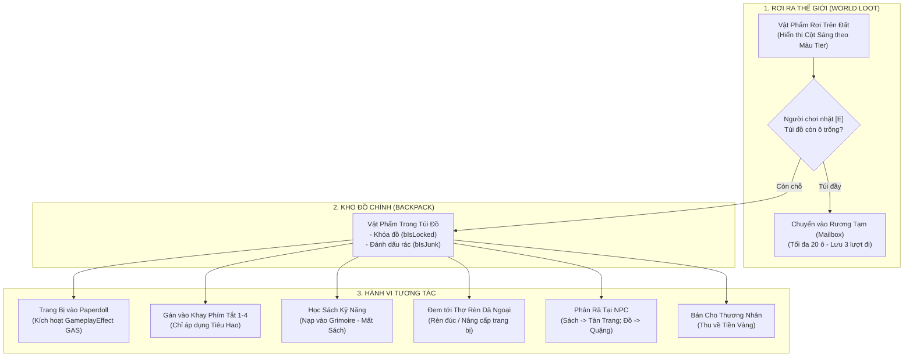

# Inventory & 5-Tier Item Database

> **Status**: Approved  
> **Author**: Systems Designer & Lead Programmer  
> **Last Updated**: 2026-09-15  
> **Implements Pillar**: Meaningful Progression & Deep Customization  
> **Target Engine**: Unreal Engine 5 (PrimaryDataAsset & UInventoryComponent)

---

## Overview

Hệ thống Kho Đồ & Cơ Sở Dữ Liệu Vật Phẩm 5 Bậc (Inventory & 5-Tier Item Database) quản lý toàn bộ vòng lặp lưu trữ, nhặt đồ (loot), trang bị, rèn đúc và sử dụng vật phẩm trong Project Ascendant. Hệ thống cung cấp cơ sở dữ liệu đồng nhất theo chuẩn `PrimaryDataAsset` của Unreal Engine 5 cho:
1. **Kho Đồ Dạng Ô (Slot-Based Grid):** Khởi đầu 30 ô, mở rộng tối đa 60 ô qua nâng cấp túi/thắt lưng tại Thợ rèn.
2. **Khung Trang Bị Nhân Vật (Paperdoll):** 6 vị trí trang bị cốt lõi trực tiếp kích hoạt các `GameplayEffect` trong Gameplay Ability System (GAS).
3. **Khay Phím Tắt Tiêu Hao (Quickbar 1–4):** Cho phép kích hoạt nhanh bình dược phẩm trong lúc giao chiến.
4. **Cơ Sở Dữ Liệu 5 Bậc Hiếm (5-Tier Rarity):** Định nghĩa thuộc tính, màu sắc hiển thị và giá trị kinh tế.
5. **Vật Phẩm Đặc Thù:** Tích hợp Sách Kỹ Năng (`item_skill_book`) với cơ chế Class-Lock và Bộ Phận Rơi Từ Boss (Part Breaking Drops).

---

## Player Fantasy

*"Đứng giữa tàn tích hoang tàn sau trận tử chiến căng thẳng với Lãnh Chúa Thiết Giáp, tiếng kim loại leng keng và ánh sáng hào quang tím rực rỡ từ chiếc rương báu thu hút ánh nhìn của bạn. Mở rương, bạn thu về một mảnh Sừng Cổ Đại nguyên vẹn và một thanh Trảm Kiếm Bậc 3 tỏa khói lam huyền bí.*

*Mở kho đồ với giao diện gọn gàng, bạn khóa ngay thanh kiếm quý để chống bán nhầm, gắn bình Thể Lực Dược vào phím [1], rồi sắp xếp lại hành trang ngăn nắp chỉ với một cú nhấp chuột. Cảm giác tích lũy từng chiến lợi phẩm giá trị để rèn nên bộ trang bị vô địch đem lại động lực mãnh liệt cho mỗi chuyến thám hiểm."*

---

## 1. Hệ Thống Phân Cấp Vật Phẩm 5 Bậc (5-Tier Rarity)

Mọi trang bị và vật phẩm quý trong game được chuẩn hóa theo 5 cấp độ màu sắc:

| Bậc (Tier) | Tên Bậc | Màu Sắc Nhận Diện | Đặc Tính & Chỉ Số | Hệ Số Định Giá (TierMultiplier) |
| :---: | :--- | :--- | :--- | :---: |
| **Tier 1** | **Normal (Thường)** | Trắng / Xám (`#D1D5DB`) | Chỉ số cơ bản sạch, không có dòng bổ trợ, dễ rèn và mua ở Thương nhân. | $1.0\times$ |
| **Tier 2** | **Rare (Hiếm)** | Xanh Lam (`#3B82F6`) | 1–2 dòng thuộc tính ngẫu nhiên (Affixes), tăng nhẹ chỉ số tốc độ/thể lực. | $2.5\times$ |
| **Tier 3** | **Legendary (Huyền Thoại)** | Tím / Cam (`#F59E0B`) | 3 dòng ngẫu nhiên + 1 dòng hiệu ứng kỹ năng đặc thù (Combat Perk). | $6.0\times$ |
| **Tier 4** | **Immortal (Bất Tử)** | Đỏ Thẫm (`#EF4444`) | Kỹ năng kích hoạt độc quyền của bộ trang bị, rơi từ Lãnh Chúa cấp cao. | $15.0\times$ |
| **Tier 5** | **Divine (Thần Thánh)** | Hoàng Kim (`#EAB308`) | Cải biến cơ chế chiêu thức của Class, rèn từ Linh hồn Lãnh chúa cổ đại tại Thợ rèn cấm địa. | $40.0\times$ |

---

## 2. Phân Loại Vật Phẩm (Item Categories)

Kho đồ phân chia thành 4 ngăn danh mục chính:
1. **Trang Bị (Equipment):** Vũ khí chính, Vũ khí phụ/Khiên, Áo giáp thân, Nhẫn $\times 2$, Dây chuyền.
2. **Tiêu Hao (Consumables):** Bình máu/mana tức thời, Dược liệu của Dược sư, Dầu tẩm vũ khí.
3. **Nguyên Liệu (Materials):** Quặng rèn, Da thú, Mảnh vỡ bộ phận Boss (Sừng/Đuôi/Giáp/Cánh), Tàn Trang Kỹ Năng (`item_skill_shard`).
4. **Sách Bí Kíp (Skill Books):** Chủng loại vật phẩm học kỹ năng đặc thù có điều kiện khóa Class/Vũ khí.

---

## 3. Quy Cách Kho Đồ & Khung Trang Bị (Inventory & Paperdoll Architecture)

### 3.1 Sức Chứa Túi Đồ (Backpack Grid)
- **Sức chứa mặc định:** 30 ô (`base_inventory_slots = 30`), lưới hiển thị $6 \times 5$.
- **Mở rộng tối đa:** 60 ô (`max_inventory_slots = 60`), nâng cấp thông qua 3 bậc Túi Đeo / Thắt Lưng tại Thợ rèn (+10 ô mỗi bậc nâng cấp).
- **Quy tắc xếp chồng (Stacking Rules):**
  - Trang bị (Equipment) & Sách Kỹ Năng (Skill Books): Không xếp chồng (`MaxStack = 1`).
  - Vật phẩm tiêu hao (Consumables): Xếp chồng tối đa 20 cái/ô (`max_consumable_stack = 20`).
  - Nguyên liệu rèn & Tàn trang kỹ năng: Xếp chồng tối đa 999 cái/ô (`max_material_stack = 999`).

### 3.2 Khung Trang Bị Nhân Vật (Paperdoll Slots)
Gồm 6 vị trí trang bị cố định, liên kết trực tiếp với `UAscendantAttributeSet`:
1. **Vũ Khí Chính (Mainhand Weapon):** Xác định loại đòn đánh cơ bản, sát thương gốc và loại kỹ năng vũ khí khả dụng.
2. **Vũ Khí Phụ / Khiên (Offhand / Shield):** Cho phép Block/Parry giảm sát thương Posture hoặc kích hoạt đòn đánh song vũ khí.
3. **Áo Giáp Thân (Body Armor):** Cung cấp Giáp (Physical Defense), Kháng nguyên tố và tăng tỷ lệ phục hồi Posture.
4. **Dây Chuyền (Amulet):** Tăng trữ lượng Mana hoặc giảm chi phí Stamina của đòn lướt.
5. **Nhẫn 1 (Ring Slot 1):** Tăng chỉ số bạo kích hoặc sát thương Posture gây ra.
6. **Nhẫn 2 (Ring Slot 2):** Kháng hiệu ứng bất lợi hoặc gia tăng thời gian I-frame (tối đa +0.02s).

*Quy tắc kỹ thuật GAS:* Khi gắn trang bị vào Slot, hệ thống cấp `FActiveGameplayEffectHandle` tương ứng. Khi tháo trang bị, hiệu ứng lập tức bị thu hồi (`RemoveActiveGameplayEffect`).

### 3.2.1 Trực Quan Hóa Đồ Họa Đa Tầng (Modular Paperdoll Visualizer)
- **Ngoại hình Tân thủ Mặc định (Starter Linen Cloth):** Khi mới tạo nhân vật hoặc khi chưa trang bị áo giáp thân, nhân vật luôn hiển thị trang phục vải thô sơ khai (`Visual_StarterCloth`).
- **Xếp Chồng Lớp Đồ Họa (Sprite Layering in Paper2D/PaperZD):**
  - **Lớp Thân Cơ Bản (`EPAPaperdollLayer::BaseBody`):** Quần áo vải thô tân thủ.
  - **Lớp Áo Giáp Thân (`EPAPaperdollLayer::ChestArmor`):** Áo giáp sắt thép (`Visual_IronArmor`), Áo da thợ săn (`Visual_LeatherRanger`), Pháp bào ma thuật (`Visual_ArcanistRobe`). Khi trang bị, lớp giáp sẽ che phủ bộ đồ vải; khi tháo giáp, nhân vật lập tức trở lại trang phục đồ vải ban đầu.
  - **Lớp Mũ Nón (`EPAPaperdollLayer::Helmet`):** Mũ giáp, mũ trùm.
  - **Lớp Vũ Khí Chính (`EPAPaperdollLayer::MainhandWeapon`):** Đại kiếm, Cung tên, Trượng phép.
  - **Lớp Vũ Khí Phụ / Khiên (`EPAPaperdollLayer::OffhandShield`):** Khiên sắt, Dao găm, Sách phép.
- **Đồng Bộ Khung Hình Hoạt Ảnh (Frame Lockstep Synchronization):**
  - Các lớp Flipbook đồ họa trang bị được gắn trực tiếp vào `APABaseCharacter` và điều khiển qua `UPAPaperdollComponent`.
  - Trong mỗi chu kỳ Tick, khung hình hiển thị (`PlaybackPositionInFrames`) của các lớp trang phục được khóa cứng và đồng bộ chính xác với khung hình của `BaseSprite` (PaperZD Animation Component), loại bỏ hiện tượng trôi lệch frame giữa nhân vật và vũ khí/áo giáp khi di chuyển 8 hướng hoặc vung đòn.
- **Tương Tác Click-to-Equip Trực Quan:** Khi người chơi nhấp chọn hoặc kéo trang bị từ túi đồ vào ô Paperdoll tương ứng, hệ thống phát thanh sự kiện `OnPaperdollVisualChanged`, vừa cập nhật thuộc tính GAS vừa lập tức tráo đổi sprite hiển thị trên mô hình nhân vật theo thời gian thực.

### 3.3 Khay Phím Tắt Nhanh (Quickbar Slots 1–4)
- 4 ô trang bị nhanh tương ứng với các phím bấm nóng `[1]`, `[2]`, `[3]`, `[4]`.
- Chỉ chấp nhận các vật phẩm thuộc nhóm **Tiêu Hao (Consumables)**.
- **Cơ chế thi triển an toàn:** Khi bấm phím dùng bình dược phẩm, nhân vật trải qua thời gian hiệu ứng 0.8s (`potion_use_duration`), tốc độ di chuyển giảm 30% trong lúc uống, không thể bị hủy bởi đòn đánh thường nhưng nếu bị Boss hất ngã/choáng sẽ làm gián đoạn việc hồi phục.

### 3.4 Tính Năng Tiện Ích Chất Lượng Trải Nghiệm (QoL Features)
- **Tự Động Sắp Xếp (Auto-Sort):** Nút bấm hoặc phím tắt `[R]` trong UI sắp xếp lại toàn bộ túi theo thứ tự: Tier giảm dần (Divine $\rightarrow$ Normal) $\rightarrow$ Danh mục (Vũ khí $\rightarrow$ Giáp $\rightarrow$ Tiêu hao $\rightarrow$ Nguyên liệu).
- **Khóa Trang Bị (Item Lock - `bIsLocked`):** Nhấn phím `[L]` khi rê chuột lên trang bị để bật/tắt khóa. Vật phẩm bị khóa sẽ KHÔNG THỂ bị bán cho thương nhân, phân rã ở thợ rèn, hoặc vứt bỏ ra đất.
- **Đánh Dấu Phế Phẩm (Mark Junk - `bIsJunk`):** Nhấn phím `[J]` để đánh dấu rác. Khi mở cửa hàng Thương nhân, nút "Bán Tất Cả Rác" xuất hiện cho phép thanh lý toàn bộ chỉ trong 1 thao tác.

---

## 4. Danh Mục Đặc Thù: Sách Kỹ Năng (Skill Book Category)

*Đồng bộ tuyệt đối từ [`design/gdd/skill-progression-system.md`](file:///mnt/Data/Projects/project-games/design/gdd/skill-progression-system.md).*

### Thuộc Tính DataAsset Của Sách Kỹ Năng (`USkillBookItemDefinition`):
- `ItemID`: Mã định danh vật phẩm duy nhất.
- `ItemCategory`: `Consumable_Learnable`.
- `GrantedAbilityClass`: Lớp kỹ năng GAS `UGameplayAbility` sẽ mở khóa.
- `ClassLock`: **`true`** — Bắt buộc kiểm tra `RequiredClassTag`.
  - *Sách Độc Quyền:* Yêu cầu đúng Class (ví dụ `Class.VoidBlade`).
  - *Sách Võ Học Chung:* Yêu cầu loại vũ khí tương thích (`Weapon.Blade`, `Weapon.Bow`, v.v.).
- `Stackable`: **`false`** (Mỗi cuốn sách chiếm 1 ô túi đồ).
- `Salvageable`: **`true`** (Có thể đem tới NPC để rã thành `item_skill_shard`).

### Bảng Ánh Xạ Độ Hiếm Của Sách Kỹ Năng Trong Kho Đồ:

| Bậc Sách | Tương Ứng Class | Hành Vi Kho Đồ | Kết Quả Phân Rã (Salvage) |
| :--- | :--- | :--- | :--- |
| **Normal Book** | 4 Class Cơ Bản & Sách Vũ khí Chung | Nhấp chuột phải để học (nếu đúng Class) | 1 Tàn Trang Kỹ Năng (`item_skill_shard`) |
| **Rare Book** | 4 Class Hiếm | Nhấp chuột phải để học (nếu đúng Class) | 3 Tàn Trang Kỹ Năng |
| **Epic Book** | 3 Class Cao Cấp | Nhấp chuột phải để học (nếu đúng Class) | 8 Tàn Trang Kỹ Năng |
| **Mythic Book** | 1 Class Ẩn (God Slayer) | Nhấp chuột phải để học (nếu đúng Class) | 25 Tàn Trang Kỹ Năng |

### Tương Tác Giữa Kho Đồ & Hệ Thống Kỹ Năng:
1. **Kiểm Tra Điều Kiện:** Nhấp chuột phải vào Sách Kỹ Năng $\rightarrow$ Nếu nhân vật mang thẻ `State.InCombat`, thông báo *"Không thể đọc bí kíp trong lúc giao chiến"*. Nếu không khớp `RequiredClassTag`, thông báo *"Chức nghiệp không phù hợp"*.
2. **Tiêu Hao & Nạp Grimoire:** Khi hợp lệ, số lượng sách trừ 1, nạp `GrantedAbilityClass` vào Thư viện Grimoire vĩnh viễn.

---

## 5. Danh Mục Đặc Thù: Bộ Phận Rơi Từ Boss (Part Breaking Loot)

*Đồng bộ trực tiếp từ [`design/gdd/stagger-system.md`](file:///mnt/Data/Projects/project-games/design/gdd/stagger-system.md).*

Khi người chơi phá vỡ bộ phận Boss trong trận chiến, các vật phẩm nguyên liệu đặc biệt sẽ rớt trực tiếp ra đất:
- **Sừng Lãnh Chúa (Warlord's Horn):** Rơi khi bẻ gãy Sừng. Nguyên liệu rèn vũ khí Bậc 3 có dòng xuyên giáp Posture.
- **Vảy Đuôi Thiết Giáp (Armored Tail Plating):** Rơi khi chặt đứt Đuôi. Nguyên liệu rèn Khiên và Giáp Bậc 3.
- **Mảnh Giáp Ngực Nứt Vỡ (Cracked Coreplate):** Rơi khi đập vỡ Giáp Ngực. Dùng để nâng cấp chỉ số phòng thủ tối thượng.
- **Cánh Tật Phong (Gale Wing Membrane):** Rơi khi xé Cánh. Dùng chế tạo Dược Phẩm Tốc Độ hoặc Giày lướt né.

*Đặc tính kho đồ:* Thuộc nhóm `Materials`, xếp chồng tối đa 999, không thể bị phân rã nhầm nếu chưa xác nhận popup cảnh báo nguyên liệu hiếm.

---

## 6. Sơ Đồ Trạng Thái & Vòng Đời Vật Phẩm (State & Transitions)

---

## 7. Công Thức Định Giá & Cân Bằng Kinh Tế (Formulas & Economy)

### 7.1 Công Thức Định Giá Mua Bán Trang Bị

$$\text{BasePrice}(\text{Tier}) = 50 \times \text{TierMultiplier}$$

$$\text{SellValue} = \text{BasePrice} \times \text{VendorSellPenalty} \times \text{DurabilityPct}$$

*Trong đó:*
- `TierMultiplier`: $1.0$ (Normal), $2.5$ (Rare), $6.0$ (Legendary), $15.0$ (Immortal), $40.0$ (Divine).
- `VendorSellPenalty` = $0.30$ (Người chơi bán cho NPC chỉ thu lại 30% giá trị gốc).
- `DurabilityPct`: Tỷ lệ độ bền còn lại ($0.0 \rightarrow 1.0$). Trang bị hỏng hoàn toàn chỉ bán được 10% giá trị.

### 7.2 Chi Phí Mở Rộng Túi Đồ Tại Thợ Rèn

| Cấp Nâng Cấp | Sức Chứa Mới | Nguyên Liệu Yêu Cầu | Chi Phí Vàng |
| :---: | :---: | :--- | :---: |
| **Bậc 1 (+10 Ô)** | 40 Ô | 10 $\times$ Da Thú Rừng Sâu + 5 $\times$ Quặng Đồng | 500 Vàng |
| **Bậc 2 (+10 Ô)** | 50 Ô | 15 $\times$ Da Cường Lực + 5 $\times$ Quặng Sắt Đen | 2,000 Vàng |
| **Bậc 3 (+10 Ô)** | 60 Ô (Tối đa) | 5 $\times$ Vảy Đuôi Thiết Giáp Boss + 2 $\times$ Quặng Hư Không | 8,000 Vàng |

---

## 8. Edge Cases & Xử Lý Ngoại Lệ

1. **Túi Đầy Khi Diệt Boss Rơi Nhiều Đồ:**  
   Nếu túi đồ không còn ô trống khi đồ Boss rơi ra đất, đồ sẽ tồn tại trên sàn đấu vô thời hạn cho đến khi người chơi rời khỏi map. Khi chuyển vùng hoặc chết, toàn bộ vật phẩm từ bậc Rare trở lên chưa nhặt sẽ tự động được gửi về **Rương Tạm Thất Lạc (Overflow Stash / Mailbox)** tại Lửa trại (sức chứa tối đa 20 ô, lưu trữ trong vòng 3 lần thám hiểm kế tiếp).
2. **Tháo Trang Bị Khi Túi Đồ Đã Đầy:**  
   Nếu người chơi cố tình tháo một món đồ trên Paperdoll xuống túi khi túi đang $30/30$ ô, hệ thống chặn thao tác, phát âm thanh cảnh báo lỗi và hiển thị thông báo *"Túi đồ đã đầy, không thể tháo trang bị!"*.
3. **Hoán Đổi Vũ Khí Trong Khi Đang Giao Chiến (Combat Weapon Swap):**  
   Người chơi được phép đổi giữa 2 bộ vũ khí đã gán sẵn trong trận chiến nhưng sẽ phải chịu độ trễ 0.5s Animation Lock (không thể lướt né trong 0.5s này). Tuyệt đối **KHÔNG ĐƯỢC PHÉP** tháo/lắp Giáp, Nhẫn, Dây chuyền khi nhân vật đang mang thẻ `State.InCombat`.
4. **Bấm Dùng Bình Máu Khi Đang Bị Choáng (Stun) Hoặc Đang Dash I-frame:**  
   Lệnh dùng bị từ chối; bình thuốc trong Quickbar không bị mất và không kích hoạt thời gian hồi chiêu.

---

## 9. Dependencies & Registry Sync

- **Upstream Systems:**
  - [`design/gdd/attributes-system.md`](file:///mnt/Data/Projects/project-games/design/gdd/attributes-system.md) (Áp dụng các chỉ số trang bị qua GAS AttributeSet).
  - [`design/gdd/stagger-system.md`](file:///mnt/Data/Projects/project-games/design/gdd/stagger-system.md) (Cung cấp bảng loot bộ phận rớt từ Boss).
  - [`design/gdd/skill-progression-system.md`](file:///mnt/Data/Projects/project-games/design/gdd/skill-progression-system.md) (Đồng bộ định nghĩa và cơ chế Class-Lock của Sách Kỹ Năng).
- **Downstream Systems:**
  - [`design/gdd/foundational-classes.md`](file:///mnt/Data/Projects/project-games/design/gdd/foundational-classes.md) (Quy định loại vũ khí và trang bị khởi đầu của 4 Class cơ bản).
  - `design/gdd/blacksmithing-system.md` (Sử dụng danh mục nguyên liệu để rèn và cường hóa trang bị).
  - `design/gdd/merchant-economy.md` (Sử dụng công thức định giá mua bán và tính năng Bán Rác).

---

## 10. Tuning Knobs

| Tên Biến Số | Giá Trị Mặc Định | Biên Độ Khuyến Nghị | Đơn Vị | Mục Đích Cân Bằng |
| :--- | :---: | :---: | :---: | :--- |
| `base_inventory_slots` | 30 | 20 – 40 | Ô (Slots) | Sức chứa ô đồ khởi đầu của người chơi. |
| `max_inventory_slots` | 60 | 50 – 80 | Ô (Slots) | Sức chứa ô đồ tối đa sau khi nâng cấp hết mức. |
| `max_quickbar_slots` | 4 | 3 – 5 | Ô (Slots) | Số lượng ô phím nóng vật phẩm tiêu hao. |
| `max_consumable_stack` | 20 | 10 – 50 | Cái/Ô | Giới hạn xếp chồng dược liệu tiêu hao. |
| `max_material_stack` | 999 | 99 – 9999 | Cái/Ô | Giới hạn xếp chồng nguyên liệu rèn đúc. |
| `overflow_stash_limit` | 20 | 10 – 30 | Ô (Slots) | Sức chứa tối đa của Rương Tạm Thất Lạc. |
| `potion_use_duration` | 0.8 | 0.5 – 1.2 | Giây | Thời gian uống bình thuốc (chạy chậm 30%). |
| `vendor_sell_penalty` | 0.30 | 0.20 – 0.50 | Tỷ lệ | Tỷ lệ vàng thu hồi khi bán đồ cho NPC (30%). |

---

## 11. Visual / Audio & UI Requirements

### Visual & VFX
- **Cột Sáng Rơi Đồ (Loot Beam Niagara VFX):** Khi vật phẩm rơi trên sàn, cột sáng bốc lên thẳng đứng mang màu sắc chuẩn xác của Bậc (Trắng, Xanh Lam, Tím/Cam, Đỏ Thẫm, Hoàng Kim).
- **Viền Hào Quang Trang Bị (Item Icon Border):** Trong giao diện ô đồ, viền ô phát sáng nhẹ theo màu Bậc. Bậc Immortal và Divine có hiệu ứng hạt phát sáng chạy quanh viền.

### Audio & SFX
- **Âm Nhặt Đồ (Loot Pickup):** Âm thanh va chạm kim loại thanh mảnh (*Crisp Metallic Clink*), âm trầm bổng hơn khi nhặt đồ Tier cao.
- **Âm Trang Bị (Equip SFX):** Tiếng khóa lẫy giáp nặng nề (*Heavy Leather / Plate Clasp*).
- **Âm Dùng Bình Thuốc:** Tiếng mở nắp chai và nuốt nước ừng ực (*Cork pop & Gulp*).

### UI Requirements (CommonUI)
- **Bố Cục Cửa Sổ Kho Đồ (Phím tắt `[I]` hoặc `[Tab]`):**
  - Cửa sổ bên trái: Mô hình 3D nhân vật xoay tròn kèm 6 ô Paperdoll trang bị xung quanh.
  - Cửa sổ bên phải: Lưới 30 ô chứa đồ chính, có thanh chuyển Tab danh mục (Tất Cả / Trang Bị / Tiêu Hao / Nguyên Liệu / Sách).
  - Phía dưới: Nút Tự Động Sắp Xếp `[R]`, Bán Tất Cả Rác `[J]`, số dư Vàng hiện có.
- **Bảng So Sánh Chỉ Số (Tooltip Comparison):** Khi rê chuột vào một trang bị trong túi, hiển thị song song bảng so sánh chỉ số với món đồ đang mặc trên người (dòng xanh lá nếu tăng, đỏ nếu giảm).

---

## 12. Acceptance Criteria

- [ ] **AC-1 (Backpack Capacity & Expansion):** Người chơi khởi đầu với đúng 30 ô chứa đồ; sau khi nâng cấp tại thợ rèn với đủ nguyên liệu/vàng, sức chứa tăng chính xác +10 ô mỗi lần, đạt trần ở 60 ô.
- [ ] **AC-2 (Paperdoll GAS Binding):** Khi kéo trang bị vào bất kỳ ô nào trong 6 ô Paperdoll, các `GameplayEffect` cộng chỉ số lập tức được áp dụng vào `UAscendantAttributeSet`; khi tháo ra, chỉ số hoàn về giá trị cũ ngay lập tức.
- [ ] **AC-3 (Quickbar Functional):** Nhấn các phím `[1]`, `[2]`, `[3]`, `[4]` kích hoạt đúng bình dược phẩm gán trong ô tương ứng, áp dụng hiệu ứng uống thuốc 0.8s và giảm 1 số lượng trong ngăn xếp.
- [ ] **AC-4 (QoL Safety Checks):** Vật phẩm được gắn cờ `bIsLocked = true` không thể bị kéo thả vào ô bán của Thương nhân hoặc nút phân rã của Thợ rèn; bấm nút Bán Rác chỉ thanh lý các vật phẩm có cờ `bIsJunk = true`.
- [ ] **AC-5 (Skill Book Class-Lock Integration):** Nhấp chuột phải vào Sách Kỹ Năng trong túi đồ kiểm tra đúng điều kiện `RequiredClassTag` và `!State.InCombat`, sau đó tiêu hao 1 sách và nạp chiêu thức vào Thư viện Grimoire.
- [ ] **AC-6 (Overflow Stash Safety Net):** Khi diệt Boss với túi đồ đầy $30/30$, các vật phẩm bậc Rare trở lên bị bỏ lại trên sàn sẽ xuất hiện đầy đủ trong Rương Tạm tại Lửa trại khi chuyển cảnh.
