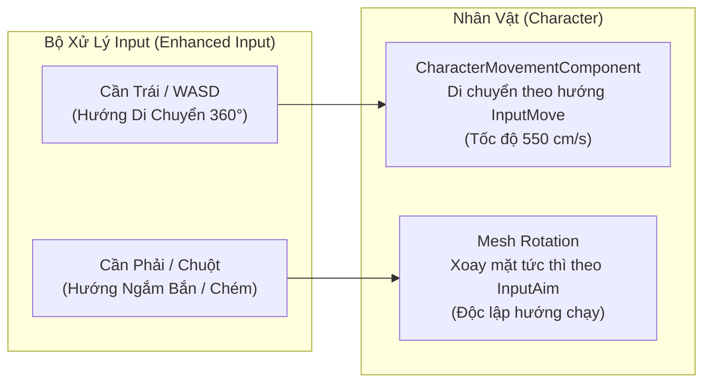

# Input & Isometric Camera Controller

> **Status**: Approved  
> **Author**: Systems Designer & Gameplay Programmer  
> **Last Updated**: 2026-09-15  
> **Implements Pillar**: True Skill Expression & Responsive Combat  
> **Target Engine**: Unreal Engine 5 (Enhanced Input & SpringArm/Camera)

---

## Overview

Hệ thống Điều Khiển & Camera Isometric 2.5D (Input & Isometric Camera Controller) là cầu nối tương tác vật lý trực tiếp giữa người chơi và nhân vật trong Project Ascendant. Được xây dựng trên nền tảng **Unreal Engine Enhanced Input System** và cấu trúc **SpringArm/Camera Component**, hệ thống xử lý chuyển động 8 hướng mượt mà, cơ chế xoay hướng nhân vật tức thì theo trỏ chuột hoặc cần analog phải, và thiết lập góc nhìn Isometric chuẩn mực (Pitch: -45°, Yaw: 45°). 

Hệ thống giải quyết bài toán cốt lõi: đảm bảo độ trễ phản hồi bằng 0 (Zero-latency responsiveness), tách biệt độc lập giữa hướng di chuyển và hướng ngắm đòn, đồng thời vận hành cơ chế camera đón đầu thông minh (Look-ahead Offset) giúp người chơi bao quát đấu trường và quan sát trước các đòn đánh nguy hiểm của Boss. Hệ thống hỗ trợ hoàn hảo cả Chuột/Bàn phím lẫn Tay cầm chơi game.

---

## Player Fantasy

*"Bạn lướt đi trên chiến trường tựa như một vũ công. Tay trái điều khiển bước chạy luồn lách qua làn mưa đạn, tay phải rê chuột vung kiếm chuẩn xác từng mili-mét vào tử huyệt đối thủ. Camera lướt theo nhịp nhàng, mở rộng tầm nhìn về hướng hiểm họa, mang lại cảm giác làm chủ không gian và phản xạ tuyệt đối trước mọi đòn đánh bất ngờ của Boss."*

Người chơi cảm nhận sự chính xác tuyệt đối trong từng thao tác điều khiển: nhân vật đổi hướng ngay lập tức không có trớn trượt lố khó chịu, và camera tạo cảm giác mở rộng tầm nhìn trực quan như đang theo dõi một bàn cờ chiến thuật đỉnh cao.

---

## Detailed Design

### Core Rules

#### 1. Cấu Hình Camera & Cơ Chế Đón Đầu (Camera Specs & Dynamic Look-Ahead)

Camera được điều khiển qua `USpringArmComponent` và `UCameraComponent` gắn trên Character:
- **`TargetArmLength`:** **1200 cm** (Bao quát trọn vẹn đấu trường trong bán kính quan sát ~24 mét).
- **`CameraRotation`:** **Pitch = -45.0°**, **Yaw = 45.0°**, **Roll = 0.0°** (Góc nhìn nghiêng xiên chuẩn mực như *Hades*).
- **`CameraLag`:** Kích hoạt với `CameraLagSpeed = 12.0` (Mượt mà, không giật hình khi người chơi lướt né tốc độ cao).
- **`bDoCollisionTest = false`:** Tắt tính năng co lò xo camera khi va tường để tránh camera bị zoom sát mặt nhân vật gây mất phương hướng. Thay vào đó, toàn bộ tường/cột che khuất đường nhìn (Line of Sight) sẽ tự động kích hoạt **Material Dithered Opacity Mask** (Làm mờ bán trong suốt vật cản).
- **Cơ chế Đón Đầu Thông Minh (Dynamic Look-Ahead Offset):**
  - Camera tự động trôi nhẹ tối đa **250 cm** theo hướng ngắm của con trỏ chuột hoặc cần analog phải (`MaxLookAheadDistance = 250.0`).
  - Khi người chơi buông cần ngắm hoặc giữ chuột gần nhân vật: Camera mượt mà hồi về vị trí tâm nhân vật với tốc độ `ReturnSpeed = 8.0`.

#### 2. Xử Lý Điều Khiển Chuyển Động (Camera-Relative Movement)

- **Chiếu Hướng Di Chuyển Theo Màn Hình (Screen-Relative Mapping):**
  - Do góc camera xoay Yaw = 45°, vector di chuyển nhận từ phím WASD được tự động xoay bù 45° theo ma trận xoay góc nhìn camera:
    - Bấm **[W]**: Chạy thẳng lên phía trên màn hình.
    - Bấm **[S]**: Chạy lùi xuống dưới màn hình.
    - Bấm **[A]**: Chạy sang bên trái màn hình.
    - Bấm **[D]**: Chạy sang bên phải màn hình.
- **Chuẩn Hóa Vận Tốc Chạy Chéo (Diagonal Vector Normalization):**
  - Khi người chơi bấm đồng thời [W] + [D] (chạy chéo), vector đầu vào được chuẩn hóa (Clamp/Normalize về độ dài = 1.0). Tốc độ chạy chéo được khóa cố định ở mức **550 cm/s** (đọc từ Attributes System), loại bỏ 100% hiện tượng chạy chéo nhanh hơn chạy thẳng ($\sqrt{2} \times$).

#### 3. Cơ Chế Xoay Hướng & Nhắm Đòn Độc Lập (Decoupled Aiming)

- **Chuột / Bàn Phím (KBM):** Nhân vật luôn xoay mặt về vị trí con trỏ chuột trên mặt đất (thông qua hàm `DeprojectScreenToWorld`). Người chơi có thể vừa lùi về phía sau vừa vung kiếm/bắn tên về phía trước mặt.
- **Tay Cầm (Gamepad Twin-Stick):** Cần Trái điều khiển hướng chạy 360°, Cần Phải điều khiển hướng ngắm với ngưỡng Deadzone = 0.2. Khi buông cần phải, nhân vật giữ nguyên hướng ngắm cũ hoặc tự động xoay theo hướng chạy.

### States and Transitions

Trạng thái vận động của nhân vật được quản lý qua bộ cờ di chuyển:

| Trạng Thái (Movement State) | Tốc Độ Di Chuyển | Quy Tắc Xoay Hướng Nhân Vật | Quyền Hạn Input |
| :--- | :---: | :--- | :--- |
| **`Idle`** | 0 cm/s | Xoay theo con trỏ chuột / cần phải | Nhận đầy đủ mọi lệnh |
| **`Moving`** | 550 cm/s | Xoay theo hướng ngắm (độc lập hướng chạy) | Nhận đầy đủ mọi lệnh |
| **`Dashing`** | 1200 cm/s (0.45s) | Khóa cố định theo góc lướt né | Khóa di chuyển thường, cho phép gối lệnh chiêu (Buffer) |
| **`LockedInAnimation`** | 0 – 150 cm/s | Cho phép chỉnh hướng ngắm trước khi vung đòn | Khóa di chuyển cho đến khi hết cửa sổ hoạt ảnh |
| **`Exhausted`** | 412.5 cm/s (-25%) | Xoay theo hướng ngắm bình thường | Khóa phím Dash (Lướt) trong 1.5s |

### Interactions with Other Systems

- **Attributes System (`attributes-system.md`):** Đọc trực tiếp thuộc tính `MoveSpeed` (550 cm/s) và thẻ trạng thái `State.Exhausted`.
- **Combat System (`combat-system.md`):** Cung cấp Vector ngắm đòn (Aim Vector) để xác định hướng phóng chiêu thức và vùng phát sinh Hitbox.
- **Dash & Evasion (`dash-evasion.md`):** Nhận hướng Input Move tại thời điểm bấm phím để định vị hướng lướt; nếu người chơi đang đứng yên sẽ lướt theo hướng con trỏ chuột.

---

## Formulas

### 1. Công Thức Chuyển Đổi Hướng Di Chuyển Theo Camera (Camera-Relative Movement)

$$\vec{V}_{world} = \mathbf{R}_{yaw}(45^\circ) \times \begin{bmatrix} \text{Input}_Y \\ \text{Input}_X \\ 0 \end{bmatrix}$$

- **Ý nghĩa:** Tự động biến đổi phím bấm thẳng đứng [W] thành vector chéo trong không gian 3D, giúp nhân vật chạy thẳng lên trên theo đúng góc nhìn màn hình của người chơi.

### 2. Công Thức Trôi Đón Đầu Của Camera (Look-Ahead Interpolation)

$$\vec{TargetOffset} = \vec{AimDirection} \times \min\left(\text{Distance}(\text{Player}, \text{Cursor}) \times 0.35, \, 250\text{ cm}\right)$$

$$\vec{CurrentOffset} = \text{FInterpTo}(\vec{CurrentOffset}, \vec{TargetOffset}, \Delta t, 8.0)$$

- **Ý nghĩa:** Rê chuột ra càng xa thì camera mở rộng tầm nhìn về phía trước tối đa 250cm với độ mượt mà cao, giúp nhận diện sớm các vùng báo chiêu của Boss.

### 3. Công Thức Vận Tốc Chuẩn Hóa (Velocity Normalization)

$$\vec{Velocity} = \text{Normalize}(\vec{V}_{world}) \times \text{MoveSpeed} \times (1 - \text{ExhaustedPenalty})$$

- Khi Kiệt Sức (`State.Exhausted`): $\text{Penalty} = 0.25 \rightarrow \vec{Velocity} = 412.5\text{ cm/s}$.
- Khi chạy chéo (W+D): Chiều dài vector input $\sqrt{1^2 + 1^2} = 1.414$ được ép chuẩn hóa về $1.0$, giữ tốc độ chạy chéo bằng đúng $550\text{ cm/s}$.

---

## Edge Cases

- **Xuyên Thấu Vật Cản Che Tầm Nhìn (Camera Occlusion Fade):** Bắn tia Line-Trace từ Camera về nhân vật. Mọi tường, cột đá, mái nhà chắn ngang tầm nhìn sẽ tự động kích hoạt `Material Opacity Mask = 0.25` trong bán kính 200cm quanh đường ngắm, tạo một "lỗ hổng mờ" để người chơi không bao giờ bị mất dấu nhân vật hay vùng báo động đỏ của Boss.
- **Mất Kết Nối Tay Cầm Đột Ngột (Controller Disconnect):** Ngay khi tay cầm bị ngắt kết nối, vận tốc nhân vật lập tức đưa về 0 (ngăn chặn tình trạng nhân vật tự động chạy thẳng vào vùng chiêu của Boss), đồng thời hệ thống tự động chuyển quyền điều khiển sang Chuột/Bàn phím tức thì.
- **Bấm Ngược Hướng Cùng Lúc (W + S hoặc A + D):** Vector triệt tiêu về 0, nhân vật dừng lại tại chỗ và chuyển ngay sang trạng thái `Idle`.
- **Con Trỏ Chuột Chạy Ra Ngoài Màn Hình (Window Focus):** Trong chế độ cửa sổ/nhiều màn hình, chuột bị khóa trong khung hình game khi đang ở màn hình gameplay, ngăn ngừa bấm nhầm ra ngoài làm mất quyền kiểm soát lúc né đòn.

---

## Dependencies

- **Hệ thống phụ thuộc bên trên (Upstream Dependencies):** Không có (Hệ thống Nền tảng / Foundation System gốc).
- **Các hệ thống phụ thuộc vào tài liệu này (Downstream Dependents):**
  - `dash-evasion.md` (Nhận vector di chuyển để xác định hướng lướt né)
  - `combat-system.md` (Nhận vector ngắm để phóng đạn/chém kiếm)
  - `multiplayer-coop.md` (Đồng bộ hướng quay nhân vật qua mạng)

---

## Tuning Knobs

| Tên Biến Số | Giá Trị Mặc Định | Biên Độ Khuyến Nghị | Ý Nghĩa Cân Bằng |
| :--- | :---: | :---: | :--- |
| `TargetArmLength` | 1200.0 cm | 1000 – 1400 cm | Cự ly bao quát tầm nhìn của camera. |
| `MaxLookAheadDistance` | 250.0 cm | 150 – 350 cm | Khoảng cách camera trôi đón đầu theo hướng ngắm. |
| `LookAheadReturnSpeed` | 8.0 | 5.0 – 12.0 | Tốc độ camera hồi về tâm nhân vật. |
| `GamepadDeadzone` | 0.2 | 0.1 – 0.3 | Vùng chết của cần analog để chống trôi cần (stick drift). |
| `CameraLagSpeed` | 12.0 | 8.0 – 16.0 | Độ mượt của camera khi nhân vật lướt né nhanh. |
| `OcclusionFadeRadius` | 200.0 cm | 150 – 300 cm | Bán kính làm mờ vật cản che khuất tầm nhìn. |

---

## Visual/Audio Requirements

### Yêu Cầu Thị Giác (VFX)
- **Tâm Ngắm Tùy Biến (Dynamic Reticle):** Con trỏ chuột được thay bằng tâm ngắm công nghệ ma thuật có vòng tròn xoay nhẹ; tự động đổi màu Đỏ khi chỉ vào quái vật và màu Vàng khi chỉ vào NPC.
- **Vết Chân Địa Hình:** Khi di chuyển trên đất bùn, tuyết hoặc tro tàn, để lại dấu chân mờ dần sau 3 giây.

### Yêu Cầu Âm Thanh (SFX)
- **Âm Bước Chân Đa Địa Hình (Physical Surface Footsteps):** Âm thanh va chạm thay đổi theo vật lý bề mặt (Đá đanh thép, Cỏ xào xạc, Nước lõm bõm).

---

## UI Requirements

- **Cài Đặt Camera & Điều Khiển (Settings Menu):**
  - Tùy chọn bật/tắt cơ chế Camera Look-Ahead (dành cho người chơi thích camera khóa cứng tâm).
  - Thanh trượt độ nhạy cần ngắm Gamepad (Aim Sensitivity).
  - Tùy chọn hiển thị vòng hiển thị hướng ngắm dưới chân nhân vật (Directional Aim Arrow).

---

## Acceptance Criteria

- [ ] **AC-1 (Di chuyển 8 hướng chuẩn màn hình):** Bấm W, S, A, D di chuyển nhân vật chính xác theo 4 hướng vuông góc màn hình; chạy chéo W+D đạt đúng vận tốc 550 cm/s (không bị nhanh hơn $\sqrt{2}$).
- [ ] **AC-2 (Nhắm đòn độc lập):** Vừa lùi vừa chém hoặc vừa lướt vừa ngắm bắn theo hướng con trỏ chuột mượt mà không bị khựng hoặc lộn hướng.
- [ ] **AC-3 (Camera Look-ahead):** Camera tự động trôi tối đa 250cm về phía trước khi rê chuột xa và mượt mà quay về tâm khi buông cần/giữ chuột gần.
- [ ] **AC-4 (Làm mờ vật cản):** Đứng sau cột đá lớn hoặc tường cao, vật cản tự động mờ dần đảm bảo nhân vật và vòng báo chiêu đỏ của Boss luôn nhìn thấy được 100%.

---

## Open Questions

- **Q1:** Khi vào các đấu trường Boss lớn (Arena), camera có nên tự động nới lỏng `TargetArmLength` từ 1200 cm lên 1500 cm để người chơi bao quát toàn bộ Boss khổng lồ không? *(Đề xuất: Có, kích hoạt qua Camera Volume đặt trong phòng Boss).*
