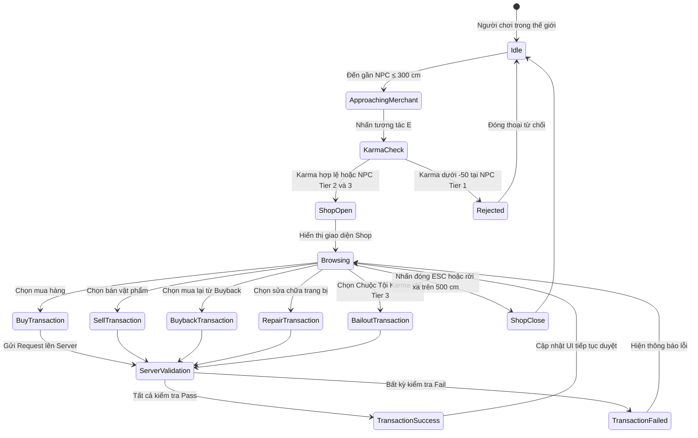

# Merchant & Currency Economy Loop

> **Status**: Approved  
> **Author**: Systems Designer & Economy Designer  
> **Last Updated**: 2026-09-15  
> **Implements Pillar**: Meaningful Progression & Zone-tiered Wilderness Economy  
> **Target Engine**: Unreal Engine 5.7 (Economy DataTables, Merchant Inventory DataAssets)

---

## Overview

Hệ thống Vòng Lặp Kinh Tế Tiền Tệ & Mạng Lưới Thương Nhân Dã Ngoại (Merchant & Currency Economy Loop) đóng vai trò là xương sống điều tiết tài nguyên, kiểm soát lạm phát và kiến tạo huyết mạch sinh tồn trong thế giới mở Project Ascendant. Hệ thống hiện thực hóa trực tiếp Trụ cột 3 ("Kinh tế dã ngoại & Thám hiểm rủi ro cao - phần thưởng lớn") và liên kết chặt chẽ với Hệ thống Túi Đồ ([`inventory-system.md`](file:///mnt/Data/Projects/project-games/design/gdd/inventory-system.md)), Hệ thống Bản Đồ Mở & Lửa Trại ([`zone-system.md`](file:///mnt/Data/Projects/project-games/design/gdd/zone-system.md)), cùng Hệ thống Thợ Rèn Dã Ngoại ([`blacksmithing-system.md`](file:///mnt/Data/Projects/project-games/design/gdd/blacksmithing-system.md)). Kinh tế trong trò chơi vận hành xoay quanh hai loại tiền tệ chính với cơ chế cung-cầu tách biệt rõ ràng: **Vàng (Gold)**—tiền tệ giao thương vĩ mô dùng để mua nhu yếu phẩm dã ngoại, chi trả phí sửa chữa trang bị hao mòn (`repair_cost_formula`), tháo khảm ngọc (`gem_unsocket_fee = 100 gold`), và chuộc lại tội danh Karma; cùng **Tàn Trang (Ash Shards)**—tiền tệ linh hồn quý hiếm thu thập từ quái Tinh anh và Thủ lĩnh, dùng cho các nâng cấp thợ rèn tối thượng và đột phá kỹ năng.

Người chơi tương tác với hệ thống qua hai kênh:
1. **Tương tác chủ động**: Tiếp cận các NPC Thương nhân phân bố theo 3 bậc nguy hiểm của thế giới để mua sắm vật tư, thanh lý chiến lợi phẩm thu gom từ dã ngoại với giá chiết khấu chuẩn (`vendor_sell_penalty = 0.30`), sử dụng danh mục mua lại đồ đã bán (Buyback Window), hoặc thực hiện các dịch vụ đặc thù phân vùng.
2. **Cơ chế thụ động & bồn chứa (Sinks & Faucets)**: Tiền tệ được bơm vào thế giới qua hoạt động tiêu diệt quái vật theo ngưỡng đóng góp Contested MMO (gây ≥5% sát thương theo ADR-0001) và mở rương kho báu; đồng thời liên tục bị tiêu hao qua các bồn chứa khắt khe—đặc biệt là cơ chế phạt chết khắc nghiệt (rơi 50% Vàng vào Vệt Tro Tàn khi tử trận PvE, hoặc mất 25% Vàng cho kẻ kết liễu trong PvP) và thuế phí sửa chữa trang bị định kỳ.

Hệ thống mạng lưới Thương nhân được phân bổ tương ứng với 3 Bậc Vùng Đất của thế giới mở:
- **Thương nhân Tiền Trạm (Outpost Provisioner - Tier 1)**: Thường trú tại vùng an toàn Sanctuary (Verdant Frontier), cung ứng nhu yếu phẩm cơ bản vô hạn (bình máu, bình mana, đuốc, cuốc chim), thu mua phế liệu dã ngoại, và **tuyệt đối từ chối giao dịch** với những kẻ mang danh hiệu Truy Nã (Wanted / Red Name, Karma < -50) nhằm thượng tôn luật pháp liên minh.
- **Thương nhân Lang Thang (Wandering Smuggler - Tier 2)**: Xuất hiện bên cạnh các Lửa Trại hoang dã (Ashen Wilderness), mang đến các bản đồ mật cảnh, nguyên liệu chế tác độc quyền như Đá Bảo Hộ Ép Đồ (`item_blacksmith_ward`), với số lượng hàng tồn có hạn (Limited Stock) được làm mới theo chu kỳ thời gian thực (Restock Timer).
- **Chợ Đen Cấm Địa (Sanctum Black Market Broker - Tier 3)**: Ẩn sâu trong vùng vô luật pháp (Forbidden Sanctum), nơi duy nhất không màng đến công lý—sẵn sàng giao thương với mọi sát thủ Red Name, cung cấp cổ vật cấm địa, độc dược biến dị và độc quyền cung cấp dịch vụ Nộp Phạt Chuộc Tội (Karma Bailout) với mức giá cắt cổ để gột rửa danh phận tội đồ.

Theo quyết định kiến trúc mạng [`ADR-0001`](file:///mnt/Data/Projects/project-games/docs/architecture/adr-0001-open-world-mmo-combat-networking.md), toàn bộ các giao dịch kinh tế được quản lý độc quyền theo mô hình **Server-Authoritative 100%**. Mọi thao tác mua sắm, bán vật phẩm, mua lại (Buyback), sửa chữa trang bị hay nộp phạt Karma đều được thực thi dưới dạng giao dịch nguyên tử (Atomic Server Transactions) thông qua Server RPC. Dedicated Server chịu trách nhiệm kiểm tra nghiêm ngặt khoảng cách tương tác (Interaction Distance ≤ 300 cm), trạng thái thoát giao tranh (In-Combat Check = False), kiểm tra số dư và thể tích ô túi đồ trước khi đồng thời khấu trừ tiền tệ và chuyển giao vật phẩm. Kiến trúc này triệt tiêu hoàn toàn nguy cơ gian lận duping, hack số dư tiền tệ từ phía Client, hay khai thác lỗ hổng trễ mạng trong môi trường MMO thế giới mở.

## Player Fantasy

Hệ thống Kinh Tế & Thương Nhân phục vụ đồng thời Trụ cột 1 ("Chinh phục điều không thể bằng kỹ năng tuyệt đỉnh") và Trụ cột 3 ("Kinh tế dã ngoại & Thám hiểm rủi ro cao - phần thưởng lớn"). Mỗi đồng Vàng người chơi tích lũy đều mang trong mình câu chuyện sinh tồn — và mỗi khoản chi trả đều là một quyết định đánh cược:

> *"Sau ba lần chết lại, túi vàng vơi đi gần nửa, bạn cuối cùng cũng hạ được con Golem Đá canh giữ hành lang tầng sâu. Nó rơi ra 340 Gold và 2 Tàn Trang run rẩy ánh bạc. Bạn nắm chặt chiến lợi phẩm, bước nhanh qua xác quái chưa kịp tan biến.*
>
> *Bên đống lửa trại leo lét, gã Thương Nhân Lang Thang quen thuộc đang ngồi xếp bằng, mỉm cười bí ẩn khi thấy bạn lê lết tới. Hắn mở chiếc hòm gỗ cũ kỹ ra: một viên Đá Bảo Hộ Ép Đồ — thứ nguyên liệu duy nhất bảo vệ vũ khí không bị phá hủy khi nâng cấp thất bại tại Thợ Rèn Dã Ngoại. Giá: 800 Gold. Còn lại đúng 1 viên trong hàng tồn.*
>
> *Bạn nhìn xuống túi tiền: 1,240 Gold — tích cóp cả buổi sáng mạo hiểm. Mua viên đá này nghĩa là mất gần 2/3 gia tài. Không mua — lần nâng cấp tiếp theo tại Thợ Rèn sẽ là canh bạc sống còn với thanh kiếm +4 quý giá của bạn. Tim đập nhanh hơn. Bạn liếc nhìn thời gian restock: 'Hàng mới trong 47 phút.' Quyết định nhanh — có kẻ khác đang tiến lại gần lửa trại...*
>
> *Bạn bấm 'Mua'. 800 Gold bốc hơi. Viên đá nằm gọn trong ô ba lô cuối cùng còn trống. Hàng tồn gã thương nhân hiện chữ đỏ: 'Hết hàng.' Gã khẽ gật đầu, thổi một làn khói dài lên trời đêm. Người chơi đến sau chỉ còn biết nhìn ô hàng trống rỗng mà nghiến răng.*
>
> *Mỗi đồng vàng là mồ hôi. Mỗi giao dịch là đánh cược. Và cảm giác ôm khư khư món hàng hiếm cuối cùng giữa thế giới khan hiếm tàn khốc — đó là thứ xa xỉ không tiền nào mua được."*

**Trải nghiệm cảm xúc mục tiêu:**

| Khoảnh khắc | Cảm xúc mục tiêu |
|---|---|
| Nhặt Gold/Ash Shards sau trận đánh | Thỏa mãn tích lũy — "từng đồng đều xứng đáng" |
| Đến Thương nhân sau chuyến dã ngoại dài | Nhẹ nhõm, an tâm — "ốc đảo văn minh giữa hoang dã" |
| Thấy món hàng hiếm Limited Stock | Hưng phấn + áp lực quyết định — "mua hay không mua?" |
| Thanh lý chiến lợi phẩm (Sell) | Hài lòng gọn gàng — "dọn túi, chốt lời" |
| Mua lại đồ vừa bán nhầm (Buyback) | Nhẹ nhõm cứu vãn — "may quá, chưa mất hẳn" |
| Bị từ chối vì Red Name (Tier 1) | Hổ thẹn + thúc đẩy chuộc tội — "tôi phải gột rửa" |
| Giao dịch tại Chợ Đen Cấm Địa | Phấn khích ngầm + cảm giác phi pháp — "giao dịch bóng tối" |
| Nộp phạt Karma Bailout | Đau đớn tài chính + nhẹ nhõm xóa tội — "đắt xắt ra miếng" |
| Chết mất 50% Gold (PvE) | Tiếc nuối cay đắng — "lẽ ra phải quay về sớm hơn" |

## Detailed Design

### Core Rules

#### 1. Hệ Thống Song Tiền Tệ (Dual Currency System)

Kinh tế Project Ascendant vận hành trên hai kênh tiền tệ tách biệt chức năng:

| Tiền tệ | Tên Hiển Thị | Nguồn Cung (Faucets) | Kênh Tiêu Hao (Sinks) | Giới Hạn Mang |
|---|---|---|---|---|
| **Gold** | Vàng | Tiêu diệt quái vật, rương kho báu, bán vật phẩm cho Thương nhân | Mua hàng, sửa chữa trang bị (`repair_cost_formula`), tháo ngọc (`gem_unsocket_fee = 100`), nộp phạt Karma Bailout, phạt chết PvE (50%), phạt chết PvP (25%) | 9,999,999 Gold |
| **Ash Shards** | Tàn Trang | Tinh anh (Elite), Thủ lĩnh (Boss), rương ẩn Tier 2-3 | Nâng cấp kỹ năng (`foundational_upgrade_cost`), chế tác Thợ Rèn cao cấp, mua hàng đặc thù Tier 2-3 | 99,999 Shards |

**Quy tắc chung:**
- Server-Authoritative 100%: Mọi thay đổi số dư tiền tệ chỉ được thực hiện bởi Dedicated Server qua Server RPC (theo ADR-0001).
- Client chỉ gửi yêu cầu giao dịch (Request), Server xác nhận (Validate → Execute → Replicate).
- Không tồn tại giao dịch giữa người chơi với nhau (No Player-to-Player Trading) trong phiên bản MVP — chỉ giao dịch qua NPC Thương nhân.

#### 2. Mạng Lưới Thương Nhân 3 Bậc (3-Tier Merchant Network)

##### Tier 1: Thương Nhân Tiền Trạm (Outpost Provisioner)
- **Vị trí**: Thường trú tại khu vực an toàn Sanctuary (Verdant Frontier).
- **Danh mục hàng cố định** (luôn có, restock vô hạn):

| Tên Vật Phẩm | Giá Mua (Gold) | Loại | Ghi Chú |
|---|---|---|---|
| Bình Máu Nhỏ (Minor Health Flask) | 50 | Consumable | Hồi 30% Max HP trong 3s |
| Bình Mana Nhỏ (Minor Mana Flask) | 50 | Consumable | Hồi 30% Max MP trong 3s |
| Đuốc Soi Đường (Pathfinder Torch) | 30 | Consumable | Chiếu sáng bán kính 500 cm, 10 phút |
| Cuốc Chim Dã Ngoại (Prospector Pickaxe) | 80 | Tool | Khai thác quặng ngoài tự nhiên |
| Lưỡi Mài Tạm (Whetstone) | 40 | Consumable | Hồi 10% Durability tại chỗ, 1 lần dùng |
| Túi Mở Rộng Nhỏ (Minor Bag Expansion) | 500 | Upgrade | +5 ô ba lô (tối đa `max_inventory_slots = 60`) |

- **Danh mục hàng xoay vòng** (3 ô, thay đổi mỗi chu kỳ restock):
  - Pool xoay vòng: Bình Máu Lớn, Bình Mana Lớn, Lưỡi Mài Cao Cấp, Cuộn Hồi Thành (Town Portal Scroll), Ngọc thô Tier 1, Nguyên liệu chế tác Tier 1.
  - Mỗi món giới hạn tồn kho: 5–10 đơn vị.
- **Chính sách từ chối**: Khi người chơi có Karma < -50 (Red Name / Wanted), NPC từ chối mở giao diện giao dịch, hiển thị thoại: *"Tên tội đồ! Cút khỏi lãnh thổ Liên Minh trước khi ta gọi lính canh!"*
- **Dịch vụ thu mua**: Mua lại mọi vật phẩm bán được với hệ số `vendor_sell_penalty = 0.30` (người chơi nhận 30% giá gốc).

##### Tier 2: Thương Nhân Lang Thang (Wandering Smuggler)
- **Vị trí**: Xuất hiện tại Lửa Trại trong vùng Hoang Dã Tàn Tích (Ashen Wilderness).
- **Danh mục hàng cố định** (luôn có, restock vô hạn):

| Tên Vật Phẩm | Giá Mua | Loại Tiền | Loại | Ghi Chú |
|---|---|---|---|---|
| Bình Máu Lớn (Greater Health Flask) | 150 | Gold | Consumable | Hồi 60% Max HP trong 3s |
| Bình Mana Lớn (Greater Mana Flask) | 150 | Gold | Consumable | Hồi 60% Max MP trong 3s |
| Đá Bảo Hộ Ép Đồ (`item_blacksmith_ward`) | 800 | Gold | Protection | Bảo vệ 1 lần nâng cấp thất bại |

- **Danh mục hàng xoay vòng** (4 ô, thay đổi mỗi chu kỳ restock):
  - Pool xoay vòng: Bản Đồ Mật Cảnh (Dungeon Map, giá = Ash Shards), Nguyên liệu chế tác Tier 2, Ngọc thô Tier 2, Cuộn Teleport Khẩn Cấp (Emergency Warp Scroll, giá = Ash Shards), Thức ăn buff tạm thời.
  - Mỗi món giới hạn tồn kho: 1–3 đơn vị.
- **Chính sách từ chối**: Không từ chối ai — gã buôn lậu không quan tâm đến luật pháp. Tuy nhiên **giá mua tăng 20%** cho người chơi có Karma < -50 (phí rủi ro buôn bán với tội phạm).
- **Dịch vụ thu mua**: Như Tier 1, `vendor_sell_penalty = 0.30`.

##### Tier 3: Chợ Đen Cấm Địa (Sanctum Black Market Broker)
- **Vị trí**: Ẩn sâu trong khu vực Cấm Địa Thần Tích (Forbidden Sanctum), cần khám phá để phát hiện.
- **Danh mục hàng cố định** (luôn có, restock vô hạn):

| Tên Vật Phẩm | Giá Mua | Loại Tiền | Loại | Ghi Chú |
|---|---|---|---|---|
| Thuốc Biến Dị (Mutation Elixir) | 500 | Gold | Consumable | Buff +15% ATK, -10% DEF, 5 phút |
| Khói Tẩu Xóa Dấu (Smoke Veil) | 300 | Gold | Consumable | Xóa trạng thái bị quái truy đuổi 1 lần |

- **Danh mục hàng xoay vòng** (5 ô, thay đổi mỗi chu kỳ restock):
  - Pool xoay vòng: Cổ Vật Cấm Địa (Relic Fragments, giá = Ash Shards), Độc Dược Tê Liệt (Paralysis Toxin, giá = Gold), Ngọc thô Tier 3, Nguyên liệu Thợ Rèn Tier 3, Sách Kỹ Năng Ngẫu Nhiên (`item_skill_book`, giá = Ash Shards).
  - Mỗi món giới hạn tồn kho: 1 đơn vị.
- **Dịch vụ độc quyền — Nộp Phạt Chuộc Tội (Karma Bailout)**:
  - Chỉ khả dụng tại Chợ Đen Tier 3.
  - Công thức: `karma_bailout_cost = abs(current_karma) * 50 Gold` (ví dụ: Karma = -80 → trả 4,000 Gold).
  - Hiệu ứng: Reset Karma về 0, xóa trạng thái Wanted/Red Name ngay lập tức.
- **Chính sách từ chối**: Không từ chối ai — Chợ Đen phục vụ mọi người chơi bất kể Karma.
- **Dịch vụ thu mua**: `vendor_sell_penalty = 0.25` (tốt hơn 5% so với Tier 1-2, đền bù rủi ro di chuyển đến Cấm Địa).

#### 3. Cơ Chế Hàng Tồn Kho & Restock (Inventory & Restock)

- **Hàng cố định**: Số lượng vô hạn, luôn mua được bất cứ lúc nào.
- **Hàng xoay vòng**: Số lượng giới hạn (Limited Stock). Khi hết hàng, ô hiển thị "Hết hàng" với đồng hồ đếm ngược đến chu kỳ restock tiếp theo.
- **Chu kỳ Restock**:
  - Tier 1: Mỗi 30 phút thời gian thực (realtime).
  - Tier 2: Mỗi 60 phút thời gian thực.
  - Tier 3: Mỗi 90 phút thời gian thực.
- **Restock đồng bộ toàn server**: Tất cả thương nhân cùng Tier restock đồng thời trên toàn server (không theo thời gian cá nhân từng player) → tạo hiệu ứng "giờ vàng" cạnh tranh giữa người chơi.

#### 4. Hệ Thống Mua Lại (Buyback Window)

- **Dung lượng**: 10 ô Buyback, xử lý theo FIFO (First-In-First-Out) — khi đầy 10 ô, món bán lâu nhất tự động bị đẩy ra và biến mất vĩnh viễn.
- **Giá mua lại**: Bằng đúng số Gold đã nhận khi bán (không bị chiết khấu lần 2).
- **Phạm vi**: Buyback Window gắn liền với **NPC cụ thể** — bán cho Thương nhân A rồi mở Thương nhân B thì không thấy trong danh mục buyback.
- **Thời hạn**: Buyback tồn tại trong suốt phiên chơi hiện tại (session). Khi người chơi logout hoặc server restart, toàn bộ Buyback bị xóa.

#### 5. Quy Trình Giao Dịch Server-Authoritative (Transaction Pipeline)

Mọi giao dịch tuân thủ quy trình Atomic Transaction sau:

```
Client gửi Request (Buy/Sell/Buyback/Repair/Bailout)
      ↓
[Server] Kiểm tra khoảng cách ≤ 300 cm đến NPC
      ↓
[Server] Kiểm tra trạng thái: In-Combat = False, Alive = True
      ↓
[Server] Kiểm tra Karma (nếu NPC Tier 1: Karma ≥ -50)
      ↓
[Server] Kiểm tra số dư tiền tệ ≥ giá mua
      ↓
[Server] Kiểm tra ô trống ba lô (nếu mua) ≥ 1
      ↓
[Server] Kiểm tra hàng tồn kho NPC (nếu Limited Stock) > 0
      ↓
[Server] Atomic Execute: Khấu trừ tiền + Chuyển vật phẩm (cùng 1 tick)
      ↓
[Server] Replicate kết quả về Client + Cập nhật UI
```

- **Nếu bất kỳ bước nào fail**: Toàn bộ giao dịch bị hủy (Rollback), Client nhận thông báo lỗi cụ thể.
- **Anti-exploit**: Server kiểm tra tốc độ giao dịch (max 2 giao dịch/giây/player) để chống spam macro.

### States and Transitions



> **Ghi chú kiểm tra Server (theo ADR-0001):** Mọi `ServerValidation` bao gồm 6 bước tuần tự: (1) Distance ≤ 300 cm, (2) In-Combat = False, (3) Karma check (Tier 1 only), (4) Balance ≥ Price, (5) Inventory space, (6) Stock available.

### Interactions with Other Systems

| Hệ Thống Liên Quan | Chiều Tương Tác | Mô Tả Tương Tác |
|---|---|---|
| [`inventory-system.md`](file:///mnt/Data/Projects/project-games/design/gdd/inventory-system.md) | ↔ Song phương | Kiểm tra ô trống khi mua, khấu trừ vật phẩm khi bán, `vendor_sell_penalty = 0.30` |
| [`blacksmithing-system.md`](file:///mnt/Data/Projects/project-games/design/gdd/blacksmithing-system.md) | → Downstream | Thương nhân bán `item_blacksmith_ward`, nguyên liệu chế tác. Chi phí sửa chữa theo `repair_cost_formula` |
| [`zone-system.md`](file:///mnt/Data/Projects/project-games/design/gdd/zone-system.md) | ← Upstream | Quyết định NPC nào xuất hiện ở Tier nào. Thương nhân gắn với Lửa Trại trong zone tương ứng |
| [`attributes-system.md`](file:///mnt/Data/Projects/project-games/design/gdd/attributes-system.md) | ← Upstream | Tiêu thụ phẩm mua tại shop hồi HP/MP/Stamina. Consumable buff ảnh hưởng stats |
| [`skill-progression-system.md`](file:///mnt/Data/Projects/project-games/design/gdd/skill-progression-system.md) | → Downstream | Chợ Đen Tier 3 bán `item_skill_book` ngẫu nhiên. Ash Shards cho nâng cấp kỹ năng |
| [`stagger-system.md`](file:///mnt/Data/Projects/project-games/design/gdd/stagger-system.md) | ← Upstream (gián tiếp) | Gold/Ash Shards faucet từ Boss kill, Boss posture break → loot → tiền tệ |
| [`ADR-0001`](file:///mnt/Data/Projects/project-games/docs/architecture/adr-0001-open-world-mmo-combat-networking.md) | ← Governance | Mọi giao dịch phải Server-Authoritative, Atomic Transaction, anti-duping |

## Formulas

### 1. Giá Bán Vật Phẩm Cho Thương Nhân (Vendor Sell Price)

```
vendor_sell_price = floor(item_base_price * vendor_sell_penalty)
```

| Biến | Giá Trị | Nguồn |
|---|---|---|
| `item_base_price` | Giá gốc trong DataTable | `inventory-system.md` |
| `vendor_sell_penalty` | 0.30 (Tier 1-2), 0.25 (Tier 3) | Registry `vendor_sell_penalty` |

**Ví dụ**: Item giá gốc 200 Gold → Bán tại Tier 1: `floor(200 * 0.30)` = **60 Gold**. Bán tại Tier 3: `floor(200 * 0.25)` = **50 Gold**.

> Lưu ý: Tier 3 cho tỷ lệ thu mua cao hơn (25% thay vì 30% chiết khấu = người chơi nhận **nhiều hơn** 5%). Đây là phần thưởng cho rủi ro di chuyển đến Cấm Địa.

### 2. Phí Tăng Giá Cho Tội Phạm Tại Tier 2 (Wanted Surcharge)

```
wanted_surcharge_price = ceil(item_base_price * (1.0 + wanted_surcharge_ratio))
```

| Biến | Giá Trị | Ghi Chú |
|---|---|---|
| `wanted_surcharge_ratio` | 0.20 | Chỉ áp dụng khi Karma < -50 tại NPC Tier 2 |

**Ví dụ**: Đá Bảo Hộ giá gốc 800 Gold → Người chơi Wanted mua tại Tier 2: `ceil(800 * 1.20)` = **960 Gold**.

### 3. Chi Phí Chuộc Tội Karma (Karma Bailout Cost)

```
karma_bailout_cost = abs(current_karma) * karma_bailout_gold_per_point
```

| Biến | Giá Trị | Ghi Chú |
|---|---|---|
| `current_karma` | Giá trị Karma hiện tại (âm) | `zone-system.md` |
| `karma_bailout_gold_per_point` | 50 | Gold cho mỗi điểm Karma cần xóa |

**Ví dụ**: Karma = -80 → `abs(-80) * 50` = **4,000 Gold** để reset về 0.

### 4. Chi Phí Sửa Chữa Trang Bị (Repair Cost — tham chiếu)

```
repair_cost = ceil(base_price * 0.25 * (1.0 - durability_pct))
```

> Đã đăng ký trong registry dưới tên `repair_cost_formula`, nguồn `blacksmithing-system.md`. Merchant chỉ cung cấp dịch vụ sửa chữa — công thức tính thuộc quyền sở hữu của Thợ Rèn.

### 5. Giá Mua Lại (Buyback Price)

```
buyback_price = last_sell_received_gold
```

Bằng đúng số Gold người chơi đã nhận khi bán. Không áp dụng chiết khấu lần 2.

## Edge Cases

| # | Tình huống | Xử lý | Lý do |
|---|---|---|---|
| E1 | **Mất kết nối giữa giao dịch**: Client disconnect sau khi Server khấu trừ tiền nhưng trước khi nhận vật phẩm | Server hoàn thành Atomic Transaction bất kể trạng thái Client. Khi reconnect, Client nhận Replicate đầy đủ (vật phẩm đã trong ba lô, tiền đã trừ). | Atomic Transaction đảm bảo tính nhất quán — không bao giờ xảy ra trạng thái "tiền mất tật mang" |
| E2 | **Mua hàng khi ba lô đầy** (`base_inventory_slots` hoặc `max_inventory_slots` = 60) | Server từ chối giao dịch, trả lỗi: "Ba lô đã đầy! Hãy bán hoặc bỏ bớt vật phẩm." Không trừ tiền. | Kiểm tra ô trống trước khi Execute |
| E3 | **Kẻ Wanted (Karma < -50) cố giao dịch NPC Tier 1** | NPC từ chối mở Shop. Hiển thị thoại từ chối bằng dialogue bubble. Người chơi không thể bypass bằng cách nào. | Karma check là bước thứ 3 trong Transaction Pipeline |
| E4 | **Bị quái tấn công trong khi đang mở Shop** | Server tự động đóng giao diện Shop khi trạng thái In-Combat = True. Mọi giao dịch đang pending bị hủy (Rollback). | In-Combat check tại mỗi giao dịch, nhưng cũng có event listener đóng UI khi combat bắt đầu |
| E5 | **Hai người chơi mua cùng 1 món Limited Stock cuối cùng** | Server xử lý tuần tự (FIFO queue). Người gửi Request trước mua được. Người sau nhận lỗi: "Hết hàng!" | Server-side stock count là nguồn sự thật duy nhất |
| E6 | **Spam macro mua/bán** | Server rate-limit 2 giao dịch/giây/player. Vượt quá → từ chối + cảnh báo. Quá 10 lần vi phạm/phút → tạm khóa giao dịch 60 giây. | Anti-exploit theo ADR-0001 |
| E7 | **Buyback sau khi di chuyển sang NPC khác** | Buyback gắn liền NPC cụ thể. Đổi NPC = không thấy buyback cũ. Quay lại NPC gốc vẫn thấy (nếu chưa logout). | Buyback là per-NPC, per-session |
| E8 | **Buyback khi Gold không đủ** (đã tiêu Gold nhận được từ bán) | Server từ chối buyback, trả lỗi: "Không đủ Vàng để mua lại." Buyback slot vẫn giữ nguyên. | Buyback price = Gold đã nhận, phải có đủ để hoàn trả |
| E9 | **Nộp Karma Bailout khi Gold không đủ** | Server từ chối, hiển thị chi phí cần thiết. Không cho phép chuộc một phần (all-or-nothing). | Đơn giản hóa logic, tránh edge case Karma trung gian |
| E10 | **Rời xa NPC > 500 cm trong khi Shop đang mở** | Server tự động đóng Shop. Mọi giao dịch pending bị hủy. | Distance check liên tục, không chỉ lúc mở |

## Dependencies

| Hệ Thống | Trạng Thái | Chiều Phụ Thuộc | Điểm Tích Hợp Cụ Thể |
|---|---|---|---|
| [`inventory-system.md`](file:///mnt/Data/Projects/project-games/design/gdd/inventory-system.md) | ✅ Approved | ↔ Song phương | `vendor_sell_penalty`, `base_inventory_slots`, `max_inventory_slots`, kiểm tra ô trống, vật phẩm 5-Tier |
| [`blacksmithing-system.md`](file:///mnt/Data/Projects/project-games/design/gdd/blacksmithing-system.md) | ✅ Approved | → Downstream | `repair_cost_formula`, `item_blacksmith_ward`, `gem_unsocket_fee`, nguyên liệu chế tác |
| [`zone-system.md`](file:///mnt/Data/Projects/project-games/design/gdd/zone-system.md) | ✅ Approved | ← Upstream | Phân bố NPC theo 3 Bậc Vùng Đất, Lửa Trại, Sanctuary radius, Karma/Wanted rules |
| [`attributes-system.md`](file:///mnt/Data/Projects/project-games/design/gdd/attributes-system.md) | ✅ Approved | ← Upstream | Consumable hồi HP/MP/Stamina, buff stats tạm thời |
| [`skill-progression-system.md`](file:///mnt/Data/Projects/project-games/design/gdd/skill-progression-system.md) | ✅ Approved | → Downstream | `item_skill_book` bán tại Chợ Đen, Ash Shards cho nâng cấp skill |
| [`stagger-system.md`](file:///mnt/Data/Projects/project-games/design/gdd/stagger-system.md) | ✅ Approved | ← Upstream (gián tiếp) | Boss loot → Gold/Ash Shards faucet |
| [`ADR-0001`](file:///mnt/Data/Projects/project-games/docs/architecture/adr-0001-open-world-mmo-combat-networking.md) | ✅ Accepted | ← Governance | Server-Authoritative, Atomic Transaction, anti-duping, rate-limiting |
| [`foundational-classes.md`](file:///mnt/Data/Projects/project-games/design/gdd/foundational-classes.md) | ✅ Approved | ← Upstream (gián tiếp) | `foundational_upgrade_cost` sử dụng Ash Shards |

## Tuning Knobs

| Tham Số | Giá Trị Mặc Định | Phạm Vi Điều Chỉnh | Ảnh Hưởng |
|---|---|---|---|
| `vendor_sell_penalty` (Tier 1-2) | 0.30 | 0.20 – 0.50 | Tỷ lệ Gold nhận khi bán item. Tăng = người chơi giàu nhanh hơn |
| `vendor_sell_penalty_tier3` | 0.25 | 0.15 – 0.40 | Thu mua tại Chợ Đen. Tăng = khuyến khích di chuyển đến Cấm Địa |
| `wanted_surcharge_ratio` | 0.20 | 0.10 – 0.50 | Phí phạt tội phạm tại Tier 2. Tăng = trừng phạt PK nặng hơn |
| `karma_bailout_gold_per_point` | 50 | 20 – 200 | Chi phí chuộc tội. Tăng = Red Name tốn nhiều Gold hơn để gột rửa |
| `restock_timer_tier1` | 1800s (30 phút) | 600 – 3600 | Chu kỳ restock Tier 1. Giảm = hàng có thường xuyên hơn |
| `restock_timer_tier2` | 3600s (60 phút) | 1800 – 7200 | Chu kỳ restock Tier 2 |
| `restock_timer_tier3` | 5400s (90 phút) | 3600 – 10800 | Chu kỳ restock Tier 3 |
| `rotating_slot_count_tier1` | 3 | 2 – 5 | Số ô hàng xoay vòng tại Tier 1 |
| `rotating_slot_count_tier2` | 4 | 3 – 6 | Số ô hàng xoay vòng tại Tier 2 |
| `rotating_slot_count_tier3` | 5 | 3 – 8 | Số ô hàng xoay vòng tại Tier 3 |
| `buyback_max_slots` | 10 | 5 – 20 | Số ô Buyback tối đa |
| `transaction_rate_limit` | 2/giây | 1 – 5 | Số giao dịch tối đa/giây/player |
| `merchant_interaction_distance` | 300 cm | 200 – 500 | Khoảng cách tương tác mở Shop |
| `shop_auto_close_distance` | 500 cm | 400 – 800 | Khoảng cách tự đóng Shop |
| `gold_carry_limit` | 9,999,999 | 999,999 – 99,999,999 | Giới hạn Gold mang theo |
| `ash_shards_carry_limit` | 99,999 | 9,999 – 999,999 | Giới hạn Ash Shards mang theo |

## Visual/Audio Requirements

### Visual
- **NPC Thương Nhân Tier 1**: Trang phục thương nhân sạch sẽ, áo choàng nâu, xe hàng gỗ nhỏ bên cạnh. Biểu tượng túi tiền vàng trên đầu (Interaction Marker).
- **NPC Thương Nhân Tier 2**: Áo choàng tối màu rách rưới, mặt nạ vải che nửa mặt, hòm gỗ cũ kỹ có khóa. Ngồi bên lửa trại, tẩu thuốc lá tỏa khói. Biểu tượng túi tiền với dấu hỏi (?).
- **NPC Chợ Đen Tier 3**: Trang phục đen toàn thân, mặt nạ sọ thú, bàn trải vải đỏ thẫm với cổ vật lấp lánh. Chiếu sáng bằng đèn lồng đỏ thay vì lửa trại. Biểu tượng hộp sọ vàng.
- **UI Shop**: Giao diện chia 2 phần — bên trái: danh mục hàng NPC (cố định + xoay vòng), bên phải: ba lô người chơi. Tab Buyback riêng biệt.
- **Hàng Limited Stock hết**: Ô item greyed-out với chữ đỏ "Hết hàng" và đồng hồ đếm ngược restock.
- **Giao dịch thành công**: Flash vàng trên icon item + số Gold/Ash Shards bay lên rồi mờ dần.
- **Giao dịch thất bại**: Rung nhẹ (screen shake micro) + flash đỏ trên nút giao dịch.

### Audio
- **Mở Shop**: Tiếng lục lạc nhỏ (Tier 1), tiếng mở hòm gỗ kẽo kẹt (Tier 2), tiếng chuông gió rùng rợn (Tier 3).
- **Mua hàng**: Tiếng đồng xu rơi leng keng (Gold), tiếng thủy tinh vỡ nhẹ + tiếng vọng (Ash Shards).
- **Bán hàng**: Tiếng túi vải đặt xuống bàn "thịch".
- **Buyback**: Tiếng đồng xu kéo ngược + item bay lại vào ba lô.
- **Từ chối Wanted (Tier 1)**: Tiếng quát giận dữ của NPC + tiếng kiếm rút khỏi vỏ (đe dọa).
- **Karma Bailout**: Tiếng tiền xu đổ ào ạt kéo dài 2 giây + tiếng chuông thanh tịnh khi xóa tội.
- **Restock notification**: Tiếng chuông nhẹ khi người chơi ở gần NPC vừa restock.

## UI Requirements

### Giao Diện Shop Chính
- **Layout**: Chia đôi màn hình — NPC Inventory (trái) | Player Inventory (phải).
- **Tab Navigation**: `[Mua hàng]` | `[Bán]` | `[Mua lại]` | `[Sửa chữa]` | `[Chuộc tội]` (chỉ hiện tại Tier 3).
- **Mỗi ô hàng hiển thị**: Icon item, tên, giá (Gold icon hoặc Ash Shard icon), số lượng tồn kho (nếu Limited), rarity border color.
- **Header**: Tên NPC + Tier badge + đồng hồ restock tiếp theo.
- **Footer**: Tổng Gold hiện có | Tổng Ash Shards hiện có | Ô trống ba lô còn lại.

### Tooltip Chi Tiết
- Hover item hiện tooltip: Tên đầy đủ, mô tả, stats (nếu equipment), giá mua/bán, so sánh với đồ đang mặc (nếu equipment).

### Thông Báo Lỗi
- Popup nhỏ hiện ngay trên nút giao dịch, tự biến mất sau 3 giây.
- Màu đỏ cho lỗi, màu vàng cho cảnh báo (ví dụ: "Buyback sắp đầy!").

### Đếm Ngược Restock
- Thanh tiến trình nhỏ phía trên danh mục hàng xoay vòng: "Hàng mới trong: MM:SS".
- Khi restock xảy ra trong lúc đang mở Shop: Animation flash vàng trên các ô hàng mới.

## Acceptance Criteria

| # | Tiêu Chí | Phương Pháp Kiểm Tra |
|---|---|---|
| AC1 | Mua hàng cố định tại Tier 1 trừ đúng số Gold và thêm item vào ba lô | Test tự động: So sánh Gold trước/sau, kiểm tra item trong inventory |
| AC2 | Bán item nhận đúng `floor(base_price * 0.30)` Gold | Test tự động: So sánh Gold nhận với giá trị tính toán |
| AC3 | Buyback trả đúng số Gold đã nhận khi bán, item quay về ba lô | Test tự động: Bán → Buyback → kiểm tra Gold net = 0, item intact |
| AC4 | NPC Tier 1 từ chối mở Shop cho người chơi Karma < -50 | Test tự động: Set Karma = -60, thử tương tác, verify Shop không mở |
| AC5 | NPC Tier 2 tính phí surcharge 20% cho Wanted player | Test tự động: Set Karma = -60, mua item, verify giá = `ceil(base * 1.20)` |
| AC6 | Limited Stock giảm đúng khi mua, hiện "Hết hàng" khi = 0 | Test tự động: Mua hết stock, verify UI hiện countdown |
| AC7 | Restock đồng bộ toàn server đúng chu kỳ | Test tích hợp: 2 client, verify cả 2 thấy restock cùng lúc |
| AC8 | Karma Bailout tại Tier 3: trừ đúng `abs(karma) * 50` Gold, reset Karma = 0 | Test tự động: Set Karma = -80, Bailout, verify Gold -= 4000, Karma = 0 |
| AC9 | Giao dịch bị từ chối khi ba lô đầy (mua) hoặc Gold thiếu | Test tự động: Fill inventory, thử mua → fail. Set Gold = 0, thử mua → fail |
| AC10 | Shop tự đóng khi rời xa > 500 cm hoặc vào combat | Test tự động: Mở shop, di chuyển xa → verify UI đóng. Mở shop, trigger combat → verify UI đóng |
| AC11 | Buyback FIFO: bán 11 item, item đầu tiên bị đẩy ra | Test tự động: Bán 11 item, verify buyback chỉ còn 10 item (item 2-11) |
| AC12 | Rate-limit: gửi 5 request/giây, verify chỉ 2 thành công, 3 bị reject | Test tự động: Spam request, đếm success/fail |
| AC13 | Atomic Transaction: disconnect giữa chừng, reconnect → verify state nhất quán | Test tích hợp: Force disconnect sau Server Execute, reconnect, verify inventory + gold |

## Open Questions

| # | Câu Hỏi | Trạng Thái | Ghi Chú |
|---|---|---|---|
| Q1 | Player-to-Player Trading (Giao dịch giữa người chơi) có nên thêm ở phiên bản sau MVP? | Mở | Rủi ro RMT (Real Money Trading) và duping. Cần ADR riêng nếu triển khai. |
| Q2 | Auction House (Nhà Đấu Giá) có phù hợp với triết lý kinh tế khan hiếm của Project Ascendant? | Mở | Có thể phá vỡ cảm giác "quý từng đồng". Cân nhắc trong Live-Ops phase. |
| Q3 | NPC Thương nhân có nên có hệ thống Affinity/Reputation (càng mua nhiều càng giảm giá)? | Mở | Tăng chiều sâu nhưng phức tạp hóa kinh tế. Xem xét cho Post-Launch. |
