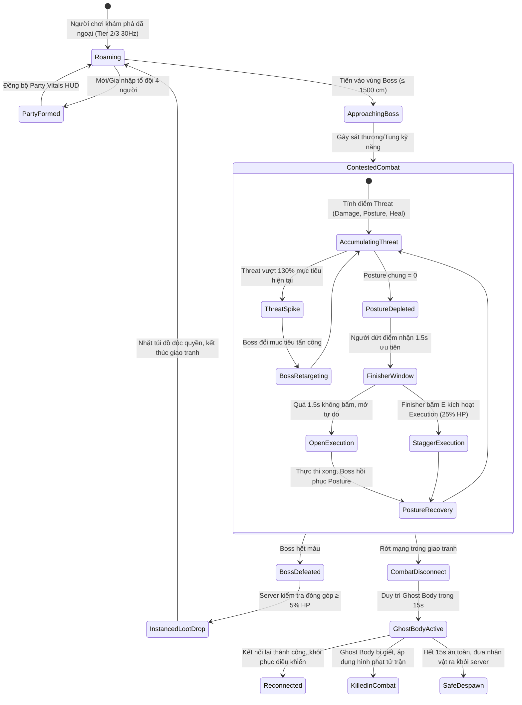

# Open World MMO Netcode & Contested Aggro Sync

> **Status**: Approved  
> **Author**: Network Programmer & Lead Gameplay Systems Designer  
> **Last Updated**: 2026-09-16  
> **Implements Pillar**: Responsive Combat & Seamless Open World MMO Contested Cooperation  
> **Target Engine**: Unreal Engine 5.7 (Iris Replication System, Gameplay Ability System Replication, Dedicated Server)

---

## Overview

Hệ thống Đồng Bộ Mạng Thế Giới Mở & Cừu Hận Tranh Chấp (Open World MMO Netcode & Contested Aggro Sync) là trụ cột hạ tầng kỹ thuật và trải nghiệm nhiều người chơi then chốt của Project Ascendant. Được xây dựng trên nền tảng **Unreal Engine 5.7 Iris Replication System** kết hợp cùng **Gameplay Ability System (GAS) Replication**, hệ thống giải quyết bài toán đồng bộ thời gian thực cho các cuộc đụng độ quy mô lớn dã ngoại mà không sử dụng rào cản phụ bản (No Instanced Dungeons / No Matchmaking Queues). Mọi hành động chiến đấu, di chuyển, tung chiêu thức kỹ năng, tính toán va chạm và bẻ gãy thanh Thể Khí (Posture) đều được điều phối trực tiếp trên bản đồ mở rộng lớn thông qua mô hình **Dedicated Server Authority 100%** theo quyết định kiến trúc [`ADR-0001`](file:///mnt/Data/Projects/project-games/docs/architecture/adr-0001-open-world-mmo-combat-networking.md).

Về mặt lối chơi, hệ thống vận hành theo cơ chế **Chiến Đấu Cạnh Tranh Mở (Contested Combat / Open Tagging)**—loại bỏ hoàn toàn khái niệm khóa quái độc quyền (No Kill-Lock). Mọi người chơi và tổ đội đi ngang qua đều có quyền tự do can thiệp vào bất kỳ trận giao tranh nào ngoài tự nhiên. Trọng tâm tương tác nhiều người chơi xoay quanh ba cơ chế cốt lõi:
1. **Bảng Cừu Hận Động (Dynamic Aggro & Threat Table)**: Quái vật Tinh anh và Thủ lĩnh (Boss) tự động tính toán điểm đe dọa (Threat Score) từ mọi người chơi tham chiến dựa trên tổng sát thương gây ra, lượng sát thương bẻ gãy Posture tích lũy, kỹ năng khiêu khích (Taunt của Vanguard/Templar), và lượng hồi máu hỗ trợ (Healing Threat của Acolyte). AI liên tục tái đánh giá mục tiêu mỗi 1.0 giây hoặc chuyển mục tiêu đột ngột (Target Switching) khi nhận đòn bộc phát lớn.
2. **Hệ Thống Tổ Đội Động 4 Người (4-Player Dynamic Party System)**: Cho phép tối đa 4 người chơi liên kết tức thì ngoài hoang dã. Tổ đội cung cấp khả năng quan sát trạng thái sinh tồn của đồng đội theo thời gian thực (Party HUD Vitals), chia sẻ điểm kinh nghiệm thưởng trong phạm vi 3000 cm theo công thức `party_exp_share`, kích hoạt đồng bộ hồi phục và buff hào quang mà không lo va chạm vật lý gây cản trở di chuyển giữa các thành viên.
3. **Phân Phối Chiến Lợi Phẩm & Cửa Sổ Bẻ Gãy Posture Chung (Shared Posture & Priority Execution)**: Thủ lĩnh dã ngoại sử dụng cơ chế Dynamic Difficulty Scaling (DDS) để tự động co giãn máu và thể khí theo số lượng người tham chiến. Khi thanh Posture bị bẻ gãy về 0, người chơi tung đòn kết liễu thể khí (Finisher) nhận độc quyền **1.5 giây ưu tiên** thực thi đòn Trừng Phạt (Stagger Execution gây 25% Max HP). Mọi người chơi đạt ngưỡng đóng góp tối thiểu ($\ge 5\%$ HP hoặc $\ge 10\%$ Posture) đều được Dedicated Server cấp phát riêng túi đồ thưởng rơi độc lập (Instanced Loot Drop), triệt tiêu hoàn toàn nạn cướp loot bất công.

Về mặt hạ tầng mạng, Iris Replication tối ưu hóa băng thông bằng cách phân cụm đối tượng (Spatial Filtering) và chỉ đồng bộ dữ liệu chi tiết của các thực thể nằm trong bán kính quan sát 3500 cm. Dedicated Server là nguồn chân lý duy nhất xác nhận mọi đòn đánh trúng (Hit Registration) và loại bỏ hoàn toàn khả năng can thiệp dữ liệu từ phía Client. Hệ thống tích hợp cơ chế chống ngắt kết nối trốn phạt (Anti-Combat-Logging) bằng cách lưu giữ cơ thể ảo (Ghost Body) trong 15 giây nếu người chơi mất mạng khi đang trong trạng thái giao tranh (In-Combat), đảm bảo sự công bằng tuyệt đối cho môi trường MMO hardcore.

## Player Fantasy

Hệ thống Mạng & Cừu Hận phục vụ đồng thời Trụ cột 1 ("Chinh phục điều không thể bằng kỹ năng tuyệt đỉnh") và Trụ cột 3 ("Kinh tế dã ngoại & Thám hiểm rủi ro cao - phần thưởng lớn"). Trải nghiệm nhiều người chơi trong Project Ascendant không phải là một phòng chờ đợi nhàm chán, mà là những cuộc hội ngộ sinh tử nghẹt thở giữa hoang dã bao la:

> *"Bạn cùng ba người đồng đội trong tổ đội đang dồn sức vây hãm con Golem Đá Canh Gác tại khúc quanh rực lửa của Hoang Dã Tàn Tích. Bạn chơi Vanguard—đứng sừng sững tuyến đầu, giương khiên đỡ đòn nện đất, liên tục tích lũy điểm cừu hận để con quái khổng lồ dán chặt mắt vào bạn, che chắn cho nàng Ranger phía sau đang kéo căng dây cung bắn liên hoàn tên gió.*
> 
> *Bỗng nhiên, từ hẻm núi tàn tích, một tổ đội lạ khác gồm hai người chơi xuất hiện. Không có tường ngăn hay màn hình tải, họ lao thẳng vào tiếp chiến. Trên màn hình của bạn, thanh máu của Golem Đá khẽ nhấp nháy chuyển trạng thái co giãn độ khó động (DDS)—máu tối đa tăng lên, thanh Thể Khí (Posture) dày thêm.*
> 
> *Đột ngột, gã Thuật Sĩ bên đội lạ tung ra một chiêu nổ AoE lôi điện cực mạnh—sát thương bộc phát tức thì kéo vọt điểm cừu hận (Threat Spike) của hắn lên đỉnh! Con Golem khổng lồ gầm lên dữ dội, ngoảnh phắt đầu 180°, giơ hai nắm đấm đá tảng chuẩn bị giáng thẳng xuống đầu gã Thuật Sĩ không có kỹ năng đỡ đòn. Bạn không do dự—bấm phím lướt Dash chéo góc luồn qua khe đá, tung tuyệt kỹ Khiêu Khích 'Tiếng Gầm Khiên Thép'! Điểm cừu hận tức thì khóa chặt lại bạn. Cú đấm trời giáng nện trúng khiên của bạn, tóe lửa thành một vầng sáng chói lòa trong khoảnh khắc Perfect Parry hoàn hảo.*
> 
> *'KENGGGG—CRACK!'*
> 
> *Âm thanh bẻ gãy Thể Khí rền vang khắp thung lũng. Cú phản đòn của bạn vừa vặn trừ nốt điểm Posture cuối cùng của con Boss! Toàn thân Golem quỳ sụp xuống. Trên màn hình bạn bừng sáng viền hoàng kim: 'ƯU TIÊN KẾT LIỄU: 1.5s' dành riêng cho bạn—người tung đòn Finisher. Bạn vung thanh trọng kiếm cắm phập vào lõi năng lượng phát sáng giữa ngực nó, kích hoạt đòn Trừng Phạt xé toạc 25% máu.*
> 
> *Khi con quái khổng lồ nổ tung thành ngàn mảnh vụn đá, trước mắt bạn và mỗi người tham chiến xuất hiện một quả cầu ánh sáng chiến lợi phẩm riêng biệt (Instanced Loot). Không ai có thể cướp của ai. Không có gian lận desync. Cả hai tổ đội lạ mặt cùng nhìn nhau, giơ vũ khí chào rồi chia nhau thu dọn chiến lợi phẩm trong sự tôn trọng tuyệt đối của những kẻ sinh tồn chân chính."*

**Bảng Mục Tiêu Cảm Xúc (Emotional Target Table):**

| Khoảnh khắc | Cảm xúc mục tiêu |
|---|---|
| Gặp gỡ người chơi khác giữa bản đồ dã ngoại | Bất ngờ, cảnh giác nhưng hào hứng — "thế giới sống động, không cô độc" |
| Đồng đội tham gia vào trận đánh dã ngoại | An tâm, vững tin — "sức mạnh tổ đội kề vai sát cánh" |
| Giật lại cừu hận giải cứu đồng đội nguy cấp | Tự hào, bản lĩnh người gánh vác (Tank hero moment) |
| Boss đổi mục tiêu đột ngột (Threat Switch) | Giật mình, nhịp tim tăng vọt — "phải phản ứng né đòn ngay lập tức" |
| Đạt đòn bẻ gãy Posture cuối cùng (Finisher) | Hưng phấn tột độ — "cửa sổ vàng 1.5s thuộc về tôi!" |
| Cả 2 tổ đội cùng xông vào đánh Boss (Contested) | Cạnh tranh lành mạnh, cùng vượt qua thử thách cam go |
| Nhận túi đồ thưởng cá nhân riêng biệt (Instanced Loot) | Hài lòng tuyệt đối, công bằng — "công sức mình bỏ ra được đền đáp xứng đáng" |
| Mạng kết nối mượt mà, đòn né I-frame trúng chuẩn xác | Tin tưởng vào hạ tầng — "thao tác chuẩn thì thắng, không chết oan do lag" |

## Detailed Design

### Core Rules

#### 1. Mô Hình Mạng Dedicated Server Authority 100% & Iris Replication Framework

Mọi tương tác trong thế giới mở Project Ascendant tuân thủ nghiêm ngặt nguyên tắc Server-Authoritative từ [`ADR-0001`](file:///mnt/Data/Projects/project-games/docs/architecture/adr-0001-open-world-mmo-combat-networking.md):

- **Single Source of Truth**: Máy chủ chuyên dụng (Dedicated Server) nắm độc quyền quyền sinh sát—tính toán toàn bộ tọa độ di chuyển, va chạm hitbox/hurtbox, kích hoạt kỹ năng GAS, xác nhận trúng đòn (Hit Registration), khấu trừ máu, bẻ gãy Posture và phát sinh chiến lợi phẩm.
- **Client Prediction & Server Reconciliation**:
  - Khi người chơi di chuyển hoặc kích hoạt Lướt né I-frame ([`dash-evasion.md`](file:///mnt/Data/Projects/project-games/design/gdd/dash-evasion.md)), Client giả lập di chuyển tức thì (Zero-latency responsiveness).
  - Server kiểm tra tính hợp lệ của vận tốc và va chạm môi trường. Nếu có sai lệch tọa độ vượt quá ngưỡng dung sai $15\text{ cm}$, Server sẽ gửi gói tin điều chỉnh nhẹ nhàng (Soft Reconciliation) kéo nhân vật về đúng vị trí thực tế mà không gây giật màn hình.
- **Xác Nhận Đòn Đánh (Server-Side Lag Compensation)**:
  - Khi Client tung chiêu, gói tin RPC `ServerRequestCastAbility` mang theo góc ngắm và Timestamp của Client.
  - Server lưu giữ bộ đệm lịch sử vị trí các thực thể (History Buffer) trong 200ms. Server lùi thời gian (Rewind) để kiểm tra xem tại thời điểm Client tung đòn, tia đánh/vùng chém có thực sự chạm vào hitbox mục tiêu hay không. Nếu hợp lệ, Server áp dụng Gameplay Effect trừ máu/Posture.
- **Cơ Chế Điều Tiết Băng Thông Động Iris (Dynamic 3-Tier Iris Replication)**:
  - **Tier 1 — Cận Chiến Cao Tần (60Hz)**: Áp dụng cho các thực thể nằm trong bán kính $\le 1500\text{ cm}$ đang trong trạng thái giao tranh (In-Combat). Đồng bộ đầy đủ frame cử động, góc ngắm, thanh máu/thể khí.
  - **Tier 2 — Trung Cảnh (30Hz)**: Áp dụng cho các thực thể ở cự ly từ $1500\text{ cm}$ đến $3500\text{ cm}$. Giảm tần số cập nhật animation, ưu tiên tọa độ tổng thể.
  - **Tier 3 — Spatial Culling (> 3500 cm)**: Ngắt hoàn toàn việc gửi dữ liệu chuyển động chi tiết; chỉ duy trì thông tin vị trí đại diện (Dormant Proxy) trên bản đồ nhỏ.
- **Chống Thoát Game Trốn Phạt (Anti-Combat-Logging Ghost Body)**:
  - Nếu Client bị mất kết nối (rút dây mạng, tắt ứng dụng đột ngột) trong lúc nhân vật đang có trạng thái `In-Combat`, Server duy trì nhân vật dưới dạng Cơ Thể Ảo (Ghost Body) trong **15 giây** (`combat_disconnect_ghost_duration = 15.0s`).
  - Quái vật và người chơi khác vẫn có thể tấn công và tiêu diệt Ghost Body này bình thường. Nếu chết trong thời gian này, các hình phạt tử trận (mất 50% vàng PvE, rơi đồ Wanted) vẫn áp dụng trọn vẹn.

#### 2. Bảng Cừu Hận Động & Cơ Chế Tranh Chấp Dã Ngoại (Contested Threat & Aggro Engine)

Không có cơ chế khóa mục tiêu độc quyền (No Kill-Lock). Mọi quái vật Tinh anh và Thủ lĩnh mở vận hành bảng điểm đe dọa (Threat Table) theo thời gian thực:

- **Công Thức Tính Điểm Đe Dọa (Threat Accumulation Formula)**:
  - **Sát thương Máu (Damage Threat)**: $1.0\text{ điểm Threat} / 1\text{ sát thương HP thực tế}$.
  - **Sát thương Bẻ Gãy Thể Khí (Posture Threat)**: $2.5\text{ điểm Threat} / 1\text{ Posture Damage}$ (Khuyến khích lối chơi đập Posture chuyên sâu).
  - **Kỹ Năng Khiêu Khích (Taunt Threat)**: Nhân $5.0\times$ Threat tích lũy trong thời gian hiệu lực và lập tức cộng điểm đe dọa để vọt lên vị trí Top 1 Threat Table (dành riêng cho Vanguard và Templar).
  - **Hồi Máu Đồng Đội (Healing Threat)**: $0.5\text{ điểm Threat} / 1\text{ HP hồi phục}$ (Thu hút quái vào Acolyte nếu hồi máu bộc phát).
- **Quy Tắc Chuyển Đổi Mục Tiêu Bộc Phát (130% Threat Retargeting Rule)**:
  - Định kỳ mỗi $1.0\text{ giây}$, AI Boss quét lại bảng Threat.
  - **Cơ chế bộc phát (Threat Spike)**: Nếu có một người chơi mới tích lũy điểm đe dọa vượt qua **130%** điểm Threat của mục tiêu hiện tại, Boss sẽ lập tức kích hoạt chuyển đổi mục tiêu (Immediate Retargeting), xoay người tung đòn về phía kẻ đe dọa lớn nhất.
- **Hao Mòn Cừu Hận (Threat Decay)**:
  - Nếu một người chơi không gây ra bất kỳ tác động nào (không sát thương, không khống chế, không hồi máu) trong vòng $3.0\text{ giây}$, điểm Threat của họ bắt đầu giảm $10\%$ mỗi giây cho đến khi về 0.
- **Ranh Giới Truy Đuổi Quái Vật (Leash Boundary)**:
  - Quái vật chỉ truy đuổi người chơi tối đa cách điểm spawn ban đầu **2500 cm** (`ai_leash_max_distance = 2500.0`).
  - Khi vượt quá khoảng cách này, Boss lập tức kích hoạt trạng thái `Leash Reset`—miễn nhiễm mọi sát thương, quay về vị trí ban đầu và hồi phục lại 100% sinh lực và thể khí.

#### 3. Hệ Thống Tổ Đội Động 4 Người (4-Player Dynamic Party Engine)

- **Quy Mô & Kết Nối**: Tối đa 4 người chơi trong một tổ đội (Party). Người chơi có thể mời đồng đội nhanh dã ngoại trong cự ly tương tác $\le 500\text{ cm}$ hoặc qua giao diện Danh Sách Bạn Bè.
- **Đồng Bộ Trạng Thái Sinh Tồn (Party HUD Vitals Replication)**:
  - Thông số Sinh Lực, Nội Lực, Thể Lực và các biểu tượng Buff/Debuff của 3 thành viên còn lại được replicate chuyên biệt qua kênh ưu tiên cao (Reliable Multicast) ở tần số 20Hz, hiển thị trực quan ở góc trái màn hình.
- **Vô Hiệu Hóa Sát Thương & Va Chạm Đồng Minh (Friendly Fire & Collision Pass-Through)**:
  - Trong chế độ PvE và dã ngoại thông thường, đòn đánh thường, mũi tên, phép thuật AoE và va chạm vật lý giữa các thành viên trong tổ đội (và người chơi cùng phe) **hoàn toàn xuyên thấu** (Pass-Through).
  - Không tồn tại hiện tượng cản đường đi (Zero Body-Blocking) và không có sát thương phản chủ (Zero Friendly Fire), đảm bảo không gian cơ động tối đa trong các góc nhìn Isometric hẹp.
- **Chia Sẻ Kinh Nghiệm Thưởng (Party EXP Radius)**:
  - Toàn bộ thành viên tổ đội đứng trong bán kính **3000 cm** tính từ điểm quái bị tiêu diệt đều nhận được phần chia EXP theo công thức `party_exp_share`, cộng thêm phần trăm thưởng tinh thần đồng đội (Morale Bonus: +10% cho đội 2 người, +20% cho đội 3 người, +35% cho đội 4 người).

#### 4. Quy Tắc Contested Boss & Phân Phối Chiến Lợi Phẩm Cá Nhân Hóa (Instanced Loot)

- **Co Giãn Độ Khó Động (DDS — Dynamic Difficulty Scaling)**:
  - Lượng Máu Tối Đa và Thể Khí Tối Đa của Boss tự động co giãn theo số lượng người tham chiến ($N \ge 1$) đã gây $\ge 1\%$ sát thương trong 30 giây gần nhất:
    * $HP_{max} = Base \times [1 + 0.45 \times (N-1)]$
    * $Posture_{max} = Base \times [1 + 0.35 \times (N-1)]$
- **Cửa Sổ Ưu Tiên Bẻ Gãy Thể Khí (1.5s Finisher Window)**:
  - Khi thanh Posture chung bị bẻ gãy về 0, người chơi tung đòn đánh cuối cùng (Finisher) nhận độc quyền **1.5 giây ưu tiên** (`boss_finisher_exclusive_window = 1.5s`).
  - Trong 1.5s này, chỉ Finisher mới có thể bấm nút Tương Tác kích hoạt đòn Trừng Phạt (Stagger Execution gây 25% Max HP).
  - Sau 1.5s nếu Finisher không kích hoạt, cơ hội mở tự do cho mọi người chơi tham chiến.
- **Ngưỡng Đóng Góp Nhận Thưởng Cá Nhân (Instanced Loot Eligibility)**:
  - Mọi người chơi (dù đi đơn lẻ hay theo tổ đội) gây tối thiểu **$\ge 5\%$ tổng lượng sát thương HP** hoặc **$\ge 10\%$ sát thương Posture** đều đạt chuẩn nhận thưởng.
  - Khi Boss chết, Dedicated Server tạo riêng cho mỗi người chơi đủ điều kiện một túi đồ ảo (Instanced Loot Droplet) hiển thị độc quyền trên màn hình của họ. Người chơi khác hoàn toàn không nhìn thấy và không thể nhặt túi đồ này, loại bỏ vĩnh viễn hành vi cướp loot (Ninja Looting).

---

### States and Transitions



---

### Interactions with Other Systems

| Hệ Thống Liên Quan | Chiều Tương Tác | Mô Tả Tương Tác Cụ Thể |
|---|---|---|
| [`isometric-controller.md`](file:///mnt/Data/Projects/project-games/design/gdd/isometric-controller.md) | ↔ Song phương | Tọa độ Client Prediction, đồng bộ hướng xoay góc nhìn nghiêng -45°, loại bỏ va chạm thân thể đồng minh |
| [`combat-system.md`](file:///mnt/Data/Projects/project-games/design/gdd/combat-system.md) | ↔ Song phương | Gửi và xác nhận RPC tung chiêu `ServerRequestCastAbility`, Server lag compensation rewind 200ms |
| [`stagger-system.md`](file:///mnt/Data/Projects/project-games/design/gdd/stagger-system.md) | → Downstream | Đồng bộ thanh Posture chung, quản lý cửa sổ độc quyền 1.5s Finisher Execution |
| [`attributes-system.md`](file:///mnt/Data/Projects/project-games/design/gdd/attributes-system.md) | ← Upstream | Thuộc tính HP/MP/Stamina được replicate tới đồng đội trong Party HUD qua kênh Reliable |
| [`zone-system.md`](file:///mnt/Data/Projects/project-games/design/gdd/zone-system.md) | ← Upstream | Tuân thủ ranh giới đuổi quái `ai_leash_max_distance = 2500 cm`, áp dụng luật Sanctuary và hình phạt Wanted |
| [`inventory-system.md`](file:///mnt/Data/Projects/project-games/design/gdd/inventory-system.md) | → Downstream | Dedicated Server sinh túi đồ Instanced Loot Droplet độc quyền vào kho đồ cá nhân người chơi |
| [`ADR-0001`](file:///mnt/Data/Projects/project-games/docs/architecture/adr-0001-open-world-mmo-combat-networking.md) | ← Governance | Tuân thủ tuyệt đối kiến trúc Dedicated Server Authority 100%, Iris Replication và chống Combat-Logging |

## Formulas

### 1. Công Thức Tính Điểm Cừu Hận Động (Threat Score Formula)

```
threat_score = (damage_hp * threat_mult_hp) + (damage_posture * threat_mult_posture) + (healing_done * threat_mult_heal)
```
- Khi kỹ năng Khiêu Khích (Taunt) đang kích hoạt: `threat_score = threat_score * taunt_multiplier`
- Giá trị mặc định: `threat_mult_hp = 1.0`, `threat_mult_posture = 2.5`, `threat_mult_heal = 0.5`, `taunt_multiplier = 5.0`.

### 2. Ngưỡng Chuyển Đổi Mục Tiêu Bộc Phát (Retargeting Threshold)

```
is_retarget_triggered = (threat_candidate >= threat_current_target * threat_retarget_ratio)
```
- Giá trị mặc định: `threat_retarget_ratio = 1.30` (Cần vượt 130% điểm Threat của mục tiêu hiện tại để kích hoạt bộc phát).

### 3. Co Giãn Độ Khó Động Thủ Lĩnh (DDS Boss Dynamic Scaling — Tham Chiếu Registry)

```
boss_scaled_hp = round(base_max_hp * (1.0 + hp_scale_coefficient * max(0, combatant_count - 1)))
boss_scaled_posture = round(base_max_posture * (1.0 + posture_scale_coefficient * max(0, combatant_count - 1)))
```
- Đã đăng ký trong registry: `boss_dynamic_hp_scaling` (`hp_scale_coefficient = 0.45`) và `boss_dynamic_posture_scaling` (`posture_scale_coefficient = 0.35`).

### 4. Chia Sẻ Điểm Kinh Nghiệm Tổ Đội (Party EXP Share — Tham Chiếu Registry)

```
party_member_exp = round((base_monster_exp * (1.0 + morale_bonus)) / valid_party_member_count)
```
- Đã đăng ký trong registry: `party_exp_share`. Morale bonus: 2 người (+10%), 3 người (+20%), 4 người (+35%) trong bán kính 3000 cm.

---

## Edge Cases

| # | Tình huống phát sinh | Giải pháp xử lý | Cơ chế bảo đảm |
|---|---|---|---|
| E1 | **Rút dây mạng / Thoát game lúc đánh Boss (Combat-Logging)** | Server giữ nguyên Ghost Body trong 15s. Boss/quái tiếp tục đánh và tiêu diệt. Nếu chết, áp dụng phạt tử trận bình thường. | Dedicated Server Authority ngăn chặn hoàn toàn gian lận trốn chết. |
| E2 | **Hai người chơi cùng tung đòn bẻ gãy Posture trong cùng 1 frame** | Server xử lý theo Timestamp của gói tin RPC đến trước (Microsecond tie-breaker). Người có timestamp sớm hơn nhận Finisher 1.5s. | Server là trọng tài duy nhất, không có hiện tượng tranh chấp lock. |
| E3 | **Finisher bị quái khác đánh văng / chết trong cửa sổ 1.5s** | Cửa sổ ưu tiên lập tức kết thúc sớm (Cancel Window). Trạng thái Stagger chuyển ngay sang `Open Execution` cho đồng đội khác. | Posture State Machine tự động kiểm tra `IsAlive` và `Stunned` của Finisher. |
| E4 | **Dụ Boss vượt ra ngoài bán kính 2500 cm (Leashing Exploit)** | Boss kích hoạt `Leash Reset`—về trạng thái bất tử, không thể nhận sát thương, chạy về điểm spawn và hồi 100% HP/Posture. | `ai_leash_max_distance = 2500.0` ngăn chặn việc kéo boss về vùng an toàn Sanctuary. |
| E5 | **Người chơi gây 4.9% sát thương (dưới ngưỡng 5% Instanced Loot)** | Server từ chối cấp phát túi đồ thưởng Boss. Chỉ nhận EXP thông thường nếu trong phạm vi. Không có ngoại lệ làm tròn. | `boss_loot_contribution_hp = 0.05` là ngưỡng cứng để chống hành vi "chém 1 đòn ăn ké loot". |
| E6 | **Thành viên tổ đội AFK đứng ngoài bán kính 3000 cm** | Server loại khỏi danh sách `valid_party_member_count`. Không nhận EXP, không được chia loot, không tính bonus. | Spatial distance check định kỳ mỗi giây. |
| E7 | **Ping cao đột biến (> 250ms)** | Server lag compensation chỉ tua lại tối đa 200ms (`MaxLagCompensation = 0.20s`). Đòn đánh tung ra ngoài 200ms bị Server từ chối (Miss). | Bảo vệ người chơi ping thấp không bị "chém trúng trong quá khứ" (Dying behind cover). |
| E8 | **Tank dùng Taunt ngay khi Boss bắt đầu vung đòn báo hiệu (Telegraph)** | Đòn đánh hiện tại của Boss vẫn giữ nguyên quỹ đạo vào mục tiêu cũ; sau khi vung xong chiêu thức mới quay sang đánh Tank. | Animation lock bảo toàn tính công bằng của đòn báo hiệu thị giác. |
| E9 | **Người chơi tử trận ngay trước khi Boss chết 1 giây** | Nếu đã đạt ngưỡng $\ge 5\%$ HP trước khi chết, túi đồ Instanced Loot vẫn rơi tại vị trí xác chết của họ và tồn tại 30 phút. | Quyền lợi đóng góp được bảo lưu độc quyền theo PlayerID. |
| E10 | **Tổ đội có thành viên mang tội danh Wanted (Red Name)** | Các thành viên khác vẫn nhận EXP bình thường, nhưng lính gác Tiền Trạm Sanctuary sẽ bắn hạ thành viên Red Name nếu tiến vào kết giới. | Luật phân vùng `zone-system.md` được ưu tiên tuyệt đối. |

---

## Dependencies

| Hệ Thống | Trạng Thái | Chiều Phụ Thuộc | Điểm Tích Hợp Cụ Thể |
|---|---|---|---|
| [`isometric-controller.md`](file:///mnt/Data/Projects/project-games/design/gdd/isometric-controller.md) | ✅ Approved | ↔ Song phương | Client Prediction tọa độ di chuyển, hướng xoay -45°, xuyên thấu thân thể đồng minh |
| [`combat-system.md`](file:///mnt/Data/Projects/project-games/design/gdd/combat-system.md) | ✅ Approved | ↔ Song phương | RPC `ServerRequestCastAbility`, lag compensation buffer 200ms, hủy bỏ Friendly Fire trong PvE |
| [`stagger-system.md`](file:///mnt/Data/Projects/project-games/design/gdd/stagger-system.md) | ✅ Approved | → Downstream | Đồng bộ thanh Posture co giãn động, cửa sổ ưu tiên 1.5s Finisher Execution |
| [`attributes-system.md`](file:///mnt/Data/Projects/project-games/design/gdd/attributes-system.md) | ✅ Approved | ← Upstream | Replicate thanh HP/MP/Stamina của đồng đội vào Party HUD |
| [`zone-system.md`](file:///mnt/Data/Projects/project-games/design/gdd/zone-system.md) | ✅ Approved | ← Upstream | `ai_leash_max_distance = 2500 cm`, kết giới Sanctuary 1000 cm, cơ chế Corpse Run |
| [`inventory-system.md`](file:///mnt/Data/Projects/project-games/design/gdd/inventory-system.md) | ✅ Approved | → Downstream | Cấp phát túi đồ Instanced Loot Droplet độc quyền vào túi đồ cá nhân |
| [`merchant-economy.md`](file:///mnt/Data/Projects/project-games/design/gdd/merchant-economy.md) | ✅ Approved | ↔ Song phương | Tương tác giao dịch Server-Authoritative không bị gián đoạn bởi netcode chiến đấu |
| [`ADR-0001`](file:///mnt/Data/Projects/project-games/docs/architecture/adr-0001-open-world-mmo-combat-networking.md) | ✅ Accepted | ← Governance | Chuẩn mực Dedicated Server Authority 100%, Iris Replication, chống Combat-Logging |

---

## Tuning Knobs

| Tham Số | Giá Trị Mặc Định | Phạm Vi Điều Chỉnh | Ảnh Hưởng Thiết Kế |
|---|---|---|---|
| `threat_retarget_ratio` | 1.30 | 1.10 – 1.50 | Ngưỡng bộc phát để Boss đổi mục tiêu. Càng cao thì Boss càng bám chặt mục tiêu cũ. |
| `threat_decay_delay` | 3.0s | 1.0 – 5.0 | Thời gian không gây sát thương trước khi điểm đe dọa bắt đầu tụt. |
| `threat_decay_rate` | 0.10/s | 0.05 – 0.25 | Tỷ lệ hao mòn cừu hận mỗi giây. |
| `taunt_multiplier` | 5.0 | 2.0 – 10.0 | Hệ số nhân điểm Threat khi kích hoạt kỹ năng khiêu khích của Tank. |
| `posture_threat_multiplier` | 2.5 | 1.5 – 4.0 | Hệ số nhân điểm đe dọa từ sát thương Posture. Khuyến khích lối chơi đập thể khí. |
| `healing_threat_multiplier` | 0.5 | 0.2 – 1.0 | Hệ số nhân điểm đe dọa từ lượng máu hồi phục của Healer. |
| `party_max_members` | 4 | 2 – 6 | Số lượng thành viên tối đa trong một tổ đội. |
| `party_exp_radius` | 3000.0 cm | 2000 – 5000 | Bán kính tối đa để được chia sẻ điểm kinh nghiệm và thưởng tổ đội. |
| `iris_tier1_radius` | 1500.0 cm | 1000 – 2000 | Bán kính đồng bộ cận chiến cao tần 60Hz. |
| `iris_tier2_radius` | 3500.0 cm | 2500 – 5000 | Bán kính đồng bộ trung cảnh 30Hz trước khi kích hoạt Culling. |
| `server_max_lag_compensation` | 0.20s (200ms) | 0.10 – 0.35 | Giới hạn tối đa Server lùi thời gian để xác nhận trúng đòn cho người chơi ping cao. |
| `combat_disconnect_ghost_duration`| 15.0s | 10.0 – 30.0 | Thời gian tồn tại của Cơ Thể Ảo chống trốn phạt khi rớt mạng trong giao tranh. |
| `boss_finisher_exclusive_window` | 1.5s | 1.0 – 2.5 | Thời gian ưu tiên độc quyền cho người tung đòn bẻ gãy Posture cuối cùng. |
| `boss_loot_contribution_hp` | 0.05 (5%) | 0.02 – 0.10 | Ngưỡng sát thương máu tối thiểu để được cấp phát túi đồ Instanced Loot. |
| `boss_loot_contribution_posture` | 0.10 (10%)| 0.05 – 0.20 | Ngưỡng sát thương thể khí tối thiểu để được nhận Instanced Loot. |

## Visual/Audio Requirements

### Visual
- **Party Overhead Vitals**: Hiển thị thanh máu nhỏ gọn màu xanh lam/vàng trên đầu đồng đội kèm biểu tượng Class để dễ nhận diện trong giao tranh hỗn loạn.
- **Threat Retargeting Flash**: Khi Boss đổi cừu hận sang mục tiêu mới, mắt Boss lóe sáng một tia sáng đỏ rực trong 0.2s (Threat Flash), cơ thể xoay chuyển dứt khoát về hướng kẻ đe dọa.
- **Finisher Priority Aura**: Người chơi tung đòn bẻ gãy Posture cuối cùng được bao bọc trong một luồng hào quang hoàng kim rực rỡ trong 1.5 giây, trên ngực Boss hiện icon phím [E] nhấp nháy vàng.
- **Instanced Loot Orb**: Túi đồ thưởng độc quyền hiển thị dưới dạng quả cầu linh hồn ánh sáng lơ lửng màu tím/vàng với các hạt tro tàn lấp lánh (chỉ người đạt chuẩn $\ge 5\%$ mới nhìn thấy).
- **Ghost Body Visual**: Nhân vật bị mất kết nối trong giao tranh được bao bọc trong lớp viền xám tro mờ ảo (Ash Silhouette) kèm icon tín hiệu mạng đứt gãy màu đỏ trên đầu.

### Audio
- **Party Join/Leave**: Tiếng tù và hiệu lệnh vang lên trầm ấm khi lập đội; tiếng sừng vỡ nhẹ khi rời đội.
- **Threat Retargeting Roar**: Tiếng gầm gừ đanh thép của Boss khi đổi hướng mục tiêu cảnh báo cho người chơi bị ngắm.
- **Posture Broken Stagger**: Âm thanh va đập kim loại rền vang *"KENGGG—CRACK!"* đặc trưng báo hiệu cửa sổ 1.5s bắt đầu.
- **Taunt Trigger**: Tiếng đập chày/khiên chan chát cùng tiếng hô vang dội thu hút sự chú ý.
- **Instanced Loot Drop**: Tiếng thủy tinh ngân vang êm dịu khi quả cầu chiến lợi phẩm cá nhân xuất hiện.

---

## UI Requirements

### Giao Diện Tổ Đội (Party HUD Frame)
- **Vị trí**: Cố định góc trên bên trái màn hình.
- **Hiển thị tối đa 3 đồng đội**: Chân dung đại diện, Tên, Cấp độ, Icon Class, Thanh Sinh Lực (xanh lá), Thanh Nội Lực (xanh dương), các icon Buff/Debuff kèm thời gian đếm ngược, và cự ly mét cách bản thân.
- **Chỉ báo ngoài tầm chia EXP**: Nếu đồng đội cách xa $> 3000\text{ cm}$, khung chân dung chuyển mờ bán trong suốt (Greyed out) kèm icon cảnh báo xa cách.

### Giao Diện Thanh Máu Thủ Lĩnh (Contested Boss Bar)
- **Vị trí**: Chính giữa phía trên màn hình.
- **Thanh Máu Chính**: Hiển thị Max HP đã co giãn theo DDS, kèm tỷ lệ phần trăm sát thương đóng góp của bản thân (`% Contribution`) ngay góc phải thanh máu.
- **Thanh Posture Chung**: Đặt ngay dưới thanh máu với vạch màu cam, hiển thị trực quan mức độ thể khí tích lũy của toàn bộ người chơi tham chiến.
- **Nhãn Mục Tiêu Cừu Hận (Current Aggro Target)**: Hiển thị tên và icon class của người chơi đang giữ Top 1 Threat Table bên cạnh thanh máu Boss.

---

## Acceptance Criteria

| # | Tiêu Chí Kiểm Thử | Phương Pháp Kiểm Tra |
|---|---|---|
| AC1 | Server Lag Compensation tua lại đúng tối đa 200ms để xác nhận trúng đòn | Giả lập Client Ping 150ms, tung chiêu trúng mục tiêu di động, verify Server confirm Hit |
| AC2 | Boss đổi mục tiêu tức thì khi Threat vượt $\ge 130\%$ mục tiêu hiện tại | Test tự động: Player A gây 1000 Threat, Player B bộc phát 1310 Threat $\rightarrow$ verify Boss đổi target |
| AC3 | Điểm Threat bắt đầu hao mòn 10%/giây sau 3.0 giây không gây tác động | Test tự động: Player ngừng đánh trong 3s, kiểm tra Threat giảm dần đều về 0 |
| AC4 | Rút dây mạng trong combat $\rightarrow$ Ghost Body tồn tại đúng 15 giây | Ngắt kết nối mạng Client, kiểm tra trên Server xem Actor nhân vật còn tồn tại đúng 15.0s |
| AC5 | Boss kích hoạt Leash Reset khi bị kéo xa $> 2500\text{ cm}$ | Kéo Boss vượt 2500 cm $\rightarrow$ verify Boss bất tử chạy về bãi spawn và hồi 100% HP/Posture |
| AC6 | Instanced Loot chỉ xuất hiện cho người chơi đóng góp $\ge 5\%$ HP hoặc $\ge 10\%$ Posture | Test 3 client (gây 6%, 4.9%, 0% damage) $\rightarrow$ verify chỉ Client 6% nhận được túi loot |
| AC7 | Người tung đòn bẻ gãy Posture cuối cùng nhận độc quyền 1.5s Finisher | Cho 2 Client cùng đứng cạnh Boss bị Stagger $\rightarrow$ verify Client thứ 2 không bấm được nút E trong 1.5s đầu |
| AC8 | EXP tổ đội được chia đều trong bán kính 3000 cm kèm Morale Bonus | Giết quái, đo lượng EXP nhận được của 4 thành viên đứng gần so với công thức `party_exp_share` |
| AC9 | Không có va chạm vật lý (Body Blocking) và Friendly Fire giữa người chơi PvE | 2 người chơi chạy xuyên qua nhau và tung kỹ năng diện rộng vào nhau $\rightarrow$ verify không cản đường, 0 damage |
| AC10 | Iris Replication điều tiết đúng 3 tầng tần số (60Hz, 30Hz, Culling) | Đặt nhân vật ở các cự ly 1000 cm, 2500 cm, 4000 cm $\rightarrow$ đo đạc tần số gói tin cập nhật |
| AC11 | Kỹ năng Taunt nhân $5.0\times$ Threat và đưa Tank lên vị trí Top 1 cừu hận | Kích hoạt Taunt $\rightarrow$ verify điểm Threat tăng vọt và Boss quay sang đánh Tank ngay lập tức |
| AC12 | Server Reconciliation nắn chỉnh nhẹ nhàng khi Client lệch $> 15\text{ cm}$ | Giả lập Client cố tình hack vị trí dịch chuyển 30 cm $\rightarrow$ verify Server nắn kéo về tọa độ chuẩn |

---

## Open Questions

| # | Câu Hỏi Mở | Trạng Thái | Định Hướng Xử Lý |
|---|---|---|---|
| Q1 | Hệ thống Bang Hội (Guild / Clan System) và chiến tranh lãnh thổ dã ngoại nên thêm vào giai đoạn nào? | Mở | Xem xét triển khai trong giai đoạn Beta hoặc Live-Ops để tránh làm phình scope của bản Vertical Slice. |
| Q2 | Có nên mở rộng quy mô Tổ đội lên Liên Minh Đột Kích (Raid Party 8 hoặc 16 người) cho World Boss không? | Mở | Kiến trúc netcode Iris hoàn toàn hỗ trợ được. Cần cân nhắc về độ rối loạn thị giác trên góc nhìn Isometric 2.5D. |
| Q3 | Tích hợp Voice Chat thời gian thực nội bộ tổ đội (Party Voice Chat)? | Mở | Có thể tích hợp plugin Unreal Audio / Vivox ở giai đoạn Alpha/Beta. |
