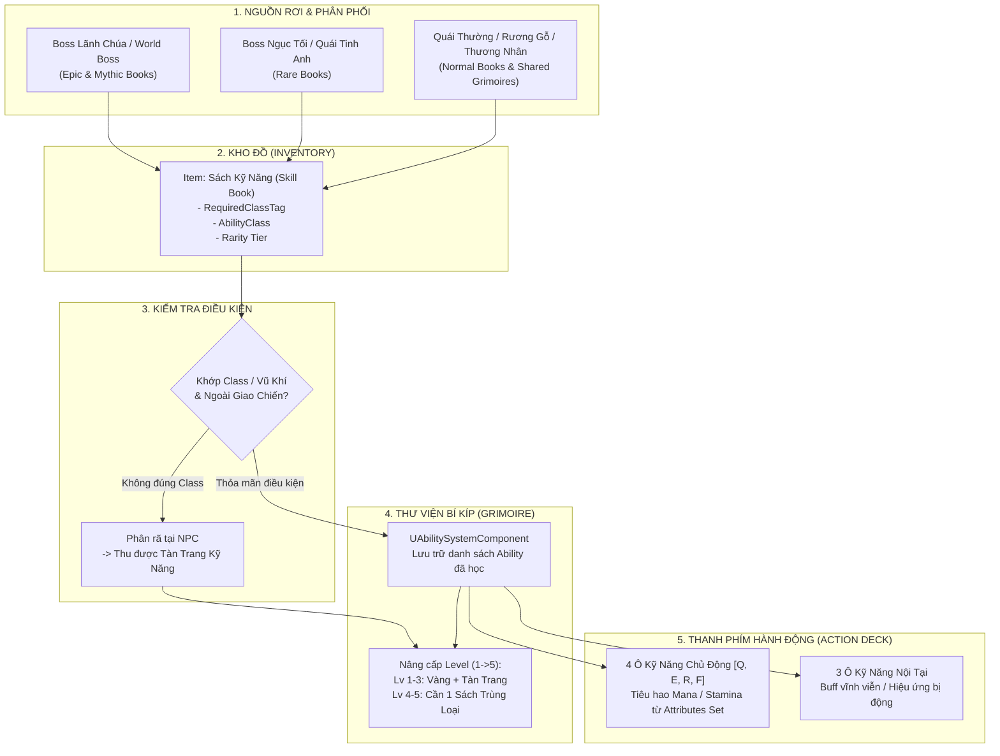

# Skill Progression & Skill Book System

> **Status**: Approved  
> **Author**: Systems Designer & Lead Programmer  
> **Last Updated**: 2026-09-15  
> **Implements Pillar**: True Skill Expression & Meaningful Progression  
> **Target Engine**: Unreal Engine 5 (GAS GameplayAbility & Item Data Assets)

---

## Overview

Hệ thống Phát triển Kỹ năng & Sách Kỹ Năng (Skill Progression & Skill Book System) là kiến trúc quản lý toàn bộ vòng lặp thu thập, học tập, cường hóa và trang bị kỹ năng chiến đấu cho cả 12 Chức nghiệp trong Project Ascendant. Hệ thống xây dựng cầu nối liền mạch giữa:
1. **Kho Đồ (Inventory System):** Nơi Sách Kỹ Năng (Skill Book) tồn tại dưới dạng vật phẩm tiêu hao có điều kiện khóa Class/Vũ khí.
2. **Hệ Thống Thuộc Tính (Attributes Engine - GAS):** Nơi các chiêu thức trích xuất Mana và Stamina để thi triển theo quy chuẩn cân bằng.
3. **Thanh Kỹ Năng Hành Động (Action Deck):** Giới hạn số lượng kỹ năng mang vào chiến đấu (4 Active + 3 Passive) để duy trì trải nghiệm hành động tốc độ cao, tránh quá tải phím bấm.

---

## Player Fantasy

*"Trong tàn tích ngập tràn dung nham sau khi hạ gục một Lãnh chúa hắc ám, chiếc rương cổ bật mở hé lộ một cuốn cổ thư phát ra ánh sáng tím biếc. Bạn cầm trên tay cuốn 'Hư Không Trảm' độc quyền. Mở sách, từng dòng ấn ký cổ xưa tan biến vào tâm trí. Bạn lập tức gán chiêu thức mới vào thanh phím nóng, chuẩn bị cho những đòn chém xé toạc không gian trong trận chiến kế tiếp."*

Người chơi trải nghiệm cảm giác hồi hộp của việc săn tìm bí kíp võ học, sự thỏa mãn khi mở khóa chiêu thức mới và chiều sâu chiến thuật khi tự do tinh chỉnh bộ kỹ năng (Loadout) phù hợp với từng Boss.

---

## Detailed Design

### 1. Starter Skills (Bộ Kỹ Năng Khởi Đầu 12 Class)

Mỗi chức nghiệp khi được khởi tạo hoặc mở khóa trong thế giới sẽ lập tức sở hữu miễn phí:
* **2 Kỹ Năng Chủ Động Cơ Bản (Active Skills):** Gán mặc định vào Slot 1 và Slot 2.
* **1 Kỹ Năng Nội Tại Cốt Lõi (Passive Trait):** Gán mặc định vào Slot Nội Tại 1.
* *Đặc tính kỹ thuật:* Không tốn sách, không yêu cầu cấp độ, không thể bị xóa hoặc phân rã (`bIsStarterAbility = true`).

#### Bộ Starter Kit Tiêu Biểu:
- **Chiến Binh (Vanguard):** 
  - Active 1: *Khiên Kích (Shield Bash)* — Tích 25% Posture lên mục tiêu (Tốn 20 Mana).
  - Active 2: *Kiếm Khí Trảm (Blade Arc)* — Vung kiếm quét rộng đẩy lùi quái (Tốn 15 Stamina + 10 Mana).
  - Passive: *Thế Đứng Kiên Định* — Giảm 20% sát thương Posture nhận phải khi đang Block.
- **Du Hiệp (Ranger):**
  - Active 1: *Xuyên Tâm Tiễn (Piercing Shot)* — Tên bắn xuyên thẳng nhiều mục tiêu (Tốn 20 Mana).
  - Active 2: *Lưới Bẫy Chông (Caltrop Trap)* — Làm chậm 40% đàn quái đuổi theo (Tốn 15 Stamina + 10 Mana).
  - Passive: *Bộ Pháp Nhanh Nhẹn* — Sau khi lướt né tăng 15% tốc chạy trong 1.5s.
- **Hư Không Kiếm Sư (Void Blade):**
  - Active 1: *Hư Không Trảm (Void Slash)* — Cắt không gian để lại vết nứt nổ sau 1s (Tốn 25 Mana).
  - Active 2: *Thiểm Ảnh (Blink)* — Lướt dịch chuyển tức thời sau lưng mục tiêu (Tốn 20 Mana + 15 Stamina).
  - Passive: *Vết Cắt Thứ Nguyên* — Đòn đánh có 20% cơ hội bỏ qua 30% giáp của đối thủ.
- **Thí Thần Giả (God Slayer):**
  - Active 1: *Thần Lực Tước Đoạt (Divine Siphon)* — Đòn quét bòn rút 30 Mana của mục tiêu (Tốn 20 Stamina).
  - Active 2: *Nhất Kiếm Tuyệt Diệt (Severance)* — Đòn đâm xuyên thế đứng gây 35% Posture (Tốn 35 Mana).
  - Passive: *Linh Hồn Phản Xạ* — Perfect Dodge đóng băng thời gian xung quanh trong 1.0s.

---

### 2. Skill Book Item Specification (Đặc Tả Vật Phẩm Sách Kỹ Năng)

Sách Kỹ Năng được định nghĩa trong Unreal Engine qua class `USkillBookItemDefinition` (`UPrimaryDataAsset`):
* `FText SkillName`: Tên kỹ năng hiển thị.
* `TSubclassOf<UGameplayAbility> GrantedAbilityClass`: Lớp kỹ năng GAS sẽ nạp vào ASC.
* `FGameplayTag RequiredClassTag`: Thẻ chức nghiệp bắt buộc (ví dụ `Class.Vanguard`, `Class.VoidBlade`).
* `FGameplayTag RequiredWeaponTag`: Thẻ loại vũ khí yêu cầu (dùng cho sách võ học chung).
* `EItemRarity RarityTier`: 4 bậc (Normal, Rare, Epic, Mythic).

#### Phân Loại Khóa Chức Nghiệp (Class-Lock):
1. **Sách Độc Quyền (Dedicated Class Book):** Chỉ duy nhất Class mang đúng `RequiredClassTag` mới đọc được. Toàn bộ sách của 7 Class Nâng Cao và 1 Class Ẩn đều thuộc nhóm này.
2. **Bí Kíp Võ Học Chung (Shared Weapon Grimoire):** Dành cho các Class dùng chung vũ khí (Kiếm, Cung, Trượng, Chùy).
   - *Lợi thế của 4 Class Cơ Bản (Normal):* Có thể học toàn bộ Sách Cơ Bản của mình LẪN các Bí Kíp Võ Học Chung, giúp lối build đồ vô cùng đa dạng và linh hoạt (Đúng triết lý A+C).

---

### 3. Quy Trình Học, Cường Hóa & Giới Hạn Slot (Action Deck)

#### Thao Tác Học & Thư Viện Kỹ Năng (Grimoire Library):
* Người chơi mở Kho đồ, nhấp chuột phải vào Sách Kỹ Năng.
* Hệ thống kiểm tra: Đúng Class/Vũ khí + Đang ngoài giao chiến (`!State.InCombat`).
* Nếu hợp lệ: Tiêu hao 1 cuốn sách, gọi hàm `GiveAbility(GrantedAbilityClass, Level = 1)` nạp vào `UAbilitySystemComponent`.
* Kỹ năng được lưu vĩnh viễn vào **Thư Viện Kỹ Năng (Grimoire Library)**.

#### Giới Hạn Slot Hành Động (Action Deck - Tránh Quá Tải Phím):
Dù người chơi có thể học hàng chục kỹ năng vào Grimoire, khi tham chiến chỉ được trang bị:
* **4 Ô Kỹ Năng Chủ Động (Active Ability Slots):** Gán vào các phím nóng `[Q]`, `[E]`, `[R]`, `[F]` (hoặc 4 nút mặt tay cầm).
* **3 Ô Kỹ Năng Nội Tại (Passive Trait Slots):** Gán các hiệu ứng buff nội tại kích hoạt tự động.
* *Quy tắc đổi Skill:* Chỉ được hoán đổi kỹ năng trong Loadout khi đứng gần Lửa Trại, Điểm Lưu (Checkpoint) hoặc tại Thành trấn an toàn.

#### Cơ Chế Cường Hóa Kỹ Năng (Level 1 → Level 5):
* **Cấp 1 → 3 (Cơ Bản → Thành Thạo):** 
  - Tiêu hao: **Vàng** + **Tàn Trang Kỹ Năng (Skill Shards)**.
  - Tác dụng: Tăng +10% sát thương/hiệu ứng mỗi cấp, giảm 5% thời gian hồi chiêu.
* **Cấp 4 → 5 (Đỉnh Phong / Mastery):**
  - Tiêu hao: **Vàng** + **1 cuốn Sách Kỹ Năng cùng loại (Duplicate Book)**.
  - Tác dụng: Mở khóa **Hiệu Ứng Đột Biến (Mastery Mutation)** (ví dụ: Chiêu tăng phạm vi AoE +30%, hoặc cú chém tạo thêm hiệu ứng chảy máu).
* **Cơ Chế Phân Rã Sách Thừa (Salvage):**
  - Nhặt được Sách Kỹ Năng của Class khác? Người chơi đem tới NPC Học Giả / Thợ Rèn để phân rã thành **Tàn Trang Kỹ Năng (Skill Shards)** dùng nâng cấp chiêu thức cho Class của mình. *Không có cuốn sách nào bị vô dụng!*

---

## Formulas & Resource Costs

Tham chiếu trực tiếp từ [`design/gdd/attributes-system.md`](file:///mnt/Data/Projects/project-games/design/gdd/attributes-system.md) (Base Mana = 100, Base Stamina = 100, Posture = 100):

### 1. Chi Phí Tài Nguyên Kỹ Năng

| Phân Loại Kỹ Năng | Chi Phí Mana | Chi Phí Stamina | Thời Gian Hồi (Cooldown) | Quy Tắc Cân Bằng |
| :--- | :---: | :---: | :---: | :--- |
| **Kỹ năng Cơ động / Phản kích** | 10 – 15 | 15 – 20 | 4.0s – 7.0s | Tiêu hao kết hợp thể lực để tránh spam lướt liên tục. |
| **Kỹ năng Khống chế / Đòn đánh cơ bản**| 20 – 30 | 0 | 5.0s – 8.0s | Tiêu hao Mana nhẹ, hồi phục nhanh qua đòn đánh thường (+10 Mana/hit). |
| **Kỹ năng Dồn Sát Thương Phá Thế** | 35 – 45 | 10 | 10.0s – 15.0s | Gây lượng Posture lớn (20-30% thanh Posture của mục tiêu). |
| **Kỹ năng Tối Thượng (Ultimate)** | 50 – 60 | 0 | 25.0s – 40.0s | Khống chế diện rộng hoặc sát thương khủng, tối đa 60% bình Mana gốc. |

### 2. Công Thức Tăng Trưởng Khi Lên Cấp Kỹ Năng

$$\text{SkillValue}(Level) = \text{BaseValue} \times (1 + 0.10 \times (Level - 1))$$

$$\text{Cooldown}(Level) = \text{BaseCooldown} \times (1 - 0.05 \times (Level - 1))$$

- *Tại Level 5 (Mastery):* Mở khóa thêm thẻ hiệu ứng đột biến `GameplayTag = Ability.Modifier.[Mutation]`.

---

## System Flow & Architecture (Mermaid Diagram)

---

## Class × Tier × Skill Book Mapping Matrix

| Tầng Class | Tên Chức Nghiệp | Cấp Độ Sách (Tier) | Loại Sách Sử Dụng | Nguồn Rơi Trọng Tâm |
| :---: | :--- | :---: | :--- | :--- |
| **Normal** | **Chiến Binh (Vanguard)** | Normal (Tier 1) | Sách Vanguard + Bí kíp Kiếm/Khiên chung | Quái thường, Thủ lĩnh, Thương nhân thành trấn |
| **Normal** | **Du Hiệp (Ranger)** | Normal (Tier 1) | Sách Ranger + Bí kíp Cung/Song đao chung | Quái thường, Rương gỗ rừng sâu, Thủ lĩnh |
| **Normal** | **Thuật Sĩ (Arcanist)** | Normal (Tier 1) | Sách Arcanist + Bí kíp Ma pháp trượng chung | Quái phép thuật, Thư viện phế tích, Thương nhân |
| **Normal** | **Tu Sĩ (Acolyte)** | Normal (Tier 1) | Sách Acolyte + Bí kíp Khí công/Chùy chung | Tu viện đổ nát, Quái thánh địa, Thương nhân |
| **Rare** | **Cuồng Chiến Sĩ (Berserker)** | Rare (Tier 2) | Sách Berserker độc quyền | Đấu trường Hẻm Núi Máu, Tinh anh cấp 20+ |
| **Rare** | **Ảo Ảnh Thích Khách (Shadowblade)**| Rare (Tier 2) | Sách Shadowblade độc quyền | Căn cứ đầm lầy, Thích khách tinh anh |
| **Rare** | **Nguyên Tố Sư (Elementalist)** | Rare (Tier 2) | Sách Elementalist độc quyền | Rương đền thờ nguyên tố, Tinh anh nguyên tố |
| **Rare** | **Thánh Hiệp Sĩ (Templar)** | Rare (Tier 2) | Sách Templar độc quyền | Lăng mộ thánh địa, Kỵ sĩ tha hóa |
| **Epic** | **Hư Không Kiếm Sư (Void Blade)** | Epic (Tier 3) | Sách Void Blade độc quyền | **Boss Lãnh Chúa Khe Nứt Hư Không** |
| **Epic** | **Thời Gian Ma Đạo (Chronomancer)** | Epic (Tier 3) | Sách Chronomancer độc quyền | **Boss Lãnh Chúa Tháp Đồng Hồ** |
| **Epic** | **Long Kỵ Sĩ (Dragon Knight)** | Epic (Tier 3) | Sách Dragon Knight độc quyền | **Boss Lãnh Chúa Hỏa Long** |
| **Mythic** | **Thí Thần Giả (God Slayer)** | Mythic (Tier 4)| Sách Thí Thần độc quyền | **World Boss Thần Linh / Thử thách No-Hit** |

---

## Edge Cases

- **Đọc sách khi đang bị quái truy đuổi:** Nếu người chơi bị đánh trúng trong lúc đang mở màn hình học sách, hành động lập tức bị hủy, sách không bị mất. Sách chỉ được dùng khi nhân vật có trạng thái `!State.InCombat`.
- **Học trùng kỹ năng đã có trong Grimoire:** Nếu người chơi đã học kỹ năng đó ở Level 1 mà nhấp chuột phải vào cuốn sách thứ hai: Hệ thống sẽ tự động hỏi: *"Bạn có muốn dùng cuốn sách này làm nguyên liệu để nâng cấp kỹ năng lên Cấp 4/5 không?"*, tránh việc tiêu hao lãng phí.
- **Kỹ năng đang trong thời gian hồi chiêu (Cooldown) mà tháo ra khỏi Slot:** Thời gian hồi chiêu vẫn tiếp tục đếm ngầm trên `FGameplayAbilitySpec`. Nếu gắn lại kỹ năng đó vào thanh phím nóng, nó vẫn phải chờ hết thời gian cooldown mới được dùng tiếp (ngăn chặn hành vi tháo lắp để reset cooldown).
- **Hệ thống Tẩy Kỹ Năng (Respec):** Người chơi có thể tự do gỡ bỏ kỹ năng khỏi thanh Active/Passive bất kỳ lúc nào tại Lửa trại mà không tốn phí. Điểm nâng cấp Level của kỹ năng gắn liền với kỹ năng đó vĩnh viễn trong Grimoire.

---

## Dependencies & Registry Sync

- **Upstream:**
  - `design/gdd/attributes-system.md` (Đọc các thông số Mana, Stamina, Posture).
  - `design/gdd/inventory-system.md` (Đăng ký chủng loại Item Sách Kỹ Năng).
- **Downstream:**
  - `foundational-classes.md` (Triển khai cụ thể các skill sách cấp Normal).
  - `advanced-classes.md` (Triển khai cụ thể các skill sách cấp Rare & Epic).
  - `hidden-classes.md` (Triển khai kỹ năng Thí Thần Giả).

---

## Tuning Knobs

| Tên Biến Số | Giá Trị Mặc Định | Biên Độ Khuyến Nghị | Ý Nghĩa Cân Bằng |
| :--- | :---: | :---: | :--- |
| `MaxActiveSlots` | 4 | 4 – 5 | Số ô kỹ năng chủ động mang vào trận chiến. |
| `MaxPassiveSlots` | 3 | 2 – 4 | Số ô ngọc/nội tại kích hoạt vĩnh viễn. |
| `MaxSkillLevel` | 5 | 5 – 10 | Cấp độ tối đa của một kỹ năng. |
| `SalvageShardRate_Normal` | 1 | 1 – 2 | Số Tàn Trang thu được khi rã sách Normal. |
| `SalvageShardRate_Rare` | 3 | 2 – 4 | Số Tàn Trang thu được khi rã sách Rare. |
| `SalvageShardRate_Epic` | 8 | 5 – 10 | Số Tàn Trang thu được khi rã sách Epic. |
| `SalvageShardRate_Mythic` | 25 | 20 – 30 | Số Tàn Trang thu được khi rã sách Mythic. |
| `UpgradeBooksRequired_Mastery` | 1 | 1 – 2 | Số sách trùng loại cần để đột phá Level 4 & 5. |

---

## Visual/Audio & UI Requirements

### Visual (VFX)
- **Học Sách Thành Công:** Cổ thư tan rã thành luồng hạt ánh sáng bay xoay quanh nhân vật rồi hội tụ vào ngực, kèm chữ nổi *"Kỹ Năng Mới Đã Mở Khóa"* rực rỡ theo màu của Tier sách (Trắng, Xanh, Tím, Vàng kim).
- **Cường Hóa Đột Phá (Mastery Lv 5):** Cột sáng bùng nổ, biểu tượng kỹ năng có thêm viền hào quang phát sáng trên HUD.

### Audio (SFX)
- **Tiếng Lật Trang & Tan Biến:** Âm thanh lật giấy cổ trầm ấm (*Paper rustle*) chuyển dần thành tiếng chuông thần bí (*Mystic Chime*).
- **Âm Nâng Cấp Kỹ Năng:** Tiếng rèn đúc nổ giòn báo hiệu kỹ năng đã thăng cấp.

### UI Requirements
- **Giao Diện Thư Viện Kỹ Năng (Grimoire UI):** Phím tắt `[K]` mở ra một cuốn sách da ma thuật, bên trái là danh sách các kỹ năng đã học (phân loại theo Chủ Động / Nội Tại), bên phải là 4 ô Active Slots và 3 ô Passive Slots để kéo thả (Drag & Drop).

---

## Acceptance Criteria

- [ ] **AC-1 (Starter Skills):** Khi tạo nhân vật thuộc bất kỳ class nào trong 12 class, nhân vật lập tức sở hữu sẵn 2 kỹ năng chủ động và 1 nội tại trong thanh phím nóng với cấp độ 1, thi triển được ngay.
- [ ] **AC-2 (Class-Lock Validation):** Khi dùng Sách Kỹ Năng, hệ thống chặn việc học và hiển thị thông báo *"Chức nghiệp không phù hợp"* nếu nhân vật không đúng `RequiredClassTag`.
- [ ] **AC-3 (Slot Limits Enforced):** Người chơi không thể kích hoạt nhiều hơn 4 kỹ năng chủ động và 3 nội tại cùng một lúc.
- [ ] **AC-4 (Salvage Loop):** Phân rã sách khác Class tại NPC trả về chính xác số lượng Tàn Trang Kỹ Năng (Skill Shards) tương ứng với độ hiếm của sách.
- [ ] **AC-5 (Mastery Upgrade):** Nâng cấp kỹ năng lên Cấp 4 và 5 yêu cầu đúng 1 cuốn sách trùng loại trong túi đồ; nếu không có sách trùng loại, nút nâng cấp bị vô hiệu hóa.
