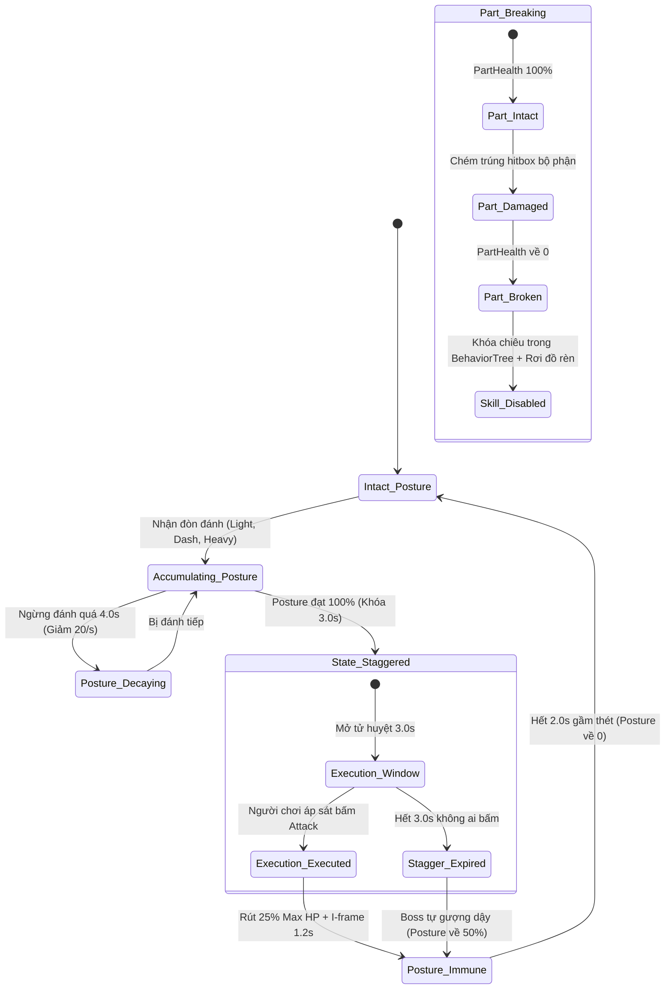

# Stagger & Part Breaking System

> **Status**: Approved  
> **Author**: Systems Designer & Gameplay Programmer  
> **Last Updated**: 2026-09-15  
> **Implements Pillar**: True Skill Expression & Break Posture  
> **Target Engine**: Unreal Engine 5 (GAS, Motion Warping, Chaos Skeletal Mesh)

---

## Overview

Hệ thống Phá Thế Đứng & Phá Hủy Bộ Phận (Stagger & Part Breaking System) là cơ chế mang tính biểu tượng định nghĩa lối chơi "đánh Boss vượt cấp" (Under-leveled Boss Slaying) trong *Project Ascendant*. Được xây dựng trên nền tảng **Unreal Engine Gameplay Ability System (GAS)** kết hợp Unreal Motion Warping và Chaos Skeletal Mesh, hệ thống vận hành theo 2 nhánh cơ chế tương hỗ:
1. **Cơ chế Phá Vỡ Thế Đứng (Stagger & Execution):** Mỗi đòn đánh chuẩn xác, đòn tụ lực (Heavy Charged) hoặc phản đòn né hoàn hảo tích tụ thanh Posture của đối phương. Khi thanh Posture đạt 100%, Boss rơi vào trạng thái choáng vỡ thế (`State.Staggered`) trong **3.0 giây**, mở ra cửa sổ kích hoạt Đòn Kết Liễu (**Execution**) rút thẳng **25% Máu tối đa (Max HP)** bất kể chênh lệch cấp độ hay chỉ số phòng thủ của Boss.
2. **Cơ chế Phá Hủy Bộ Phận (Part Breaking):** Các bộ phận giải phẫu đặc thù của quái vật (sừng, đuôi, giáp ngực, cánh) sở hữu thanh máu bộ phận độc lập. Khi người chơi tập trung tấn công và phá hủy một bộ phận, không chỉ rơi ra nguyên liệu rèn quý hiếm (Crafting Reagents) mà còn **vô hiệu hóa hoặc suy yếu vĩnh viễn các đòn đánh nguy hiểm nhất của Boss** trong phần còn lại của trận đấu.

Hệ thống giải quyết triệt để bài toán game design: Loại bỏ lối chơi "chém rỉa máu khô khan kéo dài hàng chục phút" khi gặp quái cấp cao. Thay vào đó, tưởng thưởng tinh thần dũng cảm, khả năng duy trì nhịp độ tấn công dồn dập (áp lực duy trì đòn đánh trước khi Posture hạ nhiệt sau 4.0s) và tư duy nhắm điểm yếu chiến thuật.

---

## Player Fantasy

*"Con Cự Thú Thiết Giáp cấp 45 giậm chân rung chuyển cả mặt đất, chiếc sừng khổng lồ phát sáng chuẩn bị tung chiêu húc quét chết người. Thay vì sợ hãi rút lui, bạn lướt né xuyên qua khe chân nó, tung liên hoàn kiếm bồi thêm cú chém tụ lực uy lực giáng thẳng vào gốc sừng. Tiếng 'RẮC!' đanh thép vang lên — chiếc sừng gãy lìa văng ra xa, con quái vật gầm thét đau đớn, đòn húc tử thần bị dập tắt vĩnh viễn! Cùng lúc đó, thanh Posture của nó chạm đỉnh 100%; toàn thân nó sụp đổ khụy gối trong cơn choáng váng. Bạn nhảy vọt lên cao cắm sâu lưỡi kiếm vào tim quái vật — một phần tư thanh máu khổng lồ bốc hơi tức thì trong ánh sáng chói lòa."*

Người chơi trải nghiệm cảm giác của một thợ săn bậc thầy: làm chủ không gian, bóc tách từng lớp giáp vũ khí của quái thú và kết liễu đối thủ khổng lồ bằng sự chính xác tuyệt đối.

---

## Detailed Design

### Core Rules

Cơ chế Phá Thế Đứng và Phá Hủy Bộ Phận được điều khiển thông qua class C++ `UGA_StaggerHandler` kết hợp `UAscendantAttributeSet` và Motion Warping trong Unreal Engine 5.

#### 1. Cơ Chế Phá Vỡ Thế Đứng & Đòn Kết Liễu (Stagger & Execution)
- **Ngưỡng Thế Đứng (Posture Capacity):**
  - Quái thường / Tinh anh: `MaxPosture` từ 100 – 250 (dễ dàng vỡ thế sau 1 đòn tụ lực hoặc chuỗi combo 3 nhịp).
  - Boss khu vực: `MaxPosture` từ 500 – 1200 (yêu cầu phối hợp né hoàn hảo, đòn chém lướt và từ 5 – 8 đòn Heavy Charged).
- **Cửa Sổ Choáng Vỡ Thế (`State.Staggered` - 3.0 Giây):**
  - Khi thanh `Posture` đạt 100%: Boss lập tức phát ra âm thanh chuông vỡ vang dội, ngắt toàn bộ hành vi tấn công và khụy gối bất động trong **3.0 giây**.
  - Tử huyệt của Boss phát sáng đỏ rực (`Socket_Execution`).
- **Kích Hoạt Đòn Kết Liễu (Execution Mechanic):**
  - Người chơi áp sát trong phạm vi **250 cm** và nhấn phím **Tấn Công** hoặc **Tương Tác**.
  - Hệ thống sử dụng Unreal *Motion Warping* để hút mượt nhân vật vào đúng vị trí tử huyệt và phát hoạt ảnh kết liễu song hành (`AM_Execute_Boss`).
  - **Sát thương tuyệt đối:** Rút thẳng **25% Máu tối đa (Max HP)** của Boss, hoàn toàn bỏ qua chỉ số Giáp phòng thủ (Defense). Bất kỳ người chơi cấp thấp nào chỉ cần phá vỡ 4 lần Posture là hạ gục Boss.
  - **Bảo hộ I-frame:** Người chơi được cấp thẻ `State.Invulnerable` trong suốt 1.2s của hoạt ảnh kết liễu.
  - **Hồi phục của Boss:** Sau đòn kết liễu, thanh Posture làm mới về 0 và Boss được cấp 2.0s Miễn nhiễm Posture (`State.PostureImmune`) trong lúc đứng dậy và gầm thét, chống việc bị "combo khóa chết" vô tận.
- **Cơ Chế Hạ Nhiệt Thế Đứng (Posture Decay):**
  - Nếu người chơi không gây thêm bất kỳ sát thương nào trong **4.0 giây** (`PostureDecayDelay`), thanh Posture của Boss sẽ tự động hạ nhiệt với tốc độ **20 điểm / giây** (`PostureDecayRate`). Điều này buộc người chơi phải liên tục bám sát và tấn công dồn dập, không được câu giờ chạy trốn.

#### 2. Cơ Chế Phá Hủy Bộ Phận (Part Breaking System)
Mỗi Boss sở hữu các bộ phận giải phẫu với thanh máu độc lập (`PartHealth`), yêu cầu người chơi chém trúng hitbox xương của bộ phận đó:

| Bộ phận (Part Tag) | Tỷ lệ máu bộ phận | Hiệu ứng khi bị phá vỡ (Break Effect) | Kỹ năng Boss bị vô hiệu hóa | Nguyên liệu rơi độc quyền |
| :--- | :---: | :--- | :--- | :--- |
| **`Boss.Part.Horn` (Sừng)** | 20% Max HP Boss | Sừng gãy đôi, quái bị choáng váng 1.5s tại chỗ. | **Cấm vĩnh viễn** chiêu Húc Càn / Phun Hỏa Tuyệt Kỹ. | `Item_Beast_Horn_Shard` |
| **`Boss.Part.Tail` (Đuôi)** | 15% Max HP Boss | Đuôi đứt lìa văng ra sàn đấu, Boss mất thăng bằng. | **Cấm vĩnh viễn** chiêu Quất Đuôi 360° phản kích sau lưng. | `Item_Dragon_Tail_Sinew` |
| **`Boss.Part.Armor` (Giáp Ngực)** | 25% Max HP Boss | Lớp giáp vỡ nát, lộ ra trái tim phát sáng đỏ. | Vùng ngực trở thành **Điểm Yếu (Weakpoint)** nhận thêm +50% sát thương. | `Item_Hardened_Carapace` |
| **`Boss.Part.Wings` (Đôi Cánh)** | 20% Max HP Boss | Cánh rách nát, Boss rơi mạnh từ trên không xuống đất. | **Cấm vĩnh viễn** cơ chế bay lượn xả đạn từ xa. | `Item_Wyvern_Wing_Membrane` |

### States and Transitions

### Interactions with Other Systems

- **Attributes System (`attributes-system.md`):**
  - Đọc `Posture`, `MaxPosture`, `PostureDecayRate`, `PostureDecayDelay` và thực thi trừ thẳng 25% vào `Health` qua `stagger_execution_hp_pct`.
- **Core Combat System (`combat-system.md`):**
  - Tiếp nhận sát thương Posture từ chuỗi combo đòn đánh thường (10–30), Dash Attack (25) và Heavy Charged Attack (60).
- **Prototype Boss AI (`boss-ai.md`):**
  - Khi `State.Staggered` được gán: Ép Behavior Tree của Boss ngắt mọi Task đang chạy và chuyển sang nhánh `Staggered Recovery`.
  - Khi một bộ phận bị phá hủy (`Part_Broken`): Gửi sự kiện Blackboard làm mới điều kiện chọn kỹ năng (ví dụ: `bCanUseHornCharge = false`).
- **Blacksmithing System (`blacksmithing-system.md`):**
  - Sinh ra các vật phẩm nguyên liệu bậc cao trực tiếp tại vị trí mảnh vỡ bộ phận rơi xuống đất.

---

## Formulas

### 1. Tích Lũy Thế Đứng (Posture Accumulation)
$$\text{CurrentPosture}(t + \Delta t) = \min(\text{MaxPosture}, \text{CurrentPosture}(t) + \text{IncomingPostureDamage})$$

### 2. Hạ Nhiệt Thế Đứng Khi Ngừng Tấn Công (Posture Decay Formula)
$$\text{PostureDecay}(t) = \begin{cases} 
  0 & \text{nếu } t - t_{\text{last\_hit}} < \text{PostureDecayDelay} \ (4.0\text{s}) \\
  \max(0, \text{CurrentPosture} - \text{PostureDecayRate} \times \Delta t) & \text{nếu } t - t_{\text{last\_hit}} \ge 4.0\text{s}
\end{cases}$$
- *Quy tắc:* Mỗi khi nhận 1 đòn đánh mới, đồng hồ đếm ngược $t_{\text{last\_hit}}$ được làm mới về 0.

### 3. Sát Thương Đòn Kết Liễu (Execution True Damage)
$$\text{ExecutionDamage} = \text{MaxHealth}_{\text{Target}} \times \text{stagger\_execution\_hp\_pct} = \text{MaxHealth}_{\text{Target}} \times 0.25$$
- Luôn là sát thương chuẩn (True Damage / Direct Attribute Set), triệt tiêu hoàn toàn chỉ số giảm thương của Giáp.

### 4. Thanh Máu Bộ Phận (Part Health Formula)
$$\text{PartHealth}_{\text{Max}} = \text{MaxHealth}_{\text{Boss}} \times \text{PartRatio}$$
- Trong đó `PartRatio` dao động từ $0.15$ đến $0.25$ tùy theo loại bộ phận. Khi người chơi chém trúng bộ phận, sát thương vừa trừ vào Máu tổng của Boss vừa trừ vào `PartHealth`.

---

## Edge Cases

- **Boss Bị Stagger Khi Đang Bay Trên Không (Mid-Air Stagger):**
  - Boss lập tức bị hủy Montage bay lượn, rơi tự do xuống sàn đấu với hiệu ứng va chạm chấn động (Crash Landing Montage), mở ra cửa sổ Execution 3.0s dưới mặt đất.
- **Bị Quái Phụ Tấn Công Khi Đang Làm Hoạt Ảnh Kết Liễu:**
  - Hoạt ảnh kết liễu 1.2s cấp thẻ `State.Invulnerable` tuyệt đối, mọi đòn tấn công của quái đệ (Minions) đi xuyên qua người chơi không gây sát thương hay ngắt chiêu.
- **Tranh Chấp Đòn Kết Liễu Giữa Nhiều Người Chơi ([ADR-0001](file:///mnt/Data/Projects/project-games/docs/architecture/adr-0001-open-world-mmo-combat-networking.md)):**
  - Trong 1.5s đầu tiên của cửa sổ Stagger, quyền thực hiện đòn chém chính rút 25% HP thuộc độc quyền về người chơi gây đòn bẻ gãy thế đứng cuối cùng (Posture Break Finisher).
  - Từ giây 1.5 đến 3.0s, quyền này mở tự do cho mọi người chơi tham chiến (Server Authority xác thực theo thứ tự RPC đến máy chủ).
  - Bất kỳ người chơi nào khác kích hoạt tương tác kết liễu trong lúc người đầu tiên đang thi triển hoạt ảnh sẽ tự động chuyển sang hoạt ảnh bồi đòn phối hợp (Contested Assist Strike) gây thêm 5% sát thương phụ mà không làm glitch hoạt ảnh.
- **Hết 3.0s Mà Không Ai Tung Đòn Kết Liễu:**
  - Boss tự phục hồi thế đứng, gầm thét tạo sóng đẩy lùi 300cm, thanh Posture hồi phục lại mốc **50%** (thay vì về 0) để người chơi có thể nhanh chóng tích lũy lại cơ hội tiếp theo.

---

## Dependencies

- **Attributes System (`attributes-system.md`):** Cung cấp và quản lý `Posture`, `MaxPosture`, `PostureDecayRate`, `stagger_execution_hp_pct`.
- **Core Combat System (`combat-system.md`):** Cung cấp sát thương Posture từ các đòn đánh thường, Dash Attack và Heavy Charged Attack.
- **Prototype Boss AI (`boss-ai.md`):** Nhận tín hiệu chuyển trạng thái Staggered và cập nhật cây hành vi khi bộ phận bị vỡ.

---

## Tuning Knobs

| Tên Biến Số | Giá Trị Mặc Định | Biên Độ Khuyến Nghị | Ý Nghĩa Cân Bằng |
| :--- | :---: | :---: | :--- |
| `StaggerDuration` | 3.0s | 2.5s – 4.0s | Thời lượng cửa sổ quái khụy gối cho phép kết liễu. |
| `PostureDecayDelay` | 4.0s | 3.0s – 5.0s | Thời gian ngừng tấn công trước khi Posture bắt đầu hạ nhiệt. |
| `PostureDecayRate` | 20.0/s | 15.0 – 30.0/s | Tốc độ hạ nhiệt thanh Posture mỗi giây. |
| `ExecutionRange` | 250 cm | 200 – 300 cm | Cự ly tối đa để kích hoạt hút Motion Warping vào tử huyệt. |
| `ExecutionInvulnDuration`| 1.2s | 1.0s – 1.5s | Thời lượng bất tử bảo vệ người chơi khi làm hoạt ảnh kết liễu. |
| `BossRecoveryPostureRefund`| 50.0% | 30% – 60% | Lượng Posture giữ lại nếu người chơi bỏ lỡ cửa sổ kết liễu. |
| `PartRatio_Horn` | 0.20 | 0.15 – 0.25 | Tỷ lệ máu sừng so với máu tổng của Boss. |
| `PartRatio_Tail` | 0.15 | 0.10 – 0.20 | Tỷ lệ máu đuôi so với máu tổng của Boss. |

---

## Visual/Audio Requirements

- **VFX Niagara:**
  - `NS_PostureBreak_Sparks`: Vụ nổ tinh thể ánh vàng cam chói lòa bùng nổ quanh Boss khi Posture đạt 100%.
  - `NS_PartBreak_Debris`: Mảnh vỡ xương/vảy đá bắn tung tóe khi bộ phận bị phá hủy.
  - `NS_Execution_BloodSlash`: Nhát chém đỏ thẫm kéo dài theo chuyển động Motion Warping của vũ khí.
- **Âm thanh (Audio SFX):**
  - `SFX_PostureBreak_Gong`: Tiếng chuông đồng / thanh âm kim loại ngân vang trầm hùng báo hiệu vỡ thế.
  - `SFX_PartBreak_Snap`: Tiếng rạn vỡ đanh thép của xương hoặc giáp đá.
  - `SFX_Execution_Impact`: Tiếng đâm xuyên sâu thấu xương kèm tiếng nổ xung lực.

---

## UI Requirements

- **HUD Phản Hồi:**
  - Thanh Posture nằm dưới thanh Máu của Boss (màu vàng kim), nhấp nháy đỏ khi sắp chạm 100%.
  - Ký hiệu Tử Huyệt (Execution Reticle): Vòng tròn tâm ngắm phát sáng nổi trên đỉnh đầu Boss kèm nút bấm gợi ý (Icon phím Attack / Interact).
  - Biểu ngữ thông báo: *"BỘ PHẬN ĐÃ BỊ PHÁ HỦY: SỪNG CỰ THÚ"* xuất hiện trong 1.5s trên màn hình.

---

## Acceptance Criteria

- [ ] **AC-1 (Kích Hoạt Choáng Vỡ Thế):** Đạt 100% Posture, Boss lập tức ngắt chiêu, khụy gối trong 3.0s và phát âm thanh chuông ngân `SFX_PostureBreak_Gong`.
- [ ] **AC-2 (Đòn Kết Liễu 25% Max HP):** Tiếp cận trong 250cm nhấn nút Tấn công kích hoạt Motion Warping, hút nhân vật vào tử huyệt, cấp I-frame 1.2s và trừ chuẩn xác 25% Max HP của Boss.
- [ ] **AC-3 (Hạ Nhiệt Posture Sau 4.0s):** Ngừng đánh trong 4.0s, thanh Posture của Boss tự động tụt 20 điểm/s cho đến khi bị đánh trở lại.
- [ ] **AC-4 (Phá Hủy Bộ Phận & Khóa Chiêu):** Khi thanh máu bộ phận về 0, mảnh vỡ Niagara bắn ra, vật phẩm rèn rơi xuống đất, và Boss bị khóa hoàn toàn chiêu thức gắn với bộ phận đó trong Behavior Tree.

---

## Open Questions

- *Không còn câu hỏi mở tồn đọng. Toàn bộ thông số hoàn toàn khớp với attributes-system và combat-system.*
