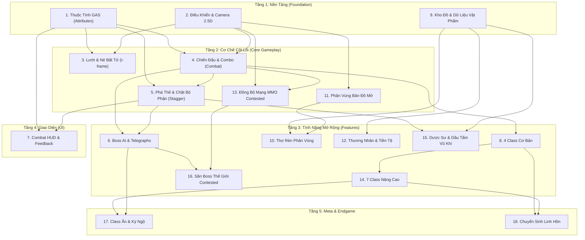

# Systems Index: Project Ascendant

> **Status**: Approved  
> **Created**: 2026-09-14  
> **Last Updated**: 2026-09-14  
> **Source Concept**: `design/gdd/game-concept.md`  
> **Target Engine**: Unreal Engine 5 (C++, Gameplay Ability System, Niagara)

---

## Overview

Project Ascendant là một tựa game 2.5D Isometric Action RPG hardcore nơi kỹ năng người chơi là trung tâm. Vòng lặp gameplay cốt lõi (Core Loop) được vận hành bởi sự kết hợp giữa: **Tránh né i-frame chuẩn xác**, **cơ chế Phá vỡ thế đứng (Stagger) để đánh Boss vượt cấp**, **kim tự tháp 12 Chức nghiệp** với 4 Class khởi đầu làm nền tảng và 8 Class mở khóa qua kỳ ngộ/kỹ năng, cùng **hệ thống Thợ rèn dã ngoại phân vùng** thúc đẩy người chơi mạo hiểm thám hiểm các vùng đất không giới hạn cấp độ.

---

## Systems Enumeration

| # | Tên Hệ Thống (System Name) | Nhóm (Category) | Mức Ưu Tiên | Trạng Thái | Tài Liệu Thiết Kế (Design Doc) | Phụ Thuộc (Depends On) |
|---|----------------------------|-----------------|-------------|------------|--------------------------------|------------------------|
| 1 | Character Attributes & Stats Engine (GAS) *(inferred)* | Core | MVP | Approved | `design/gdd/attributes-system.md` | — |
| 2 | Input & Isometric Camera Controller *(inferred)* | Core | MVP | Approved | `design/gdd/isometric-controller.md` | — |
| 3 | Dash & I-frame Evasion | Gameplay | MVP | Approved | `design/gdd/dash-evasion.md` | Attributes (1), Controller (2) |
| 4 | Core Combat & Combo System | Gameplay | MVP | Approved | `design/gdd/combat-system.md` | Attributes (1), Controller (2), Dash Evasion (3) |
| 5 | Stagger & Part Breaking System | Gameplay | MVP | Approved | `design/gdd/stagger-system.md` | Attributes (1), Combat (4) |
| 6 | Prototype Boss AI & Telegraphs | Gameplay | MVP | Approved | `design/gdd/boss-ai.md` | Combat (4), Stagger (5) |
| 7 | Minimal Combat HUD & Feedback *(inferred)* | UI | MVP | Approved | `design/gdd/combat-hud.md` | Attributes (1), Stagger (5) |
| 8 | Skill Progression & Skill Book System | Progression | Vertical Slice | Approved | `design/gdd/skill-progression-system.md` | Attributes (1), Inventory (9) |
| 9 | Inventory & 5-Tier Item Database *(inferred)* | Economy | Vertical Slice | Approved | `design/gdd/inventory-system.md` | — |
| 10 | 4 Foundational Classes & Skill Trees | Progression | Vertical Slice | Approved | `design/gdd/foundational-classes.md` | Attributes (1), Combat (4), Skills (8) |
| 11 | Zone-tiered Blacksmithing System | Economy | Vertical Slice | Approved | `design/gdd/blacksmithing-system.md` | Inventory (9), Zones (12) |
| 12 | Non-gated Open Zones & Checkpoints | World | Vertical Slice | Approved | `design/gdd/zone-system.md` | Controller (2) |
| 13 | Merchant & Currency Economy Loop | Economy | Vertical Slice | Approved | `design/gdd/merchant-economy.md` | Inventory (9) |
| 14 | Open World MMO Netcode & Contested Aggro Sync | Multiplayer | Vertical Slice | Approved | `design/gdd/multiplayer-coop.md` | Controller (2), Combat (4) |
| 15 | 7 Advanced Classes (4 Rare + 3 Epic) | Progression | Alpha | Not Started | `design/gdd/advanced-classes.md` | Foundational Classes (10) |
| 16 | Apothecary & Weapon Oils System | Gameplay | Alpha | Not Started | `design/gdd/apothecary-system.md` | Inventory (9), Stagger (5) |
| 17 | Open World Boss Raids & Contested Battles | Multiplayer | Alpha | Not Started | `design/gdd/world-bosses.md` | Multiplayer (14), Boss AI (6) |
| 18 | 1–2 Hidden/Mythic Classes & Trials | Progression | Full Vision | Not Started | `design/gdd/hidden-classes.md` | Advanced Classes (15) |
| 19 | Reincarnation & Soul Prestige Loop | Meta | Full Vision | Not Started | `design/gdd/reincarnation.md` | Attributes (1), Classes (15) |

---

## Dependency Graph (Sơ đồ Phụ thuộc)

---

## Thứ tự Thiết kế Khuyến nghị (Recommended Design Sequence)

Để từng bước hiện thực hóa dự án theo nguyên tắc "chắc móng trước khi xây tầng", thứ tự thiết kế GDD chi tiết được xếp như sau:

| Thứ Tự | Hệ Thống | Mức Ưu Tiên | Tầng Kiến Trúc | Chuyên Viên Phụ Trách | Ước Lượng Độ Phức Tạp |
| :---: | :--- | :---: | :---: | :--- | :---: |
| **1** | **Character Attributes & Stats (GAS)** | MVP | Foundation | systems-designer | Medium (2 phiên) |
| **2** | **Input & Isometric Camera Controller** | MVP | Foundation | gameplay-programmer | Small (1 phiên) |
| **3** | **Core Combat, Combo & Dash I-frame** | MVP | Core | gameplay-programmer | Large (3 phiên) |
| **4** | **Stagger & Part Breaking System** | MVP | Core | systems-designer | Medium (2 phiên) |
| **5** | **Prototype Boss AI & Telegraphs** | MVP | Feature | ai-programmer | Medium (2 phiên) |
| **6** | **Combat HUD & Feedback UI** | MVP | Presentation | ux-designer | Small (1 phiên) |
| **7** | **Inventory & 5-Tier Item Database** | Vertical Slice | Foundation | systems-designer | Medium (2 phiên) |
| **8** | **4 Foundational Classes & Skill Trees** | Vertical Slice | Feature | game-designer | Large (3 phiên) |
| **9** | **Zone-tiered Blacksmithing System** | Vertical Slice | Feature | economy-designer | Medium (2 phiên) |
| **10** | **Open World MMO Netcode & Contested Aggro Sync** | Vertical Slice | Core | network-programmer | Large (3 phiên) |
