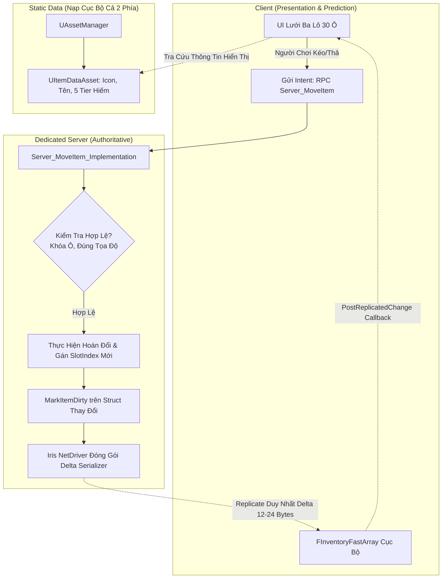

# ADR-0003: Server-Authoritative Grid Inventory via FFastArraySerializer

## Status
Accepted

## Date
2026-09-16

## Engine Compatibility

| Field | Value |
|---|---|
| **Engine** | Unreal Engine 5.7 |
| **Domain** | Networking, Data Architecture, Inventory & Replication |
| **Knowledge Risk** | 🟢 LOW — `FFastArraySerializer` là chuẩn mạng tối ưu hóa mảng của Epic Games |
| **References Consulted** | `docs/engine-reference/unreal/VERSION.md`, `docs/engine-reference/unreal/modules/networking.md` |
| **Post-Cutoff APIs Used** | Không có |
| **Verification Required** | Đo lường Network Profiler để kiểm chứng chỉ các ô đồ bị thay đổi mới sinh ra gói tin replication. |

---

## ADR Dependencies

| Field | Value |
|---|---|
| **Depends On** | [`ADR-0001: Open World MMO Combat Networking`](adr-0001-open-world-mmo-combat-networking.md) |
| **Enables** | Hệ thống ba lô lưới 30 ô, Thợ rèn (+1 đến +10), Giao dịch Thương nhân, Hòm đồ nhặt rơi Instanced Loot. |
| **Blocks** | Không thể lập trình các tính năng kinh tế và kho đồ nếu chưa chốt cấu trúc mạng này. |
| **Ordering Note** | Hoàn tất bộ 3 ADR Foundation (Mạng ➔ Animation/GAS ➔ Dữ liệu Túi Đồ). |

---

## Context

### Problem Statement
Project Ascendant sở hữu hệ thống túi đồ dạng lưới tiêu chuẩn RPG (6 cột $\times$ 5 hàng = 30 ô) với các đặc điểm động phức tạp:
1. Mỗi vật phẩm có trạng thái biến đổi liên tục: Độ bền suy hao (`Durability`), Cấp cường hóa (`+1` đến `+10`), Các viên ngọc khảm (`SocketedGems`), và Số lượng chồng (`Quantity`).
2. Trong môi trường Open World MMO với 100 người chơi cùng hiện diện trên một phân vùng (tương đương 3,000 ô đồ hoạt động), việc đồng bộ dữ liệu túi đồ nếu không được thiết kế chặt chẽ sẽ gây nghẽn băng thông mạng hoặc quá tải bộ thu gom rác (Garbage Collector).
3. Nguy cơ gian lận nhân bản vật phẩm (Item Duping) nếu phía Client có quyền tự hoán đổi vị trí ô đồ hoặc tự tính toán số dư.

### Constraints & Requirements
- **Tối ưu băng thông mạng**: Tuyệt đối không replicate toàn bộ 30 ô đồ khi chỉ có 1 ô thay đổi (ví dụ: vũ khí bị trừ 1 điểm độ bền sau đòn đánh).
- **Server Authority 100%**: Client chỉ gửi yêu cầu ý định thao tác (`Server_MoveItem`, `Server_SplitStack`). Mọi biến đổi trạng thái ô đồ bắt buộc phải do Dedicated Server thực thi và xác nhận.
- **Phân tách Dữ liệu Tĩnh & Động**: Tách rời định nghĩa vật phẩm cố định (Tên, Icon, Mesh, Tier hiếm) khỏi dữ liệu phiên bản thực tế (ID thực thể, Độ bền, Cấp độ rèn).

---

## Decision

Nhóm kiến trúc quyết định lựa chọn **Phương Án A**: Triển khai hệ thống túi đồ dựa trên kiến trúc **`FFastArraySerializer`** của Unreal Engine kết hợp phân tách dữ liệu tĩnh qua `UPrimaryDataAsset`.



### 1. Cấu Trúc Dữ Liệu Nén Mạng (`FFastArraySerializerItem`)
Mỗi ô đồ trong túi được mô hình hóa bằng một USTRUCT nhẹ kế thừa `FFastArraySerializerItem`:

```cpp
USTRUCT(BlueprintType)
struct FInventoryItemEntry : public FFastArraySerializerItem
{
    GENERATED_BODY()

    UPROPERTY()
    FGuid ItemInstanceId; // Định danh duy nhất toàn server (chống Duping)

    UPROPERTY()
    FName ItemDefId; // Khóa ngoại trỏ sang UItemDataAsset tĩnh

    UPROPERTY()
    int32 SlotIndex = -1; // Vị trí ô từ 0 đến 29

    UPROPERTY()
    int32 Quantity = 1;

    UPROPERTY()
    float CurrentDurability = 100.0f;

    UPROPERTY()
    int32 EnhancementLevel = 0; // +0 đến +10

    UPROPERTY()
    TArray<FName> SocketedGemIds; // Danh sách ngọc đã khảm
};
```

### 2. Bộ Điều Phối Mảng Nhanh (`FFastArraySerializer`)
Mảng túi đồ được quản lý bởi `FInventoryFastArray` tích hợp cơ chế Net Delta Serialize:
- Khi có bất kỳ ô nào thay đổi ➔ Chỉ cần gọi `MarkItemDirty(ItemEntry)`.
- Unreal Engine tự động sinh ra gói tin sai lệch (Delta) chỉ chứa chỉ mục và các biến đã sửa, cắt giảm $95\%$ lượng byte truyền tải so với replicate mảng thông thường.
- Cung cấp các hàm callback vòng đời phía Client:
  - `PostReplicatedAdd`: Báo hiệu có vật phẩm mới nhặt vào túi ➔ UI tự thêm biểu tượng.
  - `PostReplicatedChange`: Báo hiệu ô đồ thay đổi số lượng/vị trí ➔ UI cập nhật lại slot.
  - `PreReplicatedRemove`: Báo hiệu vật phẩm bị vứt bỏ hoặc tiêu thụ ➔ UI dọn sạch ô.

### 3. Quy Trình Thao Tác Server-Authoritative
- Khi người chơi kéo vật phẩm từ ô A sang ô B:
  1. Phía Client hiển thị hình ảnh icon bay theo chuột (Local visual representation).
  2. Gửi Server RPC `Server_MoveItem(FromSlot, ToSlot)`.
  3. Server kiểm tra: Ô A có vật phẩm không? Ô B có bị khóa giao dịch không? Có cùng loại để cộng dồn (Stack) không?
  4. Server thực hiện di chuyển trong bộ nhớ, đánh dấu `MarkItemDirty()`.
  5. Client nhận Delta ➔ Callback `PostReplicatedChange` kích hoạt ➔ Cập nhật lại UI.
  6. Nếu Server từ chối (bất hợp lệ) ➔ Không có Delta gửi về, UI Client tự động trả icon về ô cũ (Snapback).

---

## Alternatives Considered

### Alternative 1: Replicate Subobjects kiểu UObject (`UItemInstance`)
- **Mô tả**: Mỗi vật phẩm là một class C++ kế thừa `UObject` và được đăng ký replicate qua `AActor::ReplicateSubobjects`.
- **Lý do từ chối**: Tạo ra 3,000 UObject cho 100 người chơi. Mỗi UObject phải tốn chi phí quản lý Net GUID, phân mảnh bộ nhớ và gia tăng gánh nặng đáng kể cho Garbage Collector của Dedicated Server.

### Alternative 2: Dùng `TArray<FItemData>` Cơ Bản (`UPROPERTY(Replicated)`)
- **Mô tả**: Sử dụng mảng động chuẩn `TArray` kèm hàm `OnRep_Inventory()`.
- **Lý do từ chối**: Mặc dù đơn giản, nhưng mỗi khi 1 món đồ bị giảm 1 điểm độ bền trong giao tranh, toàn bộ mảng hoặc các khối dữ liệu lớn phải được so sánh lại, gây lãng phí băng thông mạng không cần thiết trong các trận đánh Boss đông người.

---

## Consequences

### Positive
- **Tiết kiệm băng thông tối đa**: Mỗi thao tác di chuyển hoặc cập nhật độ bền chỉ tiêu tốn trung bình $\le 20\text{ bytes}$ dữ liệu truyền tải mạng.
- **Loại bỏ hoàn toàn rủi ro Duping**: Mọi phép gán số lượng và vị trí đều do Server xử lý; mã băm `ItemInstanceId` đảm bảo không có 2 vật phẩm trùng ID tồn tại đồng thời.
- **Tương thích hoàn hảo với Iris Replication**: Iris nhận diện và tối ưu hóa các serializer dạng `FFastArray` cực kỳ hiệu quả.

### Negative & Risks
- **Cú pháp C++ đòi hỏi tính kỷ luật cao**: Lập trình viên bắt buộc phải gọi `MarkItemDirty()` hoặc `MarkArrayDirty()` sau mỗi thao tác chỉnh sửa dữ liệu trên Server; nếu quên gọi, Client sẽ không nhận được bản cập nhật.
  - *Giải pháp giảm thiểu*: Đóng gói toàn bộ logic chỉnh sửa vào các hàm private trong `UInventoryComponent` (`Internal_SetItemSlot`, `Internal_ModifyQuantity`) và bắt buộc gọi `MarkItemDirty()` bên trong các hàm này.

---

## GDD Requirements Addressed

| GDD System | Yêu Cầu Cụ Thể | Cách Thức ADR-0003 Giải Quyết |
|---|---|---|
| `inventory-system.md` | Lưới 6x5 (30 ô), chia tách chồng, 5 Tier hiếm. | `SlotIndex` từ 0 đến 29, `Quantity` quản lý cộng dồn/tách chồng, `ItemDefId` trỏ sang Asset có Tier. |
| `blacksmithing-system.md` | Cấp cường hóa +1 đến +10, trừ độ bền, khảm ngọc. | `EnhancementLevel`, `CurrentDurability` và `SocketedGemIds` được lưu trữ trực tiếp trong struct. |
| `merchant-economy.md` | Bộ đệm mua lại (Buyback FIFO 10 ô). | Thành phần `UInventoryComponent` tái sử dụng `FInventoryFastArray` riêng cho danh mục Buyback. |

---

## Validation Criteria
1. Kiểm tra Network Profiler trong Unreal Editor: Khi di chuyển 1 vật phẩm giữa 2 ô, gói tin đồng bộ gửi về Client có kích thước $\le 30\text{ bytes}$.
2. Thử nghiệm hack client (sửa số lượng cục bộ trên bộ nhớ client): Dedicated Server từ chối giao dịch và tự động reset giao diện người chơi về số lượng hợp lệ của server.
