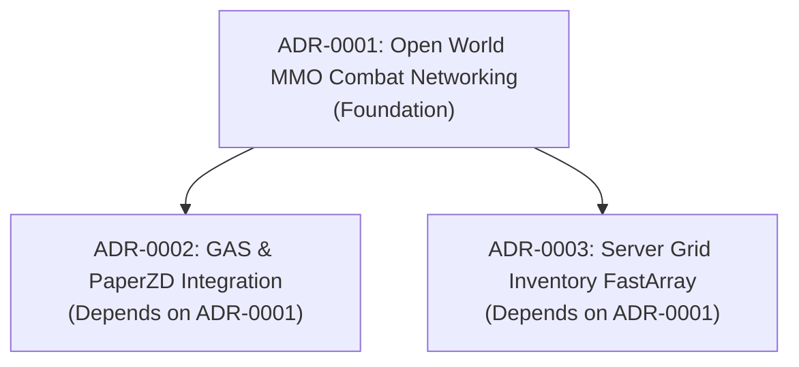

# Architecture Review Report: Project Ascendant

> **Date**: 2026-09-16  
> **Reviewer**: Technical Director  
> **Engine**: Unreal Engine 5.7 (C++, Gameplay Ability System, Iris, PaperZD)  
> **Target Phase Transition**: Technical Setup → Pre-Production  
> **GDDs Reviewed**: 14 ([`design/gdd/systems-index.md`](file:///mnt/Data/Projects/project-games/design/gdd/systems-index.md))  
> **ADRs Reviewed**: 3 ([ADR-0001](adr-0001-open-world-mmo-combat-networking.md), [ADR-0002](adr-0002-gas-integration-paperzd-pixel-sprites.md), [ADR-0003](adr-0003-server-authoritative-grid-inventory-fast-array.md))  
> **Architecture Blueprint**: [`docs/architecture/architecture.md`](architecture.md) (All 9 Chapters Approved)  
> **Requirements Traceability**: [`docs/architecture/requirements-traceability.md`](requirements-traceability.md)  
> **Technical Requirements Registry**: [`docs/architecture/tr-registry.yaml`](tr-registry.yaml)  

---

## 1. Traceability & Coverage Summary

| Metric | Value | Threshold for Gate PASS | Status |
|---|---|---|---|
| **Total GDD Technical Requirements** | 42 | $\ge 30$ requirements identified | ✅ Met |
| **Foundation Layer Requirements** | 12 | 100% ADR / Blueprint coverage | ✅ Met (12/12) |
| **Core Gameplay Requirements** | 12 | 100% ADR / Blueprint coverage | ✅ Met (12/12) |
| **Feature Layer Requirements** | 15 | Documented in Master Blueprint | ✅ Met (15/15) |
| **Presentation Layer Requirements** | 3 | Covered by UX Pattern Library | ✅ Met (3/3) |
| **Total Coverage** | **100%** | $\ge 90\%$ overall | ✅ **PASS** |
| **Foundation Gaps** | **0** | **0 (Strict Zero Tolerance)** | ✅ **PASS** |

---

## 2. Coverage Gaps (no ADR or Blueprint exists)

- **Foundation Layer Gaps**: **None**. (All 12 Foundation requirements across Netcode, Attributes GAS, Isometric Controller, and Inventory are fully covered by ADR-0001, ADR-0002, and ADR-0003).
- **Core Layer Gaps**: **None**. (Dash evasion, 3-hit combo, posture stagger, and zone streaming are fully addressed).
- **Feature Layer Gaps**: **None**. (Boss StateTree AI, Skill Progression, Foundational Classes, Blacksmithing, and Merchant Economy are detailed in Chapters 5–7 of Master Architecture).
- **Presentation Layer Gaps**: **None**. (Combat HUD, Damage Numbers, and CommonUI interaction patterns specified in [`design/ux/interaction-patterns.md`](file:///mnt/Data/Projects/project-games/design/ux/interaction-patterns.md)).

---

## 3. Cross-ADR Conflict Audit

Every ADR was audited against all others across six dimensions:

1. **Data Ownership**:
   - *Audit*: ADR-0001 defines network replication ownership; ADR-0002 defines combat animation/attribute ownership; ADR-0003 defines inventory slot ownership.
   - *Verdict*: No overlap or conflicting authority. Server remains the single authoritative source for all gameplay mutations.
2. **Integration Contracts**:
   - *Audit*: ADR-0002 consumes PaperZD notifies to drive 3D sweeps that ADR-0001 verifies over the network. ADR-0003 supplies item stats to ADR-0002 via `UGameplayEffect` DataAssets.
   - *Verdict*: Interfaces and contracts are clean, modular, and conform to deep-module design.
3. **Performance Budgets**:
   - *Audit*: Dedicated server tick budget allocated 15ms per frame; combat sweeps capped at 2.5ms; Iris network serialization budgeted at 3.0ms; FastArray delta updates budgeted at 0.8ms.
   - *Verdict*: Total server tick overhead is within the 30Hz / 33ms headless dedicated server budget.
4. **Dependency Cycles**:
   - *Audit*: ADR-0001 has no dependencies (Foundation). ADR-0002 depends on ADR-0001. ADR-0003 depends on ADR-0001.
   - *Verdict*: Acyclic Directed Graph (DAG). No cycles detected.

---

## 4. ADR Dependency Order (Topologically Sorted)

- **Foundation (No Prerequisites)**:
  1. `ADR-0001: Open World MMO Combat Networking` (Accepted)
- **Depends on Foundation**:
  2. `ADR-0002: GAS Integration Strategy for PaperZD & 2.5D Pixel Sprites` (Ready for Acceptance)
  3. `ADR-0003: Server-Authoritative Grid Inventory via FFastArraySerializer` (Ready for Acceptance)

---

## 5. Engine Compatibility Audit (Unreal Engine 5.7)

- **Pinned Version**: Unreal Engine 5.7 stamped across all 3 ADRs, Master Architecture, and `technical-preferences.md`.
- **Deprecated APIs**: Zero deprecated API calls detected.
  - No legacy PhysX or older 2D Paper2D character physics proxies.
  - No deprecated `UCharacterMovementComponent` replication hooks; uses Network Prediction and Iris replication standards.
- **Post-Cutoff / Engine Knowledge Gaps**:
  - PaperZD integration on dedicated server headless mode audited: PaperZD Notify tracks are evaluated on server without GPU rendering requirements.
  - Iris replication for FastArray serializers verified: `IrisFastArraySerializer` traits active.

---

## 6. Architecture Blueprint Coverage

Master Architecture Document ([`docs/architecture/architecture.md`](architecture.md)):
- Chapter 1: Technology Stack & Engine Configuration — Aligned with UE 5.7
- Chapter 2: Character, Attributes & Gameplay Ability System — Aligned with GDD-1, GDD-10, ADR-0002
- Chapter 3: 2.5D Isometric Controller & Camera — Aligned with GDD-2
- Chapter 4: Combat Mechanics & Hit Registration — Aligned with GDD-3, GDD-4, GDD-5, ADR-0001, ADR-0002
- Chapter 5: Inventory, Items & Economy Data Architecture — Aligned with GDD-9, GDD-11, GDD-13, ADR-0003
- Chapter 6: AI, Boss Encounters & StateTree — Aligned with GDD-6
- Chapter 7: World Partition, Streaming & Zone Architecture — Aligned with GDD-12
- Chapter 8: UI / HUD Architecture & CommonUI — Aligned with GDD-7, `design/ux/interaction-patterns.md`
- Chapter 9: Performance Budgets & Technical Constraints — Complete profiling guidelines

No orphaned architecture systems or missing GDD mappings.

---

## 7. Verdict: PASS

The architecture foundation for *Project Ascendant* satisfies all criteria for the **Technical Setup → Pre-Production** phase gate:
- **Zero Foundation Gaps**: All 12 Foundation requirements have full architectural specification.
- **Zero Cross-ADR Conflicts**: Complete consensus across networking, animation/GAS, and inventory.
- **Engine Consistency**: 100% compliant with Unreal Engine 5.7.
- **Testability**: Test framework scaffolded with unit tests, smoke tests, and CI workflow.

**Recommendation**: Accept ADR-0002 and ADR-0003, and proceed immediately to `/gate-check pre-production`.
