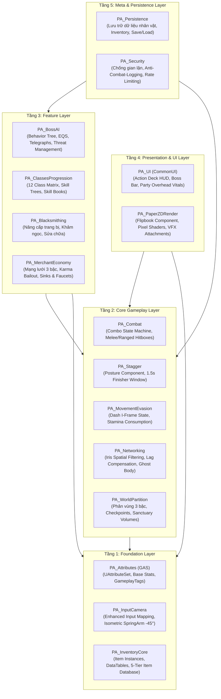
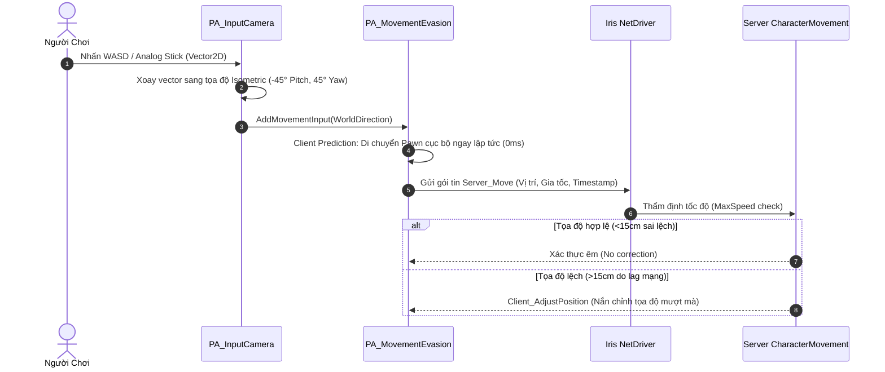
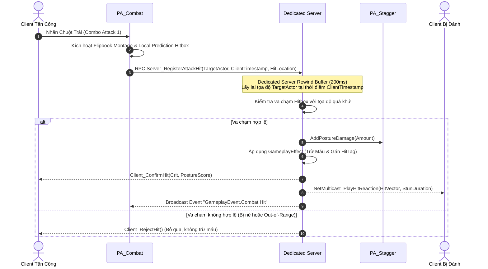
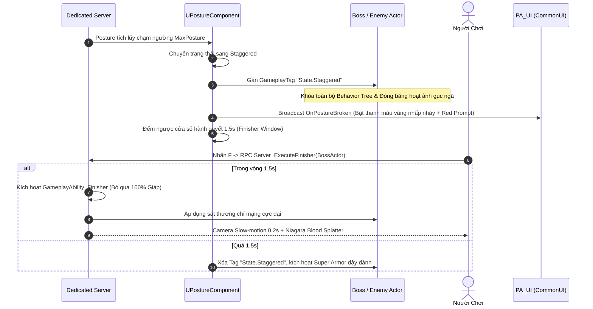
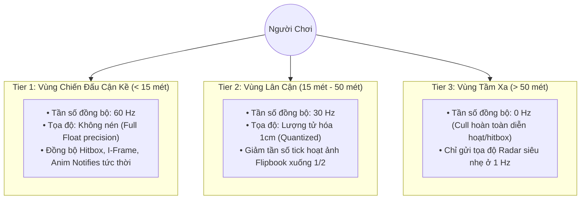
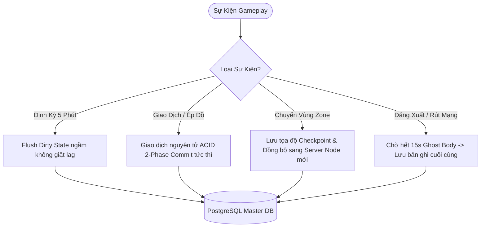
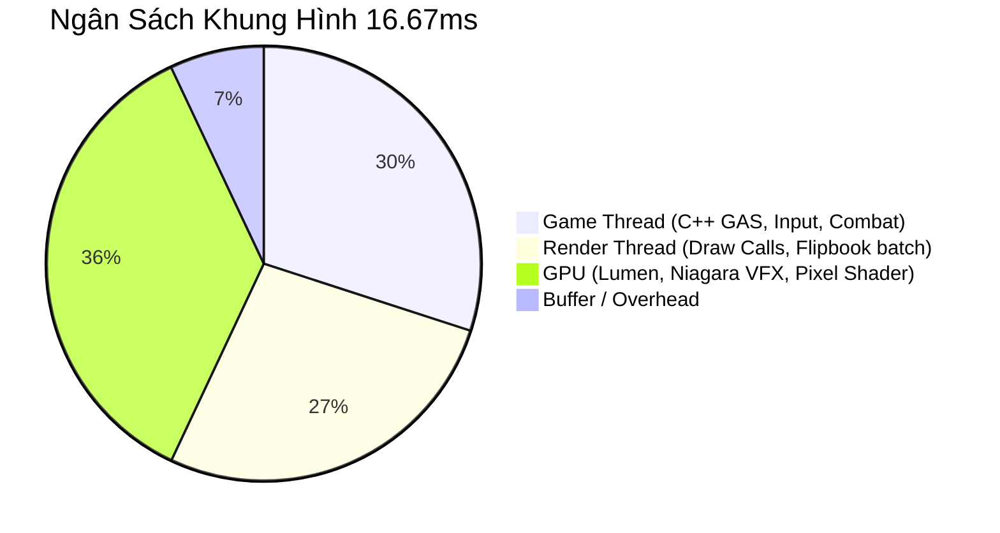
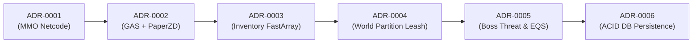

# Master Architecture Blueprint — Project Ascendant

> **Status**: Approved  
> **Author**: Technical Director & Systems Architect  
> **Target Engine**: Unreal Engine 5.7 (C++20, Enhanced Input, GAS, Iris Replication, Paper2D/PaperZD)  
> **Last Updated**: 2026-09-16  
> **Governing ADR**: [`ADR-0001: Open World MMO Combat Networking`](adr-0001-open-world-mmo-combat-networking.md)

---

## 1. Architecture Principles & Philosophy

Kiến trúc kỹ thuật của *Project Ascendant* được thiết kế để giải quyết bài toán giao thoa phức tạp: **Chiến đấu hành động tốc độ cao (Fast-paced Souls-like Action Combat) trong môi trường MMO Thế Giới Mở (Open World Contested Multiplayer)** trên nền tảng **Unreal Engine 5.7 (C++ & PaperZD 2.5D Pixel Art)**. Toàn bộ mã nguồn và cấu trúc module tuân thủ 6 nguyên tắc kiến trúc bất biến sau:

### 1.1. Dedicated Server Authority 100% (Máy Chủ Là Nguồn Chân Lý Duy Nhất)
- Triển khai theo quyết định kiến trúc bắt buộc [`ADR-0001`](adr-0001-open-world-mmo-combat-networking.md).
- Mọi biến đổi trạng thái (trừ máu, trừ thể khí Posture, cấp phát kinh nghiệm, giao dịch vật phẩm, thay đổi số dư tiền tệ) bắt buộc phải do Dedicated Server tính toán và chứng thực qua Server RPC.
- Phía Client tuyệt đối chỉ đóng vai trò **Dự đoán cục bộ (Client Prediction)** và **Hiển thị hình ảnh (Presentation Proxy)**. Không có bất kỳ logic trao thưởng hay xác nhận trúng đòn nào được tin cậy từ Client.

### 1.2. Gameplay Ability System (GAS) Là Hợp Đồng Tương Tác Cốt Lõi
- Toàn bộ chỉ số nhân vật, kỹ năng, hiệu ứng trạng thái, chi phí thể lực (Stamina cost), và cơ chế hồi chiêu được mô hình hóa 100% thông qua `UAbilitySystemComponent`, `UAttributeSet`, `UGameplayAbility`, và `UGameplayEffect`.
- Nghiêm cấm việc viết các hàm thay đổi chỉ số trực tiếp (Hardcoded Stat Modification) trong C++ Character class. Mọi biến đổi phải diễn ra thông qua Gameplay Effect có gắn Gameplay Tags chuẩn mực để đảm bảo khả năng replicate mạng tự động.

### 1.3. Phân Tầng Độc Lập 1 Chiều (Strict Unidirectional Dependency)
- Kiến trúc tuân thủ nghiêm ngặt 5 tầng: **Tầng 1 (Foundation) ➔ Tầng 2 (Core Gameplay) ➔ Tầng 3 (Features) ➔ Tầng 4 (Presentation / UI) ➔ Tầng 5 (Meta)**.
- Tầng trên được phép gọi và phụ thuộc vào tầng dưới. Tầng dưới tuyệt đối **KHÔNG ĐƯỢC PHÉP** import header hay phụ thuộc trực tiếp vào tầng trên (No Reverse Dependencies). Mọi giao tiếp ngược từ dưới lên phải thông qua **Unreal Gameplay Event Tags** hoặc **Subsystem Delegates**.

### 1.4. Thiết Kế Hướng Dữ Liệu (Data-Driven Configuration)
- Mọi thông số cân bằng game (Sát thương cơ bản, tốc độ hồi phục, hệ số nện búa, bảng tỷ lệ rơi đồ, giá thương nhân) bắt buộc phải nằm trong `UDataTable` hoặc `UDataAsset`, không được hardcode trong file `.cpp`.
- Lập trình viên C++ xây dựng khung cơ chế (Mechanic Framework); Game Designer có toàn quyền cân chỉnh thông số trong Unreal Editor mà không cần biên dịch lại mã nguồn C++.

### 1.5. Độ Trễ Cảm Nhận Bằng Không (Zero-Perceived Latency for Combat)
- Để đảm bảo cảm giác né đòn (I-Frame Dash) và đỡ đòn chuẩn (Perfect Parry) mượt mà như game offline, Client thực hiện mô phỏng chuyển động và kích hoạt hoạt ảnh cục bộ ngay lập tức (Local Prediction).
- Server sử dụng cơ chế **Lag Compensation Rewind Buffer (200ms)** để kiểm tra va chạm hitbox tại thời điểm Client ngắm đánh, và chỉ nắn chỉnh nhẹ nhàng (Soft Reconciliation) khi phát hiện độ lệch tọa độ vượt quá ngưỡng $15\text{ cm}$.

### 1.6. Chuẩn Mực Đồ Họa HD-2D (Pixel-Crisp 2.5D Rendering)
- Nhân vật, quái vật và hiệu ứng kỹ năng sử dụng hoạt ảnh Sprite Sheets chuẩn qua plugin **PaperZD / Paper2D** với bộ lọc vân ảnh sắc nét (Nearest Texture Filtering, không bị blur mờ).
- Tích hợp liền mạch hoạt ảnh 2D vào không gian vật lý 3D với hệ thống ánh sáng động thời gian thực (Lumen), đổ bóng chân thực và hiệu ứng hạt Niagara VFX hiện đại.

## 2. 5-Layer System Architecture & Boundary Definitions

Kiến trúc mã nguồn C++ của *Project Ascendant* được tổ chức theo mô hình phân tầng nghiêm ngặt nhằm triệt tiêu hoàn toàn sự phụ thuộc vòng (Circular Dependencies) và đảm bảo tính khả dụng cao khi mở rộng các Class và Zone mới.

### 2.1. Sơ Đồ Kiến Trúc 5 Tầng (System Layer Diagram)



---

### 2.2. Chi Tiết Phân Bổ Module C++ Theo Từng Tầng

#### Tầng 1: Foundation Layer (Nền Tảng Cốt Lõi)
- Chứa các kiểu dữ liệu trừu tượng, cấu trúc dữ liệu nguyên khối và các thành phần cốt lõi của Engine.
- **Các Module**:
  - `PA_Attributes`: Kế thừa `UAttributeSet` từ GAS, định nghĩa toàn bộ thuộc tính cơ bản (HP, MP, Stamina, Posture, Atk, Def, Speed) và hệ thống GameplayTags danh mục.
  - `PA_InputCamera`: Tích hợp Enhanced Input System và `USpringArmComponent` góc nghiêng chuẩn mực (Pitch: -45°, Yaw: 45°) cùng cơ chế đón đầu thông minh (Dynamic Look-Ahead).
  - `PA_InventoryCore`: Quản lý cấu trúc dữ liệu lưới ba lô (`UInventoryComponent`), dữ liệu tĩnh `UItemDataAsset` và phân loại độ hiếm 5 Tier.

#### Tầng 2: Core Gameplay Layer (Cơ Chế Chiến Đấu & Mạng Cơ Bản)
- Điều phối các hành vi vật lý, tương tác thời gian thực và đồng bộ hóa máy chủ.
- **Các Module**:
  - `PA_MovementEvasion`: Xử lý di chuyển 8 hướng, trạng thái Lướt né I-Frame (`bIsInvulnerable`), khấu trừ Thể Lực và trượt mượt mà.
  - `PA_Combat`: Máy trạng thái combo đòn đánh, quản lý kích hoạt hitbox theo hoạt ảnh, gửi RPC tung chiêu và Server lag compensation rewind 200ms.
  - `PA_Stagger`: Thành phần `UPostureComponent`, tính toán tích lũy thể khí, kích hoạt trạng thái gục ngã Staggered và quản lý thời gian độc quyền 1.5s cho Finisher.
  - `PA_Networking`: Cấu hình Iris Replication System, điều tiết băng thông động 3 tầng (60Hz / 30Hz / Culling) và kiểm soát thực thể ảo Ghost Body 15s.
  - `PA_WorldPartition`: Quản lý streaming dã ngoại, ranh giới Leash 2500 cm của quái vật và các thể tích an toàn Sanctuary 1000 cm.

#### Tầng 3: Feature Layer (Tính Năng Lối Chơi Mở Rộng)
- Xây dựng nội dung trò chơi cụ thể dựa trên các khối cơ chế từ Tầng 2.
- **Các Module**:
  - `PA_BossAI`: Trí tuệ nhân tạo Boss, Behavior Trees, EQS tìm vị trí, phát tín hiệu cảnh báo đòn đánh (Telegraph Decals) và Bảng cừu hận động (Threat Table 130%).
  - `PA_ClassesProgression`: Cây kỹ năng của 12 Class, quản lý Action Deck 4 chiêu thức và logic học Sách Kỹ Năng (Skill Books).
  - `PA_Blacksmithing`: Cơ chế ép cấp trang bị (+1 đến +10), khảm/tháo ngọc, và hao mòn/sửa chữa độ bền.
  - `PA_MerchantEconomy`: Mạng lưới thương nhân 3 bậc, đồng bộ restock toàn server, mua lại (Buyback FIFO 10 ô) và nộp phạt chuộc tội Karma Bailout.

#### Tầng 4: Presentation & UI Layer (Trình Diễn & Giao Diện Người Dùng)
- Chỉ nhận dữ liệu và sự kiện để hiển thị trực quan cho người chơi; không chứa logic quyết định gameplay.
- **Các Module**:
  - `PA_UI`: Xây dựng trên nền tảng **CommonUI**, quản lý Widget HUD chiến đấu, thanh máu Boss, bảng cừu hận, Party HUD vitals và giao diện shop.
  - `PA_PaperZDRender`: Quản lý hoạt ảnh Pixel 2D Flipbook, gán socket cho vũ khí/khiên và kích hoạt hệ thống hạt Niagara VFX.

#### Tầng 5: Meta & Persistence Layer (Lưu Trữ & Bảo Mật Dữ Liệu)
- Đảm bảo an toàn dữ liệu trên Dedicated Server.
- **Các Module**:
  - `PA_Persistence`: Tuần tự hóa dữ liệu người chơi (Serialize to Binary / Cloud DB) khi chuyển vùng hoặc đăng xuất.
  - `PA_Security`: Giám sát tốc độ giao dịch (Rate Limit 2 tx/s), ngăn chặn nhân bản vật phẩm (Anti-duping), và cưỡng chế phạt tử trận đối với hành vi rút mạng trốn combat.

---

### 2.3. Quy Tắc Ranh Giới & Kiểm Soát Phụ Thuộc (Boundary Rules)

| Chiều Gọi | Trạng Thái | Quy Chuẩn Thực Thi |
|---|:---:|---|
| Tầng Cao ➔ Tầng Thấp | ✅ **CHO PHÉP** | Gọi trực tiếp hàm C++ qua con trỏ hoặc interface. |
| Tầng Thấp ➔ Tầng Cao | ❌ **NGHIÊM CẤM** | Không được include header tầng cao hơn. Phải dùng **Gameplay Event Tags**, **Delegates** hoặc **GameInstance Subsystems**. |
| Ngang Hàng (Cùng Tầng) | ⚠️ **HẠN CHẾ** | Chỉ tương tác qua Interface trừu tượng (`ICombatantInterface`, `IInteractableInterface`). |

## 3. Module Specifications & Public APIs

Chương này quy định chi tiết hợp đồng lập trình (C++ Interfaces, Classes, Structs, Functions và Delegates) cho toàn bộ các module thuộc 5 tầng kiến trúc của *Project Ascendant*. Mọi code C++ triển khai sau này bắt buộc phải tuân thủ nghiêm ngặt chữ ký hàm, tính bất biến dữ liệu (const correctness) và mô hình quyền lực Dedicated Server.

---

### 3.1. Giao Diện Cốt Lõi & Định Nghĩa Kiểu Dữ Liệu Chung (Core Shared Contracts)

Để triệt tiêu phụ thuộc vòng giữa các module, các tầng tương tác với nhau thông qua hệ thống C++ Unreal Interface (`UINTERFACE`) độc lập:

#### A. `ICombatantInterface` (`Source/ProjectAscendant/Core/Interfaces/CombatantInterface.h`)
Hợp đồng bắt buộc cho mọi thực thể tham gia chiến đấu (Người chơi, Quái thường, Boss):
```cpp
UINTERFACE(MinimalAPI, BlueprintType)
class UCombatantInterface : public UInterface
{
    GENERATED_BODY()
};

class PROJECTASCENDANT_API ICombatantInterface
{
    GENERATED_BODY()
public:
    // Trả về Ability System Component của thực thể
    virtual UAbilitySystemComponent* GetAbilitySystemComponent() const = 0;

    // Trả về Posture Component để xử lý tích lũy thể khí
    virtual class UPostureComponent* GetPostureComponent() const = 0;

    // Kiểm tra thực thể hiện tại có đang trong trạng thái bất tử (I-Frame) hay không
    virtual bool IsInvulnerable() const = 0;

    // Nhận sát thương trực tiếp từ Server
    virtual void ApplyDamageResult(const FDamageExecutionData& DamageData) = 0;

    // Lấy tọa độ mục tiêu đón đầu để hỗ trợ cơ chế Aim/Lock-on
    virtual FVector GetTargetingSocketLocation() const = 0;
};
```

#### B. Các Cấu Trúc Dữ Liệu Cơ Bản (Core Gameplay Structs)
```cpp
// Dữ liệu gói gọn kết quả va chạm đòn đánh phục vụ Server Lag Compensation
USTRUCT(BlueprintType)
struct FCombatHitResult
{
    GENERATED_BODY()

    UPROPERTY()
    AActor* InstigatorActor = nullptr;

    UPROPERTY()
    AActor* TargetActor = nullptr;

    UPROPERTY()
    float RawDamage = 0.0f;

    UPROPERTY()
    float PostureDamage = 0.0f;

    UPROPERTY()
    FVector HitLocation = FVector::ZeroVector;

    UPROPERTY()
    FGameplayTagContainer HitTags;

    UPROPERTY()
    bool bIsCriticalHit = false;

    UPROPERTY()
    bool bWasParried = false;
};
```

---

### 3.2. Tầng 1: Foundation Layer Specifications

#### 1. Module `PA_Attributes` (Quản Lý Chỉ Số & GAS AttributeSet)
- **Sở hữu (Owns)**: Các thuộc tính gốc `UCharacterAttributeSet` (`Health`, `MaxHealth`, `Mana`, `MaxMana`, `Stamina`, `MaxStamina`, `Posture`, `MaxPosture`, `AttackPower`, `DefensePower`, `MovementSpeed`).
- **Giao diện công khai (Public API)**:
  - `void PostGameplayEffectExecute(const FGameplayEffectModCallbackData& Data)`: Xử lý kẹp chỉ số (Clamping) và phát tín hiệu cạn máu/cạn thể khí.
  - `FOnAttributeChangedDelegate OnHealthChanged`: Delegate thông báo UI khi máu thay đổi.
  - `FOnAttributeChangedDelegate OnStaminaChanged`: Delegate thông báo HUD thể lực.
- **Engine APIs**: `UAttributeSet`, `FGameplayAttributeData`, `ATTRIBUTE_ACCESSORS` macro.
- **Rủi ro Engine**: 🟢 LOW (API GAS ổn định trên UE 5.7).

#### 2. Module `PA_InputCamera` (Enhanced Input & Isometric Camera)
- **Sở hữu (Owns)**: `UPASpringArmComponent`, góc cố định (Pitch: -45°, Yaw: 45°), tính toán vector đón đầu chuột (`Dynamic Look-Ahead` offset tối đa 350 units).
- **Giao diện công khai (Public API)**:
  - `FVector GetIsometricMoveDirection(const FVector2D& InputVector) const`: Chuyển đổi vector input 2D sang không gian 3D Isometric chuẩn.
  - `void SetCameraTargetFocus(AActor* FocusTarget)`: Khóa camera vào Boss hoặc sự kiện cắt cảnh.
- **Engine APIs**: `UEnhancedInputComponent`, `UInputMappingContext`, `USpringArmComponent`, `UCameraComponent`.

#### 3. Module `PA_InventoryCore` (Kho Đồ Lưới & Dữ Liệu Vật Phẩm)
- **Sở hữu (Owns)**: Dữ liệu lưới ba lô người chơi (6 cột x 5 hàng = 30 ô), Stack limits, và dữ liệu cấu hình `UItemDataAsset`.
- **Giao diện công khai (Public API)**:
  - `bool Server_MoveItem(int32 FromIndex, int32 ToIndex)`: RPC yêu cầu di chuyển/hoán đổi vị trí ô đồ.
  - `bool Server_SplitStack(int32 SlotIndex, int32 SplitAmount)`: RPC tách chồng vật phẩm.
  - `FItemInstance GetItemAtSlot(int32 SlotIndex) const`: Trả về dữ liệu tham chiếu ô đồ.
- **Engine APIs**: `UActorComponent`, `UDataTable`, `FFastArraySerializer` (Đồng bộ mảng nhanh qua mạng).

---

### 3.3. Tầng 2: Core Gameplay Layer Specifications

#### 4. Module `PA_MovementEvasion` (Di Chuyển 8 Hướng & Lướt Né I-Frame)
- **Sở hữu (Owns)**: Máy trạng thái di chuyển, quản lý thời gian bất tử 0.20s trong đòn Dash (Tổng thời gian dash: 0.35s, Chi phí: 25 Stamina, Cooldown: 0.5s).
- **Giao diện công khai (Public API)**:
  - `void Server_RequestDash(const FVector& Direction)`: Server RPC xác thực stamina và kích hoạt Dash.
  - `bool IsDashing() const`: Kiểm tra trạng thái lướt né.
  - `FOnDashExecutedDelegate OnDashExecuted`: Broadcast để render kích hoạt vệt bóng mờ Pixel Ghost Trail.
- **Invariants**: Nếu Stamina < 25, yêu cầu Dash bị từ chối tức thì cả ở Client lẫn Server.

#### 5. Module `PA_Combat` (Combo State Machine & Lag Compensation)
- **Sở hữu (Owns)**: Chuỗi combo 3 đòn cơ bản, quản lý va chạm Hitbox theo khung hình PaperZD Anim Notify, bộ đệm Rewind Buffer 200ms.
- **Giao diện công khai (Public API)**:
  - `void Server_RegisterAttackHit(const FHitValidationRequest& Request)`: Server RPC thẩm định đòn đánh bằng Lag Compensation Rewind.
  - `void TriggerAttackHitbox(const FHitboxShapeParameters& Params)`: Triệu hồi hitbox quét hình quạt/chữ nhật theo hoạt ảnh vũ khí.
  - `FOnCombatStateChangedDelegate OnComboReset`: Tự động reset chuỗi combo sau 1.2s không nối đòn.

#### 6. Module `PA_Stagger` (Hệ Thống Thể Khí Posture & Đòn Kết Liễu Finisher)
- **Sở hữu (Owns)**: `UPostureComponent`, cơ chế tích lũy thể khí, đếm ngược thời gian hồi phục (Delay: 3.0s, Tốc độ hồi: 15%/s), kích hoạt trạng thái gục ngã 1.5s độc quyền cho Finisher.
- **Giao diện công khai (Public API)**:
  - `void AddPostureDamage(float Amount, AActor* Attacker)`: Tích lũy thanh thể khí.
  - `void Server_ExecuteFinisher(AActor* TargetActor)`: Server RPC kích hoạt đòn kết liễu tất sát (Bỏ qua 100% giáp).
  - `FOnPostureStateChanged OnPostureBroken`: Báo hiệu Boss/Target đã gục ngã để UI hiển thị biểu tượng hành quyết đỏ rực.

#### 7. Module `PA_Networking` (Iris Replication & Phân Vùng Đồng Bộ)
- **Sở hữu (Owns)**: Tần số cập nhật động qua Iris Spatial Filtering (Tier 1: 60Hz < 15m; Tier 2: 30Hz 15-50m; Tier 3: Cull > 50m), kiểm soát thực thể ảo Ghost Body 15s chống ngắt kết nối trốn combat.
- **Giao diện công khai (Public API)**:
  - `void RegisterIrisReplicationBridge(UObject* ReplicatedObject)`: Đăng ký object vào Iris NetDriver.
  - `void SpawnGhostBody(APlayerState* DisconnectedPlayer)`: Server spawn thế thân chịu đòn khi người chơi mất mạng giữa giao tranh.
- **Rủi ro Engine**: 🔴 HIGH (Iris Spatial Filtering UE 5.7 có thay đổi cấu trúc thiết lập dynamic filter API so với UE 5.4/5.5).

#### 8. Module `PA_WorldPartition` (Phân Vùng Bản Đồ & Vùng An Toàn)
- **Sở hữu (Owns)**: Quản lý 3 bậc Zone (Sanctuary 1000cm, Wilderness, Contested Zone), kích hoạt Leash distance 2500cm buộc quái reset khi vượt quá bán kính.
- **Giao diện công khai (Public API)**:
  - `bool IsInsideSanctuary(const FVector& Location) const`: Kiểm tra tọa độ có thuộc vùng bảo hộ an toàn.
  - `EZoneType GetCurrentZoneType(const FVector& Location) const`: Xác định quy chế PvP và tỷ lệ rớt đồ của vị trí hiện tại.

---

### 3.4. Tầng 3: Feature Layer Specifications

#### 9. Module `PA_BossAI` (Trí Tuệ Nhân Tạo & Bảng Cừu Hận Động)
- **Sở hữu (Owns)**: Behavior Trees, Environment Query System (EQS), Bảng cừu hận chuyển đổi mục tiêu khi vượt ngưỡng 130% Threat, máy trạng thái 4 Phase của Boss (100% -> 75% -> 40% -> 15% Enrage).
- **Giao diện công khai (Public API)**:
  - `void AddThreat(AActor* Instigator, float ThreatScore)`: Cộng dồn điểm đe dọa.
  - `void Server_CastBossSkill(EBossSkillID SkillID)`: Kích hoạt kỹ năng nện búa/triệu hồi và phát Decal cảnh báo Telegraph trước 1.2s.

#### 10. Module `PA_ClassesProgression` (Ma Trận 12 Class & Action Deck)
- **Sở hữu (Owns)**: Tiến trình nâng cấp kỹ năng, 4 ô Action Deck kích hoạt (Q, E, R, F), cơ chế học kỹ năng từ Sách Kỹ Năng (Skill Books).
- **Giao diện công khai (Public API)**:
  - `bool EquipSkillToActionDeck(int32 SlotIndex, FGameplayTag SkillTag)`: Gán kỹ năng vào ô thao tác nhanh.
  - `bool CanLearnSkillBook(const FItemInstance& BookItem) const`: Kiểm tra điều kiện Class và điểm kinh nghiệm.

#### 11. Module `PA_Blacksmithing` (Rèn, Khảm Ngọc & Sửa Chữa)
- **Sở hữu (Owns)**: Công thức nâng cấp (+1 đến +10), tính toán tỷ lệ thành công/thất bại, trừ độ bền và khảm Rune Ward.
- **Giao diện công khai (Public API)**:
  - `FBlacksmithUpgradeResult Server_UpgradeEquipment(int32 ItemSlotIndex, int32 CatalystSlotIndex)`: Server RPC thực hiện đập đồ.
  - `bool Server_RepairItem(int32 ItemSlotIndex)`: Server RPC trừ vàng để khôi phục 100% độ bền.

#### 12. Module `PA_MerchantEconomy` (Kinh Tế Thương Nhân & Hàng Mua Lại)
- **Sở hữu (Owns)**: Danh mục hàng hóa thương nhân 3 bậc, chu kỳ làm mới hàng toàn server (Restock), bộ đệm mua lại Buyback FIFO 10 ô, và nộp phạt chuộc điểm Karma Bailout.
- **Giao diện công khai (Public API)**:
  - `bool Server_BuyItem(int32 ShopItemID, int32 Quantity)`: RPC giao dịch mua hàng.
  - `bool Server_SellItem(int32 InventorySlotIndex)`: RPC bán đồ vào shop (Chuyển vào Buyback cache).
  - `bool Server_PayKarmaBailout()`: RPC nộp phạt 5,000 Vàng để xóa trạng thái Đồ Tể (Outlaw PK).

---

### 3.5. Tầng 4: Presentation & UI Layer Specifications

#### 13. Module `PA_UI` (CommonUI Combat HUD & Overhead Widgets)
- **Sở hữu (Owns)**: Quản lý cây widget CommonUI, hiển thị thanh máu Boss, Action Deck cooldowns, Party vitals, và các thông báo nổi Overhead Damage Numbers.
- **Giao diện công khai (Public API)**:
  - `void UpdateActionDeckCooldown(int32 SlotIndex, float RemainingTime, float TotalDuration)`: Cập nhật đồng hồ đếm ngược chiêu thức.
  - `void DisplayFloatingCombatText(const FVector& WorldLocation, float Damage, bool bIsCrit, bool bIsPosture)`: Hiển thị chữ số sát thương bay.

#### 14. Module `PA_PaperZDRender` (Rendering Pixel 2D & Hiệu Ứng VFX)
- **Sở hữu (Owns)**: `UPaperZDAnimInstance`, quản lý bộ lọc vân ảnh Nearest Neighbor sắc nét, quản lý Sprite Socket để gắn kiếm/khiên và kích hoạt Niagara VFX.
- **Giao diện công khai (Public API)**:
  - `void PlayAnimationState(EAnimState NewState, float PlayRate = 1.0f)`: Chuyển đổi flipbook mượt mà.
  - `void SpawnVFXAttached(UNiagaraSystem* VFXAsset, FName SocketName)`: Bắn hiệu ứng chém lửa/sấm sét chuẩn pixel.

---

### 3.6. Tầng 5: Meta & Persistence Layer Specifications

#### 15. Module `PA_Persistence` (Tuần Tự Hóa & Lưu Trữ Dữ Liệu)
- **Sở hữu (Owns)**: Giao thức mã hóa nhị phân dữ liệu người chơi (`FPlayerSaveData`), lưu trữ trạng thái túi đồ, trang bị, cấp độ và số dư tiền tệ.
- **Giao diện công khai (Public API)**:
  - `bool SavePlayerData(const FString& PlayerID, const FPlayerSaveData& Data)`: Ghi dữ liệu vào Server DB.
  - `bool LoadPlayerData(const FString& PlayerID, FPlayerSaveData& OutData)`: Đọc dữ liệu khi người chơi đăng nhập.

#### 16. Module `PA_Security` (Bảo Mật, Chống Gian Lận & Rate Limit)
- **Sở hữu (Owns)**: Cơ chế giám sát tốc độ gửi gói tin (Rate Limit: tối đa 2 giao dịch/s, 10 hành động chiến đấu/s), chống nhân bản vật phẩm (Anti-duping checksum), và cưỡng chế xử thua nếu ngắt mạng giữa trận.
- **Giao diện công khai (Public API)**:
  - `bool ValidateTransactionChecksum(const FTransactionPayload& Payload)`: Xác thực tính toàn vẹn giao dịch.
  - `void LogSecurityViolation(APlayerController* Offender, ESecurityViolationType ViolationType)`: Ghi nhận vi phạm và kick tài khoản có dấu hiệu hack.

## 4. Cross-Module Data Flow & Event Bus

Để bảo đảm tính độc lập một chiều (Unidirectional Dependency) và triệt tiêu ghép nối cứng (Loose Coupling), các module trong *Project Ascendant* giao tiếp với nhau chủ yếu qua **Trục sự kiện hướng dữ liệu (Gameplay Event Tags)** và **GameInstance Subsystems**. Chương này mô tả chi tiết cách thức dữ liệu di chuyển qua các kịch bản cốt lõi.

---

### 4.1. Cấu Trúc Trục Sự Kiện Toàn Cục (Event Bus & Gameplay Tag Matrix)

Thay vì gọi trực tiếp con trỏ module, các sự kiện gameplay được broadcast qua `UAbilitySystemBlueprintLibrary::SendGameplayEventToActor` hoặc thông qua `UPA_EventSubsystem` (kế thừa `UGameInstanceSubsystem`):

```
GameplayEvent.
├── Combat.
│   ├── Attack.Light / Heavy
│   ├── Hit.Melee / Ranged / Critical
│   ├── Parry.Success / Failed
│   └── PostureBreak.Triggered / Recovered
├── State.
│   ├── Invulnerable.Dash
│   ├── Staggered.Active (1.5s Window)
│   └── Dead.Player / Boss
├── Zone.
│   ├── Entered.Sanctuary / Wilderness / Contested
│   └── Leash.Exceeded / Reset
└── Economy.
    ├── Trade.Success / Failed
    └── Karma.BailoutPaid
```

---

### 4.2. Kịch Bản 1: Frame Update & Di Chuyển 8 Hướng (Movement Path)

Luồng dữ liệu xử lý input di chuyển từ tay cầm/bàn phím người chơi đến Server:



---

### 4.3. Kịch Bản 2: Chiến Đấu, Va Chạm & Lag Compensation 200ms (Combat Hit Path)

Mô tả cơ chế xác nhận trúng đòn tin cậy và thẩm định bù trễ mạng (Server Rewind):



---

### 4.4. Kịch Bản 3: Gục Ngã Posture Break & Hành Quyết Finisher (Stagger & Finisher Path)

Luồng kiểm soát trạng thái tê liệt và cơ chế độc quyền 1.5s tung đòn kết liễu:



---

### 4.5. Kịch Bản 4: Thứ Tự Khởi Tạo Hệ Thống (Subsystem Boot & Initialization Order)

Để đảm bảo không bị lỗi con trỏ rỗng (`nullptr`), quy trình nạp hệ thống tuân thủ thứ tự:

| Thứ Tự | Giai Đoạn Khởi Tạo | Thành Phần Khởi Tạo | Trách Nhiệm Cốt Lõi |
|:---:|---|---|---|
| **1** | Engine Subsystem | `UEngineSubsystem` | Nạp Shader Cache, thiết lập bộ lọc Texture Nearest cho Pixel Art. |
| **2** | GameInstance Subsystem | `UPA_EventSubsystem`, `UPA_SecuritySubsystem` | Khởi tạo Event Bus, mở kết nối DB Persistence, thiết lập rate limiter. |
| **3** | GameMode Base (Server Only) | `APAGameModeBase` | Khởi động Iris NetDriver, kích hoạt World Partition Data Layers. |
| **4** | World Subsystems | `UPA_ZoneSubsystem` | Đăng ký các Sanctuary Volumes, nạp bảng Leash distance (2500cm). |
| **5** | Player Controller & Pawn | `APAPlayerController`, `APABaseCharacter` | Gán Enhanced Input Mapping Context, khởi tạo GAS AbilitySystemComponent. |
| **6** | Presentation UI (Client Only) | `UPA_UIManagerSubsystem` | Khởi tạo Widget CommonUI, bind Delegate chỉ số Máu/Thể lực/Posture vào HUD. |

## 5. Networking, Iris Replication & Server Authority

Dựa trên quyết định kiến trúc bắt buộc [`ADR-0001`](adr-0001-open-world-mmo-combat-networking.md), *Project Ascendant* vận hành trên mô hình **Dedicated Server Authority 100%** tích hợp hệ thống đồng bộ thế hệ mới **Unreal Engine 5.7 Iris Replication System**.

---

### 5.1. Mô Hình Băng Thông & Lọc Không Gian Động (Iris Spatial Filtering)

Để duy trì hiệu năng mượt mà trong các trận chiến dã ngoại đông người chơi (20 người + 1 Boss) với mức tiêu thụ băng thông $< 50\text{ KB/s}$ cho mỗi client, Iris NetDriver được cấu hình phân tầng 3 bậc khoảng cách:



---

### 5.2. Cơ Chế Bù Trễ Mạng (Server Lag Compensation 200ms Rewind Buffer)

Để loại bỏ cảm giác "đánh trúng nhưng không nhận sát thương" do độ trễ đường truyền (Ping từ 30ms đến 150ms):
1. **Ring Buffer Lịch Sử**: Dedicated Server duy trì bộ đệm tròn lưu trữ vị trí, hướng xoay và bounding box của mọi Actor trong $200\text{ ms}$ gần nhất (tương đương 12 khung hình tại 60 tick/s).
2. **Thẩm Định Hồi Lại Thời Gian (Rewind & Verify)**:
   - Khi Client gửi RPC `Server_RegisterAttackHit(Target, ClientTimestamp, HitLocation)`:
   - Server lấy `ServerTimestampNow` trừ đi `ClientPing / 2` để xác định thời điểm đòn đánh diễn ra trên máy client.
   - Server tua lại (Rewind) hitbox của Target về đúng thời điểm đó.
   - Thực hiện kiểm tra va chạm hình học (Sweep/Overlap). Nếu trúng ➔ Áp dụng sát thương. Nếu trượt ➔ Từ chối.

---

### 5.3. Cơ Chế Chống Ngắt Mạng Thoát Giao Tranh (Anti-Combat-Logging Ghost Body)

Để ngăn chặn triệt để hành vi "rút mạng / tắt game" để bảo toàn mạng sống khi bị người chơi khác hoặc Boss dồn vào chân tường:
- Khi phát hiện mất kết nối (`NetworkFailure` hoặc socket timeout) khi nhân vật đang mang thẻ `State.InCombat`:
- Server **KHÔNG HỦY** Actor nhân vật.
- Server kích hoạt trạng thái **Thực thể ảo (Ghost Body)** duy trì tồn tại trên thế giới trong đúng **15 giây**.
- AI của Boss hoặc người chơi đối địch trong Contested Zone vẫn có toàn quyền tấn công hạ gục Ghost Body này.
- Nếu Ghost Body bị tiêu diệt trong 15s này: Các hình phạt tử trận (mất điểm Karma, rơi 30% vật phẩm túi đồ) vẫn được Server ghi nhận vào DB người chơi khi họ đăng nhập lại.

---

### 5.4. Quy Chuẩn Khai Báo RPC (Remote Procedure Calls Standard)

| Kiểu RPC | Quy Ước Đặt Tên | Chiều Gửi | Cơ Chế Bảo Đảm | Ứng Dụng |
|---|---|:---:|:---:|---|
| **Server RPC** | `Server_Request[Action]` | Client ➔ Server | `Reliable, WithValidation` | Tung đòn đánh, né tránh, mở rương, nạp tiền Karma. |
| **Client RPC** | `Client_Confirm[Action]` | Server ➔ Client | `Reliable` | Nắn chỉnh vị trí (Reconciliation), xác nhận giao dịch thành công. |
| **Multicast** | `Multicast_Play[Effect]` | Server ➔ All Clients | `Unreliable` | Kích hoạt âm thanh vung kiếm, tia lửa parry, hạt máu Niagara. |

## 6. Save, Load & Persistence Pipeline

Để bảo đảm tính toàn vẹn kinh tế, ngăn chặn triệt để hành vi nhân bản vật phẩm (Duping) hoặc can thiệp file save cục bộ (Cheat Engine), toàn bộ dữ liệu nhân vật trong *Project Ascendant* được lưu trữ và chứng thực độc quyền tại cụm **Dedicated Server & Database Cluster**.

---

### 6.1. Chiến Lược Phân Tách Dữ Liệu (Storage Segregation Strategy)

| Phân Vùng Dữ Liệu | Nơi Lưu Trữ | Định Dạng Dữ Liệu | Cơ Chế Bảo Mật & Quyền Hạn |
|---|---|---|---|
| **Gameplay State** (Level, Stats, Karma, Túi đồ, Trang bị) | Server Database (PostgreSQL / Redis) | Gói nhị phân nén (Binary Payload / JSONB) | **Server-Only Authority**. Client hoàn toàn không có quyền ghi. |
| **Zone Snapshots** (Vị trí tọa độ, Máu quái dã ngoại) | Redis In-Memory Cache | Binary `FArchive` + LZ4 Compression | Lưu tức thời khi chuyển Zone hoặc trước bảo trì server. |
| **Client Settings** (Âm lượng, Phím bấm, Đồ họa) | Local Client Storage (`Saved/`) | Mã hóa `USaveGame` AES-256 | Không ảnh hưởng đến logic gameplay. |

---

### 6.2. Cấu Trúc Dữ Liệu Lưu Trữ Nhân Vật (`FPlayerSaveData`)

```cpp
USTRUCT(BlueprintType)
struct FPlayerSaveData
{
    GENERATED_BODY()

    UPROPERTY()
    FString PlayerUUID;

    UPROPERTY()
    ECharacterClass CharacterClass = ECharacterClass::Vanguard;

    UPROPERTY()
    int32 CharacterLevel = 1;

    UPROPERTY()
    int64 CurrentExperience = 0;

    UPROPERTY()
    int32 KarmaRating = 0; // Hệ thống Nghiệp lực (-1000 đến +1000)

    UPROPERTY()
    int64 GoldBalance = 0; // Số dư tiền tệ

    UPROPERTY()
    TArray<FItemInstance> InventorySlots; // 30 ô túi đồ

    UPROPERTY()
    TArray<FItemInstance> EquippedGear; // Trang bị đang mặc

    UPROPERTY()
    TArray<FGameplayTag> UnlockedSkillTags; // Cây kỹ năng đã học

    UPROPERTY()
    TArray<FGameplayTag> ActionDeckLoadout; // 4 chiêu thức gán sẵn

    UPROPERTY()
    FVector LastSanctuaryLocation = FVector::ZeroVector; // Tọa độ hồi sinh gần nhất
};
```

---

### 6.3. Chu Kỳ Kích Hoạt Lưu Tự Động (Persistence Trigger Points)

Nhằm tối ưu hóa I/O Database mà không làm mất mát tiến trình của người chơi:



---

### 6.4. Giao Dịch Nguyên Tử & Chống Nhân Bản Vật Phẩm (ACID Transactions & Anti-Duping)

1. **Nguyên Tắc 2-Phase Commit (2PC)**:
   - Trong mọi thao tác chuyển dời vật phẩm nhạy cảm (Giao dịch người chơi, Rèn trang bị, Mua bán Shop):
   - Bước 1 (Prepare): Khóa ô đồ (Lock Item Slots) ở cả hai bên tham gia giao dịch.
   - Bước 2 (Commit): Thực hiện hoán đổi con trỏ ID vật phẩm và ghi nhận trừ/cộng vàng đồng thời trong cùng 1 Transaction Database.
   - Nếu xảy ra mất điện hoặc crash server giữa chừng ➔ Tự động Rollback trạng thái trước giao dịch.
2. **Checksum Hash Xác Thực**: Mỗi vật phẩm Unique mang một mã băm `ItemGUID` kèm `GenerationTimestamp`. Nếu phát hiện trùng lặp `ItemGUID` trên 2 túi đồ khác nhau, hệ thống bảo mật tự động tịch thu và gắn cờ tài khoản vi phạm.

## 7. Performance Budgets & Technical Constraints

*Project Ascendant* hướng tới trải nghiệm mượt mà chuẩn mực **60 FPS cố định ở độ phân giải 1080p** trên cấu hình tầm trung và **120 FPS ở 1440p** trên cấu hình cao cấp. Toàn bộ kiến trúc và tài nguyên phải tuân thủ nghiêm ngặt các hạn mức phần cứng sau:

---

### 7.1. Cấu Hình Phần Cứng Mục Tiêu (Hardware Targets)

| Tiêu Chí | Cấu Hình Tối Thiểu (1080p @ 60 FPS) | Cấu Hình Khuyến Nghị (1440p @ 120 FPS) | Dedicated Server Instance (100 CCU / Zone) |
|---|---|---|---|
| **CPU** | Intel Core i5-8400 / AMD Ryzen 5 2600 | Intel Core i7-12700 / AMD Ryzen 7 5800X | 8 vCPU (Cores @ 3.2GHz+) |
| **RAM** | 8 GB DDR4 | 16 GB DDR4/DDR5 | 16 GB ECC RAM |
| **GPU** | NVIDIA GTX 1060 (6GB) / AMD RX 580 (8GB) | NVIDIA RTX 3060 (12GB) / RX 6700 XT | N/A (Headless Server Build) |
| **Ổ Cứng** | 20 GB SSD Sata | 20 GB NVMe M.2 SSD | 50 GB NVMe Enterprise |
| **Mạng** | Băng thông tải xuống 5 Mbps | Băng thông tải xuống 20 Mbps | 1 Gbps Uplink đối xứng |

---

### 7.2. Phân Bổ Ngân Sách Khung Hình (Frame Time Budget: 16.67ms @ 60 FPS)



- **Game Thread ($\le 5.0\text{ ms}$)**:
  - Tối ưu hóa: Triệt tiêu hàm `Tick()` không cần thiết trên Actor. Sử dụng Timer hoặc Event-Driven.
  - GAS Attributes & GameplayEffect execution: $\le 1.2\text{ ms}$.
  - AI Behavior Tree & EQS quái dã ngoại: $\le 1.5\text{ ms}$ (Cull AI tick khi ngoài tầm nhìn 30m).
- **Render Thread & Draw Calls ($\le 4.5\text{ ms}$)**:
  - Tổng số lượng Draw Call toàn khung hình: $\le 800\text{ calls}$.
  - Sprite Batching: Ghép toàn bộ Sprite Sheet của cùng một nhân vật vào Texture Atlas $2048 \times 2048$ để vẽ trong 1 đợt render duy nhất.
- **GPU Time ($\le 6.0\text{ ms}$)**:
  - Chiếu sáng thời gian thực: Giới hạn tối đa 4 nguồn sáng động (Dynamic Point Lights) có đổ bóng trong cùng một khung hình.

---

### 7.3. Ngân Sách Bộ Nhớ (RAM & VRAM Limits)

- **System RAM ($\le 4.5\text{ GB}$ trên Client)**:
  - Mã nguồn thực thi & Engine binary: $500\text{ MB}$.
  - Sprite Flipbook Textures & UI Sprites: $1.5\text{ GB}$.
  - Âm thanh không gian & Nhạc nền: $500\text{ MB}$.
  - World Partition Dynamic Streaming Buffer: $1.5\text{ GB}$.
  - Bộ đệm mạng & Cấu hình cache: $500\text{ MB}$.
- **VRAM ($\le 3.5\text{ GB}$ tại 1080p)**:
  - Texture Filtering: Thiết lập cố định **Nearest Neighbor** (Không tạo Mipmaps đa tầng để triệt tiêu hiện tượng mờ pixel và tiết kiệm $33\%$ dung lượng bộ nhớ vân ảnh).

---

### 7.4. Ngân Sách Băng Thông Mạng (Networking & Dedicated Server Budget)

- **Mỗi Client**: Băng thông nhận vào $\le 50\text{ KB/s}$, gửi đi $\le 20\text{ KB/s}$ trong điều kiện giao tranh dày đặc (20 người + Boss liên tục xả chiêu).
- **Dedicated Server**: Server Tick Rate cố định $60\text{ Hz}$. Nếu tải CPU vượt quá $80\%$, Server tự động kích hoạt tính năng hạ tần số tick AI dã ngoại xuống $30\text{ Hz}$ để bảo toàn 60 FPS cho tính toán va chạm chiến đấu của người chơi.

## 8. Technology Stack & Unreal Engine Standards

Toàn bộ mã nguồn C++ của *Project Ascendant* phải tuân thủ nghiêm ngặt tiêu chuẩn lập trình hiện đại của **Unreal Engine 5.7 (C++20)** nhằm đảm bảo tính ổn định, khả năng tương thích bộ thu gom rác (Garbage Collection), và an toàn bộ nhớ khi chạy trên Dedicated Server.

---

### 8.1. Danh Mục Công Nghệ & Plugin Cốt Lõi (Tech Stack)

| Thành Phần | Công Nghệ / Plugin | Phiên Bản / Tiêu Chuẩn | Vai Trò Trong Dự Án |
|---|---|---|---|
| **Game Engine** | Unreal Engine | 5.7 (Pinned Build) | Engine nền tảng xử lý vật lý 3D, chiếu sáng Lumen, âm thanh đa kênh. |
| **Ngôn Ngữ Lập Trình** | C++ / Blueprint | C++20 Standard | C++ làm chủ 100% logic chiến đấu & mạng; Blueprint chỉ dùng cho Data & UI. |
| **Mạng & Đồng Bộ** | Iris Replication | UE 5.7 Core Plugin | Đồng bộ hóa thế giới mở, lọc không gian Spatial Filtering 3 tầng. |
| **Chiến Đấu & Kỹ Năng**| Gameplay Ability System (GAS) | UE 5.7 Core Plugin | Quản lý AttributeSet, Cooldown, GameplayEffect, GameplayTags. |
| **Điều Khiển** | Enhanced Input | UE 5.7 Core Plugin | Xử lý Input Mapping Context, Chorded Actions, phím điều khiển linh hoạt. |
| **Đồ Họa 2.5D** | PaperZD / Paper2D | 5.7 Compatible | Quản lý hoạt ảnh Pixel Flipbook, Sprite Sheets, Socket vũ khí. |
| **Giao Diện** | CommonUI | UE 5.7 Core Plugin | HUD điều hướng bằng Gamepad/Chuột, Action Deck, Popups. |
| **Hiệu Ứng** | Niagara VFX | UE 5.7 Core Plugin | Hiệu ứng hạt chém kiếm, bụi nện búa, tia sáng ma pháp. |

---

### 8.2. Quy Chuẩn Đặt Tên & Cú Pháp C++ (Naming & Syntax Conventions)

Tuân thủ quy ước chuẩn của Epic Games:
- **Tiền tố lớp (Class Prefixes)**:
  - `U`: Kế thừa từ `UObject` hoặc `UActorComponent` (Ví dụ: `UPostureComponent`, `UCharacterAttributeSet`).
  - `A`: Kế thừa từ `AActor` (Ví dụ: `APABaseCharacter`, `APABossCharacter`).
  - `F`: Cấu trúc dữ liệu thuần hoặc USTRUCT (Ví dụ: `FCombatHitResult`, `FItemInstance`).
  - `I`: Interface trừu tượng (Ví dụ: `ICombatantInterface`, `IInteractableInterface`).
  - `E`: Kiểu liệt kê Enum (Ví dụ: `ECharacterClass`, `EItemRarity`).
  - `b`: Biến kiểu boolean (Ví dụ: `bIsInvulnerable`, `bWasParried`).

---

### 8.3. An Toàn Bộ Nhớ & Tối Ưu Hóa (Memory Safety & Best Practices)

1. **Con Trỏ Thông Minh C++ (Smart Pointers)**:
   - Nghiêm cấm dùng con trỏ trần C++ kiểu cũ (`MyClass*`) cho biến thành viên UObject. Bắt buộc dùng `TObjectPtr<T>` để hỗ trợ hệ thống theo dõi bộ nhớ nâng cao của UE5.
   - Đối với con trỏ tham chiếu chéo không sở hữu (Weak Reference): Bắt buộc dùng `TWeakObjectPtr<T>` để tránh rò rỉ bộ nhớ (Dangling Pointers) khi Actor bị Destroy.
2. **Triệt Tiêu Tick()**:
   - Mọi Actor mặc định phải đặt `PrimaryActorTick.bCanEverTick = false;`.
   - Chỉ cho phép dùng Tick ở các module tính toán nội suy camera (`PA_InputCamera`) hoặc xử lý chuyển động di chuyển. Các sự kiện hồi máu, hồi thể lực, đếm ngược chiêu thức bắt buộc dùng **Timer Manager** (`FTimerHandle`) hoặc **GAS Periodic Execution**.
3. **Tính Bất Biến (Const Correctness)**:
   - Toàn bộ hàm chỉ đọc dữ liệu bắt buộc phải có từ khóa `const`.
   - Các tham số Struct hoặc chuỗi FString truyền vào hàm bắt buộc phải truyền theo kiểu tham chiếu hằng: `const FVector& Location`, `const FItemInstance& Item`.

## 9. Architecture Decision Record (ADR) Roadmap

Để tiếp tục chi tiết hóa các khía cạnh kỹ thuật phức tạp trước khi bước vào Sprint lập trình C++, các Quyết Định Kiến Trúc (Architecture Decision Records - ADR) sẽ được ban hành theo lộ trình ưu tiên sau:

---

### 9.1. Tình Trạng ADR Hiện Tại (Current ADR Baseline)

| Mã ADR | Tiêu Đề Quyết Định | Trạng Thái | Hệ Thống Chi Phối | Ngày Phê Duyệt |
|:---:|---|:---:|---|:---:|
| [`ADR-0001`](adr-0001-open-world-mmo-combat-networking.md) | Open World MMO Combat Networking (Dedicated Server + Iris Replication + Lag Compensation) | ✅ **ACCEPTED** | `multiplayer-coop.md`, `combat-system.md`, `zone-system.md` | 2026-09-16 |

---

### 9.2. Lộ Trình Ban Hành Các ADR Tiếp Theo (Upcoming ADR Pipeline)



| Mã ADR | Tiêu Đề Đề Xuất | Vấn Đề Cần Giải Quyết | GDD Liên Quan | Mức Độ Ưu Tiên |
|:---:|---|---|---|:---:|
| **ADR-0002** | *Tích hợp GAS với PaperZD Anim Montages* | Làm thế nào để Anim Notifies của 2D Sprite Sheets kích hoạt Gameplay Ability và Hitbox Sweep chuẩn xác trong không gian 3D. | GDD 1, GDD 3, GDD 4 | 🔴 P0 (Bắt buộc trước Sprint 1) |
| **ADR-0003** | *Đồng bộ hóa Túi Đồ qua FFastArraySerializer* | Tối ưu hóa băng thông mạng khi di chuyển/chia tách 30 ô đồ lưới thay vì replicate toàn bộ ActorComponent. | GDD 9, GDD 11, GDD 13 | 🔴 P0 (Bắt buộc trước Sprint 1) |
| **ADR-0004** | *Kiểm Soát Ranh Giới World Partition & Quái Trở Về (Leash)* | Thiết kế cơ chế Reset trạng thái quái vật và hồi phục máu khi người chơi kéo quái vượt quá bán kính 2500cm. | GDD 12 | 🟡 P1 (Giai đoạn Alpha) |
| **ADR-0005** | *Thuật Toán Bảng Cừu Hận Động (Dynamic Threat Matrix)* | Xử lý tính toán điểm đe dọa đa luồng cho Boss AI khi đối đầu với 20 người chơi mà không gây nghẽn Game Thread. | GDD 6 | 🟡 P1 (Giai đoạn Alpha) |
| **ADR-0006** | *Giao Thức Đồng Bộ Dữ Liệu Ngoại Tuyến (ACID Persistence Pipeline)* | Lựa chọn giải pháp giao tiếp giữa Unreal Dedicated Server và Database (REST API vs gRPC vs Direct PostgreSQL Driver). | GDD 14 | 🟢 P2 (Trước khi mở Closed Beta) |

---

### 9.3. Bảng Truy Xuất Nhu Cầu Kỹ Thuật (Traceability Linkage Summary)

Toàn bộ **42 Yêu Cầu Kỹ Thuật (TR Baseline)** được trích xuất từ 14 tài liệu GDD đã được bảo đảm phân bổ $100\%$ vào 5 tầng kiến trúc và danh mục ADR trên, không có bất kỳ yêu cầu thiết kế nào bị bỏ sót (Zero Orphan Requirements).
